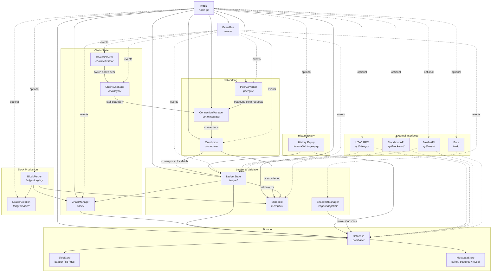
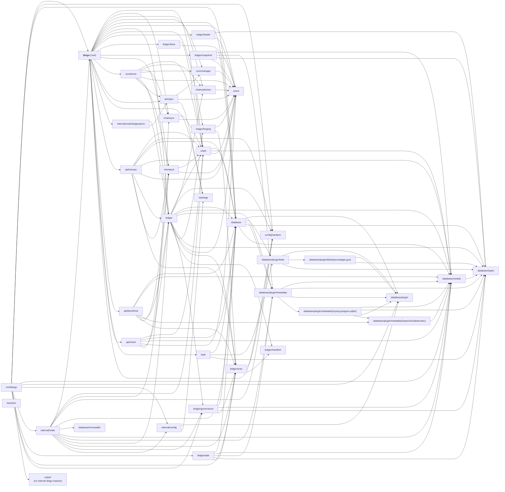
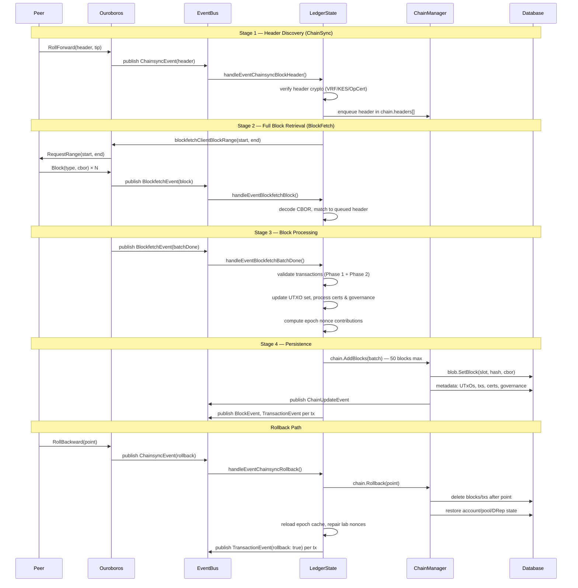
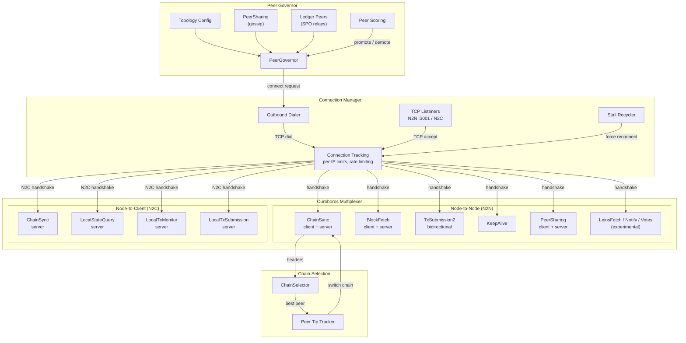
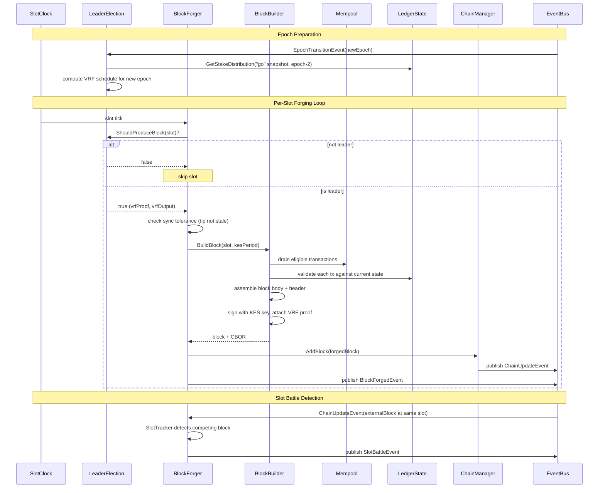

# Architecture

Last reviewed: 2026-06-23

Dingo is a high-performance Cardano blockchain node implementation in Go. This document describes its architecture, core components, and design patterns.

## Table of Contents

- [Overview](#overview)
- [Architecture Diagrams](#architecture-diagrams)
  - [Component Interactions](#component-interactions)
  - [Package Dependency Tree](#package-dependency-tree)
  - [Data Flow](#data-flow)
  - [Peer-to-Peer Networking](#peer-to-peer-networking)
  - [Block Forging](#block-forging)
- [Directory Structure](#directory-structure)
- [Core Node Structure](#core-node-structure)
- [Event-Driven Communication](#event-driven-communication)
- [Storage Architecture](#storage-architecture)
- [Blockchain State Management](#blockchain-state-management)
- [Chain Management](#chain-management)
- [Network and Protocol Handling](#network-and-protocol-handling)
- [Peer Governance](#peer-governance)
- [Transaction Mempool](#transaction-mempool)
- [Block Production](#block-production)
- [Mithril Bootstrap](#mithril-bootstrap)
- [External Interfaces](#external-interfaces)
- [Architectural Boundaries](#architectural-boundaries)
- [Design Patterns](#design-patterns)
- [Threading and Concurrency](#threading-and-concurrency)
- [Configuration](#configuration)
- [Stake Snapshots](#stake-snapshots)

## Overview

Dingo's architecture is built on several key principles:

1. Modular component design using dependency injection and composition
2. Event-driven async notifications via EventBus, with synchronous queries
   passed through explicit constructor-injected dependencies or narrow
   interfaces
3. Pluggable storage backends with a dual-layer database architecture (blob + metadata)
4. Full Ouroboros protocol support for Node-to-Node and Node-to-Client
5. Multi-peer chain synchronization with Ouroboros Praos chain selection
6. Block production with VRF leader election and stake snapshots
7. Graceful shutdown with phased resource cleanup

The root `dingo` package, `cmd/dingo`, and `internal/node` are the composition
layers. Domain packages should not reach upward into node startup, CLI, or
operator policy; when cross-component behavior is required, the node should
wire it through a narrow interface, callback, or EventBus subscription.

## Architecture Diagrams

### Component Interactions

How the Node orchestrator wires components together. Solid arrows are direct method calls; dashed arrows are asynchronous EventBus messages.



### Package Dependency Tree

Internal import relationships between production dingo packages. External
dependencies and tests are omitted. This graph was refreshed from `go list` on
2026-06-23.



### Data Flow

How blocks flow from the network through validation and into storage.



The BlockFetch server path mirrors the retrieval flow for downstream peers:
when a peer requests a range, `ouroboros/blockfetch.go` validates the bounds,
opens a chain iterator at the requested start point, sends `StartBatch`, then
streams `Block` messages until the requested end or local tip before
`BatchDone`. The range sender is asynchronous so the mini-protocol callback can
return promptly, but it applies backpressure between messages by waiting for
the underlying gouroboros protocol send queue to drain. This keeps large Leios
catch-up ranges from filling the mux pending-message queue and turning a slow
consumer into a connection-level protocol violation.

### Peer-to-Peer Networking

Connection lifecycle, protocol multiplexing, and peer governance.



### Block Forging

The block production pipeline from leader election through broadcast.



## Directory Structure

```
dingo/
├── cmd/dingo/           # CLI entry points
│   ├── main.go          # Cobra CLI setup, plugin management
│   ├── serve.go         # Node server command
│   ├── load.go          # Block loading from ImmutableDB/Mithril
│   ├── mithril.go       # Mithril bootstrap subcommand
│   └── version.go       # Version information
├── chain/               # Blockchain state and validation
│   ├── chain.go         # Chain struct, block management
│   ├── manager.go       # ChainManager, fork handling
│   ├── event.go         # Chain events (update, fork)
│   ├── iter.go          # ChainIterator for sequential block access
│   └── errors.go        # Chain-specific errors
├── chainselection/      # Multi-peer chain comparison
│   ├── selector.go      # ChainSelector struct
│   ├── comparison.go    # Ouroboros Praos chain selection rules
│   ├── event.go         # Selection events
│   ├── peer_tip.go      # Peer tip tracking
│   └── vrf.go           # VRF verification
├── chainsync/           # Block synchronization protocol state
│   ├── chainsync.go     # Multi-client sync state, stall detection
│   └── strategy.go      # Configurable multi-active header-sync strategy
├── connmanager/         # Network connection lifecycle
│   ├── connection_manager.go
│   └── event.go         # Connection events
├── database/            # Storage abstraction layer
│   ├── database.go      # Database struct, dual-layer design
│   ├── cbor_cache.go    # TieredCborCache implementation
│   ├── cbor_offset.go   # Offset-based CBOR references
│   ├── hot_cache.go     # Hot cache for frequently accessed data
│   ├── block_lru_cache.go # Block-level LRU cache
│   ├── immutable/       # ImmutableDB chunk reader
│   ├── models/          # Database models
│   ├── types/           # Database types
│   ├── sops/            # Storage operations
│   └── plugin/          # Storage plugin system
│       ├── plugin.go    # Plugin registry and interfaces
│       ├── blob/        # Blob storage plugins
│       │   ├── badger/  # Badger (default local storage)
│       │   ├── aws/     # AWS S3
│       │   └── gcs/     # Google Cloud Storage
│       └── metadata/    # Metadata plugins
│           ├── sqlite/  # SQLite (default)
│           ├── postgres/# PostgreSQL (non-default, planned tag-gating #2586)
│           └── mysql/   # MySQL (non-default, planned tag-gating #2586)
├── event/               # Event bus for decoupled communication
│   ├── event.go         # EventBus, async delivery
│   ├── epoch.go         # Epoch transition events
│   └── metrics.go       # Event metrics
├── ledger/              # Ledger state, validation, block production
│   ├── state.go         # LedgerState, UTXO tracking
│   ├── view.go          # Ledger view queries
│   ├── queries.go       # State queries
│   ├── validation.go    # Transaction validation (Phase 1 UTXO rules)
│   ├── verify_header.go # Block header validation (VRF/KES/OpCert)
│   ├── chainsync.go     # Epoch nonce calculation, rollback handling
│   ├── candidate_nonce.go # Candidate nonce computation
│   ├── certs.go         # Certificate processing
│   ├── governance.go    # Governance action processing
│   ├── delta.go         # State delta tracking
│   ├── block_event.go   # Block event processing
│   ├── slot_clock.go    # Wall-clock slot timing
│   ├── metrics.go       # Ledger metrics
│   ├── peer_provider.go # Ledger-based peer discovery
│   ├── era_summary.go   # Era transition handling
│   ├── eras/            # Era-specific validation rules
│   │   ├── byron.go     # Byron era
│   │   ├── shelley.go   # Shelley era
│   │   ├── allegra.go   # Allegra era
│   │   ├── mary.go      # Mary era
│   │   ├── alonzo.go    # Alonzo era
│   │   ├── babbage.go   # Babbage era
│   │   └── conway.go    # Conway era
│   ├── forging/         # Block production
│   │   ├── forger.go    # BlockForger, slot-based forging loop
│   │   ├── builder.go   # DefaultBlockBuilder, block assembly
│   │   ├── keys.go      # PoolCredentials (VRF/KES/OpCert)
│   │   ├── slot_tracker.go # Slot battle detection
│   │   ├── events.go    # Forging events
│   │   └── metrics.go   # Forging metrics
│   ├── leader/          # Leader election
│   │   ├── election.go  # Ouroboros Praos leader checks
│   │   └── schedule.go  # Epoch leader schedule computation
│   ├── leios/           # CIP-0164 Leios voting + pipeline (experimental)
│   │   ├── committee.go # Stake-truncated committee selection
│   │   ├── quorum.go    # Stake-quorum predicate
│   │   ├── bls.go       # BLS12-381 MinSig sign/verify/aggregate
│   │   ├── keys.go      # Vote signing key + voter pubkey registry
│   │   ├── certificate.go # EB certificate build/validate
│   │   ├── manager.go   # VoteManager: store, tally, serve, emit
│   │   └── pipeline.go  # PipelineManager: stage/timing, EB equivocation, inclusion eligibility
│   └── snapshot/        # Stake snapshot management
│       ├── manager.go   # Snapshot manager, event-driven capture
│       ├── calculator.go# Stake distribution calculation
│       └── rotation.go  # Mark/Set/Go rotation
├── ledgerstate/         # Low-level ledger state import
│   ├── cbor_decode.go   # CBOR decoding for large structures
│   ├── mempack.go       # Memory-packed state representation
│   ├── snapshot.go      # Snapshot parsing
│   ├── import.go        # Ledger state import
│   ├── utxo.go          # UTXO state handling
│   └── certstate.go     # Certificate state handling
├── mempool/             # Transaction pool
│   ├── mempool.go       # Mempool, validation, capacity
│   └── consumer.go      # Per-consumer transaction tracking
├── ouroboros/            # Ouroboros protocol handlers
│   ├── ouroboros.go      # N2N and N2C protocol management
│   ├── chainsync.go      # Chain synchronization
│   ├── blockfetch.go     # Block fetching
│   ├── txsubmission.go   # TX submission (N2N)
│   ├── localtxsubmission.go # TX submission (N2C)
│   ├── localtxmonitor.go    # Mempool monitoring
│   ├── localstatequery.go   # Ledger queries
│   └── peersharing.go   # Peer discovery
├── peergov/             # Peer selection and governance
│   ├── peergov.go       # PeerGovernor
│   ├── churn.go         # Peer rotation
│   ├── quotas.go        # Per-source quotas
│   ├── score.go         # Peer scoring
│   ├── ledger.go        # Ledger-based peer discovery
│   └── event.go         # Peer events
├── topology/            # Network topology handling
│   └── topology.go      # Topology and peer-snapshot configuration
├── api/                     # Transport-facing API packages
│   ├── blockfrost/          # Blockfrost-compatible REST API
│   │   ├── blockfrost.go    # Server lifecycle
│   │   ├── adapter.go       # Node state adapter
│   │   ├── handlers.go      # HTTP handlers
│   │   ├── pagination.go    # Cursor-based pagination
│   │   └── types.go         # API response types
│   ├── mesh/                # Mesh (Rosetta) API
│   │   ├── mesh.go          # Server lifecycle
│   │   ├── network.go       # /network/* endpoints
│   │   ├── account.go       # /account/* endpoints
│   │   ├── block.go         # /block/* endpoints
│   │   ├── construction.go  # /construction/* endpoints
│   │   ├── mempool_api.go   # /mempool/* endpoints
│   │   ├── operations.go    # Cardano operation mapping
│   │   └── convert.go       # Type conversion utilities
│   └── utxorpc/             # UTxO RPC gRPC server
│       ├── utxorpc.go       # Server setup
│       ├── query.go         # Query service
│       ├── submit.go        # Submit service
│       ├── sync.go          # Sync service
│       └── watch.go         # Watch service
├── bark/                # Bark Dingo-to-Dingo C2 and archive protocol
│   ├── bark.go          # Bark server lifecycle and transport setup
│   ├── archive.go       # Archive service interface
│   └── blob.go          # Remote archive blob adapter
├── midnight/            # Midnight MidnightState gRPC compatibility surface
│   ├── midnight_state*.pb.go # Generated google.golang.org/grpc service stubs
│   └── server/          # Native gRPC server lifecycle (reflection, health, TLS)
│       └── server.go    # Serves the MidnightState gRPC compatibility surface
├── mithril/             # Mithril snapshot bootstrap
│   ├── bootstrap.go     # Bootstrap orchestration
│   ├── client.go        # Mithril aggregator client
│   └── download.go      # Snapshot download and extraction
├── keystore/            # Key management
│   ├── keystore.go      # Key store interface
│   ├── keyfile.go       # Key file parsing
│   ├── keyfile_unix.go  # Unix file permissions
│   ├── keyfile_windows.go # Windows ACL permissions
│   └── evolution.go     # KES key evolution
├── config/cardano/      # Embedded Cardano network configurations
├── internal/
│   ├── config/          # Configuration parsing
│   ├── integration/     # Integration tests
│   ├── node/            # Node orchestration (CLI wiring)
│   │   ├── node.go      # Run(), signal handling, metrics server
│   │   └── load.go      # Block loading implementation
│   ├── historyexpiry/   # Ledger-window-based local block history expiry
│   │   └── pruner.go    # Background expiry scanner
│   ├── test/            # Test utilities
│   │   ├── conformance/ # Amaru conformance tests
│   │   ├── devnet/      # DevNet end-to-end tests
│   │   └── testutil/    # Shared test helpers
│   └── version/         # Version information
├── node.go              # Node struct definition, Run(), shutdown
├── config.go            # Configuration management (functional options)
└── tracing.go           # OpenTelemetry tracing
```

## Core Node Structure

The `Node` struct (defined in `node.go`) orchestrates all major components:

```go
type Node struct {
    connManager    *connmanager.ConnectionManager  // Network connections
    peerGov        *peergov.PeerGovernor          // Peer selection/governance
    chainsyncState *chainsync.State               // Multi-peer sync state
    chainSelector  *chainselection.ChainSelector  // Chain comparison
    eventBus       *event.EventBus                // Event routing
    mempool        *mempool.Mempool               // Transaction pool
    chainManager   *chain.ChainManager            // Blockchain state
    db             *database.Database             // Storage layer
    ledgerState    *ledger.LedgerState            // UTXO/state tracking
    snapshotMgr    *snapshot.Manager              // Stake snapshot capture
    utxorpc        *utxorpc.Utxorpc               // UTxO RPC server
    bark           *bark.Bark                     // Bark C2/archive server
    historyExpiry  *historyexpiry.Pruner          // Local block history expiry
    blockfrostAPI  *blockfrost.Blockfrost         // Blockfrost REST API
    meshAPI        *mesh.Server                   // Mesh (Rosetta) API
    midnightServer *midnightserver.Server         // Midnight MidnightState gRPC server
    offchainMetadataFetcher *offchainmetadata.Fetcher // Off-chain metadata
    midnightIndexer *midnightindexer.Indexer      // Midnight cNIGHT/registration/governance/candidate scanner
    ouroboros      *ouroboros.Ouroboros            // Protocol handlers
    blockForger    *forging.BlockForger           // Block production
    leaderElection *leader.Election               // Slot leader checks
    rtsMetrics     *rtsMetrics                    // Runtime statistics metrics
}
```

### Initialization Flow

When `Node.Run()` is called, components are initialized in this order:

```
 1. EventBus creation in `New`, plus tracing/runtime metrics setup in `Run`
 2. Database loading (blob + metadata plugins)
 3. ChainManager initialization and block-proposed event subscription
 4. Ouroboros protocol handler creation
 5. LedgerState creation (UTXO tracking, validation)
 6. Bark remote archive adapter and History Expiry worker (if configured)
 7. Database recovery, if startup detects a recoverable timestamp conflict
 8. Ledger startup epoch-cache preparation, then Midnight indexer creation +
    backfill + EventBus subscription (if API storage mode).
    Indexes cNIGHT creates/spends, mapping-validator registrations/deregistrations,
    Technical Committee and Council governance datums, Ariadne permissioned-candidate
    parameters, and committee-candidate UTxO snapshots (taken at epoch boundaries via
    block-event epoch advancement, with EpochTransitionEvent as a secondary path).
    Runs synchronously before LedgerState starts so no
    BlockActionApply events are missed. The epoch cache is prepared first,
    inside a startup-only transaction, so backfill can resolve
    Ariadne/candidate epoch keys without falling back to epoch 0. Backfill
    iterates stored blocks from the last checkpoint slot onward; inserts are
    idempotent (ON CONFLICT DO NOTHING) so a
    crash-restart replay is safe.
 9. LedgerState start. Loading the epoch cache (`loadEpochs`) also runs
    `healEmptyLabNonces`: it repairs any epoch record whose
    `last_epoch_block_nonce` was persisted empty or stale by pre-fix boundary
    lookup bugs, re-deriving the lab from the active chain's boundary block and
    recomputing the affected epoch's nonce in the cache when that epoch has a
    stored `candidate_nonce`, so leader-VRF verification matches the network.
    If the candidate is missing, startup leaves the epoch unchanged rather than
    substituting Shelley genesis for a candidate that may have evolved.
10. Snapshot manager start (captures genesis snapshot, or reuses an existing
    post-Mithril Mark snapshot window)
11. Mempool setup and injection into LedgerState/Ouroboros
12. ChainsyncState (multi-client tracking, stall detection)
13. ChainSelector (genesis/Praos comparison) start
14. ConnectionManager creation and event wiring
15. PeerGovernor creation/start (topology + churn + ledger peers)
16. ConnectionManager listener start
17. Stalled client recycler (background goroutine)
18. UTxO RPC server (if API storage mode and port configured)
19. Bark C2/archive server (if port configured)
20. Midnight gRPC server (if API storage mode and midnight port configured)
21. Blockfrost API (if API storage mode and port configured)
22. Mesh API (if API storage mode and port configured)
23. Off-chain metadata fetcher (if API storage mode)
24. Block forger + leader election (if block producer mode)
25. Wait for shutdown signal
```

### Shutdown Flow

Graceful shutdown proceeds in phases:

```
Phase 1: Stop accepting new work
  Midnight indexer (unsubscribes from BlockEventType),
  Block forger, leader election, chain selector,
  peer governor, snapshot manager, UTxO RPC,
  Bark C2/archive server, Midnight gRPC server,
  Blockfrost API, Mesh API, off-chain metadata fetcher

Phase 2: Drain and close connections
  Mempool, ConnectionManager

Phase 3: Flush state and close database
  LedgerState, Database

Phase 4: Cleanup resources
  Registered shutdown functions, EventBus
```

## Event-Driven Communication

Components use the `EventBus` (`event/event.go`) for asynchronous
cross-component notifications. Synchronous state queries still use direct
method calls, callbacks, or narrow interfaces injected by the node composition
layer.

```
Publisher ---publish---> EventBus ---deliver---> Subscribers
                            |
                            | async
                            v
                       Worker Pool
                       (4 workers)
```

### Key Event Types

All event types follow the `subsystem.snake_case_name` convention.

| Event | Source | Purpose |
|-------|--------|---------|
| `chain.update` | ChainManager | Block added to chain |
| `chain.fork_detected` | ChainManager | Fork detected |
| `chainselection.peer_tip_update` | ChainSelector | Peer tip updated |
| `chainselection.chain_switch` | ChainSelector | Active peer changed |
| `chainselection.selection` | ChainSelector | Chain selection made |
| `chainselection.peer_evicted` | ChainSelector | Peer evicted |
| `chainsync.client_added` | ChainsyncState | Client tracking added |
| `chainsync.client_removed` | ChainsyncState | Client tracking removed |
| `chainsync.client_synced` | ChainsyncState | Client caught up |
| `chainsync.client_stalled` | ChainsyncState | Client stall detected |
| `chainsync.fork_detected` | ChainsyncState | Chainsync fork detected |
| `chainsync.client_remove_requested` | Node | Stalled client removal |
| `chainsync.resync` | LedgerState | Chainsync resync request |
| `connmanager.inbound_conn` | ConnManager | Inbound connection |
| `connmanager.conn_closed` | ConnManager | Connection closed |
| `connmanager.connection_recycle_requested` | ConnManager | Connection recycling |
| `mempool.add_tx` | Mempool | Transaction added |
| `mempool.remove_tx` | Mempool | Transaction removed |
| `ledger.block` | LedgerState | Block applied or rolled back |
| `ledger.tx` | LedgerState | Transaction processed |
| `ledger.error` | LedgerState | Ledger error occurred |
| `ledger.blockfetch` | Ouroboros | Block fetch event received |
| `ledger.chainsync` | Ouroboros | Chainsync event received |
| `ledger.pool_restored` | LedgerState | Pool state restored after rollback |
| `epoch.transition` | LedgerState | Epoch boundary crossed |
| `hardfork.transition` | LedgerState | Hard fork transition |
| `block.forged` | BlockForger | Block successfully forged |
| `forging.slot_battle` | SlotTracker | Competing blocks at same slot |
| `leios.eb_quorum` | Leios VoteManager | Endorser block reached stake quorum; certificate built (consumed by the Leios PipelineManager for inclusion eligibility) |
| `peergov.outbound_conn` | PeerGov | Outbound connection initiated |
| `peergov.peer_demoted` | PeerGov | Peer demoted |
| `peergov.peer_promoted` | PeerGov | Peer promoted |
| `peergov.peer_removed` | PeerGov | Peer removed |
| `peergov.peer_added` | PeerGov | Peer added |
| `peergov.peer_churn` | PeerGov | Peer rotation event |
| `peergov.quota_status` | PeerGov | Quota status update |
| `peergov.bootstrap_exited` | PeerGov | Exited bootstrap mode |
| `peergov.bootstrap_recovery` | PeerGov | Bootstrap recovery |

### EventBus Features

- Asynchronous delivery via worker pool (4 workers, 1000-entry async queue)
- Default subscriber buffers of 1024 events, with opt-in 100000-entry burst
  buffers for high-volume ledger chainsync/blockfetch paths
- Non-blocking `Publish`, blocking `PublishBlocking` for ordering-critical
  streams, and `PublishAsync` for best-effort async work
- Prometheus metrics for event delivery tracking and latency

## Storage Architecture

Dingo uses a dual-layer storage architecture with pluggable backends:

```
                         Database
    -------------------------------------------------
    |       Blob Store            |  Metadata Store  |
    |   (blocks, UTxOs, txs)     |  (indexes, state)|
    -------------------------------------------------
    | Plugins:                    | Plugins:          |
    |  - Badger (default)         |  - SQLite (default)|
    |  - AWS S3 (tag-gated)       |  - PostgreSQL (non-default)|
    |  - Google Cloud Storage (tag-gated)|  - MySQL (non-default)|
    -------------------------------------------------
```

Badger and SQLite are always compiled into Dingo. The non-default blob plugins
(`s3` and `gcs`) are compiled only when the `dingo_extra_plugins` build tag is
enabled; project builds, CI, and release binaries opt into that tag, while a
plain `go build ./cmd/dingo` omits the cloud blob SDKs. The non-default
metadata plugins (`postgres` and `mysql`) are still compiled into plain builds
on current `main`; issue #2586 tracks moving them behind the same tag.

### Storage Modes

Dingo supports two storage modes, configured via `storageMode`:

- `core` (default): Minimal storage for chain following and block production.
- `api`: Extended storage with transaction indexes, address lookups, and asset tracking. Required when any client-facing API server (Blockfrost, Mesh, UTxO RPC) is enabled. Bark is a separate Dingo-to-Dingo protocol and is not part of that API surface.

### Midnight gRPC Server

In `storageMode: api` with `midnight.port > 0`, `node.go` starts
`midnight/server.Server`, a native `google.golang.org/grpc` server (not
ConnectRPC, for byte-for-byte compatibility with the Acropolis tonic service)
on its own `midnight.host:midnight.port` listener. It registers the
`MidnightState` service, plus gRPC reflection and a `grpc_health_v1` health
service reporting `SERVING`. The compatibility surface is still incomplete:
merged work covers server lifecycle and block scanning, while the remaining RPC
bodies are tracked by the Midnight plan and issues #2118/#2119. TLS is enabled
when the shared `tlsCertFilePath`/`tlsKeyFilePath` are set. `Start` binds the
listener synchronously (so bind/cert errors surface immediately) and serves in
a goroutine; a context watcher performs a bounded `GracefulStop`, escalating to
a hard `Stop` on timeout. Setting `midnight.port` to `0` disables the server
without affecting indexer eligibility.

### Off-chain Metadata Fetching

In `storageMode: api`, `node.go` also starts `internal/offchainmetadata.Fetcher`
as a background worker. The worker asks the metadata store to discover on-chain
URL/hash pointers from pool registrations, DRep anchors, governance
proposal/vote anchors, constitutions, and committee resignations. It then fetches
due rows asynchronously into the `offchain_metadata` table.

Fetched content is never fed back into consensus or ledger validation. The
on-chain Blake2b-256 hash remains authoritative: fetched bytes are stored as
usable only when their Blake2b-256 digest matches the ledger-provided hash.
Failed, unsupported, or oversized fetches remain in the table with retry
metadata and diagnostic state. HTTP(S) pointers are fetched directly. `ipfs://`
pointers are translated to the fetcher's configured IPFS gateway URL, which
defaults to `https://gateway.pinata.cloud/ipfs/`, while the cache key remains
the original on-chain URL. Operators can override fetch interval, request
timeout, user agent, IPFS gateway URL, batch size, max response bytes, and
private-address allowance through the `offchainMetadata` YAML block, matching
`DINGO_OFFCHAIN_METADATA_*` environment variables, or
`--offchain-metadata-*` CLI flags.
If the worker context is canceled while a request is in flight, the worker drops
that in-memory result instead of recording a failed fetch, so shutdown does not
advance retry state. Metadata-store discovery, batch claim, and result update
calls receive the same worker context, and the worker returns before issuing new
store work after cancellation.
The default HTTP transport caps response bytes, follows a small redirect budget,
and refuses localhost, private, link-local, multicast, and other non-public
targets so arbitrary ledger URLs and gateway targets do not become unrestricted
node-side network access.

The worker is intentionally composed at the node boundary. Ledger and database
indexing code persist the URL/hash pointers; APIs read the local cache through
the metadata store when they need off-chain documents.

### Archive And History Expiry Topology

Dingo's blob-store abstraction supports independent history expiry and archive
fallback:

- An archive node uses a signed-URL-capable object-storage blob plugin (`s3` or
  `gcs`) and enables the Bark server with `barkPort`. Bark's archive service
  maps a requested `(slot, hash)` to the blob store's `GetBlockURL`, returning
  a signed object URL plus compact block metadata.
- A node with `historyExpiry.enabled` keeps its local blob plugin and starts
  `internal/historyexpiry.Pruner`. The worker derives its safety window from
  `LedgerState.StabilityWindow()` and scans only blocks older than that window.
  `Database.PruneBlock` materializes any UTxO CBOR still stored as block
  offsets before replacing the block CBOR value with an expired-history marker,
  leaving block indexes and metadata intact.
- A node with `barkBaseUrl` is wired by `node.go` with a `bark.BlobStoreBark`
  wrapper. Normal block writes still go to the local blob plugin. Reads first
  check local storage; expired or missing historical blocks fall back to the
  remote Bark archive and download the signed URL response. This wrapper can be
  used with or without local History Expiry.

### Tiered CBOR Cache

Instead of storing full CBOR data redundantly, Dingo uses offset-based references with a tiered cache:

```
CBOR Data Request
       |
       v
Tier 1: Hot Cache (in-memory)
  - UTxO entries: configurable count (HotUtxoEntries)
  - Transaction entries: configurable count + byte limit
  - O(1) access, LRU eviction
       | miss
       v
Tier 2: Block LRU Cache
  - Recently accessed blocks with pre-computed indexes
  - Fast extraction without blob store access
  - Lock-striped: blocks are routed by hash to one of N independent
    shards, each with its own mutex and LRU list, so concurrent lookups
    for different blocks rarely contend. Shard count is derived from the
    configured capacity (small caches use a single shard, preserving exact
    global-LRU behavior). Eviction is per-shard; total occupancy never
    exceeds the configured entry limit.
       | miss
       v
Tier 3: Cold Extraction
  - Fetch block from blob store
  - Extract CBOR at stored offset
```

### CborOffset Structure

Each CBOR reference is a fixed 52-byte `CborOffset` struct with magic prefix:

| Field | Size | Purpose |
|-------|------|---------|
| Magic | 4 bytes | "DOFF" prefix to identify offset storage |
| BlockSlot | 8 bytes | Block slot number |
| BlockHash | 32 bytes | Block hash |
| ByteOffset | 4 bytes | Offset within block CBOR |
| ByteLength | 4 bytes | Length of CBOR data |

### Plugin System

Plugins are registered via a global registry (`database/plugin/plugin.go`):

```go
plugin.SetPluginOption() -> plugin.GetPlugin() -> plugin.Start() -> Use interface
```

Interfaces:
- `BlobStore` - Block/transaction storage operations
- `MetadataStore` - Index and query operations

### Database Models

Key models in `database/models/`:

| Model | Purpose |
|-------|---------|
| `Block` | Block metadata (slot, hash, height, era) |
| `Transaction` | Transaction records |
| `Utxo` | UTXO set entries |
| `Account` | Stake account registrations and delegations |
| `Pool` | Stake pool registrations |
| `Drep` | DRep registrations |
| `Epoch` | Epoch metadata and nonces |
| `PoolStakeSnapshot` | Per-pool stake at epoch boundary |
| `EpochSummary` | Network-wide aggregates per epoch |
| `BackfillCheckpoint` | Mithril backfill progress tracking |
| `NetworkState` | Network-wide state tracking (treasury/reserves); updated at the epoch boundary by treasury withdrawals, donations, and unclaimed pool-retirement deposit refunds |
| `NetworkDonation` | Per-block treasury donations, applied to treasury at the epoch boundary |
| `GovernanceAction` | Governance proposals |
| `CommitteeMember` | Constitutional committee members |

## Blockchain State Management

The `LedgerState` (`ledger/state.go`) manages UTXO tracking and validation:

```
                       LedgerState
    -------------------------------------------------
    | - UTXO tracking and lookup                     |
    | - Protocol parameter management                |
    | - Certificate processing (pools, stakes, DReps)|
    | - Transaction validation (Phase 1: UTXO rules) |
    | - Plutus script execution (Phase 2)            |
    | - Block header validation (VRF/KES/OpCert)     |
    | - Epoch nonce computation                      |
    | - Governance action processing                 |
    | - State restoration on rollback                |
    | - Ledger-based peer discovery                  |
    -------------------------------------------------
    |              Database Worker Pool              |
    | - Async database operations                    |
    | - Configurable pool size (default: 5 workers)  |
    | - Fire-and-forget or result-waiting            |
    -------------------------------------------------
```

### Era-Specific Validation

The `ledger/eras/` package provides era-specific validation rules for each Cardano era. The default active era table is Byron through Conway. Experimental Dijkstra support is added to the active table when Dingo starts on the `musashi` network (the IOG Leios prototype testnet, matched by network name or magic 164), with `runMode: "leios"`, or with `startEra: "dijkstra"` — see `Config.experimentalDijkstraEnabled`. Keying on the network lets `dingo -n musashi` follow the Musashi testnet past the Conway-to-Dijkstra hard fork without an explicit run mode. The Dijkstra descriptor uses `github.com/blinklabs-io/gouroboros/ledger/dijkstra`, including that release's generated CDDL shape for the nullable Leios/Peras certificate slots.

Era transitions run the target era's `HardForkFunc` to translate protocol parameters before persisting the new pparams. Transitions can also rewrite ratified-but-not-yet-enacted governance action payloads into the target era's CBOR shape; the Conway to Dijkstra path translates parameter-change proposals so the Dijkstra enactment update function receives `DijkstraProtocolParameterUpdate` rather than a stale Conway update.

With the Leios mini-protocols active (below), the node fetches a referenced endorser block's manifest and its transactions and applies those transactions to the ledger ahead of the ranking block's own. A Dijkstra ranking block names its endorser block in the Leios header extension (`DijkstraBlockHeader.LeiosEndorserBlockRef`, an `[eb_hash, eb_size]` pair — not the block-level `leios_cert`, which is an empty placeholder). `ledgerProcessBlock` looks the endorser block up through `LedgerStateConfig.EndorserBlockProvider` (backed by the `ouroboros` package's fetched-EB cache); when its full transaction set is cached, `applyEndorserBlock` (`ledger/leios_apply.go`) decodes the standalone transactions and applies them. Because the prototype produces an endorser block and its ranking block in the same slot and diffuses them together, the ranking block otherwise reaches `ledgerProcessBlock` a few milliseconds ahead of its endorser block and the cache lookup misses; to close this ordering gap, batch delivery is gated upstream by `ensureReferencedEndorserBlocks` (`ledger/leios_apply.go`), which — at the chain tip only (`IsAtTip`) and before the block-processing DB transaction opens — waits up to the Leios certify-by deadline for each referenced endorser block's fetch to complete. That window is `LedgerStateConfig.EndorserBlockWaitSlots`, sourced from the pipeline timing's `CertifyByDeadlineSlots` (the wire mini-protocol specs define no timeout, so the override-able `PipelineTiming` struct is the timing source) and converted to wall-clock via the Shelley slot length. The certify-by deadline is used rather than the shorter `DiffuseWindowSlots` because by the time a ranking block references an endorser block that block has already been certified, and the measured relay tx-offer delay plus fetch time exceeds the diffuse window. During historical catch-up (`IsAtTip` false) the gate instead drives backfill. `ensureReferencedEndorserBlocks` partitions its references: those well behind the chain head are handed to the `leiosBackfiller` (`ledger/leios_apply.go`), which fetches each missing endorser block by point through `LedgerStateConfig.EndorserBlockFetcher` (backed by the `ouroboros` package's `FetchEndorserBlockByPoint`) under a bounded worker pool with an in-flight dedup map, then waits skip-fast — returning as soon as the block is cached or the all-peers fetch completes without caching — so a tail-fetch failure on one endorser block advances the sync rather than stalling it; references at or near the head keep the original certify-by tip wait. The prototype relays serve historical endorser blocks by point on demand when otherwise idle (`MsgLeiosBlockRequest` carrying the block point, then the windowed transaction fetch), so a from-scratch sync backfills the endorser-resident transactions for the chain history it replays rather than only the endorser blocks observed live. Because endorser transactions are not part of any chain block — so they have no CBOR offsets — their CBOR is persisted as a standalone blob keyed by the endorser block's `(slot, hash)` with DOFF offsets (mirroring the genesis path), and `SetTransaction`/delta apply is reused so they behave uniformly with all other transactions; their ledger effects are recorded under the *ranking* block's point so a rollback removes them. Decode/build failures still leave the block on the best-effort path, but once EB storage mutation starts, a failure aborts the enclosing block transaction so partial EB effects cannot be committed. With the endorser-resident outputs now present, per-tx UTxO validation is run for the ranking block, including successfully resolved empty endorser blocks. Three behaviors keep this safe and fast: (1) when the endorser block was *not* applied — it has not been fetched, or no connected leios-fetch peer fully served it (every peer returned an empty or partial response under load, so it was skipped to keep the sync advancing) — Dijkstra per-tx validation is skipped, both because the inputs are genuinely unresolvable and because running the full rule set per tx on dense near-tip blocks caps throughput at the block-production rate; (2) a validation disagreement on an endorser-applied block is logged and trusted rather than rewinding the certified chain, since endorser-block availability and the certificate surface are still evolving in the prototype; (3) rollback recovery (`findPeerForkPath`) resolves fork-path ancestors with `database.BlockByHash` (hash-index only, no sequential blob-scan fallback), since the hashes probed are overwhelmingly unpersisted peer headers and the per-miss scan otherwise made recovery O(fork-depth) blob scans under the ledger lock. Blocks persisted before the hash index was added can still miss this fast lookup unless the operator backfills the index. Because historical endorser blocks are fetched by point, a from-scratch sync's UTxO set includes endorser-resident outputs from the start of the endorser-block era forward, not only from the point the node starts. The remaining dependency is relay availability: the prototype relay's by-point responses are reliable when it is idle but can turn flaky — empty manifests — when one connection also carries blockfetch, so the backfiller fetches across every connected leios-fetch peer (`connmanager.LeiosFetchConnectionIds`, round-robined per endorser block) and skips any endorser block that no peer will fully serve, leaving only those gaps absent from the UTxO set. (The "partial transaction window" stalls that previously appeared even against a single idle relay were a dingo bitmap bit-order bug, not relay flakiness — see the MSB-first request bitmap under "Leios Networking", issue #2656 — so a single healthy relay now serves every endorser block in full and a from-genesis sync builds a complete UTxO set.)

The experimental N2N Leios protocols (`Config.experimentalLeiosNetworkingEnabled`) are enabled on the `musashi` network as well as under `runMode: "leios"` or `startEra: "dijkstra"`, so `dingo -n musashi` runs leios-notify and leios-fetch alongside base chainsync/blockfetch. Earlier prototype interop reset every connection within ~100ms: dingo initiated the standalone leios-votes mini-protocol (protocol 20), which the prototype Haskell node does not run, so the prototype's muxer tore down the whole bearer on the unknown protocol ID (taking chainsync/blockfetch with it). That protocol is now gated off for the prototype network (`OuroborosConfig.EnableLeiosVotes`, wired in `node.go`); the prototype diffuses votes inline over leios-notify (`MsgVotesOffer`, tag 4) instead. dingo is ahead of the prototype on the wire, so the leios-notify and leios-fetch codecs accept the prototype's dialect leniently: notify tag 4 decodes either offered vote IDs or full pushed votes (`FullVotes`); leios-fetch `MsgBlock` decodes the endorser block as either dingo's array-wrapped form or the prototype's bare `{txhash => size}` manifest map; and `MsgBlockTxs`/`MsgBlockTxsRequest` carry the prototype's `[point, bitmaps, tx_list]` shape with an indefinite-length bitmaps map. On a notify block offer, `ouroboros/` fetches the endorser-block manifest over leios-fetch, decodes and hash-validates it, caches it, and hands it to the vote and pipeline managers. The transaction bodies (gated by `OuroborosConfig.EnableLeiosTxFetch`) are fetched when the peer sends the corresponding transactions offer (`MsgBlockTxsOffer`), not immediately after the manifest — requesting before that offer makes the prototype relay reset the connection. They are requested in batches of up to eight 64-transaction windows per request, re-requesting the still-missing transactions (learned from the `MsgBlockTxs` response bitmaps, with a prefix fallback) until the set is complete, because the relay caps a single response. The request bitmap is numbered MSB-first — the transaction at window offset 0 is the most-significant bit of its 64-bit word — to match the relay; an LSB-first numbering round-tripped against a dingo peer but made the relay serve only the high-index transactions of a partial window (and nothing at all for a final window of 32 or fewer transactions), so a from-genesis sync stalled mid-epoch with an incomplete UTxO set (issue #2656). The leios-fetch response timeout is raised from the protocol default to 60s, because under concurrent blockfetch the default deadline expired mid-window and tore down the connection. Tip prefetch on leios-notify offers is suppressed while the node is far behind the chain tip (`SlotsBehindHead` beyond a small lag bound), so a deep catch-up does not contend the connection fetching current-tip endorser blocks it will not apply for hours; the historical references it actually needs are driven by the backfiller (see "Era-Specific Validation"). A complete endorser block is then available to the ledger for application (see "Era-Specific Validation"). Pushed votes (notify `MsgVotesOffer` tag 4) are forwarded to the `ledger/leios` vote manager. The LeiosVotes and LeiosFetch vote handlers delegate vote collection, serving, and emission to the `ledger/leios` vote manager (see "Leios Voting"), and return an explicit unavailable error when the manager is not wired. A cached endorser block is also handed to the `ledger/leios` pipeline manager (see "Leios Pipeline") for stage/timing tracking and equivocation detection. LeiosVotes pull requests remain outstanding while no servable votes exist and complete when new vote material arrives or the protocol shuts down, so an empty relay store is not treated as a mini-protocol error. Durable vote storage and RB certificate embedding are still gated by the current gouroboros/Dijkstra certificate shape, where the generated Leios certificate slot remains a placeholder.

During accepted block replay, Alonzo-and-newer validation runs the UTXO/Phase 1 rule set and keeps declared ExUnit limit checks. Plutus Phase 2 execution is skipped only for blocks at or before the immutable tip (`tipBlockNo - securityParam`), where the block producer's `isValid` flag is treated as authoritative until the local Plutus VM is consensus-equivalent. Volatile block replay, local transaction validation for mempool submission, and forging continue to run Plutus execution.

### Checkpoint Enforcement

When a network config supplies a `CheckpointsFile` (mainnet and preview ship one), `config/cardano` verifies its `CheckpointsFileHash` and loads it into a block-number to block-hash map, exposed via `CardanoNodeConfig.Checkpoints()`. `LedgerState` caches the map at construction, and `ledgerProcessBlock` (`ledger/state.go`) rejects any inbound block whose height matches a checkpoint but whose hash differs, in every validation mode, before header or transaction validation runs. This is an envelope-validity guard against following a chain that diverges from the known-good chain at a checkpointed height; honest chains always agree with the shipped checkpoints, so the rule never rejects a canonical block. Byron epoch boundary blocks share the preceding block's number and are skipped to avoid a false mismatch.

### Block Header Validation

`ledger/verify_header.go` performs cryptographic validation of block headers:
- VRF proof verification against the epoch nonce
- KES signature verification with period checks
- Operational certificate chain validation
- Slot leader eligibility checking

### Epoch Nonce Computation

`ledger/chainsync.go`, `ledger/candidate_nonce.go`, and `ledger/epoch_lab_nonce.go` implement the Ouroboros Praos nonce evolution:
- Evolving nonce: accumulated from each block's VRF output
- Candidate nonce: frozen at the stability window cutoff
- Epoch nonce: derived from candidate nonce and previous epoch's last block hash

The previous epoch's last-block hash is resolved through the active chain index
(`chain.BlockBeforeSlot`), not a raw blob-store slot scan. Blob storage can
retain synthetic endorser/genesis blobs and fork blobs that are useful for other
storage paths but are not part of the selected chain.

### Ledger View

The `LedgerView` interface provides query access to ledger state:
- UTXO lookups by address or output reference
- Protocol parameter queries
- Stake distribution queries
- Account registration checks

## Chain Management

The `ChainManager` (`chain/manager.go`) manages multiple chains:

```
                      ChainManager
    -------------------------------------------------
    | Primary Chain                                  |
    |   Persistent chain loaded from database        |
    |                                                |
    | Fork Chains                                    |
    |   Temporary chains for peer synchronization    |
    |                                                |
    | Block Cache                                    |
    |   In-memory cache for quick access             |
    |                                                |
    | Rollback Support                               |
    |   Reverts chain to previous point (up to K     |
    |   blocks), emits rollback events, restores     |
    |   account/pool/DRep state                      |
    -------------------------------------------------
```

### Chain Selection (Ouroboros Praos)

The `ChainSelector` (`chainselection/`) implements Ouroboros Praos rules:

1. Higher block number wins (longer chain)
2. At equal block number, lower slot wins (denser chain)
3. At equal length/slot, the reference implementation's opcert/VRF
   tie-breaker is used when the necessary select-view data is available
4. During genesis bootstrap mode, observed density is used until the local tip
   is close enough to the best observed peer tip to switch back to Praos

The selector tracks tips from all connected peers, honors peer eligibility and
priority updates from peer governance, and switches the active chainsync
connection when a better chain is found.

Bootstrap topology peers remain chain-selection eligible after bootstrap exit
as a fallback ingress source, but peer governance lowers their priority to zero.
This lets non-bootstrap peers win same-tip transport selection without
stranding ChainSync when the bootstrap peer is still the only usable upstream.

#### Anti-flap incumbent pin

The active connection (the peer that drives the chainsync+blockfetch pipeline
via `SetClientConnId`) is selected by Praos rules, but switching it on every
1-block head difference is harmful: with multiple upstream peers at the same
tip, the peers micro-fork at the head (peer A one block ahead, then peer B
leapfrogs to a sibling at the same height, then A again). Each switch hands off
and resets the pipeline, so during deep catch-up the ledger can apply zero
blocks (it wedges) and at the live tip it grinds. The reference-implementation
Praos comparison still governs which chain is canonically best; the anti-flap
pin only suppresses the active-CONNECTION handoff between peers on the same
height or sibling head-forks.

The pin (`pinIncumbentDuringCatchUpLocked` in `chainselection/selector.go`)
engages whenever there is an established, still-selectable incumbent and a
local tip has been applied at least once (`SetLocalTip` called, applied block
> 0). It applies in both regimes: deep catch-up (best known peer tip more than
`catchUpPinBlockThreshold` = 100 blocks ahead of the applied local tip) and
at/near the live tip. When a switch would otherwise occur to a peer that is
only a head micro-fork ahead, the pin keeps the incumbent active and does NOT
emit a `ChainSwitchEvent`.

The pin RELEASES (allows the switch) when any of these hold, which together
guarantee the node still converges to the genuinely-longest chain and can never
pin to a dead/minority peer:

- No local tip has ever been applied (applied block == 0) — near-genesis and
  pre-`SetLocalTip` behavior is unchanged, so the pin is inactive.
- The incumbent is no longer selectable (disconnected, ineligible, stale, or
  implausibly behind).
- Longer-chain escape: the challenger is genuinely taller than the incumbent by
  more than `catchUpPinHeadMargin` (= 2 blocks) — a real longer chain, not a
  head micro-fork.
- Progress-stall escape: the applied local tip has stopped advancing for at
  least `catchUpPinStallTimeout` (= 20s wall-clock, not 20 slots). `SetLocalTip`
  records the timestamp of the last FORWARD progress (block number advancing);
  repeated same-or-lower tip updates (including rollbacks) do NOT reset the
  stall clock, so a stalled incumbent cannot keep the pin alive by re-reporting
  an unchanged tip. The clock is fed by an injectable `nowFn` (defaulting to
  `time.Now`) for deterministic tests.

The existing equal-tip incumbent preservation (when `ComparePraosTips` returns
`ChainEqual`, and the same-block transport tiebreaker) is preserved and runs
ahead of the pin.

## Network and Protocol Handling

### Ouroboros Protocol Stack

The `Ouroboros` struct (`ouroboros/ouroboros.go`) manages all protocol handlers:

```
              Ouroboros Protocols
    -------------------------------------------
    | Node-to-Node (N2N)  | Node-to-Client (N2C)|
    |---------------------|---------------------|
    | ChainSync           | ChainSync           |
    |   Block sync        |   Wallet sync       |
    |                     |                     |
    | BlockFetch          | LocalTxMonitor      |
    |   Block retrieval   |   Mempool queries   |
    |                     |                     |
    | TxSubmission2       | LocalTxSubmission   |
    |   Transaction share |   Transaction submit|
    |                     |                     |
    | PeerSharing         | LocalStateQuery     |
    |   Peer discovery    |   Ledger queries    |
    |                     |                     |
    | LeiosFetch/Notify/  |                     |
    | Votes (experimental)|                     |
    |   EB + vote relay   |                     |
    -------------------------------------------
```

### Connection Management

The `ConnectionManager` (`connmanager/connection_manager.go`) handles connection lifecycle:

```
                    ConnectionManager
    -------------------------------------------------
    | Inbound Listeners                              |
    |   TCP N2N (default: 3001)                      |
    |   TCP N2C (configurable)                       |
    |   Unix socket N2C                              |
    |                                                |
    | Outbound Clients                               |
    |   Source port selection                         |
    |                                                |
    | Connection Tracking                            |
    |   Per-peer connection state                    |
    |   Duplex detection (bidirectional connections) |
    |   Stalled connection recycling                 |
    -------------------------------------------------
```

### Multi-Client Chainsync

The `chainsync.State` tracks multiple concurrent chainsync clients:
- Configurable max client count
- Stall detection with configurable timeout
- Grace period before recycling stalled connections
- Cooldown to prevent rapid reconnection flapping
- Plateau detection: if the local tip stops advancing while peers are ahead, the active chainsync connection is recycled
- Peer-governance connection-close lookup uses stable endpoint identity so reconnect and eligibility cleanup still run for equivalent connection IDs; when no active chainsync client remains, ledger clears its cached upstream tip so slot-clock epoch work does not run against a disconnected tip

#### Header-Sync Strategy

A configurable strategy (`chainsync.HeaderSyncStrategy`, `chainsync/strategy.go`) decides which eligible peer is permitted to drive ledger ingress when several peers offer valid next headers. The Ouroboros roll-forward handler runs cross-peer deduplication and fork detection first, then calls `State.ShouldPublishHeader` to apply the strategy before publishing a `ChainsyncEvent` into the ledger:

- **primary** (default) — a single active peer drives ingress; new headers from any eligible peer publish, and the active peer replays a header first observed from another peer so it stays the contiguous driver. Stall detection promotes a replacement active peer, so a stalled or disconnected peer does not strand ingestion. This preserves the behavior from before the strategy existed.
- **parallel** — every eligible peer may supply headers concurrently. The first peer to report a header drives it; duplicates from other peers are deduplicated before ledger ingress (no replay), so a header never enters ledger processing twice.
- **round-robin** — a single ingress-driving peer that rotates across the eligible peers; the rotation advances on the stall-check cadence (`AdvanceHeaderSyncRotation`).

Under every strategy, all eligible peers still update tip tracking, observed-header history (for blockfetch peer discovery), and fork detection, so divergent peer headers produce fork/candidate-chain handling rather than silent suppression. The strategy is set via `chainsync.strategy` (YAML), `DINGO_CHAINSYNC_STRATEGY` (env), or `--chainsync-strategy` (CLI).

## Peer Governance

The `PeerGovernor` (`peergov/peergov.go`) manages peer selection and topology:

```
                      PeerGovernor
    -------------------------------------------------
    | Peer Targets                                   |
    |   Known peers: 150                             |
    |   Established peers: 50                        |
    |   Active peers: 20                             |
    |                                                |
    | Per-Source Quotas                               |
    |   Topology quota: 3 peers                      |
    |   Gossip quota: 12 peers                       |
    |   Ledger quota: 5 peers                        |
    |                                                |
    | Peer Churn                                     |
    |   Gossip churn: 5 min interval, 20%            |
    |   Public root churn: 30 min interval, 20%      |
    |                                                |
    | Peer Scoring                                   |
    |   Performance-based peer ranking               |
    |                                                |
    | Ledger Peer Discovery                          |
    |   Discovers peers from stake pool relays       |
    |   Activated after UseLedgerAfterSlot           |
    |                                                |
    | Denied List                                    |
    |   Prevents reconnection to bad peers           |
    |   (30 min timeout)                             |
    -------------------------------------------------
```

Connection recovery is both edge-triggered and level-triggered. The
connection-closed event spawns a one-shot reconnect goroutine for the affected
peer, and each reconcile cycle additionally redials known peers that have no
connection and no active reconnect goroutine: topology local/public roots
always (and bootstrap peers while bootstrap promotion is still allowed),
gossip/ledger peers only when the node has no chain-selection-eligible
upstream connection left, capped per cycle. This guarantees the node converges
back to connected even when a close event cannot be attributed to its peer or
a dial loop exited early. Gossip churn never demotes the peer holding the last
eligible upstream connection, so routine churn cannot leave the node without a
chainsync source.

Reconnect backoff after short-lived sessions escalates exponentially. The
reconnect goroutine consumes and zeroes the stored delay before dialing, so
the close handler derives the next rung from a count of consecutive
short-lived outbound sessions (1s doubling to a 128s cap) rather than from
the stored delay; a stable session resets the count, as does an inbound
connection from a topology peer, which proves reachability. Separately, chainsync
resync reasons that indicate a peer chain we cannot follow (rollback or fork
resolution exceeding the security parameter K, and both Mithril
trust-boundary reasons) place the peer on the deny list for a cooldown in
addition to closing the connection, so the node does not redial a peer that
will deterministically be rejected again moments later.

Topology configuration is loaded from an explicit topology file when provided,
otherwise from the embedded `network/topology.json` for built-in networks,
falling back to the legacy network bootstrap-peer list only when no embedded
topology exists. A topology `peerSnapshotFile` is resolved relative to the
topology file or embedded network directory and parsed as a cardano-node ledger
peer snapshot.

When Genesis chain selection is active and a peer snapshot contains relays, the
node loads topology local/public roots without topology bootstrap peers, then
seeds the snapshot relays as `PeerSourceP2PLedger` peers before outbound
connection startup. This avoids relying on bootstrap peers for Ouroboros
Genesis initial sync while preserving the existing `UseLedgerAfterSlot` path:
later ledger peer refreshes still query the live ledger/database provider.
If the snapshot produces no usable peers, startup falls back to topology
bootstrap peers.

Live ledger peer discovery is adapted at the node composition boundary:
`ledger/` exposes stake pool relay data and current slot through neutral
ledger/database types, while `internal/node/ledgerpeers` converts that data to
the `peergov.LedgerPeerProvider` interface consumed by the peer governor.

Bootstrap peers are used during initial sync and recovery. Bootstrap exit can
be triggered by enough connected ledger peers, or by the configured slot/progress
thresholds once at least one non-bootstrap client-capable successor is
available. Exiting bootstrap preserves bootstrap peer identity for recovery and
lowers bootstrap chain-selection priority instead of making connected bootstrap
ChainSync streams ineligible.

## Transaction Mempool

The `Mempool` (`mempool/mempool.go`) manages pending transactions:

```
                        Mempool
    -------------------------------------------------
    | Transaction Management                         |
    |   Validation on add (Phase 1 + Phase 2)        |
    |   Capacity limits (configurable)               |
    |   Watermark-based eviction and rejection       |
    |   Automatic purging on chain updates           |
    |                                                |
    | Consumer Tracking                              |
    |   Per-consumer state for TX distribution       |
    |                                                |
    | Metrics                                        |
    |   Transaction count, total size,               |
    |   validation statistics                        |
    -------------------------------------------------
```

## Block Production

When running as a stake pool operator, Dingo can produce blocks. This involves three subsystems under `ledger/`:

### Leader Election (`ledger/leader/`)

`Election` subscribes to epoch transition events and pre-computes a leader schedule for each epoch. For each slot, it checks whether the pool's VRF output meets the threshold determined by the pool's relative stake (from the "go" snapshot, 2 epochs old).

### Block Forging (`ledger/forging/`)

`BlockForger` runs a slot-based loop that:
1. Waits for the next slot boundary using the wall-clock slot timer
2. Checks leader eligibility via the `Election`
3. Assembles a block from a neutral pending-transaction provider using `DefaultBlockBuilder`
4. Optionally self-validates the forged block before adoption (see below)
5. Broadcasts the forged block through the chain manager

The forger tracks slot battles (competing blocks at the same slot) and skips forging when the node is not sufficiently synced, controlled by `forgeSyncToleranceSlots` and `forgeStaleGapThresholdSlots`.

#### Optional Self-Validation (`DINGO_VALIDATE_FORGED_BLOCK`)

When `validateForgedBlock` is enabled in config, the forger invokes `LedgerState.ValidateForgedBlock` between step 3 and step 5. This runs three checks: (a) VRF proof and KES signature verification of the block header, (b) body-hash non-zero guard, and (c) per-transaction ledger rule validation against the current UTxO state with an intra-block overlay so outputs created by earlier transactions in the same block are visible to later ones. A failing block is logged, counted in `dingo_forge_validation_failed_total`, and dropped without being adopted or diffused. Validation wall-clock time is recorded in the `dingo_forge_validation_duration_seconds` histogram. Disabled by default; intended for block producers who want defence-in-depth against builder bugs at the cost of additional forge-to-diffusion latency.

### Pool Credentials (`ledger/forging/keys.go`, `keystore/`)

VRF signing keys, KES signing keys, and operational certificates are loaded from files at startup. The `keystore` package handles platform-specific file permission checks (Unix file modes, Windows ACLs) and KES key evolution.

### Leios Voting (`ledger/leios/`)

Experimental CIP-0164 stake-truncated committee voting, active only under the Dijkstra/Leios gate. `VoteManager` collects, validates, serves, and emits Leios votes:

- **Committee selection**: the voting committee for an epoch is a pure function of the stake snapshot two epochs back (the same Mark→Set→Go cadence as leader election) and the Dijkstra `CommitteeStakeCoverage` (sigma_c) protocol parameter. Pools are ordered by stake descending (pool key hash ascending on ties) and selected until cumulative stake reaches sigma_c; the 0-based position in that order is the voter's stable `voter_id`. Committees are memoized in memory and recomputed on demand — there is no database table.
- **Vote validation**: incoming votes are checked structurally, windowed against the current (or tip) slot (CIP-0164's L_vote timing window is not yet specified, so a provisional slot window bounds the forgeable vote-id space and keeps fabricated far-past/future slots away from stake snapshot queries), mapped to a committee by slot epoch, membership-checked by `voter_id`, deduplicated by `(slot, voter_id)` (first vote wins on equivocation), and BLS-verified when the voter's public key is known. CIP-0164 key registration is not yet specified, so voter public keys come from a static config registry (`leiosVoterPublicKeys`); votes from unknown voters pass lenient validation but cannot contribute to certificates. The registry is the trust root discharging the proof-of-possession requirement of BLS aggregate verification — operators vouch for the keys they configure.
- **Stake quorum and certificates**: per endorser block, the manager tracks observed stake (all membership-valid votes) and verified stake (signature-verified votes). When verified stake reaches the `QuorumStakeThreshold` (tau) fraction of *total active stake* (exact rational arithmetic, never a head count), it builds a `LeiosEbCertificate` — signers bitfield over the committee plus one aggregated BLS12-381 MinSig signature — from verified votes only, and publishes `leios.eb_quorum`. The tau < sigma_c invariant is revalidated whenever parameters are read; failures disable committee computation. Certificate *validation* (`ValidateEbCertificate`) is exposed but not yet wired into block validation: the Dijkstra CDDL's `leios_cert` block slot is still an empty placeholder in gouroboros v0.180.0.
- **Vote emission**: a block producer with a `leiosVoteSigningKeyFile` configured signs exactly one uniform vote (`slot_no`, `endorser_block_hash`, `voter_id`, BLS signature over `concat(slot_no, eb_hash)`) per observed endorser block while its pool is a committee member.
- **State lifecycle**: all state is in-memory, split across two stores. Raw votes live in a TTL- and size-bounded *serving store* (10 minutes, 8192 entries, oldest evicted) used only for relaying to peers. Dedup and tally accounting live in a separate *record ledger* (one record per accepted `(slot, voter_id)`, admission-capped at 4x the serving store with reject-new semantics — the cap gates only unverified peer votes; verified and locally emitted votes bypass it, being unforgeable and dedup-bounded to one record per slot and registered voter) that is never size-evicted: records are pruned only in lockstep with their endorser block's tally, so a vote whose tally is still accumulating can never be re-counted after its serving entry is evicted, and first-wins equivocation detection stays durable. The record cap also transitively bounds the tally map. Epoch transitions prune state older than the previous epoch; chain rollbacks drop votes, tallies, and records past the rollback point and clear the committee memo.

The manager implements the `ouroboros.LeiosVoteHandler` interface and is assigned to the Ouroboros component post-construction. The LeiosVotes server callback must return exactly the requested number of votes, so it blocks (with a per-connection cursor over the append-ordered vote log, never echoing a vote back to its origin) until enough votes arrive or the protocol shuts down; dingo's LeiosVotes client requests one vote at a time with pipelining for streaming delivery.

### Leios Pipeline (`ledger/leios/`)

Experimental CIP-0164 Linear Leios stage/timing orchestration, active only under the Dijkstra/Leios gate. `PipelineManager` tracks endorser blocks through the pipeline's phases under provisional timing windows and exposes the producer- and inclusion-facing seams the forge loop will consume. It is deliberately decoupled from `VoteManager`: both observe the same endorser blocks independently, and the only channel between them is the `leios.eb_quorum` event.

- **Stages and timing**: an endorser block advances `produce → diffuse → vote → certify → eligible → expired`, derived purely from the distance between its produce slot and the current slot (plus whether a certificate has been observed) by the single `stageFor` function. The per-phase window lengths live in one provisional `PipelineTiming` struct (off-chain, overridable via `WithLeiosPipelineTiming`) because CIP-0164 has not finalized them; they are not protocol parameters. Window decisions are slot-driven via `SlotProvider.CurrentOrTipSlot` (the `SlotClock` is private to `LedgerState`), mirroring how `VoteManager` advances. The pipeline's `VoteWindowSlots` is the single source for `VoteManager`'s vote-acceptance past bound (a vote is rejected once its slot is `VoteWindowSlots` or more behind the current slot), passed via `VoteManagerConfig` so the two components admit votes over the same window. Each EB's current stage is surfaced via the `pipeline_ebs_by_stage` gauge and the read-only `StageOf` query.
- **EB equivocation**: a second distinct endorser block observed for the same slot flags *all* of that slot's blocks as equivocated and excludes them from ranking-block eligibility. Because the CIP-0164 endorser block carries no producer identity yet, the pipeline keys equivocation on slot and cannot pick a winner — distinct from `VoteManager`'s `(slot, voter_id)` first-vote-wins, which protects the tally rather than inclusion.
- **Certification and inclusion (Stage 3)**: on `leios.eb_quorum` the pipeline marks the matching block certified, capturing the built certificate verbatim (never rebuilt). A certificate arriving at or past `CertifyByDeadlineSlots` is rejected (counted under `pipeline_certs_rejected_total{reason="late"}`): the EB stays tracked but is never certified, so it cannot become eligible. `EligibleCertifiedEbs` returns the certified, non-equivocated, not-yet-embedded blocks within their inclusion window; `MarkEmbedded` records inclusion. A Dijkstra ranking block references its endorser block through the Leios header extension `[eb_hash, eb_size]` (`DijkstraBlockHeader.LeiosEndorserBlockRef`), not the block-level `leios_cert`, which is an empty placeholder in the current Dijkstra CDDL. The endorser transactions cannot be spliced into the ranking-block CBOR — the header's `block_body_hash` covers only the ranking block's own body, so a spliced block fails body-hash verification — and are instead applied by `ledgerProcessBlock` as a ledger-internal side delta when the referencing ranking block is processed, ahead of the ranking block's own transactions (which spend the endorser-resident outputs). The prototype still does not diffuse historical endorser blocks, so from-scratch syncs can only apply EBs observed after the node starts.
- **Producer seam**: `MayProduceEndorserBlock(slot)` reports whether an EB may be forged for a slot at the current slot. EB forging itself is out of scope here (forge-loop integration is a sibling concern); this is the stable interface that integration consumes.
- **State lifecycle**: all state is in-memory — pipeline instances keyed by produce slot, indexed by EB hash. Instances are lazily pruned past their TTL on each query/observation, flushed at epoch transitions (older than the previous epoch), and dropped past the rollback point on chain rollbacks so a re-produced EB is not mistaken for equivocation. Committee/stake-snapshot rotation needs no pipeline logic: it consumes already-built certificates and inherits `VoteManager`'s epoch-2 snapshot selection.

The manager implements the `ouroboros.LeiosPipelineHandler` interface (`ObserveEndorserBlock`) and is assigned to the Ouroboros component post-construction, alongside the vote handler; `storeLeiosEndorserBlock` notifies it after the vote manager. In node startup it is constructed and started after `VoteManager` and torn down before it (LIFO), since it depends on the vote manager's `leios.eb_quorum` output.

## Mithril Bootstrap

The `mithril/` package enables fast initial sync by downloading and verifying
Mithril artifacts rather than syncing from genesis. Two artifact backends are
supported, selected by `mithril.backend` (`--mithril-backend`,
`DINGO_MITHRIL_BACKEND`):

- `v2` (default): the incremental Cardano database backend
  (`CardanoDatabase` signed entity, `/artifact/cardano-database`). The
  artifact's self-hash is checked, the certificate chain is verified, then the
  immutable-file digest list is fetched and authenticated by rebuilding its
  merkle root (a Blake2s-256 Merkle Mountain Range over the digest strings,
  `merkle_tree.go`) and comparing it with the `cardano_database_merkle_root`
  protocol message part certified by the leaf certificate. Per-immutable
  archives are then downloaded with a bounded worker pool
  (`bootstrap_v2.go`), each extracted trio is SHA-256-verified against the
  digest map (already-verified trios are skipped on resume), and the ancillary
  archive (ledger state) is verified via its Ed25519-signed
  `ancillary_manifest.json` using the per-network ancillary verification key.
- `v1` (legacy): the full-database snapshot backend
  (`CardanoImmutableFilesFull`, `/artifact/snapshots`), a single tarball
  download bound to the certificate chain via the `snapshot_digest` protocol
  message part. Upstream Mithril is phasing this artifact type out. At the
  library level an empty `BootstrapConfig.Backend`/`SyncConfig.Backend`
  selects v2; callers must specify `v1` explicitly to use the legacy backend.

Package layout:

1. `client.go` / `client_v2.go` query the Mithril aggregator artifact and
   certificate endpoints for the respective backends
2. `download.go` downloads and extracts archives, including resumable
   downloads with idle-stall retry handling (shared by both backends)
3. `bootstrap.go` verifies the certificate chain, dispatches on the
   configured backend, and orchestrates the v1 snapshot workflow;
   `bootstrap_v2.go` orchestrates the v2 digest/immutable/ancillary workflow

Both backends produce the same `BootstrapResult` (immutable directory,
ancillary ledger-state directory, synthesized snapshot metadata), so
everything downstream of `Bootstrap()` is backend-agnostic.

The `mithril/` package itself has no internal Dingo imports. Database import,
ledger-state import, ImmutableDB loading, and API-mode metadata backfill are
orchestrated by `cmd/dingo` and `internal/node`. This is exposed via the
`dingo mithril` CLI subcommand and the `dingo load` command.

During API-mode startup after a Mithril bootstrap, `Node.Run()` asks the
snapshot manager to ensure the initial stake snapshot state before starting the
client APIs. If the imported database already contains a non-empty Mark snapshot
window for the current epoch, N-1, and N-2, the snapshot manager reuses that
window instead of recalculating stake distribution from live UTxO state.

The Mithril snapshot also acts as the local trust anchor during live
chainsync. The ledger refuses any rollback below the imported ledger slot
(`mithrilLedgerSlot`), since blocks at or below that boundary were certified
as a single ledger state and intermediate UTxO states for a replacement fork
cannot be reconstructed. The boundary block is always offered as an intersect
point, so the peer's reported tip classifies the refusal: a peer whose own
tip is below the boundary is treated as stale (it is simply behind and
matched an old rung of the intersect ladder), while a peer claiming a tip at
or above the boundary that still demands a rollback below it is rejected as
genuinely divergent. Both classifications close the connection for a fresh
intersect and deny the peer for a cooldown via peer governance.

In API storage mode, the SQLite metadata plugin can defer selected query indexes
during bulk load. Deferred indexes are classified as critical or lazy in
`database/plugin/metadata/deferred`: critical indexes cover startup API queries
and rollback predicates, while lazy indexes cover secondary query paths. The
metadata plugin exposes `BuildCriticalDeferredIndexes` for the critical subset
and `BuildDeferredIndexes` for the full manifest. Mithril sync rebuilds the
critical subset before clearing `sync_status`, then leaves the pending
sync-state marker set. API-mode `serve` verifies the critical subset before
startup and runs the full lazy rebuild as background maintenance; the marker is
cleared only after the full manifest has been rebuilt. Core-mode startup still
repairs the full manifest synchronously before serving.

## External Interfaces

Dingo provides three client-facing APIs plus Bark. All are optional and gated by port configuration. UTxO RPC, Blockfrost, and Mesh are general-purpose external APIs and require `storageMode: api`. Bark is different: it is Dingo's own protocol for Dingo-to-Dingo C2/archive services, not a general-purpose application API.

### Blockfrost API (`api/blockfrost/`)

A Blockfrost-compatible REST API that provides read access to chain data and
transaction submission. The current router includes health/root, blocks,
epochs/parameters, network/eras, genesis, assets, pools/extended, governance
DRep lookup, address UTxOs and transactions, metadata label JSON/CBOR,
transaction content/CBOR/metadata/UTxOs/certificates/redeemers/required
signers, and account/delegation/registration/reward endpoints. It uses an
adapter pattern to translate between Dingo's internal state and Blockfrost
response types and supports Blockfrost-style pagination headers.

### Mesh API (`api/mesh/`)

Implements the Mesh (formerly Rosetta) API specification for wallet integration and chain analysis. Provides endpoints for network status, account balances, block queries, transaction construction, and mempool access.

### UTxO RPC (`api/utxorpc/`)

A gRPC server implementing the UTxO RPC specification with query, submit, sync, and watch services. Supports optional TLS.

### Bark (`bark/`)

Bark is Dingo's own protocol for Dingo-to-Dingo control-plane and archive
services. It exposes archive access over Connect/gRPC and supplies the remote
archive adapter used by nodes that want historical fallback.

The server side (`bark.Bark`) registers the archive service, health endpoint,
and gRPC reflection. Archive fetches validate the requested block hash, ask the
active blob plugin for a signed block URL, and return that URL with block type,
height, and previous-hash metadata. In practice this makes `s3` and `gcs` the
archive-node blob backends because they can sign object-storage URLs.

The client side (`bark.BlobStoreBark`) wraps the configured local blob store.
`GetBlock` and block iterators pass through local values, but resolve
`types.ErrHistoryExpired` or missing historical block CBOR by calling the
remote Bark archive and downloading the signed URL. Bark does not decide which
local blocks expire; `internal/historyexpiry.Pruner` owns that lifecycle when
`historyExpiry.enabled` is configured.

### Midnight Indexer (`midnight/indexer/`)

An optional block scanner that indexes Midnight chain events into multiple
`midnight_*` metadata tables. It subscribes to `ledger.block`
(`ledger.BlockEventType`) and for each applied block scans every transaction:

- **cNIGHT create**: an output carrying the configured `cnight_policy_id` +
  `cnight_asset_name` token writes a `midnight_asset_creates` row and adds
  the UTxO to an in-memory tracked set.
- **cNIGHT spend**: an input consuming a tracked cNIGHT UTxO writes a
  `midnight_asset_spends` row and removes the entry from the tracked set.
- **Registration**: an output at `mapping_validator_address` carrying a token
  whose asset name matches `auth_token_asset_name` and containing an inline
  datum writes a `midnight_registrations` row and adds the UTxO to a second
  in-memory tracked set.
- **Deregistration**: an input consuming a tracked registration UTxO writes a
  `midnight_deregistrations` row and removes the entry from the tracked set.
- **Technical Committee / Council governance**: an output at the configured TC
  or Council address carrying the corresponding policy token and an inline datum
  writes a `midnight_governance_datums` row (datum_type =
  `technical_committee` or `council`). Distinct outputs are preserved as
  history rows, while replay of the same output is ignored by the
  `(datum_type, tx_hash, output_index)` key.
- **Ariadne params**: an output carrying the configured
  `permissioned_candidate_policy` token and an inline datum that differs from
  the last stored datum upserts a `midnight_ariadne_params` row for the current
  epoch. Before each upsert, the indexer persists the previous row for that
  epoch (or its absence) in `midnight_ariadne_rollbacks` so a later rollback,
  including one delivered after process restart, can restore/delete the row and
  refresh the in-memory dedupe datum.
- **Committee-candidate tracking**: an output at the configured candidate
  address is added to an in-memory set; inputs consuming a tracked candidate
  UTxO remove it from the set. At every epoch boundary the set is serialised as
  deterministically ordered CBOR and upserted into `midnight_epoch_candidates`.
  During block rollback, candidate removals recorded while applying that block
  are restored, and candidate outputs created by the rolled-back block are
  removed before any later epoch snapshot can use stale state. Persisted
  candidate snapshots record the block that created them, so rollback deletes
  snapshots created by the rolled-back block before readers can observe stale
  `midnight_epoch_candidates` rows.

**Epoch tracking**: The indexer subscribes to `epoch.transition`
(`event.EpochTransitionEventType`) as well as block events. Before scanning the
first block of a new epoch, `handleBlockEvent` calls `advanceEpochLocked` to
snapshot any skipped epochs and update `currentEpoch`. A late or duplicate
`epoch.transition` event is ignored when the epoch has already been snapshotted
by the block-event path (`hasSnapshotEpoch` guard). On cold start
(`hasCurrentEpoch = false`), the first block's epoch is recorded without
snapshotting so no spurious empty snapshot is written before any candidates are
observed.

**Startup and catch-up**: `node.go` calls
`LedgerState.PrepareEpochCacheForStartup()`, then creates and starts the
indexer (via `Start()`) *before* `LedgerState.Start()`, so backfill can resolve
epoch-keyed Midnight rows and the EventBus subscription exists before any
`BlockActionApply` event can be emitted. `Start()` runs a synchronous backfill
pass (via the `BlockIterator` callback) that iterates all blocks stored in the
database from the last checkpoint slot onward and processes them through the
same scan logic before subscribing to live events. The checkpoint (phase
`"midnight"`)
is stored in the `backfill_checkpoint` table via `SetBackfillCheckpoint` and is
updated after each block — both during backfill and for each live event. Because
the checkpoint write and the block's `Create*` writes are separate (not
transactional), a crash between the two causes at most one block to be
re-processed on the next restart: the block whose rows were written but whose
checkpoint update did not commit. All four `Create*` methods use
`ON CONFLICT DO NOTHING` against the unique indexes on the UTxO natural keys
(`tx_hash + output_index` / `utxo_tx_hash + utxo_index`), so re-processing an
already-indexed block is safe and produces no duplicate rows.

On startup the indexer also calls `FindUnspentMidnightAssetCreates`,
`FindUnspentMidnightRegistrations` (NOT EXISTS subqueries), and
`GetMidnightCandidates` to restore all three in-memory sets so that spends and
epoch snapshots arriving in the first block after a restart are handled
correctly. The last stored Ariadne datum is also seeded from
`GetLatestMidnightAriadneParams` so in-memory deduplication works across
restarts. The indexer starts only in `storageMode: api`.

## Architectural Boundaries

Package isolation is enforced by direction, ownership, and composition:

- `cmd/dingo`, `internal/node`, and the root `dingo` package own startup,
  shutdown, CLI/config adaptation, and cross-component wiring.
- `event/` owns the EventBus primitive only. Event type constants and payloads
  should live with the package that owns the event semantics.
- `connmanager/` owns sockets and listener lifecycle. It must not know about
  ledger validation, chain selection rules, or Ouroboros mini-protocol internals.
- `ouroboros/` owns mini-protocol handlers and translates protocol callbacks
  into ledger, mempool, chainsync, and peer-governance interactions.
- `chainselection/` owns peer-tip comparison and active-peer choice. It should
  not validate blocks or mutate ledger state.
- `ledger/` owns validation, ledger state, rollback state repair, nonce/epoch
  logic, and ledger queries. Network connection action should be requested via
  neutral events or callbacks rather than direct connection-manager coupling.
  Peer-governance policy types should be adapted outside `ledger/`, at the
  node composition boundary.
- `mempool/` owns pending transaction admission, eviction, and relay state. It
  depends on a transaction-validation interface supplied by ledger, not on a
  concrete ledger implementation. Node composition adapts mempool transaction
  DTOs to the neutral transaction views consumed by ledger block construction
  and `ledger/forging`.
- `database/` and `database/plugin/*` own persistence and storage backends.
  They should not import node, ledger, mempool, networking, or API packages.
- API packages (`api/blockfrost/`, `api/mesh/`, `api/utxorpc/`) should expose server logic
  through local interfaces. Concrete adapters to `ledger`, `database`, and
  `mempool` are integration boundaries and should remain narrow.

### Import Boundary Check

Reviewed critical package boundaries are enforced by
`internal/architecture/import_boundary_test.go`. Run the focused check with:

```shell
make import-boundaries
```

`make lint` also runs the boundary check before the standard linters, so local
pre-commit and CI quality paths catch forbidden local imports automatically.
When an architecture review approves a new dependency, update the rule list in
`internal/architecture/import_boundary_test.go` and this document in the same
change. Keep each rule's `reason` field explicit so future failures explain the
ownership boundary being protected.

## Design Patterns

### Dependency Injection

The `Node` creates and injects dependencies into components during initialization. Components receive their dependencies through constructors rather than creating them internally.

### Interface Segregation

Small, focused interfaces allow swapping implementations:
- `BlobStore` for blob storage
- `MetadataStore` for metadata storage
- Protocol handler interfaces for Ouroboros
- `forging.LeaderChecker`, `forging.BlockBroadcaster`, `forging.SlotClockProvider` for block production

### Plugin Architecture

Storage backends are loaded dynamically through a plugin registry, allowing extension without modifying core code.

### Adapter Pattern

The block production system uses adapters (`ledgerMempoolAdapter`, `forgingMempoolAdapter`, `stakeDistributionAdapter`, `epochInfoAdapter`, `slotClockAdapter`) to decouple forging interfaces from concrete implementations. Node wiring also adapts neutral ledger relay data to `peergov.LedgerPeerProvider` in `internal/node/ledgerpeers`.

### Observer Pattern

The `EventBus` implements publisher/subscriber communication, decoupling components that produce events from those that consume them.

### Iterator Pattern

`ChainIterator` provides sequential access to blocks without exposing internal chain structure.

### Manager Pattern

`ChainManager`, `PeerGovernor`, and `snapshot.Manager` orchestrate related operations and maintain consistent state across multiple entities.

### Worker Pool Pattern

Database operations and event delivery use worker pools for controlled concurrency and backpressure.

## Threading and Concurrency

| Pattern | Usage |
|---------|-------|
| Goroutine Management | Tracked WaitGroups for clean shutdown |
| Mutex Protection | RWMutex for read-heavy operations |
| Atomic Operations | Atomic types for metrics counters |
| Channel Communication | EventBus async delivery |
| Context Cancellation | Graceful shutdown signals |
| Worker Pools | Database operations and event delivery |
| sync.Once | Ensure single shutdown execution |

## Configuration

Configuration priority (highest to lowest):

1. CLI flags
2. Environment variables
3. YAML config file (`dingo.yaml`)
4. Hardcoded defaults

Key configuration areas:
- Network selection (preview, preprod, mainnet)
- Storage mode (`core` or `api`)
- Database path and plugins
- Listen addresses and ports
- Mempool capacity and watermarks
- Peer targets and quotas
- CBOR cache sizing (hot entries, block LRU)
- Chainsync client limits and stall timeout
- Off-chain metadata fetcher interval, request timeout, IPFS gateway, batch
  size, response cap, and private-address policy
- Block producer credentials (VRF key, KES key, operational certificate)
- External interface ports (Blockfrost, Mesh, UTxO RPC, Bark)

## Stake Snapshots

Stake snapshots capture the stake distribution at epoch boundaries for use in Ouroboros Praos leader election. The block producer must know the stake distribution from 2 epochs ago to determine if it is the slot leader.

### Ouroboros Praos Snapshot Model

```
Epoch N-2        Epoch N-1        Epoch N (current)
   |                |                |
   v                v                v
[Go Snapshot] <- [Set Snapshot] <- [Mark Snapshot]
   |                                    |
   Used for leader election             Captured at
   in current epoch                     epoch boundary
```

- Mark Snapshot: Captured at the end of epoch N, becomes Set at epoch N+1
- Set Snapshot: Previous Mark, becomes Go at epoch N+1
- Go Snapshot: Active snapshot used for leader election (2 epochs old)

### Stake Snapshot Components

```
Block Processing
     |
     v
LedgerState --> Epoch Transition --> EventBus (EpochTransitionEvent)
                Detection                        |
                                                 v
                                         SnapshotManager
                                         (Subscribe)
                                                 |
              -----------------------------------+------
              |                                  |     |
              v                                  v     v
    Calculate Stake              Rotate Snapshots   Cleanup
    Distribution                 Mark -> Set -> Go
              |                                  |
              v                                  v
                        Database
         PoolStakeSnapshot    EpochSummary
```

### Database Models

| Model | Purpose |
|-------|---------|
| `PoolStakeSnapshot` | Per-pool stake at epoch boundary (epoch, type, pool hash, stake, delegator count) |
| `EpochSummary` | Network-wide aggregates (total stake, pool count, delegator count, epoch nonce) |

Snapshot types: `"mark"`, `"set"`, `"go"`

### Query Interface

The `LedgerView` provides stake distribution queries:

```go
// Get full stake distribution for leader election
dist, err := ledgerView.GetStakeDistribution(epoch)

// Get stake for a specific pool
poolStake, err := ledgerView.GetPoolStake(epoch, poolKeyHash)

// Get total active stake
totalStake, err := ledgerView.GetTotalActiveStake(epoch)
```

### Event-Driven Capture

`EpochTransitionEvent` triggers snapshot capture:

```go
type EpochTransitionEvent struct {
    PreviousEpoch     uint64
    NewEpoch          uint64
    BoundarySlot      uint64
    EpochNonce        []byte
    ProtocolVersion   uint
    SnapshotSlot      uint64  // Typically boundary - 1
}
```

Epoch transition events may come from block processing or the slot clock. The
slot clock only emits proactive epoch transitions when the ledger tip is within
the current era's stability window of the upstream tip; while farther behind,
block processing owns historical epoch transitions during catch-up.

### Epoch Boundary State Transitions

`processEpochRollover` (ledger) applies the Conway EPOCH rule's state changes in
a fixed order, mirroring `cardano-ledger`'s sequencing:

1. Shelley-style protocol-parameter updates (`ComputeAndApplyPParamUpdates`).
2. Embedded POOLREAP (`applyPoolRetirements`): refund the deposits of pools
   whose retirement epoch is the new epoch. Each deposit is credited to the
   pool's registered, active reward account, or added to the treasury when that
   account is missing or inactive. Active pool membership itself is query-derived
   (`GetActivePoolKeyHashesAtSlot`), so no separate pool-state delete is needed;
   the retirement certificate rows remain for rollback safety.
3. Governance enactment (`governance.ProcessEpoch`): treasury withdrawals and
   proposal-deposit returns, which observe the post-POOLREAP treasury. The
   proposal-independent voting denominators — DRep voting power
   (`LoadDRepVotingState`, the heavy `account`⋈`utxo` aggregation), the pool
   stake snapshot (`LoadSPOVotingState`), and committee state
   (`LoadCommitteeVotingState`) — are computed once per epoch tick and reused
   across every proposal's `TallyProposal`, since they do not change while the
   RATIFY loop runs. (Recomputing DRep voting power per proposal ran the heavy
   query once for every active proposal; on a freshly Mithril-restored database
   at an epoch boundary with many active proposals it stalled the rollover, and
   thus the whole ledger pipeline, for hours.) A `slowGovernanceTallyThreshold`
   warning surfaces an unexpectedly slow tally rather than letting it present as
   a silent stalled rollover.
4. Treasury donations (`applyEpochDonations`), added after withdrawals.

POOLREAP runs before governance so any deposit that lands in the treasury is
visible to the withdrawals checked in step 3. The ordering is locked in by
`TestProcessEpochRollover_OrderingInvariant`.

### Rollback Support

On chain rollback past an epoch boundary:
- Delete snapshots for epochs after rollback point
- Recalculate affected snapshots on forward replay
- Reload the remaining epoch rows into the in-memory cache and run the same
  empty/stale `last_epoch_block_nonce` repair used at startup before publishing
  the new cache. Epochs without a stored `candidate_nonce` are skipped because
  their nonce cannot be safely recomputed from the lab alone.
- Reward-account credits (`account_reward_delta` journal) and treasury/reserves
  writes (`network_state`) from governance refunds and POOLREAP deposit refunds
  are slot-keyed, so they are reverted by slot and re-derived on forward replay
