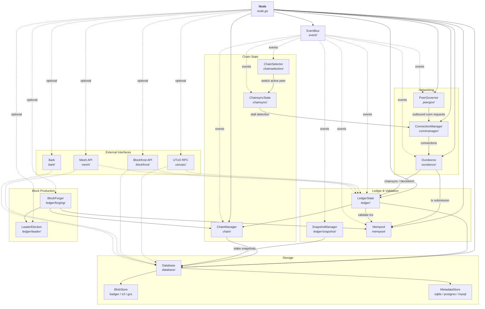
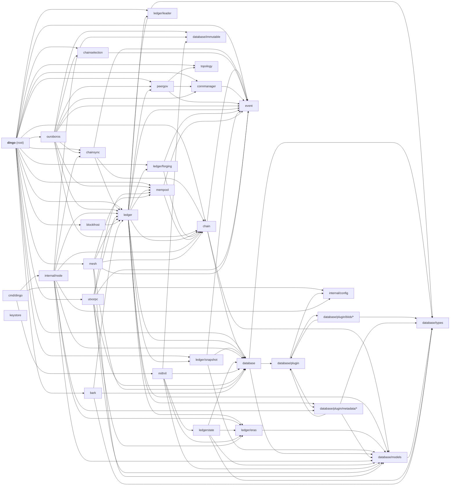
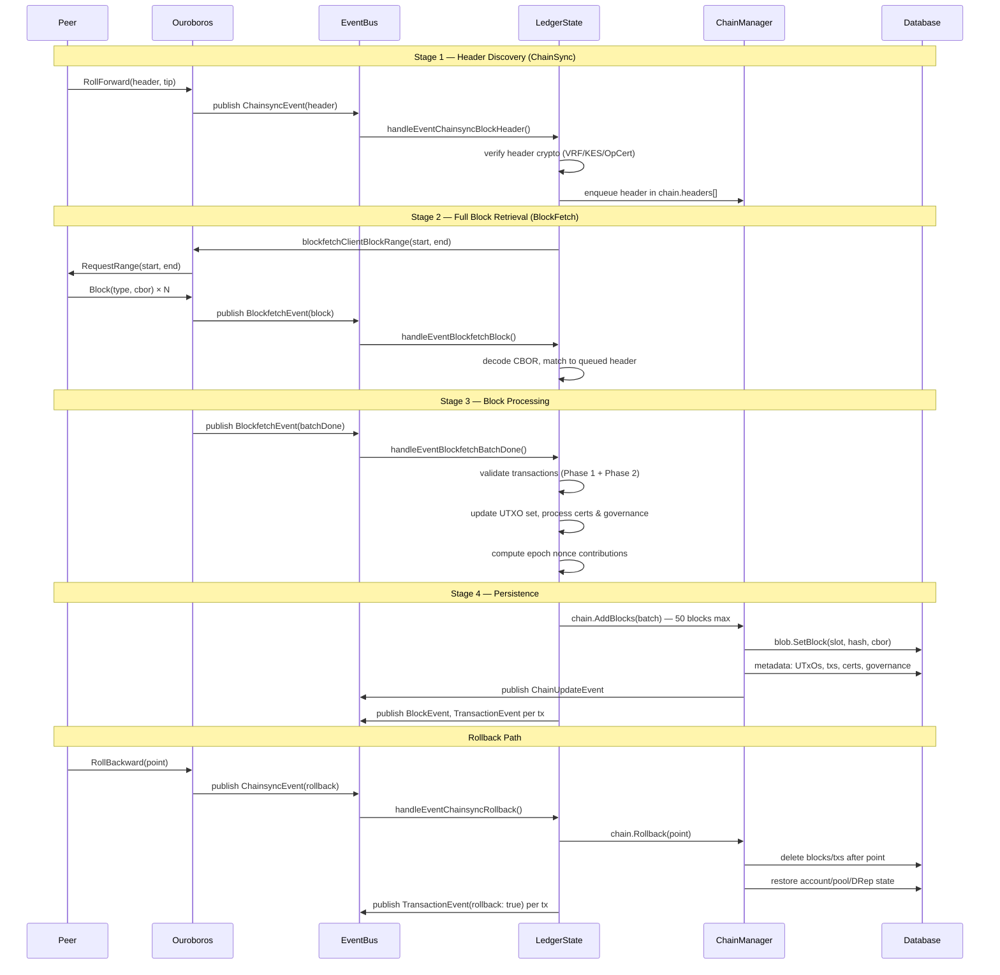
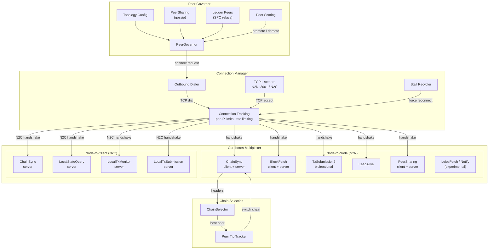
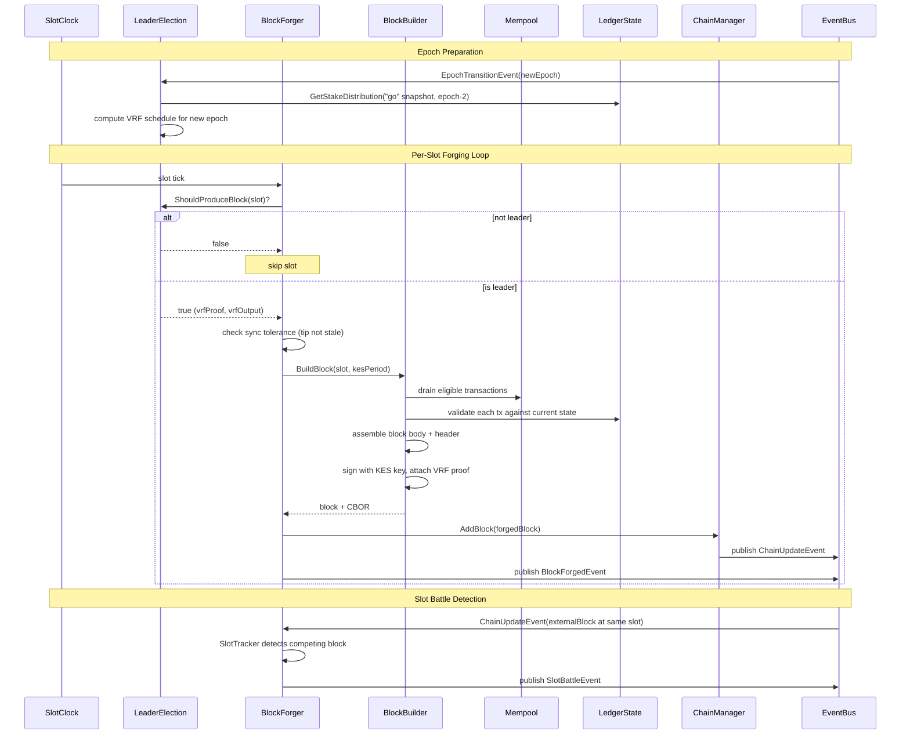

# Architecture

Dingo is a high-performance Cardano blockchain node implementation in Go. This document describes its architecture, core components, and design patterns.

## Table of Contents

- [Overview](#overview)
- [Architecture Diagrams](#architecture-diagrams)
  - [Component Interactions](#component-interactions)
  - [Package Dependency Tree](#package-dependency-tree)
  - [Data Flow](#data-flow)
  - [Peer-to-Peer Networking](#peer-to-peer-networking)
  - [Block Forging](#block-forging)
- [Directory Structure](#directory-structure)
- [Core Node Structure](#core-node-structure)
- [Event-Driven Communication](#event-driven-communication)
- [Storage Architecture](#storage-architecture)
- [Blockchain State Management](#blockchain-state-management)
- [Chain Management](#chain-management)
- [Network and Protocol Handling](#network-and-protocol-handling)
- [Peer Governance](#peer-governance)
- [Transaction Mempool](#transaction-mempool)
- [Block Production](#block-production)
- [Mithril Bootstrap](#mithril-bootstrap)
- [External Interfaces](#external-interfaces)
- [Design Patterns](#design-patterns)
- [Threading and Concurrency](#threading-and-concurrency)
- [Configuration](#configuration)
- [Stake Snapshots](#stake-snapshots)

## Overview

Dingo's architecture is built on several key principles:

1. Modular component design using dependency injection and composition
2. Event-driven communication via EventBus rather than direct coupling
3. Pluggable storage backends with a dual-layer database architecture (blob + metadata)
4. Full Ouroboros protocol support for Node-to-Node and Node-to-Client
5. Multi-peer chain synchronization with Ouroboros Praos chain selection
6. Block production with VRF leader election and stake snapshots
7. Graceful shutdown with phased resource cleanup

## Architecture Diagrams

### Component Interactions

How the Node orchestrator wires components together. Solid arrows are direct method calls; dashed arrows are asynchronous EventBus messages.



### Package Dependency Tree

Internal import relationships between dingo packages. External dependencies are omitted.



### Data Flow

How blocks flow from the network through validation and into storage.



### Peer-to-Peer Networking

Connection lifecycle, protocol multiplexing, and peer governance.



### Block Forging

The block production pipeline from leader election through broadcast.



## Directory Structure

```
dingo/
├── cmd/dingo/           # CLI entry points
│   ├── main.go          # Cobra CLI setup, plugin management
│   ├── serve.go         # Node server command
│   ├── load.go          # Block loading from ImmutableDB/Mithril
│   ├── mithril.go       # Mithril bootstrap subcommand
│   └── version.go       # Version information
├── chain/               # Blockchain state and validation
│   ├── chain.go         # Chain struct, block management
│   ├── manager.go       # ChainManager, fork handling
│   ├── event.go         # Chain events (update, fork)
│   ├── iter.go          # ChainIterator for sequential block access
│   └── errors.go        # Chain-specific errors
├── chainselection/      # Multi-peer chain comparison
│   ├── selector.go      # ChainSelector struct
│   ├── comparison.go    # Ouroboros Praos chain selection rules
│   ├── event.go         # Selection events
│   ├── peer_tip.go      # Peer tip tracking
│   └── vrf.go           # VRF verification
├── chainsync/           # Block synchronization protocol state
│   └── chainsync.go     # Multi-client sync state, stall detection
├── connmanager/         # Network connection lifecycle
│   ├── connection_manager.go
│   └── event.go         # Connection events
├── database/            # Storage abstraction layer
│   ├── database.go      # Database struct, dual-layer design
│   ├── cbor_cache.go    # TieredCborCache implementation
│   ├── cbor_offset.go   # Offset-based CBOR references
│   ├── hot_cache.go     # Hot cache for frequently accessed data
│   ├── block_lru_cache.go # Block-level LRU cache
│   ├── immutable/       # ImmutableDB chunk reader
│   ├── models/          # Database models
│   ├── types/           # Database types
│   ├── sops/            # Storage operations
│   └── plugin/          # Storage plugin system
│       ├── plugin.go    # Plugin registry and interfaces
│       ├── blob/        # Blob storage plugins
│       │   ├── badger/  # Badger (default local storage)
│       │   ├── aws/     # AWS S3
│       │   └── gcs/     # Google Cloud Storage
│       └── metadata/    # Metadata plugins
│           ├── sqlite/  # SQLite (default)
│           ├── postgres/# PostgreSQL
│           └── mysql/   # MySQL
├── event/               # Event bus for decoupled communication
│   ├── event.go         # EventBus, async delivery
│   ├── epoch.go         # Epoch transition events
│   └── metrics.go       # Event metrics
├── ledger/              # Ledger state, validation, block production
│   ├── state.go         # LedgerState, UTXO tracking
│   ├── view.go          # Ledger view queries
│   ├── queries.go       # State queries
│   ├── validation.go    # Transaction validation (Phase 1 UTXO rules)
│   ├── verify_header.go # Block header validation (VRF/KES/OpCert)
│   ├── chainsync.go     # Epoch nonce calculation, rollback handling
│   ├── candidate_nonce.go # Candidate nonce computation
│   ├── certs.go         # Certificate processing
│   ├── governance.go    # Governance action processing
│   ├── delta.go         # State delta tracking
│   ├── block_event.go   # Block event processing
│   ├── slot_clock.go    # Wall-clock slot timing
│   ├── metrics.go       # Ledger metrics
│   ├── peer_provider.go # Ledger-based peer discovery
│   ├── era_summary.go   # Era transition handling
│   ├── eras/            # Era-specific validation rules
│   │   ├── byron.go     # Byron era
│   │   ├── shelley.go   # Shelley era
│   │   ├── allegra.go   # Allegra era
│   │   ├── mary.go      # Mary era
│   │   ├── alonzo.go    # Alonzo era
│   │   ├── babbage.go   # Babbage era
│   │   └── conway.go    # Conway era
│   ├── forging/         # Block production
│   │   ├── forger.go    # BlockForger, slot-based forging loop
│   │   ├── builder.go   # DefaultBlockBuilder, block assembly
│   │   ├── keys.go      # PoolCredentials (VRF/KES/OpCert)
│   │   ├── slot_tracker.go # Slot battle detection
│   │   ├── events.go    # Forging events
│   │   └── metrics.go   # Forging metrics
│   ├── leader/          # Leader election
│   │   ├── election.go  # Ouroboros Praos leader checks
│   │   └── schedule.go  # Epoch leader schedule computation
│   └── snapshot/        # Stake snapshot management
│       ├── manager.go   # Snapshot manager, event-driven capture
│       ├── calculator.go# Stake distribution calculation
│       └── rotation.go  # Mark/Set/Go rotation
├── ledgerstate/         # Low-level ledger state import
│   ├── cbor_decode.go   # CBOR decoding for large structures
│   ├── mempack.go       # Memory-packed state representation
│   ├── snapshot.go      # Snapshot parsing
│   ├── import.go        # Ledger state import
│   ├── utxo.go          # UTXO state handling
│   └── certstate.go     # Certificate state handling
├── mempool/             # Transaction pool
│   ├── mempool.go       # Mempool, validation, capacity
│   └── consumer.go      # Per-consumer transaction tracking
├── ouroboros/            # Ouroboros protocol handlers
│   ├── ouroboros.go      # N2N and N2C protocol management
│   ├── chainsync.go      # Chain synchronization
│   ├── blockfetch.go     # Block fetching
│   ├── txsubmission.go   # TX submission (N2N)
│   ├── localtxsubmission.go # TX submission (N2C)
│   ├── localtxmonitor.go    # Mempool monitoring
│   ├── localstatequery.go   # Ledger queries
│   └── peersharing.go   # Peer discovery
├── peergov/             # Peer selection and governance
│   ├── peergov.go       # PeerGovernor
│   ├── churn.go         # Peer rotation
│   ├── quotas.go        # Per-source quotas
│   ├── score.go         # Peer scoring
│   ├── ledger.go        # Ledger-based peer discovery
│   └── event.go         # Peer events
├── topology/            # Network topology handling
│   └── topology.go      # Topology configuration
├── blockfrost/          # Blockfrost-compatible REST API
│   ├── blockfrost.go    # Server lifecycle
│   ├── adapter.go       # Node state adapter
│   ├── handlers.go      # HTTP handlers
│   ├── pagination.go    # Cursor-based pagination
│   └── types.go         # API response types
├── mesh/                # Mesh (Rosetta) API
│   ├── mesh.go          # Server lifecycle
│   ├── network.go       # /network/* endpoints
│   ├── account.go       # /account/* endpoints
│   ├── block.go         # /block/* endpoints
│   ├── construction.go  # /construction/* endpoints
│   ├── mempool_api.go   # /mempool/* endpoints
│   ├── operations.go    # Cardano operation mapping
│   └── convert.go       # Type conversion utilities
├── utxorpc/             # UTxO RPC gRPC server
│   ├── utxorpc.go       # Server setup
│   ├── query.go         # Query service
│   ├── submit.go        # Submit service
│   ├── sync.go          # Sync service
│   └── watch.go         # Watch service
├── bark/                # Bark Dingo-to-Dingo C2 and archive protocol
│   ├── bark.go          # Bark server lifecycle and transport setup
│   ├── archive.go       # Archive service interface
│   └── blob.go          # Remote archive blob adapter with security window
├── mithril/             # Mithril snapshot bootstrap
│   ├── bootstrap.go     # Bootstrap orchestration
│   ├── client.go        # Mithril aggregator client
│   └── download.go      # Snapshot download and extraction
├── keystore/            # Key management
│   ├── keystore.go      # Key store interface
│   ├── keyfile.go       # Key file parsing
│   ├── keyfile_unix.go  # Unix file permissions
│   ├── keyfile_windows.go # Windows ACL permissions
│   └── evolution.go     # KES key evolution
├── config/cardano/      # Embedded Cardano network configurations
├── internal/
│   ├── config/          # Configuration parsing
│   ├── integration/     # Integration tests
│   ├── node/            # Node orchestration (CLI wiring)
│   │   ├── node.go      # Run(), signal handling, metrics server
│   │   └── load.go      # Block loading implementation
│   ├── test/            # Test utilities
│   │   ├── conformance/ # Amaru conformance tests
│   │   ├── devnet/      # DevNet end-to-end tests
│   │   └── testutil/    # Shared test helpers
│   └── version/         # Version information
├── node.go              # Node struct definition, Run(), shutdown
├── config.go            # Configuration management (functional options)
└── tracing.go           # OpenTelemetry tracing
```

## Core Node Structure

The `Node` struct (defined in `node.go`) orchestrates all major components:

```go
type Node struct {
    connManager    *connmanager.ConnectionManager  // Network connections
    peerGov        *peergov.PeerGovernor          // Peer selection/governance
    chainsyncState *chainsync.State               // Multi-peer sync state
    chainSelector  *chainselection.ChainSelector  // Chain comparison
    eventBus       *event.EventBus                // Event routing
    mempool        *mempool.Mempool               // Transaction pool
    chainManager   *chain.ChainManager            // Blockchain state
    db             *database.Database             // Storage layer
    ledgerState    *ledger.LedgerState            // UTXO/state tracking
    snapshotMgr    *snapshot.Manager              // Stake snapshot capture
    utxorpc        *utxorpc.Utxorpc               // UTxO RPC server
    bark           *bark.Bark                     // Bark C2/archive server
    blockfrostAPI  *blockfrost.Blockfrost         // Blockfrost REST API
    meshAPI        *mesh.Server                   // Mesh (Rosetta) API
    ouroboros      *ouroboros.Ouroboros            // Protocol handlers
    blockForger    *forging.BlockForger           // Block production
    leaderElection *leader.Election               // Slot leader checks
}
```

### Initialization Flow

When `Node.Run()` is called, components are initialized in this order:

```
 1. EventBus creation
 2. Database loading (blob + metadata plugins)
 3. ChainManager initialization
 4. Ouroboros protocol handler creation
 5. LedgerState creation (UTXO tracking, validation)
 6. Bark remote archive adapter (if configured)
 7. LedgerState start
 8. Snapshot manager start (captures genesis snapshot)
 9. Mempool setup
10. ChainsyncState (multi-client tracking, stall detection)
11. ChainSelector (Ouroboros Praos chain comparison)
12. ConnectionManager (listeners)
13. Stalled client recycler (background goroutine)
14. PeerGovernor (topology + churn + ledger peers)
15. UTxO RPC server (if port configured)
16. Bark C2/archive server (if port configured)
17. Blockfrost API (if port configured)
18. Mesh API (if port configured)
19. Block forger + leader election (if block producer mode)
20. Wait for shutdown signal
```

### Shutdown Flow

Graceful shutdown proceeds in phases:

```
Phase 1: Stop accepting new work
  Block forger, leader election, chain selector,
  peer governor, snapshot manager, UTxO RPC,
  Bark C2/archive server, Blockfrost API, Mesh API

Phase 2: Drain and close connections
  Mempool, ConnectionManager

Phase 3: Flush state and close database
  LedgerState, Database

Phase 4: Cleanup resources
  Registered shutdown functions, EventBus
```

## Event-Driven Communication

Components communicate via the `EventBus` (`event/event.go`) rather than direct coupling:

```
Publisher ---publish---> EventBus ---deliver---> Subscribers
                            |
                            | async
                            v
                       Worker Pool
                       (4 workers)
```

### Key Event Types

All event types follow the `subsystem.snake_case_name` convention.

| Event | Source | Purpose |
|-------|--------|---------|
| `chain.update` | ChainManager | Block added to chain |
| `chain.fork_detected` | ChainManager | Fork detected |
| `chainselection.peer_tip_update` | ChainSelector | Peer tip updated |
| `chainselection.chain_switch` | ChainSelector | Active peer changed |
| `chainselection.selection` | ChainSelector | Chain selection made |
| `chainselection.peer_evicted` | ChainSelector | Peer evicted |
| `chainsync.client_added` | ChainsyncState | Client tracking added |
| `chainsync.client_removed` | ChainsyncState | Client tracking removed |
| `chainsync.client_synced` | ChainsyncState | Client caught up |
| `chainsync.client_stalled` | ChainsyncState | Client stall detected |
| `chainsync.fork_detected` | ChainsyncState | Chainsync fork detected |
| `chainsync.client_remove_requested` | Node | Stalled client removal |
| `chainsync.resync` | LedgerState | Chainsync resync request |
| `connmanager.inbound_conn` | ConnManager | Inbound connection |
| `connmanager.conn_closed` | ConnManager | Connection closed |
| `connmanager.connection_recycle_requested` | ConnManager | Connection recycling |
| `mempool.add_tx` | Mempool | Transaction added |
| `mempool.remove_tx` | Mempool | Transaction removed |
| `ledger.block` | LedgerState | Block applied or rolled back |
| `ledger.tx` | LedgerState | Transaction processed |
| `ledger.error` | LedgerState | Ledger error occurred |
| `ledger.blockfetch` | Ouroboros | Block fetch event received |
| `ledger.chainsync` | Ouroboros | Chainsync event received |
| `ledger.pool_restored` | LedgerState | Pool state restored after rollback |
| `epoch.transition` | LedgerState | Epoch boundary crossed |
| `hardfork.transition` | LedgerState | Hard fork transition |
| `block.forged` | BlockForger | Block successfully forged |
| `forging.slot_battle` | SlotTracker | Competing blocks at same slot |
| `peergov.outbound_conn` | PeerGov | Outbound connection initiated |
| `peergov.peer_demoted` | PeerGov | Peer demoted |
| `peergov.peer_promoted` | PeerGov | Peer promoted |
| `peergov.peer_removed` | PeerGov | Peer removed |
| `peergov.peer_added` | PeerGov | Peer added |
| `peergov.peer_churn` | PeerGov | Peer rotation event |
| `peergov.quota_status` | PeerGov | Quota status update |
| `peergov.bootstrap_exited` | PeerGov | Exited bootstrap mode |
| `peergov.bootstrap_recovery` | PeerGov | Bootstrap recovery |

### EventBus Features

- Asynchronous delivery via worker pool (4 workers, 1000-entry queue)
- Buffered channels with timeout protection to prevent blocking
- Prometheus metrics for event delivery tracking and latency

## Storage Architecture

Dingo uses a dual-layer storage architecture with pluggable backends:

```
                         Database
    -------------------------------------------------
    |       Blob Store            |  Metadata Store  |
    |   (blocks, UTxOs, txs)     |  (indexes, state)|
    -------------------------------------------------
    | Plugins:                    | Plugins:          |
    |  - Badger (default)         |  - SQLite (default)|
    |  - AWS S3                   |  - PostgreSQL     |
    |  - Google Cloud Storage     |  - MySQL          |
    -------------------------------------------------
```

### Storage Modes

Dingo supports two storage modes, configured via `storageMode`:

- `core` (default): Minimal storage for chain following and block production.
- `api`: Extended storage with transaction indexes, address lookups, and asset tracking. Required when any client-facing API server (Blockfrost, Mesh, UTxO RPC) is enabled. Bark is a separate Dingo-to-Dingo protocol and is not part of that API surface.

### Tiered CBOR Cache

Instead of storing full CBOR data redundantly, Dingo uses offset-based references with a tiered cache:

```
CBOR Data Request
       |
       v
Tier 1: Hot Cache (in-memory)
  - UTxO entries: configurable count (HotUtxoEntries)
  - Transaction entries: configurable count + byte limit
  - O(1) access, LRU eviction
       | miss
       v
Tier 2: Block LRU Cache
  - Recently accessed blocks with pre-computed indexes
  - Fast extraction without blob store access
       | miss
       v
Tier 3: Cold Extraction
  - Fetch block from blob store
  - Extract CBOR at stored offset
```

### CborOffset Structure

Each CBOR reference is a fixed 52-byte `CborOffset` struct with magic prefix:

| Field | Size | Purpose |
|-------|------|---------|
| Magic | 4 bytes | "DOFF" prefix to identify offset storage |
| BlockSlot | 8 bytes | Block slot number |
| BlockHash | 32 bytes | Block hash |
| ByteOffset | 4 bytes | Offset within block CBOR |
| ByteLength | 4 bytes | Length of CBOR data |

### Plugin System

Plugins are registered via a global registry (`database/plugin/plugin.go`):

```go
plugin.SetPluginOption() -> plugin.GetPlugin() -> plugin.Start() -> Use interface
```

Interfaces:
- `BlobStore` - Block/transaction storage operations
- `MetadataStore` - Index and query operations

### Database Models

Key models in `database/models/`:

| Model | Purpose |
|-------|---------|
| `Block` | Block metadata (slot, hash, height, era) |
| `Transaction` | Transaction records |
| `Utxo` | UTXO set entries |
| `Account` | Stake account registrations and delegations |
| `Pool` | Stake pool registrations |
| `Drep` | DRep registrations |
| `Epoch` | Epoch metadata and nonces |
| `PoolStakeSnapshot` | Per-pool stake at epoch boundary |
| `EpochSummary` | Network-wide aggregates per epoch |
| `BackfillCheckpoint` | Mithril backfill progress tracking |
| `NetworkState` | Network-wide state tracking |
| `GovernanceAction` | Governance proposals |
| `CommitteeMember` | Constitutional committee members |

## Blockchain State Management

The `LedgerState` (`ledger/state.go`) manages UTXO tracking and validation:

```
                       LedgerState
    -------------------------------------------------
    | - UTXO tracking and lookup                     |
    | - Protocol parameter management                |
    | - Certificate processing (pools, stakes, DReps)|
    | - Transaction validation (Phase 1: UTXO rules) |
    | - Plutus script execution (Phase 2)            |
    | - Block header validation (VRF/KES/OpCert)     |
    | - Epoch nonce computation                      |
    | - Governance action processing                 |
    | - State restoration on rollback                |
    | - Ledger-based peer discovery                  |
    -------------------------------------------------
    |              Database Worker Pool              |
    | - Async database operations                    |
    | - Configurable pool size (default: 5 workers)  |
    | - Fire-and-forget or result-waiting            |
    -------------------------------------------------
```

### Era-Specific Validation

The `ledger/eras/` package provides era-specific validation rules for each Cardano era (Byron through Conway). Each era implements protocol parameter extraction, fee calculation, and era-specific transaction rules.

### Block Header Validation

`ledger/verify_header.go` performs cryptographic validation of block headers:
- VRF proof verification against the epoch nonce
- KES signature verification with period checks
- Operational certificate chain validation
- Slot leader eligibility checking

### Epoch Nonce Computation

`ledger/chainsync.go` and `ledger/candidate_nonce.go` implement the Ouroboros Praos nonce evolution:
- Evolving nonce: accumulated from each block's VRF output
- Candidate nonce: frozen at the stability window cutoff
- Epoch nonce: derived from candidate nonce and previous epoch's last block hash

### Ledger View

The `LedgerView` interface provides query access to ledger state:
- UTXO lookups by address or output reference
- Protocol parameter queries
- Stake distribution queries
- Account registration checks

## Chain Management

The `ChainManager` (`chain/manager.go`) manages multiple chains:

```
                      ChainManager
    -------------------------------------------------
    | Primary Chain                                  |
    |   Persistent chain loaded from database        |
    |                                                |
    | Fork Chains                                    |
    |   Temporary chains for peer synchronization    |
    |                                                |
    | Block Cache                                    |
    |   In-memory cache for quick access             |
    |                                                |
    | Rollback Support                               |
    |   Reverts chain to previous point (up to K     |
    |   blocks), emits rollback events, restores     |
    |   account/pool/DRep state                      |
    -------------------------------------------------
```

### Chain Selection (Ouroboros Praos)

The `ChainSelector` (`chainselection/`) implements Ouroboros Praos rules:

1. Higher block number wins (longer chain)
2. At equal block number, lower slot wins (denser chain)

The selector tracks tips from all connected peers and switches the active chainsync connection when a better chain is found.

## Network and Protocol Handling

### Ouroboros Protocol Stack

The `Ouroboros` struct (`ouroboros/ouroboros.go`) manages all protocol handlers:

```
              Ouroboros Protocols
    -------------------------------------------
    | Node-to-Node (N2N)  | Node-to-Client (N2C)|
    |---------------------|---------------------|
    | ChainSync           | ChainSync           |
    |   Block sync        |   Wallet sync       |
    |                     |                     |
    | BlockFetch          | LocalTxMonitor      |
    |   Block retrieval   |   Mempool queries   |
    |                     |                     |
    | TxSubmission2       | LocalTxSubmission   |
    |   Transaction share |   Transaction submit|
    |                     |                     |
    | PeerSharing         | LocalStateQuery     |
    |   Peer discovery    |   Ledger queries    |
    -------------------------------------------
```

### Connection Management

The `ConnectionManager` (`connmanager/connection_manager.go`) handles connection lifecycle:

```
                    ConnectionManager
    -------------------------------------------------
    | Inbound Listeners                              |
    |   TCP N2N (default: 3001)                      |
    |   TCP N2C (configurable)                       |
    |   Unix socket N2C                              |
    |                                                |
    | Outbound Clients                               |
    |   Source port selection                         |
    |                                                |
    | Connection Tracking                            |
    |   Per-peer connection state                    |
    |   Duplex detection (bidirectional connections) |
    |   Stalled connection recycling                 |
    -------------------------------------------------
```

### Multi-Client Chainsync

The `chainsync.State` tracks multiple concurrent chainsync clients:
- Configurable max client count
- Stall detection with configurable timeout
- Grace period before recycling stalled connections
- Cooldown to prevent rapid reconnection flapping
- Plateau detection: if the local tip stops advancing while peers are ahead, the active chainsync connection is recycled

## Peer Governance

The `PeerGovernor` (`peergov/peergov.go`) manages peer selection and topology:

```
                      PeerGovernor
    -------------------------------------------------
    | Peer Targets                                   |
    |   Known peers: 150                             |
    |   Established peers: 50                        |
    |   Active peers: 20                             |
    |                                                |
    | Per-Source Quotas                               |
    |   Topology quota: 3 peers                      |
    |   Gossip quota: 12 peers                       |
    |   Ledger quota: 5 peers                        |
    |                                                |
    | Peer Churn                                     |
    |   Gossip churn: 5 min interval, 20%            |
    |   Public root churn: 30 min interval, 20%      |
    |                                                |
    | Peer Scoring                                   |
    |   Performance-based peer ranking               |
    |                                                |
    | Ledger Peer Discovery                          |
    |   Discovers peers from stake pool relays       |
    |   Activated after UseLedgerAfterSlot           |
    |                                                |
    | Denied List                                    |
    |   Prevents reconnection to bad peers           |
    |   (30 min timeout)                             |
    -------------------------------------------------
```

## Transaction Mempool

The `Mempool` (`mempool/mempool.go`) manages pending transactions:

```
                        Mempool
    -------------------------------------------------
    | Transaction Management                         |
    |   Validation on add (Phase 1 + Phase 2)        |
    |   Capacity limits (configurable)               |
    |   Watermark-based eviction and rejection       |
    |   Automatic purging on chain updates           |
    |                                                |
    | Consumer Tracking                              |
    |   Per-consumer state for TX distribution       |
    |                                                |
    | Metrics                                        |
    |   Transaction count, total size,               |
    |   validation statistics                        |
    -------------------------------------------------
```

## Block Production

When running as a stake pool operator, Dingo can produce blocks. This involves three subsystems under `ledger/`:

### Leader Election (`ledger/leader/`)

`Election` subscribes to epoch transition events and pre-computes a leader schedule for each epoch. For each slot, it checks whether the pool's VRF output meets the threshold determined by the pool's relative stake (from the "go" snapshot, 2 epochs old).

### Block Forging (`ledger/forging/`)

`BlockForger` runs a slot-based loop that:
1. Waits for the next slot boundary using the wall-clock slot timer
2. Checks leader eligibility via the `Election`
3. Assembles a block from mempool transactions using `DefaultBlockBuilder`
4. Broadcasts the forged block through the chain manager

The forger tracks slot battles (competing blocks at the same slot) and skips forging when the node is not sufficiently synced, controlled by `forgeSyncToleranceSlots` and `forgeStaleGapThresholdSlots`.

### Pool Credentials (`ledger/forging/keys.go`, `keystore/`)

VRF signing keys, KES signing keys, and operational certificates are loaded from files at startup. The `keystore` package handles platform-specific file permission checks (Unix file modes, Windows ACLs) and KES key evolution.

## Mithril Bootstrap

The `mithril/` package enables fast initial sync by downloading and importing a Mithril snapshot rather than syncing from genesis:

1. `client.go` queries the Mithril aggregator for the latest certified snapshot
2. `download.go` downloads and extracts the snapshot archive
3. `bootstrap.go` orchestrates the import into Dingo's database

This is exposed via the `dingo mithril` CLI subcommand and the `dingo load` command.

## External Interfaces

Dingo provides three client-facing APIs plus Bark. All are optional and gated by port configuration. UTxO RPC, Blockfrost, and Mesh are general-purpose external APIs and require `storageMode: api`. Bark is different: it is Dingo's own protocol for Dingo-to-Dingo C2/archive services, not a general-purpose application API.

### Blockfrost API (`blockfrost/`)

A Blockfrost-compatible REST API that provides read access to chain data. The current implementation exposes the latest, epoch, network, and pool subset. It uses an adapter pattern to translate between Dingo's internal state and Blockfrost response types and supports cursor-based pagination.

### Mesh API (`mesh/`)

Implements the Mesh (formerly Rosetta) API specification for wallet integration and chain analysis. Provides endpoints for network status, account balances, block queries, transaction construction, and mempool access.

### UTxO RPC (`utxorpc/`)

A gRPC server implementing the UTxO RPC specification with query, submit, sync, and watch services. Supports optional TLS.

### Bark (`bark/`)

Bark is Dingo's own protocol for Dingo-to-Dingo control-plane and archive services. It exposes archive access over Connect/gRPC and also supplies a remote archive adapter with a configurable security window, allowing Dingo to fetch historical blocks from a remote Bark instance instead of storing them locally.

## Design Patterns

### Dependency Injection

The `Node` creates and injects dependencies into components during initialization. Components receive their dependencies through constructors rather than creating them internally.

### Interface Segregation

Small, focused interfaces allow swapping implementations:
- `BlobStore` for blob storage
- `MetadataStore` for metadata storage
- Protocol handler interfaces for Ouroboros
- `forging.LeaderChecker`, `forging.BlockBroadcaster`, `forging.SlotClockProvider` for block production

### Plugin Architecture

Storage backends are loaded dynamically through a plugin registry, allowing extension without modifying core code.

### Adapter Pattern

The block production system uses adapters (`mempoolAdapter`, `stakeDistributionAdapter`, `epochInfoAdapter`, `slotClockAdapter`) to decouple forging interfaces from concrete implementations.

### Observer Pattern

The `EventBus` implements publisher/subscriber communication, decoupling components that produce events from those that consume them.

### Iterator Pattern

`ChainIterator` provides sequential access to blocks without exposing internal chain structure.

### Manager Pattern

`ChainManager`, `PeerGovernor`, and `snapshot.Manager` orchestrate related operations and maintain consistent state across multiple entities.

### Worker Pool Pattern

Database operations and event delivery use worker pools for controlled concurrency and backpressure.

## Threading and Concurrency

| Pattern | Usage |
|---------|-------|
| Goroutine Management | Tracked WaitGroups for clean shutdown |
| Mutex Protection | RWMutex for read-heavy operations |
| Atomic Operations | Atomic types for metrics counters |
| Channel Communication | EventBus async delivery |
| Context Cancellation | Graceful shutdown signals |
| Worker Pools | Database operations and event delivery |
| sync.Once | Ensure single shutdown execution |

## Configuration

Configuration priority (highest to lowest):

1. CLI flags
2. Environment variables
3. YAML config file (`dingo.yaml`)
4. Hardcoded defaults

Key configuration areas:
- Network selection (preview, preprod, mainnet)
- Storage mode (`core` or `api`)
- Database path and plugins
- Listen addresses and ports
- Mempool capacity and watermarks
- Peer targets and quotas
- CBOR cache sizing (hot entries, block LRU)
- Chainsync client limits and stall timeout
- Block producer credentials (VRF key, KES key, operational certificate)
- External interface ports (Blockfrost, Mesh, UTxO RPC, Bark)

## Stake Snapshots

Stake snapshots capture the stake distribution at epoch boundaries for use in Ouroboros Praos leader election. The block producer must know the stake distribution from 2 epochs ago to determine if it is the slot leader.

### Ouroboros Praos Snapshot Model

```
Epoch N-2        Epoch N-1        Epoch N (current)
   |                |                |
   v                v                v
[Go Snapshot] <- [Set Snapshot] <- [Mark Snapshot]
   |                                    |
   Used for leader election             Captured at
   in current epoch                     epoch boundary
```

- Mark Snapshot: Captured at the end of epoch N, becomes Set at epoch N+1
- Set Snapshot: Previous Mark, becomes Go at epoch N+1
- Go Snapshot: Active snapshot used for leader election (2 epochs old)

### Stake Snapshot Components

```
Block Processing
     |
     v
LedgerState --> Epoch Transition --> EventBus (EpochTransitionEvent)
                Detection                        |
                                                 v
                                         SnapshotManager
                                         (Subscribe)
                                                 |
              -----------------------------------+------
              |                                  |     |
              v                                  v     v
    Calculate Stake              Rotate Snapshots   Cleanup
    Distribution                 Mark -> Set -> Go
              |                                  |
              v                                  v
                        Database
         PoolStakeSnapshot    EpochSummary
```

### Database Models

| Model | Purpose |
|-------|---------|
| `PoolStakeSnapshot` | Per-pool stake at epoch boundary (epoch, type, pool hash, stake, delegator count) |
| `EpochSummary` | Network-wide aggregates (total stake, pool count, delegator count, epoch nonce) |

Snapshot types: `"mark"`, `"set"`, `"go"`

### Query Interface

The `LedgerView` provides stake distribution queries:

```go
// Get full stake distribution for leader election
dist, err := ledgerView.GetStakeDistribution(epoch)

// Get stake for a specific pool
poolStake, err := ledgerView.GetPoolStake(epoch, poolKeyHash)

// Get total active stake
totalStake, err := ledgerView.GetTotalActiveStake(epoch)
```

### Event-Driven Capture

`EpochTransitionEvent` triggers snapshot capture:

```go
type EpochTransitionEvent struct {
    PreviousEpoch     uint64
    NewEpoch          uint64
    BoundarySlot      uint64
    EpochNonce        []byte
    ProtocolVersion   uint
    SnapshotSlot      uint64  // Typically boundary - 1
}
```

### Rollback Support

On chain rollback past an epoch boundary:
- Delete snapshots for epochs after rollback point
- Recalculate affected snapshots on forward replay
