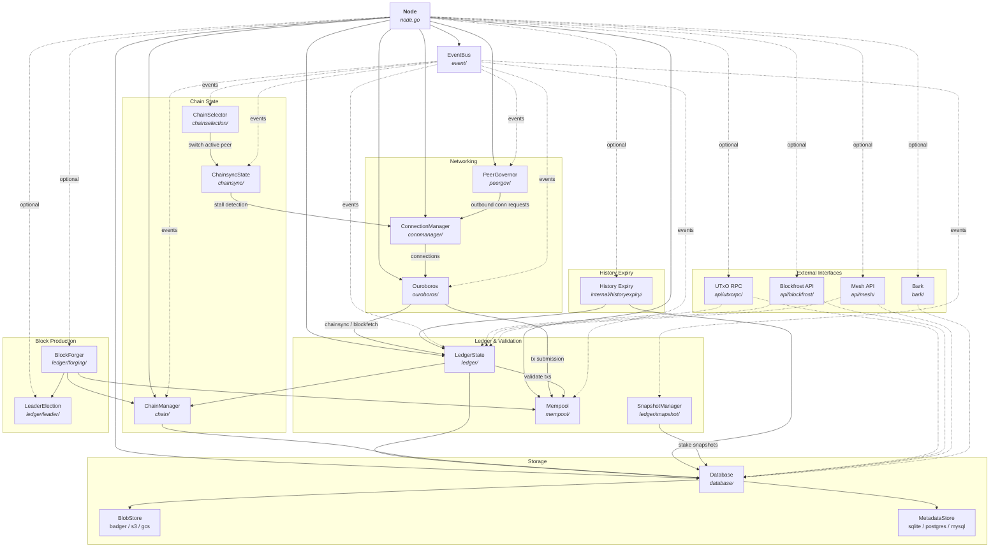
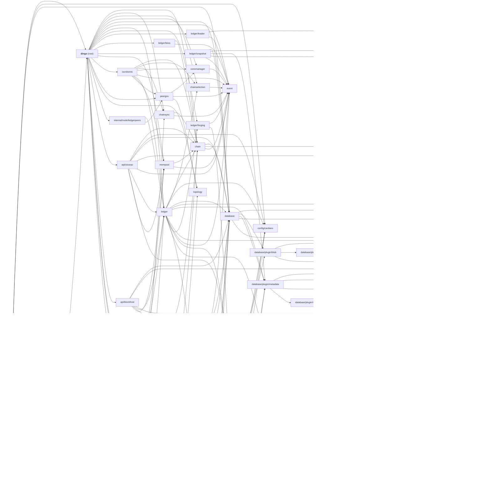
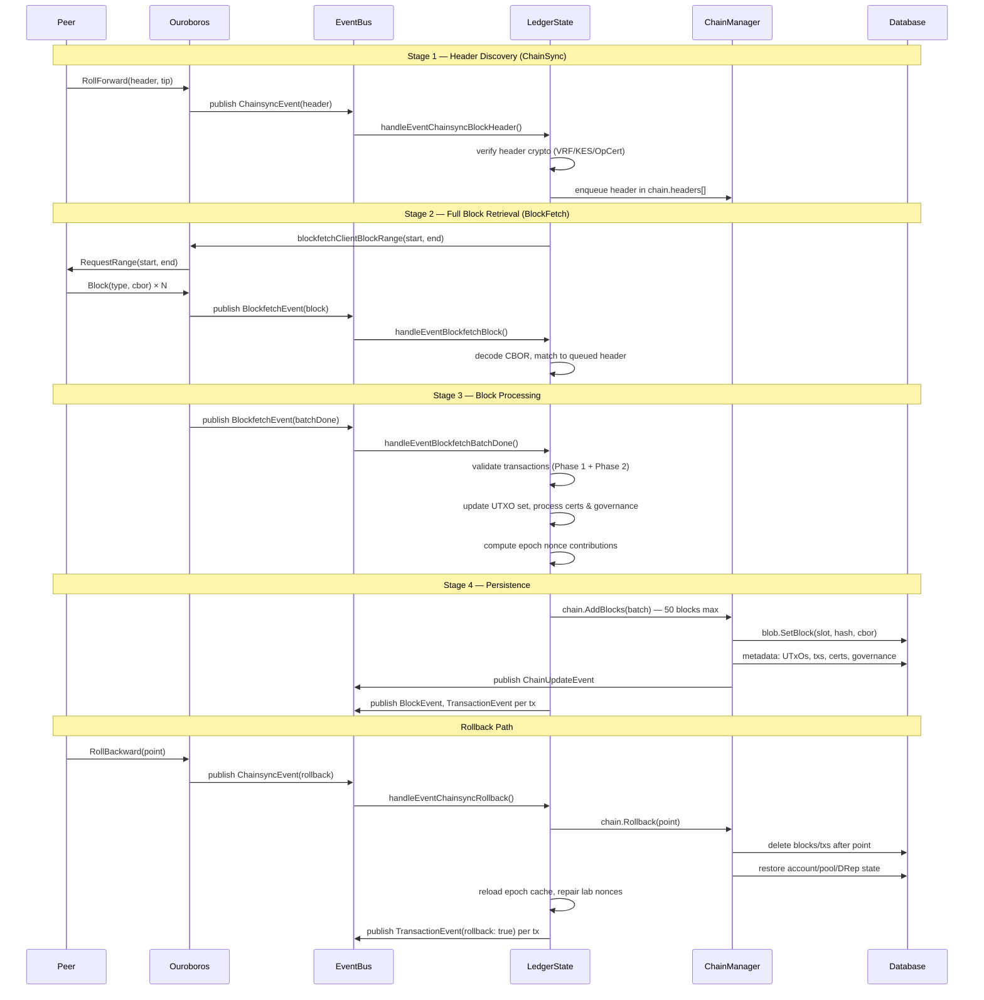
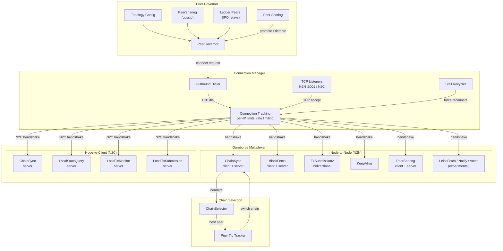
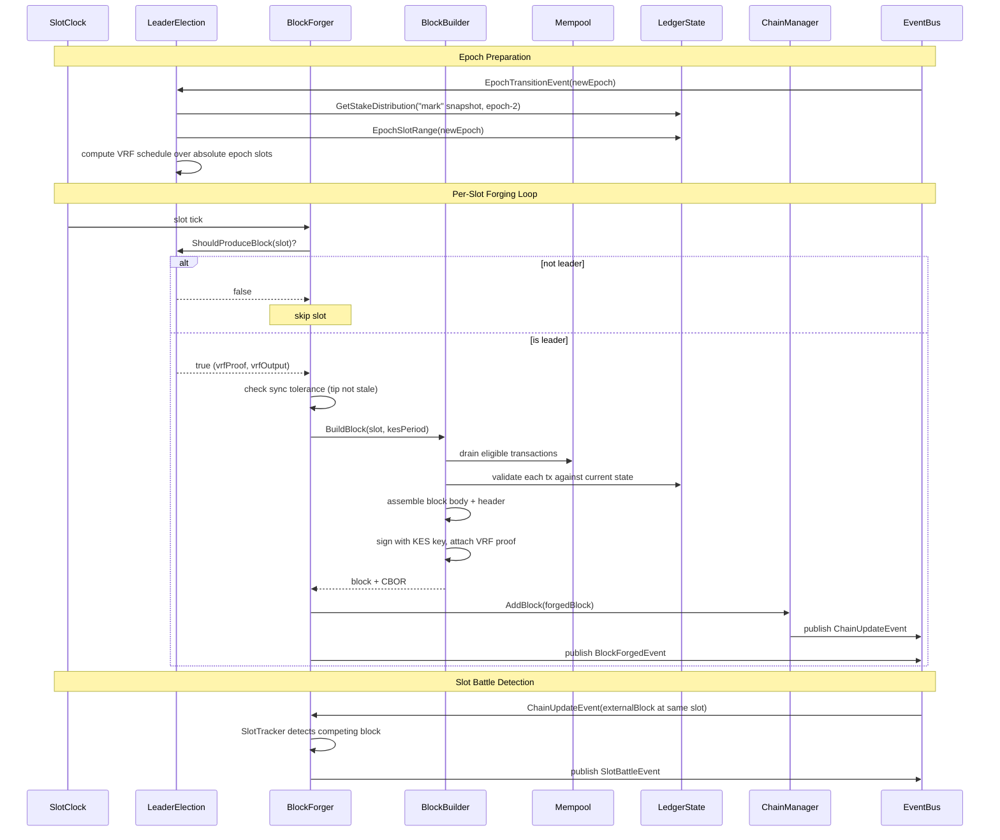

# Architecture

Last reviewed: 2026-07-09

Dingo is a high-performance Cardano blockchain node implementation in Go. This document describes its architecture, core components, and design patterns.

## Table of Contents

- [Overview](#overview)
- [Architecture Diagrams](#architecture-diagrams)
  - [Component Interactions](#component-interactions)
  - [Package Dependency Tree](#package-dependency-tree)
  - [Data Flow](#data-flow)
  - [Peer-to-Peer Networking](#peer-to-peer-networking)
  - [Block Forging](#block-forging)
- [Directory Structure](#directory-structure)
- [Core Node Structure](#core-node-structure)
- [Event-Driven Communication](#event-driven-communication)
- [Storage Architecture](#storage-architecture)
- [Blockchain State Management](#blockchain-state-management)
- [Chain Management](#chain-management)
- [Network and Protocol Handling](#network-and-protocol-handling)
- [Peer Governance](#peer-governance)
- [Transaction Mempool](#transaction-mempool)
- [Block Production](#block-production)
- [Mithril Bootstrap](#mithril-bootstrap)
- [External Interfaces](#external-interfaces)
- [Architectural Boundaries](#architectural-boundaries)
- [Design Patterns](#design-patterns)
- [Threading and Concurrency](#threading-and-concurrency)
- [Configuration](#configuration)
- [Stake Snapshots](#stake-snapshots)

## Overview

Dingo's architecture is built on several key principles:

1. Modular component design using dependency injection and composition
2. Event-driven async notifications via EventBus, with synchronous queries
   passed through explicit constructor-injected dependencies or narrow
   interfaces
3. Pluggable storage backends with a dual-layer database architecture (blob + metadata)
4. Full Ouroboros protocol support for Node-to-Node and Node-to-Client
5. Multi-peer chain synchronization with Ouroboros Praos chain selection
6. Block production with VRF leader election and stake snapshots
7. Graceful shutdown with phased resource cleanup

The root `dingo` package, `cmd/dingo`, and `internal/node` are the composition
layers. Domain packages should not reach upward into node startup, CLI, or
operator policy; when cross-component behavior is required, the node should
wire it through a narrow interface, callback, or EventBus subscription.

## Architecture Diagrams

### Component Interactions

How the Node orchestrator wires components together. Solid arrows are direct method calls; dashed arrows are asynchronous EventBus messages.



### Package Dependency Tree

Internal import relationships between production dingo packages. External
dependencies and tests are omitted. This graph was refreshed from `go list` on
2026-06-23.



### Data Flow

How blocks flow from the network through validation and into storage.



The BlockFetch server path mirrors the retrieval flow for downstream peers:
when a peer requests a range, `ouroboros/blockfetch.go` validates the bounds,
opens a chain iterator at the requested start point, sends `StartBatch`, then
streams `Block` messages until the requested end or local tip before
`BatchDone`. The range sender is asynchronous so the mini-protocol callback can
return promptly, but it applies backpressure between messages by waiting for
the underlying gouroboros protocol send queue to drain. This keeps large Leios
catch-up ranges from filling the mux pending-message queue and turning a slow
consumer into a connection-level protocol violation.

### Peer-to-Peer Networking

Connection lifecycle, protocol multiplexing, and peer governance.



### Block Forging

The block production pipeline from leader election through broadcast.



## Directory Structure

```
dingo/
├── cmd/dingo/           # CLI entry points
│   ├── main.go          # Cobra CLI setup, plugin management
│   ├── serve.go         # Node server command
│   ├── load.go          # Block loading from ImmutableDB/Mithril
│   ├── mithril.go       # Mithril bootstrap subcommand
│   └── version.go       # Version information
├── chain/               # Blockchain state and validation
│   ├── chain.go         # Chain struct, block management
│   ├── manager.go       # ChainManager, fork handling
│   ├── event.go         # Chain events (update, fork)
│   ├── iter.go          # ChainIterator for sequential block access
│   └── errors.go        # Chain-specific errors
├── chainselection/      # Multi-peer chain comparison
│   ├── selector.go      # ChainSelector struct
│   ├── comparison.go    # Ouroboros Praos chain selection rules
│   ├── event.go         # Selection events
│   ├── peer_tip.go      # Peer tip tracking
│   └── vrf.go           # VRF verification
├── chainsync/           # Block synchronization protocol state
│   ├── chainsync.go     # Multi-client sync state, stall detection
│   └── strategy.go      # Configurable multi-active header-sync strategy
├── connmanager/         # Network connection lifecycle
│   ├── connection_manager.go
│   └── event.go         # Connection events
├── database/            # Storage abstraction layer
│   ├── database.go      # Database struct, dual-layer design
│   ├── cbor_cache.go    # TieredCborCache implementation
│   ├── cbor_offset.go   # Offset-based CBOR references
│   ├── hot_cache.go     # Hot cache for frequently accessed data
│   ├── block_lru_cache.go # Block-level LRU cache
│   ├── immutable/       # ImmutableDB chunk reader
│   ├── models/          # Database models
│   ├── types/           # Database types
│   ├── sops/            # Storage operations
│   └── plugin/          # Storage plugin system
│       ├── plugin.go    # Plugin registry and interfaces
│       ├── blob/        # Blob storage plugins
│       │   ├── badger/  # Badger (default local storage)
│       │   ├── aws/     # AWS S3
│       │   └── gcs/     # Google Cloud Storage
│       └── metadata/    # Metadata plugins
│           ├── sqlite/  # SQLite (default)
│           ├── postgres/# PostgreSQL (tag-gated)
│           └── mysql/   # MySQL (tag-gated)
├── event/               # Event bus for decoupled communication
│   ├── event.go         # EventBus, async delivery
│   ├── epoch.go         # Epoch transition events
│   └── metrics.go       # Event metrics
├── ledger/              # Ledger state, validation, block production
│   ├── state.go         # LedgerState, UTXO tracking
│   ├── view.go          # Ledger view queries
│   ├── queries.go       # State queries
│   ├── validation.go    # Transaction validation (Phase 1 UTXO rules)
│   ├── verify_header.go # Block header validation (VRF/KES/OpCert)
│   ├── chainsync.go     # Epoch nonce calculation, rollback handling
│   ├── candidate_nonce.go # Candidate nonce computation
│   ├── certs.go         # Certificate processing
│   ├── governance.go    # Governance action processing
│   ├── delta.go         # State delta tracking
│   ├── block_event.go   # Block event processing
│   ├── slot_clock.go    # Wall-clock slot timing
│   ├── metrics.go       # Ledger metrics
│   ├── peer_provider.go # Ledger-based peer discovery
│   ├── era_summary.go   # Era transition handling
│   ├── eras/            # Era-specific validation rules
│   │   ├── byron.go     # Byron era
│   │   ├── shelley.go   # Shelley era
│   │   ├── allegra.go   # Allegra era
│   │   ├── mary.go      # Mary era
│   │   ├── alonzo.go    # Alonzo era
│   │   ├── babbage.go   # Babbage era
│   │   └── conway.go    # Conway era
│   ├── forging/         # Block production
│   │   ├── forger.go    # BlockForger, slot-based forging loop
│   │   ├── builder.go   # DefaultBlockBuilder, block assembly
│   │   ├── keys.go      # PoolCredentials (VRF/KES/OpCert)
│   │   ├── slot_tracker.go # Slot battle detection
│   │   ├── events.go    # Forging events
│   │   └── metrics.go   # Forging metrics
│   ├── leader/          # Leader election
│   │   ├── election.go  # Ouroboros Praos leader checks
│   │   └── schedule.go  # Epoch leader schedule computation
│   ├── leios/           # CIP-0164 Leios voting + pipeline (experimental)
│   │   ├── committee.go # Stake-truncated committee selection
│   │   ├── quorum.go    # Stake-quorum predicate
│   │   ├── bls.go       # BLS12-381 MinSig sign/verify/aggregate
│   │   ├── keys.go      # Vote signing key + voter pubkey registry
│   │   ├── certificate.go # EB certificate build/validate
│   │   ├── manager.go   # VoteManager: store, tally, serve, emit
│   │   └── pipeline.go  # PipelineManager: stage/timing, EB equivocation, inclusion eligibility
│   └── snapshot/        # Stake snapshot management
│       ├── manager.go   # Snapshot manager, event-driven capture
│       ├── calculator.go# Stake distribution calculation
│       └── rotation.go  # Mark/Set/Go rotation
├── ledgerstate/         # Low-level ledger state import
│   ├── cbor_decode.go   # CBOR decoding for large structures
│   ├── mempack.go       # Memory-packed state representation
│   ├── snapshot.go      # Snapshot parsing
│   ├── import.go        # Ledger state import
│   ├── utxo.go          # UTXO state handling
│   └── certstate.go     # Certificate state handling
├── mempool/             # Transaction pool
│   ├── mempool.go       # Mempool, validation, capacity
│   └── consumer.go      # Per-consumer transaction tracking
├── ouroboros/            # Ouroboros protocol handlers
│   ├── ouroboros.go      # N2N and N2C protocol management
│   ├── chainsync.go      # Chain synchronization
│   ├── blockfetch.go     # Block fetching
│   ├── txsubmission.go   # TX submission (N2N)
│   ├── localtxsubmission.go # TX submission (N2C)
│   ├── localtxmonitor.go    # Mempool monitoring
│   ├── localstatequery.go   # Ledger queries
│   └── peersharing.go   # Peer discovery
├── peergov/             # Peer selection and governance
│   ├── peergov.go       # PeerGovernor
│   ├── churn.go         # Peer rotation
│   ├── quotas.go        # Per-source quotas
│   ├── score.go         # Peer scoring
│   ├── ledger.go        # Ledger-based peer discovery
│   └── event.go         # Peer events
├── topology/            # Network topology handling
│   └── topology.go      # Topology and peer-snapshot configuration
├── api/                     # Transport-facing API packages
│   ├── blockfrost/          # Blockfrost-compatible REST API
│   │   ├── blockfrost.go    # Server lifecycle
│   │   ├── adapter.go       # Node state adapter
│   │   ├── handlers.go      # HTTP handlers
│   │   ├── pagination.go    # Cursor-based pagination
│   │   └── types.go         # API response types
│   ├── mesh/                # Mesh (Rosetta) API
│   │   ├── mesh.go          # Server lifecycle
│   │   ├── network.go       # /network/* endpoints
│   │   ├── account.go       # /account/* endpoints
│   │   ├── block.go         # /block/* endpoints
│   │   ├── construction.go  # /construction/* endpoints
│   │   ├── mempool_api.go   # /mempool/* endpoints
│   │   ├── operations.go    # Cardano operation mapping
│   │   └── convert.go       # Type conversion utilities
│   └── utxorpc/             # UTxO RPC gRPC server
│       ├── utxorpc.go       # Server setup
│       ├── query.go         # Query service
│       ├── submit.go        # Submit service
│       ├── sync.go          # Sync service
│       └── watch.go         # Watch service
├── bark/                # Bark Dingo-to-Dingo C2 and archive protocol
│   ├── bark.go          # Bark server lifecycle and transport setup
│   ├── archive.go       # Archive service interface
│   └── blob.go          # Remote archive blob adapter
├── midnight/            # Midnight MidnightState gRPC compatibility surface
│   ├── midnight_state*.pb.go # Generated google.golang.org/grpc service stubs
│   ├── indexer/         # Block scanner indexing midnight_* metadata tables
│   └── server/          # Native gRPC server lifecycle (reflection, health, TLS)
│       ├── server.go    # Serves the MidnightState gRPC compatibility surface
│       ├── service.go   # Governance/parameters/block/epoch/stability RPC handlers
│       └── adapter.go   # *database.Database -> MidnightDatabase interface adapter
├── mithril/             # Mithril snapshot bootstrap
│   ├── bootstrap.go     # Bootstrap orchestration
│   ├── client.go        # Mithril aggregator client
│   └── download.go      # Snapshot download and extraction
├── keystore/            # Key management
│   ├── keystore.go      # Key store interface
│   ├── keyfile.go       # Key file parsing
│   ├── keyfile_unix.go  # Unix file permissions
│   ├── keyfile_windows.go # Windows ACL permissions
│   └── evolution.go     # KES key evolution
├── config/cardano/      # Embedded Cardano network configurations
├── internal/
│   ├── config/          # Configuration parsing
│   ├── integration/     # Integration tests
│   ├── node/            # Node orchestration (CLI wiring)
│   │   ├── node.go      # Run(), signal handling, metrics server
│   │   └── load.go      # Block loading implementation
│   ├── historyexpiry/   # Ledger-window-based local block history expiry
│   │   └── pruner.go    # Background expiry scanner
│   ├── test/            # Test utilities
│   │   ├── conformance/ # Amaru conformance tests
│   │   ├── devnet/      # DevNet end-to-end tests
│   │   └── testutil/    # Shared test helpers
│   └── version/         # Version information
├── node.go              # Node struct definition, Run(), shutdown
├── config.go            # Configuration management (functional options)
└── tracing.go           # OpenTelemetry tracing
```

## Core Node Structure

The `Node` struct (defined in `node.go`) orchestrates all major components:

```go
type Node struct {
    connManager    *connmanager.ConnectionManager  // Network connections
    peerGov        *peergov.PeerGovernor          // Peer selection/governance
    chainsyncState *chainsync.State               // Multi-peer sync state
    chainSelector  *chainselection.ChainSelector  // Chain comparison
    eventBus       *event.EventBus                // Event routing
    mempool        *mempool.Mempool               // Transaction pool
    chainManager   *chain.ChainManager            // Blockchain state
    db             *database.Database             // Storage layer
    ledgerState    *ledger.LedgerState            // UTXO/state tracking
    snapshotMgr    *snapshot.Manager              // Stake snapshot capture
    utxorpc        *utxorpc.Utxorpc               // UTxO RPC server
    bark           *bark.Bark                     // Bark C2/archive server
    historyExpiry  *historyexpiry.Pruner          // Local block history expiry
    blockfrostAPI  *blockfrost.Blockfrost         // Blockfrost REST API
    meshAPI        *mesh.Server                   // Mesh (Rosetta) API
    midnightServer *midnightserver.Server         // Midnight MidnightState gRPC server
    offchainMetadataFetcher *offchainmetadata.Fetcher // Off-chain metadata
    midnightIndexer *midnightindexer.Indexer      // Midnight cNIGHT/registration/governance/candidate scanner
    ouroboros      *ouroboros.Ouroboros            // Protocol handlers
    blockForger    *forging.BlockForger           // Block production
    leaderElection *leader.Election               // Slot leader checks
    rtsMetrics     *rtsMetrics                    // Runtime statistics metrics
}
```

### Initialization Flow

When `Node.Run()` is called, components are initialized in this order:

```
 1. EventBus creation in `New`, plus tracing/runtime metrics setup in `Run`
 2. Database loading (blob + metadata plugins)
 3. ChainManager initialization and block-proposed event subscription
 4. Ouroboros protocol handler creation
 5. LedgerState creation (UTXO tracking, validation)
 6. Bark remote archive adapter and History Expiry worker (if configured)
 7. Database recovery, if startup detects a recoverable timestamp conflict
 8. Ledger startup epoch-cache preparation, then Midnight indexer creation +
    backfill + EventBus subscription (if API storage mode).
    Indexes cNIGHT creates/spends, mapping-validator registrations/deregistrations,
    Technical Committee and Council governance datums, Ariadne permissioned-candidate
    parameters, and committee-candidate UTxO snapshots (taken at epoch boundaries via
    block-event epoch advancement, with EpochTransitionEvent as a secondary path).
    Runs synchronously before LedgerState starts so no
    BlockActionApply events are missed. The epoch cache is prepared first,
    inside a startup-only transaction, so backfill can resolve
    Ariadne/candidate epoch keys without falling back to epoch 0. Backfill
    iterates stored blocks from the last checkpoint slot onward; inserts are
    idempotent (ON CONFLICT DO NOTHING) so a
    crash-restart replay is safe.
 9. LedgerState start. Loading the epoch cache (`loadEpochs`) also runs
    `healEmptyLabNonces`: in ascending epoch order over the most recent eight
    epochs plus one predecessor (or the full cache when shorter), it repairs
    records whose `last_epoch_block_nonce` was persisted empty or stale by
    pre-fix boundary bugs, re-deriving the lab from the active chain boundary
    block's `PrevHash` (nil for pre-Praos epochs and for the first Praos epoch,
    whose carried lab is NeutralNonce), and independently recomputes each
    scanned epoch's nonce as `candidate ⭒ previous epoch's carried lab` when
    that epoch has a stored `candidate_nonce` and the previous epoch's lab was
    verified — the same assembly the boundary rollover uses, so leader-VRF
    verification matches the network. The predecessor is included so the oldest
    in-window epoch can use a verified carried lab; older epochs are left as
    persisted because they no longer feed a runtime nonce. The lab repair itself
    does not need a candidate. If the candidate is missing, startup leaves the
    epoch's nonce unchanged rather than substituting Shelley genesis for a
    candidate that may have evolved. After the
    tip loads, `healMithrilGapBlockNonces` reconstructs the evolving-nonce fold
    across any Mithril "gap blocks" (see Mithril Bootstrap) before header
    verification computes an epoch nonce; only then does LedgerState subscribe
    to chainsync/blockfetch/chain-update EventBus events.
10. Snapshot manager creation, then `LedgerState.SetEpochBoundarySnapshotHook`
    wiring (authoritative epoch-boundary capture), then genesis snapshot capture
    (or reuse of an existing post-Mithril Mark snapshot window), then manager
    start. The hook is installed before genesis capture and block sync so every
    subsequent epoch rollover stages its Mark snapshot inside the rollover
    transaction.
11. Mempool setup and injection into LedgerState/Ouroboros
12. ChainsyncState (multi-client tracking, stall detection)
13. ChainSelector (genesis/Praos comparison) start
14. ConnectionManager creation and event wiring
15. PeerGovernor creation/start (topology + churn + ledger peers)
16. ConnectionManager listener start
17. Chainsync stall recycler (background goroutine)
18. UTxO RPC server (if API storage mode and port configured)
19. Bark C2/archive server (if port configured)
20. Midnight gRPC server (if API storage mode and midnight port configured)
21. Blockfrost API (if API storage mode and port configured)
22. Mesh API (if API storage mode and port configured)
23. Off-chain metadata fetcher (if API storage mode)
24. Block forger + leader election (if block producer mode)
25. Wait for shutdown signal
```

### Shutdown Flow

Graceful shutdown proceeds in phases:

```
Phase 1: Stop accepting new work
  Chainsync stall recycler (WaitGroup-tracked; shutdown blocks until
  the recycler goroutine exits, so it cannot still be running once
  ledger/database teardown begins),
  Midnight indexer (unsubscribes from BlockEventType),
  Block forger, leader election, chain selector,
  peer governor, snapshot manager, UTxO RPC,
  Bark C2/archive server, Midnight gRPC server,
  Blockfrost API, Mesh API, off-chain metadata fetcher

Phase 2: Drain and close connections
  Mempool, ConnectionManager

Phase 3: Flush state and close database
  LedgerState, Database

Phase 4: Cleanup resources
  Registered shutdown functions, EventBus
```

## Event-Driven Communication

Components use the `EventBus` (`event/event.go`) for asynchronous
cross-component notifications. Synchronous state queries still use direct
method calls, callbacks, or narrow interfaces injected by the node composition
layer.

```
Publisher ---publish---> EventBus ---deliver---> Subscribers
                            |
                            | async
                            v
                       Worker Pool
                       (4 workers)
```

### Key Event Types

All event types follow the `subsystem.snake_case_name` convention.

| Event | Source | Purpose |
|-------|--------|---------|
| `chain.update` | ChainManager | Block added to chain |
| `chain.fork_detected` | ChainManager | Fork detected |
| `chainselection.peer_tip_update` | ChainSelector | Peer tip updated |
| `chainselection.chain_switch` | ChainSelector | Active peer changed |
| `chainselection.selection` | ChainSelector | Chain selection made |
| `chainselection.peer_evicted` | ChainSelector | Peer evicted |
| `chainselection.genesis_corroboration_failed` | ChainSelector | Densest Genesis fast source lacked corroboration and was denied selection |
| `chainselection.genesis_mode_exited` | ChainSelector | Left Genesis mode for Praos after catching up to the best known tip |
| `chainselection.selected_none` | ChainSelector | Best-peer selection transitioned to none (selection stalled) |
| `chainsync.client_added` | ChainsyncState | Client tracking added |
| `chainsync.client_removed` | ChainsyncState | Client tracking removed |
| `chainsync.client_synced` | ChainsyncState | Client caught up |
| `chainsync.client_stalled` | ChainsyncState | Client stall detected |
| `chainsync.fork_detected` | ChainsyncState | Chainsync fork detected |
| `chainsync.client_remove_requested` | Node | Stalled client removal |
| `chainsync.resync` | LedgerState | Chainsync resync request |
| `connmanager.inbound_conn` | ConnManager | Inbound connection |
| `connmanager.conn_closed` | ConnManager | Connection closed |
| `connmanager.connection_recycle_requested` | ConnManager | Connection recycling |
| `mempool.add_tx` | Mempool | Transaction added |
| `mempool.remove_tx` | Mempool | Transaction removed |
| `ledger.block` | LedgerState | Block applied or rolled back |
| `ledger.tx` | LedgerState | Transaction processed |
| `ledger.error` | LedgerState | Ledger error occurred |
| `ledger.blockfetch` | Ouroboros | Block fetch event received |
| `ledger.chainsync` | Ouroboros | Chainsync event received |
| `ledger.pool_restored` | LedgerState | Pool state restored after rollback |
| `epoch.transition` | LedgerState | Epoch boundary crossed |
| `hardfork.transition` | LedgerState | Hard fork transition |
| `block.forged` | BlockForger | Block successfully forged |
| `forging.slot_battle` | SlotTracker | Competing blocks at same slot |
| `leios.eb_quorum` | Leios VoteManager | Endorser block reached stake quorum; certificate built (consumed by the Leios PipelineManager for inclusion eligibility) |
| `leios.vote_emitted` | Leios VoteManager | Locally signed prototype vote ready for node wiring to enqueue on each peer's LeiosNotify stream |
| `peergov.outbound_conn` | PeerGov | Outbound connection initiated |
| `peergov.peer_demoted` | PeerGov | Peer demoted |
| `peergov.peer_promoted` | PeerGov | Peer promoted |
| `peergov.peer_removed` | PeerGov | Peer removed |
| `peergov.peer_added` | PeerGov | Peer added |
| `peergov.peer_churn` | PeerGov | Peer rotation event |
| `peergov.quota_status` | PeerGov | Quota status update |
| `peergov.bootstrap_exited` | PeerGov | Exited bootstrap mode |
| `peergov.bootstrap_recovery` | PeerGov | Bootstrap recovery |

### EventBus Features

- Asynchronous delivery via worker pool (4 workers, 1000-entry async queue)
- Default subscriber buffers of 1024 events, with opt-in 100000-entry burst
  buffers for high-volume ledger chainsync/blockfetch paths
- Non-blocking `Publish`, blocking `PublishBlocking` for ordering-critical
  streams, and `PublishAsync` for best-effort async work
- Prometheus metrics for event delivery tracking and latency

## Storage Architecture

Dingo uses a dual-layer storage architecture with pluggable backends:

```
                         Database
    -------------------------------------------------
    |       Blob Store            |  Metadata Store  |
    |   (blocks, UTxOs, txs)     |  (indexes, state)|
    -------------------------------------------------
    | Plugins:                    | Plugins:          |
    |  - Badger (default)         |  - SQLite (default)|
    |  - AWS S3 (tag-gated)       |  - PostgreSQL (tag-gated)|
    |  - Google Cloud Storage (tag-gated)|  - MySQL (tag-gated)|
    -------------------------------------------------
```

Badger and SQLite are always compiled into Dingo. The non-default blob plugins
(`s3` and `gcs`) and metadata plugins (`postgres` and `mysql`) are compiled
only when the `dingo_extra_plugins` build tag is enabled; project builds, CI,
and release binaries opt into that tag, while a plain `go build ./cmd/dingo`
omits the cloud blob SDKs and SQL driver dependencies for non-default metadata
stores.

### Storage Modes

Dingo supports two storage modes, configured via `storageMode`:

- `core` (default): Minimal storage for chain following and block production.
- `api`: Extended storage with transaction indexes, address lookups, and asset tracking. Required when any client-facing API server (Blockfrost, Mesh, UTxO RPC) is enabled. Bark is a separate Dingo-to-Dingo protocol and is not part of that API surface.

### Midnight gRPC Server

In `storageMode: api` with `midnight.port > 0`, `node.go` starts
`midnight/server.Server`, a native `google.golang.org/grpc` server (not
ConnectRPC, for byte-for-byte compatibility with the Acropolis tonic service)
on its own `midnight.host:midnight.port` listener. It registers the
`MidnightState` service, plus gRPC reflection and a `grpc_health_v1` health
service reporting `SERVING`. The `MidnightState` service is backed by two
groups of injected dependencies, both wired in `node.go`. Per the
composition-boundary principle (domain packages depend on narrow,
constructor-injected interfaces, not concrete node/database types),
`midnight/server` declares its own narrow interfaces — `eventStore`,
`MidnightDatabase`, and `SlotTimer` — rather than importing the concrete
`*database.Database`/`*ledger.LedgerState`.

`Config.Metadata` (set to `n.db.Metadata()`, typed as a package-local
`eventStore` interface rather than the full `metadata.MetadataStore` so this
gRPC-query package doesn't carry unrelated write-path/lifecycle methods) backs
the five UTxO-event query RPCs — `GetAssetCreates`, `GetAssetSpends`,
`GetRegistrations`, `GetDeregistrations`, and `GetUtxoEvents` — implemented in
`midnight/server/midnight_state.go`; the first four page a single `midnight_*`
table forward from a `(start_block, start_tx_index)` cursor, and
`GetUtxoEvents` merge-sorts all four tables by
`(block_number, tx_index, kind_order)` and returns a `next_position` cursor
(see DATABASE.md's Midnight Indexer section for the merge algorithm,
including how page cutoffs extend to avoid splitting a transaction's rows,
and for how write-side atomicity in the indexer and the read-side
`ReadTransaction()` shared by `GetUtxoEvents`' four table reads together keep
that cursor from skipping rows while the live indexer is mid-block).
`Config.BlockNumberByHash` (set to a closure over `database.BlockByHash`)
resolves `GetUtxoEvents`' `end_block_hash` to a block number independent of
the fetched event rows, so the boundary is honored even for a block with no
Midnight events; `GetUtxoEvents` fails with `codes.FailedPrecondition` if
`end_block_hash` is set but no resolver was configured.
`utxo_capacity`/`tx_capacity` are clamped server-side (`effectivePageSize`)
to a bounded default/max instead of being forwarded to the store, since the
store's own pagination contract treats a non-positive limit as unbounded.

`Config.Database` (set to `midnightserver.NewDatabase(n.db)` — `adapter.go`'s
`databaseAdapter`, which bridges the package-level
`database.BlockByHash`/`BlocksRecent`/`BlockBeforeSlot` functions and the
0-based/1-based block-number translation into `MidnightDatabase` interface
methods, mirroring `api/mesh`'s `meshDatabaseAdapter`/`MeshDatabase`) and
`Config.SlotTimer` (set to `n.ledgerState`, satisfying `SlotToTime`/
`TimeToSlot`) back the governance/parameters/block/epoch/stability RPCs
implemented in `midnight/server/service.go`:

- `GetTechnicalCommitteeDatum` / `GetCouncilDatum` — latest
  `MidnightGovernanceDatum` at or before a block number.
- `GetAriadneParameters` — latest `MidnightAriadneParams` at or before an
  epoch.
- `GetBlockByHash` / `GetLatestBlock` — block metadata via
  `database.BlockByHash`/`BlocksRecent`, with epoch number resolved from the
  stored epoch cache (`Database.GetEpochBySlot`) and timestamp from
  `SlotTimer.SlotToTime`.
- `GetEpochNonce` — reads `Epoch.Nonce` via `Database.GetEpoch`.
- `GetEpochCandidates` — decodes `MidnightEpochCandidates.CandidatesCbor` via
  `midnight/indexer.DecodeEpochCandidatesCbor` for `(tx_hash, output_index,
  datum)` membership, batch-fetches
  `midnight_committee_candidate_registrations` rows for those tx hashes
  (`Database.GetMidnightCommitteeCandidateRegistrationsByTxHashes`, one query
  regardless of candidate count) to fill in each candidate's
  `block_number`/`slot_number`/`tx_index`/`tx_inputs` (the latter decoded via
  `midnight/indexer.DecodeCandidateInputsCbor`), and joins the `"mark"`
  `pool_stake_snapshot` rows for the epoch to build the stake distribution. A
  candidate with no matching registration row keeps those fields at their
  zero values rather than failing the response.
- `GetStableBlock` / `GetLatestStableBlock` — compare
  `chain_tip_block_number - block_number` against the requested stability
  offset; when `as_of_timestamp_unix_millis` is set, the "tip" is resolved to
  the latest block at or before that wall-clock time
  (`SlotTimer.TimeToSlot` + `database.BlockBeforeSlot`) instead of the live
  tip. `GetLatestStableBlock` looks the target block number up via
  `Database.BlockByIndex`, translating 0-based block number to the blob
  store's 1-based index the same way `api/blockfrost` does.

With both groups wired, every `MidnightState` RPC is implemented. A handler
whose backend is nil (e.g. a server started for lifecycle/health only)
returns a clean `codes.FailedPrecondition` rather than nil-panicking. TLS is
enabled when the shared `tlsCertFilePath`/`tlsKeyFilePath` are set. `Start`
binds the listener synchronously (so bind/cert errors surface immediately)
and serves in a goroutine; a context watcher performs a bounded
`GracefulStop`, escalating to a hard `Stop` on timeout. Setting
`midnight.port` to `0` disables the server without affecting indexer
eligibility.

### Off-chain Metadata Fetching

In `storageMode: api`, `node.go` also starts `internal/offchainmetadata.Fetcher`
as a background worker. The worker asks the metadata store to discover on-chain
URL/hash pointers from pool registrations, DRep anchors, governance
proposal/vote anchors, constitutions, and committee resignations. It then fetches
due rows asynchronously into the `offchain_metadata` table.

Fetched content is never fed back into consensus or ledger validation. The
on-chain Blake2b-256 hash remains authoritative: fetched bytes are stored as
usable only when their Blake2b-256 digest matches the ledger-provided hash.
Failed, unsupported, or oversized fetches remain in the table with retry
metadata and diagnostic state. HTTP(S) pointers are fetched directly. `ipfs://`
pointers are translated to the fetcher's configured IPFS gateway URL, which
defaults to `https://gateway.pinata.cloud/ipfs/`, while the cache key remains
the original on-chain URL. Operators can override fetch interval, request
timeout, user agent, IPFS gateway URL, batch size, max response bytes, and
private-address allowance through the `offchainMetadata` YAML block, matching
`DINGO_OFFCHAIN_METADATA_*` environment variables, or
`--offchain-metadata-*` CLI flags.
If the worker context is canceled while a request is in flight, the worker drops
that in-memory result instead of recording a failed fetch, so shutdown does not
advance retry state. Metadata-store discovery, batch claim, and result update
calls receive the same worker context, and the worker returns before issuing new
store work after cancellation.
The default HTTP transport caps response bytes, follows a small redirect budget,
and refuses localhost, private, link-local, multicast, and other non-public
targets so arbitrary ledger URLs and gateway targets do not become unrestricted
node-side network access.

The worker is intentionally composed at the node boundary. Ledger and database
indexing code persist the URL/hash pointers; APIs read the local cache through
the metadata store when they need off-chain documents.

### Archive And History Expiry Topology

Dingo's blob-store abstraction supports independent history expiry and archive
fallback:

- An archive node uses a signed-URL-capable object-storage blob plugin (`s3` or
  `gcs`) and enables the Bark server with `barkPort`. Bark's archive service
  maps a requested `(slot, hash)` to the blob store's `GetBlockURL`, returning
  a signed object URL plus compact block metadata.
- A node with `historyExpiry.enabled` keeps its local blob plugin and starts
  `internal/historyexpiry.Pruner`. The worker derives its safety window from
  `LedgerState.StabilityWindow()` and scans only blocks older than that window.
  `Database.PruneBlock` materializes any UTxO CBOR still stored as block
  offsets before replacing the block CBOR value with an expired-history marker,
  leaving block indexes and metadata intact.
- A node with `barkBaseUrl` is wired by `node.go` with a `bark.BlobStoreBark`
  wrapper. Normal block writes still go to the local blob plugin. Reads first
  check local storage; expired or missing historical blocks fall back to the
  remote Bark archive and download the signed URL response. Block download URLs
  are accepted only when they are HTTPS, credential-free, and hosted by the
  expected archive hostname or a configured `barkBlockDownloadHosts` allowlist
  entry; redirects are disabled and response bodies are capped before buffering.
  This wrapper can be used with or without local History Expiry.

### Tiered CBOR Cache

Instead of storing full CBOR data redundantly, Dingo uses offset-based references with a tiered cache:

```
CBOR Data Request
       |
       v
Tier 1: Hot Cache (in-memory)
  - UTxO entries: configurable count (HotUtxoEntries)
  - Transaction entries: configurable count + byte limit
  - O(1) access, LRU eviction
       | miss
       v
Tier 2: Block LRU Cache
  - Recently accessed blocks with pre-computed indexes
  - Fast extraction without blob store access
  - Lock-striped: blocks are routed by hash to one of N independent
    shards, each with its own mutex and LRU list, so concurrent lookups
    for different blocks rarely contend. Shard count is derived from the
    configured capacity (small caches use a single shard, preserving exact
    global-LRU behavior). Eviction is per-shard; total occupancy never
    exceeds the configured entry limit.
       | miss
       v
Tier 3: Cold Extraction
  - Fetch block from blob store
  - Extract CBOR at stored offset
```

### CborOffset Structure

Each CBOR reference is a fixed 52-byte `CborOffset` struct with magic prefix:

| Field | Size | Purpose |
|-------|------|---------|
| Magic | 4 bytes | "DOFF" prefix to identify offset storage |
| BlockSlot | 8 bytes | Block slot number |
| BlockHash | 32 bytes | Block hash |
| ByteOffset | 4 bytes | Offset within block CBOR |
| ByteLength | 4 bytes | Length of CBOR data |

### Plugin System

Plugins are registered via a global registry (`database/plugin/plugin.go`):

```go
plugin.SetPluginOption() -> plugin.GetPlugin() -> plugin.Start() -> Use interface
```

Interfaces:
- `BlobStore` - Block/transaction storage operations
- `MetadataStore` - Index and query operations

### Database Models

Key models in `database/models/`:

| Model | Purpose |
|-------|---------|
| `Block` | Block metadata (slot, hash, height, era) |
| `Transaction` | Transaction records |
| `Utxo` | UTXO set entries |
| `Account` | Stake account registrations and delegations |
| `Pool` | Stake pool registrations |
| `Drep` | DRep registrations |
| `Epoch` | Epoch metadata and nonces |
| `PoolStakeSnapshot` | Per-pool stake at epoch boundary |
| `EpochSummary` | Network-wide aggregates per epoch |
| `BackfillCheckpoint` | Mithril backfill progress tracking |
| `NetworkState` | Network-wide treasury/reserves state; initialized from genesis circulation or imported Mithril account state, then updated at epoch boundaries by rewards, treasury withdrawals, donations, MIR, and unclaimed pool-retirement deposit refunds |
| `NetworkDonation` | Per-block treasury donations, applied to treasury at the epoch boundary |
| `GovernanceAction` | Governance proposals |
| `CommitteeMember` | Constitutional committee members |

## Blockchain State Management

The `LedgerState` (`ledger/state.go`) manages UTXO tracking and validation:

The first reward update is applied at the boundary into epoch 2 using epoch
0's block performance with the epoch-1 ADA pots. Cardano-ledger's Go stake
distribution is still empty at that point, so monetary expansion and treasury
tax are applied but no pool or account rewards are distributed; the post-tax
amount returns to reserves. Later updates use the normal delayed E-3 snapshot,
E-2 performance, and E-1 pots mapping.

During from-genesis startup, the synthetic genesis block transaction creates
the combined Byron and Shelley genesis UTxOs and atomically writes the slot-0
`NetworkState`: treasury starts at zero and reserves start at
`maxLovelaceSupply - genesis circulation`. Epoch reward and pot transitions
therefore build from the same initial account state as cardano-ledger.
When a matching synthetic genesis block already exists, startup backfills this
baseline only if `network_state` is empty. A non-empty history is not rewritten,
because prior pot transitions cannot be repaired safely without replay.

```
                       LedgerState
    -------------------------------------------------
    | - UTXO tracking and lookup                     |
    | - Protocol parameter management                |
    | - Certificate processing (pools, stakes, DReps)|
    | - Transaction validation (Phase 1: UTXO rules) |
    | - Plutus script execution (Phase 2)            |
    | - Block header validation (VRF/KES/OpCert)     |
    | - Epoch nonce computation                      |
    | - Governance action processing                 |
    | - State restoration on rollback                |
    | - Ledger-based peer discovery                  |
    -------------------------------------------------
    |              Database Worker Pool              |
    | - Async database operations                    |
    | - Configurable pool size (default: 5 workers)  |
    | - Fire-and-forget or result-waiting            |
    -------------------------------------------------
```

### Era-Specific Validation

The `ledger/eras/` package provides era-specific validation rules for each Cardano era. The default active era table is Byron through Conway. Experimental Dijkstra support is added to the active table when Dingo starts on the `musashi` network (the IOG Leios prototype testnet, matched by network name or magic 164), with `runMode: "leios"`, or with `startEra: "dijkstra"` — see `Config.experimentalDijkstraEnabled`. Keying on the network lets `dingo -n musashi` follow the Musashi testnet past the Conway-to-Dijkstra hard fork without an explicit run mode. The Dijkstra descriptor uses `github.com/blinklabs-io/gouroboros/ledger/dijkstra`, including that release's generated CDDL shape for the nullable Leios/Peras certificate slots.

Era transitions run the target era's `HardForkFunc` to translate protocol parameters before persisting the new pparams. Transitions can also rewrite ratified-but-not-yet-enacted governance action payloads into the target era's CBOR shape; the Conway to Dijkstra path translates parameter-change proposals so the Dijkstra enactment update function receives `DijkstraProtocolParameterUpdate` rather than a stale Conway update.

The Musashi prototype (prototype-2026w29) tags its early chain as Conway (NtN block type 7) but its block headers carry a Leios-extended header body — the 10 standard Babbage fields plus `leios_certified` and `leios_announcement` — that gouroboros' strict Conway decoder rejects. Rather than loosen the shared gouroboros Conway decoder that every real Conway network relies on, dingo decodes these blocks itself, scoped to the Musashi network magic (164) and block type 7, at three entry points:

- Chain-sync headers: `ouroboros/chainsync.go` takes the raw RollForward callback (`chainsyncClientRollForwardRaw`), and `decodeChainsyncHeader` routes Musashi Conway-tagged headers through the Dijkstra header decoder (`gdijkstra.NewDijkstraBlockHeaderFromCbor`), which accepts the trailing extension. Taking the raw callback is required because the decoded callback would let gouroboros' strict Conway decode fail before dingo can intervene.
- Block-fetch bodies: `ouroboros/blockfetch.go` takes the raw block callback (`blockfetchClientBlockRaw`) so `decodeBlockfetchBlock` can call `models.DecodeConwayBlock`, which reconstructs the Conway block from the extended header.
- Ledger re-decode: `database/models` `Block.Decode` (used when reading blocks back from storage) is likewise Leios-aware for Conway blocks, calling `DecodeConwayBlock`.

`DecodeConwayBlock` (`database/models/leios_block.go`) tries the strict Conway decoder first and only falls back to the Leios-extended reconstruct when strict decode fails, so real Conway networks (mainnet/preprod/preview) pay no cost. The reconstruct drops the two extra header fields solely to satisfy the strict decoder, then restores the original header, header-body, and block CBOR, so `block.Hash()` equals the real 12-field header hash chain-sync computed, KES verification runs against the untouched header body, and `block.Cbor()` (and the `DOFF` offsets recorded against it) resolve against the verbatim block. Forged Dijkstra blocks use the same 12-field header shape: plain and announcing RBs set `leios_certified=false`, while CertRBs set it true and carry the prototype body certificate.

Announcement and certification are independent prototype surfaces. An RB names a same-slot endorser block through the header's `leios_announcement`; a later CertRB carries the body `leios_certificate` and certifies the endorser block announced by its parent. Since prototype-2026w29, that CertRB may simultaneously announce a new EB of its own.

For non-certifying ranking blocks the body Leios certificate slot remains nil/placeholder, so announcement-driven fetch and application continue to key off the header extension. CertRBs populate the prototype body certificate and set `leios_certified=true`; their optional current announcement remains independent from the certified parent announcement.

With the Leios mini-protocols active (below), the node fetches a referenced endorser block's manifest and its transactions. Whether those transactions are then applied to the ledger is a two-path choice selected by `LedgerStateConfig.LeiosApplyEndorserBlockTxs` (wired from the network in `node.go`: false on the Musashi prototype, true elsewhere). On the CIP-conformant path (every network except Musashi) the endorser transactions are applied to the UTxO ahead of the ranking block's own, so the endorser-resident outputs the ranking block spends are present; on the Haskell-conformant path (Musashi prototype-2026w29) they are applied to the ledger with their full effects but without validation or consumed-input recovery, matching the reference node's `applyLeiosClosure` (`ruleApplyTxValidation` `ValidateNone`), so the UTxO set — and the stake distribution derived from it — stays complete (an earlier prototype left its Dijkstra `SUBUTXO` rule a no-op and did not apply endorser transactions; dingo previously mirrored that with a metadata-only apply, which diverged the UTxO). On the CIP path, a Dijkstra ranking block applies the EB named by its own `DijkstraBlockHeader.LeiosAnnouncement`. On the Musashi prototype-2026w29 path, a CertRB instead applies the EB announced by its parent; its own optional `LeiosAnnouncement` names a new, not-yet-certified EB. `ledgerProcessBlock` looks the endorser block up through `LedgerStateConfig.EndorserBlockProvider` (backed by the `ouroboros` package's fetched-EB cache, with a persistent `em`/`et` blob-store reload path on cache miss); when its full transaction set is cached or reloaded, `applyEndorserBlock` (`ledger/leios_apply.go`) decodes the standalone transactions and applies them. Because the prototype produces an endorser block and its ranking block in the same slot and diffuses them together, the ranking block otherwise reaches `ledgerProcessBlock` a few milliseconds ahead of its endorser block and the cache lookup misses; to close this ordering gap, batch delivery is gated upstream by `ensureReferencedEndorserBlocks` (`ledger/leios_apply.go`), which — at the chain tip only (`IsAtTip`) and before the block-processing DB transaction opens — waits up to the Leios certify-by deadline for each referenced endorser block's fetch to complete. That window is `LedgerStateConfig.EndorserBlockWaitSlots`, sourced from the pipeline timing's `CertifyByDeadlineSlots` (the wire mini-protocol specs define no timeout, so the override-able `PipelineTiming` struct is the timing source) and converted to wall-clock via the Shelley slot length. The certify-by deadline is used rather than the shorter `DiffuseWindowSlots` because by the time a ranking block references an endorser block that block has already been certified, and the measured relay tx-offer delay plus fetch time exceeds the diffuse window. During historical catch-up (`IsAtTip` false) the gate instead drives backfill. `ensureReferencedEndorserBlocks` partitions its references: those well behind the chain head are handed to the `leiosBackfiller` (`ledger/leios_apply.go`), which fetches each missing endorser block by point through `LedgerStateConfig.EndorserBlockFetcher` (backed by the `ouroboros` package's `FetchEndorserBlockByPoint`) under a bounded worker pool with an in-flight dedup map, then waits skip-fast — returning as soon as the block is cached or the all-peers fetch completes without caching — so a tail-fetch failure on one endorser block advances the sync rather than stalling it; references at or near the head keep the original certify-by tip wait. Which settled-backlog references the backfiller receives is decided by `classifyEndorserBlockFetches` (`ledger/leios_apply.go`), keyed on the endorser-block ledger path (`LedgerStateConfig.LeiosApplyEndorserBlockTxs`). On the CIP-conformant path every referenced endorser block is fetched, so the applied UTxO set is complete. On the Haskell-conformant path (Musashi prototype-2026w29) the settled backlog is instead certificate-driven: only the endorser block a certifying ranking block certifies is fetched — per prototype-2026w29 that is the endorser block announced by the CertRB's parent (prevHash), resolved from the in-batch announcement index or the block store — and uncertified historical announcements are skipped, because that path applies only the certified endorser block a certifying ranking block references — uncertified historical announcements are never applied — so only certified endorser blocks are fetched, and the relay does not reliably serve uncertified ones anyway. Near the head, current announcements are fetched on both paths; on Musashi a CertRB also fetches its parent announcement, because w29 permits certification and a new announcement in the same block. The prototype relays serve historical endorser blocks by point on demand when otherwise idle (`MsgLeiosBlockRequest` carrying the block point, then the windowed transaction fetch), so a from-scratch sync backfills the endorser-resident transactions for the chain history it replays rather than only the endorser blocks observed live. Fetched endorser-block manifests and complete transaction lists are also persisted under blob keys `em` + EB hash and `et` + EB hash so the same node can later reload them after the 10-minute in-memory cache TTL and re-serve them to downstream peers. This persistence is asynchronous and off the leios-fetch hot path: `storeLeiosEndorserBlock` queues the write on a single background writer (`ouroboros/leios_persist.go`) that coalesces by EB hash — a complete job supersedes a manifest-only one, eliding the backfiller's duplicate manifest write — and does one blob commit per EB via `Database.SetLeiosEB`, so the CBOR encode + commit do not serialize against block application during catch-up. It is best-effort (a full bounded queue drops the historical-serving write, logged) and never affects UTxO resolution, which uses the ledger's own genesis-blob path; the writer is drained and stopped at shutdown via `StopLeiosPersistWriter`, whose drain wait is bounded by a short timeout so a stuck or slow blob store cannot hang graceful shutdown (the stop is still signalled and new enqueues are rejected once stopping, so no freshly fetched block is silently stranded). Because endorser transactions are not part of any chain block — so they have no CBOR offsets — their CBOR is persisted as a standalone blob keyed by the endorser block's `(slot, hash)` with DOFF offsets (mirroring the genesis path), and `SetTransaction`/delta apply is reused so they behave uniformly with all other transactions; their ledger effects are recorded under the *ranking* block's point so a rollback removes them. Decode/build failures still leave the block on the best-effort path, but once EB storage mutation starts, a failure aborts the enclosing block transaction so partial EB effects cannot be committed. With the endorser-resident outputs now present, per-tx UTxO validation is run for the ranking block, including successfully resolved empty endorser blocks. Three behaviors keep this safe and fast: (1) on the CIP-conformant path, when the endorser block was *not* applied — it has not been fetched, or no connected leios-fetch peer fully served it (every peer returned an empty or partial response under load, so it was skipped to keep the sync advancing) — Dijkstra per-tx validation is skipped, both because the endorser-resident inputs are then genuinely unresolvable and because running the full rule set per tx on dense near-tip blocks caps throughput at the block-production rate (on the Haskell-conformant Musashi path the endorser transactions are applied without validation and the ranking block's own Dijkstra per-tx validation is likewise skipped (`SkipDijkstraTxValidation`), trusting the Leios certificate); (2) a validation disagreement on an endorser-applied block is logged and trusted rather than rewinding the certified chain, since endorser-block availability and the certificate surface are still evolving in the prototype; (3) rollback recovery (`findPeerForkPath`) resolves fork-path ancestors with `database.BlockByHash` (hash-index only, no sequential blob-scan fallback), since the hashes probed are overwhelmingly unpersisted peer headers and the per-miss scan otherwise made recovery O(fork-depth) blob scans under the ledger lock. Blocks persisted before the hash index was added can still miss this fast lookup unless the operator backfills the index. Because historical endorser blocks are fetched by point, a from-scratch sync's UTxO set includes endorser-resident outputs from the start of the endorser-block era forward, not only from the point the node starts. The remaining dependency is relay availability: the prototype relay's by-point responses are reliable when it is idle but can turn flaky — empty manifests — when one connection also carries blockfetch, so the backfiller fetches across every connected leios-fetch peer (`connmanager.LeiosFetchConnectionIds`) and skips any endorser block that no peer will fully serve, leaving only those gaps absent from the UTxO set. `FetchEndorserBlockByPoint` (`ouroboros/leios_backfill.go`) tries the connections sequentially, ordered by `leiosBackfillConnOrder`: connections that recently served a fetch first (positive affinity), then other healthy ones, then connections cooling down from a recent failed fetch (an escalating per-connection cooldown), each partition still round-robin-rotated per endorser block so concurrent backfills spread across proven peers. Each single-connection attempt is bounded by a per-attempt deadline (`leiosBackfillPerAttemptTimeout`, well under the ledger-side `leiosBackfillMaxWait`): a connection already occupied by a tip-driven or backfill fetch is skipped immediately, and a slow-but-alive relay that keeps dribbling transactions is abandoned at the deadline (returning the contiguous prefix fetched so far), so the fetch can fail over instead of parking the whole ledger apply loop on one peer. The leios-fetch response timeout is no greater than the attempt budget, bounding an individual request that receives no response (issue #2819). (The "partial transaction window" stalls that previously appeared even against a single idle relay were a dingo bitmap bit-order bug, not relay flakiness — see the MSB-first request bitmap under "Leios Networking", issue #2656 — so a single healthy relay now serves every endorser block in full and a from-genesis sync builds a complete UTxO set.)

The two paths differ in how endorser transactions are validated on apply, not
whether they are applied. The Musashi prototype's ledger applies a certified
endorser block's transactions to the ledger state when the certifying ranking
block is applied: `applyLeiosClosure` folds the closure's transactions onto the
unticked ledger state with `ruleApplyTxValidation` `ValidateNone`
(prototype-2026w29; an earlier prototype left its Dijkstra `SUBUTXO` rule a no-op
and did not apply endorser transactions, which dingo previously mirrored with a
metadata-only apply — that divergence is the bug this path now fixes). On the
Haskell-conformant path (`LedgerStateConfig.LeiosApplyEndorserBlockTxs` false on
Musashi, set from `Config.isMusashiNetwork` in `node.go`) `applyEndorserBlock`
applies the endorser transactions with their full effects — produced outputs,
consumed inputs, certificates, governance, and network donations, recorded under
the ranking block's point so a rollback removes them — but without validation or
consumed-input recovery (`Database.SetTransactionWithOpts` with
`SkipConsumedInputRecovery`): the endorser block was admitted by its Leios
certificate, so its transactions are trusted, and a consumed input not yet
present is left as a no-op rather than driving blob recovery. Replayed endorser
transaction hashes are skipped so effects are not applied twice. Applying the
produced outputs keeps the UTxO set — and the stake distribution derived from it
— complete, matching the reference; recording metadata only (the prior behavior)
left endorser-resident outputs missing, which diverged the UTxO and made
downstream transactions and the leader-election stake snapshot treat inputs the
endorser block should have produced as absent. Every other network takes the
CIP-conformant path, where the endorser transactions are applied to the UTxO with
dingo's normal per-tx validation and consumed-input recovery, as a side delta
recorded under the ranking block's point (so a rollback removes them). dingo no longer carries the
earlier speculative-apply-with-conflict-tolerance machinery that predated the
two-path split (issues #2699/#2702): the `endorser_transaction` provenance
table, the speculative-delta skip on `ErrUtxoConflict`, the
`revokeConflictingEndorserSpends` / `RevokeEndorserTransactionClosure`
revoke-on-conflict closure, and the associated `MetadataStore` methods
(`AddEndorserTransactions`, `FilterEndorserTransactions`, `UtxoSpenders`,
`RevokeEndorserTransactions`, `DeleteEndorserTransactionsAfterSlot`,
`ExistingTransactionHashes`) have all been removed. On the CIP-conformant path
endorser transactions are now applied straightforwardly, with no speculative or
revoke handling.

The experimental N2N Leios protocols (`Config.experimentalLeiosNetworkingEnabled`) are enabled on the `musashi` network as well as under `runMode: "leios"` or `startEra: "dijkstra"`, so `dingo -n musashi` runs leios-notify and leios-fetch alongside base chainsync/blockfetch. Earlier prototype interop reset every connection within ~100ms: dingo initiated the standalone leios-votes mini-protocol (protocol 20), which the prototype Haskell node does not run, so the prototype's muxer tore down the whole bearer on the unknown protocol ID (taking chainsync/blockfetch with it). That protocol is now gated off for the prototype network (`OuroborosConfig.EnableLeiosVotes`, wired in `node.go`); the prototype diffuses votes inline over leios-notify (`MsgVotesOffer`, tag 4) instead. dingo is ahead of the prototype on the wire, so the leios-notify and leios-fetch codecs accept the prototype's dialect leniently: notify tag 4 decodes either offered vote IDs or full pushed votes (`FullVotes`); leios-fetch `MsgBlock` decodes the endorser block as either dingo's array-wrapped form or the prototype's bare `{txhash => size}` manifest map; and `MsgBlockTxs`/`MsgBlockTxsRequest` carry the prototype's `[point, bitmaps, tx_list]` shape with an indefinite-length bitmaps map. On a notify block offer, `ouroboros/` fetches the endorser-block manifest over leios-fetch, decodes and hash-validates it, caches it, queues the manifest and complete transaction set for asynchronous persistence to the blob store (a single background writer, off the fetch hot path; see "Era-Specific Validation"), and hands it to the vote and pipeline managers. The transaction bodies (gated by `OuroborosConfig.EnableLeiosTxFetch`) are fetched when the peer sends the corresponding transactions offer (`MsgBlockTxsOffer`), not immediately after the manifest — requesting before that offer makes the prototype relay reset the connection. They are requested in batches of up to eight 64-transaction windows per request, re-requesting the still-missing transactions (learned from the `MsgBlockTxs` response bitmaps, with a prefix fallback) until the set is complete, because the relay caps a single response. The request bitmap is numbered MSB-first — the transaction at window offset 0 is the most-significant bit of its 64-bit word — to match the relay; an LSB-first numbering round-tripped against a dingo peer but made the relay serve only the high-index transactions of a partial window (and nothing at all for a final window of 32 or fewer transactions), so a from-genesis sync stalled mid-epoch with an incomplete UTxO set (issue #2656). The leios-fetch response timeout is raised from the protocol default to 30s, because under concurrent blockfetch the default deadline expired mid-window and tore down the connection; it is capped at the by-point backfill attempt budget so any single unresponsive request adds at most one attempt window before peer failover. For the same reason the keep-alive client's wait-for-pong timeout is raised on Musashi from the gouroboros 10s default to the keep-alive spec maximum (`ServerTimeout`, 60s) via `OuroborosConfig.KeepAliveTimeout` (wired in `node.go`, clamped to the spec maximum in `keepaliveConnOpts`): on the single-relay prototype network, block/EB traffic on the shared muxer can delay the relay's pong past 10s, and dropping the only relay then costs a reconnect and fork rollback, so dingo tolerates a slow-but-alive relay instead. It is left unset (0) on other networks, where the 10s default still evicts genuinely dead peers quickly. Tip prefetch on leios-notify offers is suppressed while the node is far behind the chain tip (`SlotsBehindHead` beyond a small lag bound), so a deep catch-up does not contend the connection fetching current-tip endorser blocks it will not apply for hours; the historical references it actually needs are driven by the backfiller (see "Era-Specific Validation"). A complete endorser block is then available to the ledger for application (see "Era-Specific Validation"). The leios-fetch server uses the same lookup path for downstream `MsgBlockRequest` and `MsgBlockTxsRequest`: it serves from the in-memory cache when present, and on cache miss or expired-entry eviction reloads the manifest and complete tx list from the durable `em`/`et` blob keys so historical EBs can be re-served after the cache TTL. Pushed votes (notify `MsgVotesOffer` tag 4) are forwarded to the `ledger/leios` vote manager. The LeiosVotes and LeiosFetch vote handlers delegate vote collection, serving, and emission to the `ledger/leios` vote manager (see "Leios Voting"), and return an explicit unavailable error when the manager is not wired. A cached or reloaded endorser block is also handed to the `ledger/leios` pipeline manager (see "Leios Pipeline") for stage/timing tracking and equivocation detection. LeiosVotes pull requests remain outstanding while no servable votes exist and complete when new vote material arrives or the protocol shuts down, so an empty relay store is not treated as a mini-protocol error. Durable vote storage is still future work; CertRB production uses the current gouroboros/Dijkstra prototype certificate shape.

For the current respun prototype, the notify vote dialect is specifically the three-field `(announcing_rb_hash, voter_id, signature)` form. The selected-chain `chain.update` path records an announcement only after its ranking block is adopted; merely observing an eligible ChainSync header cannot make a local vote eligible. A bounded TTL queue holds votes that race ahead of adoption and retains a bounded set of alternate signatures per voter, so an invalid first candidate cannot suppress a later valid vote. Local votes use that same LeiosNotify stream; each outbound response reserves its log entry and commits the per-peer cursor only after gouroboros reports a successful send. Failed or aborted sends release the reservation into a counted retry set retained across reconnects; a reconnect advances through every pending retry on its stream rather than clearing only the first failed entry. The transitional offered-ID and four-field forms remain decode-compatible only.

During accepted block replay, Alonzo-and-newer validation runs the UTXO/Phase 1 rule set and keeps declared ExUnit limit checks. Plutus Phase 2 execution is skipped only for blocks at or before the immutable tip (`tipBlockNo - securityParam`), where the block producer's `isValid` flag is treated as authoritative until the local Plutus VM is consensus-equivalent. Volatile block replay, local transaction validation for mempool submission, and forging continue to run Plutus execution.

### Checkpoint Enforcement

When a network config supplies a `CheckpointsFile` (mainnet and preview ship one), `config/cardano` verifies its `CheckpointsFileHash` and loads it into a block-number to block-hash map, exposed via `CardanoNodeConfig.Checkpoints()`. `LedgerState` caches the map at construction, and `ledgerProcessBlock` (`ledger/state.go`) rejects any inbound block whose height matches a checkpoint but whose hash differs, in every validation mode, before header or transaction validation runs. This is an envelope-validity guard against following a chain that diverges from the known-good chain at a checkpointed height; honest chains always agree with the shipped checkpoints, so the rule never rejects a canonical block. Byron epoch boundary blocks share the preceding block's number and are skipped to avoid a false mismatch.

### Block Header Validation

`ledger/verify_header.go` performs cryptographic validation of block headers:
- VRF proof verification against the epoch nonce
- KES signature verification with period checks
- Slot leader eligibility checking

### Operational Certificate Validation

Inbound operational-certificate (opcert) validation is split by its data
dependency across two points in the pipeline:

- **Stateless checks at header verification** (`ledger/verify_opcert.go`,
  invoked from `verifyBlockHeaderCrypto`): the cold-key signature and the KES
  period expiry. The cold verification key is the header's issuer vkey — a
  registered pool's cold key is, by construction, the vkey whose Blake2b224
  hash is its pool id. `opCertFromHeader` extracts the opcert across the
  Shelley- and Babbage-family header layouts; `verifyOpCertColdSignature`
  verifies the cold-key signature over the raw cardano-ledger `OCertSignable`
  bytes (not `gouroboros`' `ledger.VerifyOpCertSignature`, which hashes a CBOR
  array that does not match real opcerts), and `ledger.ValidateKesPeriod`
  (against `maxKESEvolutions` from Shelley genesis) checks expiry. Running
  here rejects forged or expired opcerts before the block body is fetched.
  These checks share the existing skip-during-historical-sync gating.
- **Counter monotonicity at block apply** (`validateOpCertCounter`, invoked
  from `ledgerProcessBlock` under `shouldValidate`, before the block's
  transactions are validated): a read-before-write of the pool's stored opcert
  counter inside the validation transaction. A backward counter (below the last
  seen — stale/stolen hot key) is rejected in every era. A gapped counter (more
  than one past the last seen) is the Praos over-increment case and is rejected
  only for Praos eras (Babbage onward, via `opCertNoGapRuleApplies`); TPraos
  eras (Shelley–Alonzo) enforce only monotonicity, so the gap rule is scoped by
  era rather than by validation mode (`shouldValidate` can be true for
  historical or near-tip TPraos blocks). A pool with no recorded counter has no
  baseline (genuine first sighting, or a Mithril-restored start) and is accepted
  as the baseline. Rollback safety is inherited from the per-`(pool, slot)`
  `PoolOpCertSequence` store, which drops rows past the rollback slot and
  recomputes the latest counter, so the counter never advances for a block that
  is later rolled back.

### Epoch Nonce Computation

`ledger/chainsync.go`, `ledger/candidate_nonce.go`, and `ledger/epoch_lab_nonce.go` implement the Ouroboros Praos nonce evolution:
- Evolving nonce: accumulated from each block's VRF output
- Candidate nonce: frozen at the stability window cutoff
- Epoch nonce: derived from candidate nonce and previous epoch's last block hash

The previous epoch's last-block hash is resolved through the active chain index
(`chain.BlockBeforeSlot`), not a raw blob-store slot scan. Blob storage can
retain synthetic endorser/genesis blobs and fork blobs that are useful for other
storage paths but are not part of the selected chain. Because block slots are
strictly increasing with block index on the canonical chain, `BlockBeforeSlot`
binary-searches the chain index for the boundary (O(log n) block reads) rather
than walking backward from the tip; the walk previously scanned the entire
header-ahead gap during catch-up and made the startup epoch-lab-nonce heal wedge
large-DB startup for minutes (#2771).

### Ledger View

The `LedgerView` interface provides query access to ledger state:
- UTXO lookups by address or output reference
- Protocol parameter queries
- Stake distribution queries
- Account registration checks

## Chain Management

The `ChainManager` (`chain/manager.go`) manages multiple chains:

```
                      ChainManager
    -------------------------------------------------
    | Primary Chain                                  |
    |   Persistent chain loaded from database        |
    |                                                |
    | Fork Chains                                    |
    |   Temporary chains for peer synchronization    |
    |                                                |
    | Block Cache                                    |
    |   In-memory cache for quick access             |
    |                                                |
    | Rollback Support                               |
    |   Reverts chain to previous point (up to K     |
    |   blocks), emits rollback events, restores     |
    |   account/pool/DRep state                      |
    -------------------------------------------------
```

### Chain Selection (Ouroboros Praos)

The `ChainSelector` (`chainselection/`) implements Ouroboros Praos rules:

1. Higher block number wins (longer chain)
2. At equal block number, lower slot wins (denser chain)
3. At equal length/slot, the reference implementation's opcert/VRF
   tie-breaker is used when the necessary select-view data is available
4. During genesis bootstrap mode, observed density is used until the local tip
   is close enough to the best advertised peer tip (the network tip) to switch
   back to Praos

The selector tracks tips from all connected peers, honors peer eligibility and
priority updates from peer governance, and switches the active chainsync
connection when a better chain is found. A chain switch does not assume that the
new peer's already-running ChainSync cursor is still contiguous with the local
ledger. If the selected peer advertises a tip ahead of the primary chain and
there are no queued headers, buffered headers, or active blockfetch work to
bridge the gap, the ledger emits `chainsync.resync` with reason
`chain switch cursor ahead of local tip`; Ouroboros then closes that connection
for a fresh intersect from the current local tip instead of waiting for a cursor
that has already moved past the missing blocks.

Bootstrap topology peers remain chain-selection eligible after bootstrap exit
as a fallback ingress source, but peer governance lowers their priority to zero.
This lets non-bootstrap peers win same-tip transport selection without
stranding ChainSync when the bootstrap peer is still the only usable upstream.

#### Ouroboros Genesis trust model

Genesis mode (`genesisBootstrap`, active only for from-origin sync with no
`intersectTip`/`intersectPoints`) selects the chain by observed header
*density* within a window of `3k/f` slots rather than by longest-chain length,
so a from-origin node can prefer the denser (honest) chain before it has the
history to run the full Praos comparison. The window is derived from Shelley
genesis params (`GenesisWindowSlotsForParams`) or overridden by
`genesisWindowSlots`. Each tracked peer keeps a bounded recent frontier of
`(slot, hash)` points (`PeerChainTip.observedPoints`, in lockstep with the
`observedSlots` used for density), trimmed to the window and on rollback.

The trust problem Genesis solves for **biased fast-sync sources** — e.g. a
local shallow peer or the Genesis Sync Accelerator (GSA), which serve blocks
quickly but are not themselves trustworthy — is that the densest/longest source
must not be allowed to steer the local chain unless independent peers confirm
it. Dingo implements this as a **corroboration gate**
(`chainselection/genesis_corroboration.go`), controlled by
`genesisBootstrap.corroborationPeers` (`MinCorroboratingPeers`):

- A candidate peer is **corroborated** when at least `corroborationPeers`
  independent witness peers *confirm the candidate's recent chain*
  (`confirmsRecentChain`): every block a witness observed within the candidate's
  window slot range matches the candidate's own `(slot, hash)`, and they share at
  least one such block. The observed frontier is populated per header during
  chainsync (dense), so two peers on the same chain agree on every block in their
  overlap. This is deliberately stronger than "share any common point": a fast
  source that agrees on one old ancestor and then produces different blocks for
  the rest of the window is **not** confirmed, because the witness observed
  recent blocks the candidate lacks (or a conflicting hash at the same slot).
- Witnesses are counted by distinct remote **host**, and a witness on the
  candidate's own host is excluded, so several connections from one operator
  cannot self-corroborate a private fork. This is a lower bound on independence,
  not a guarantee: genuine independence (distinct operators, ASNs, and chain
  views) depends on the operator's validated topology and peer-governance
  diversity groups. Raising `corroborationPeers` raises the *count* required, not
  the independence of the peers supplied — that remains an operator
  responsibility.
- In Genesis mode with `corroborationPeers > 0`, an **uncorroborated** candidate
  is denied chain selection (`isPeerSelectableLocked`). A fully divergent fast
  source shares no recent block with any honest peer, so it is never corroborated
  and cannot become the best peer. With no corroborated peer, selection returns
  none and the node **stalls** rather than following an untrue chain: a bad or
  divergent fast source can at worst stall the node under the documented
  assumption of at least one honest, independent corroborating peer within the
  window (e.g. seeded from a ledger peer snapshot). Corroboration fails **closed**
  — a candidate whose window does not overlap any witness's frontier (e.g. a fast
  source that has raced far beyond every corroborator's window) is not confirmed
  and stalls, so operators must keep corroborators within the Genesis window of
  the fast source.
- **Enforcement is at ledger application, not just peer selection.** Header
  ingress into the ledger is gated by *peer-governance* eligibility, independent
  of the selected best peer (any ingress-eligible peer's headers are applied and
  blockfetched under the default primary strategy). So denying an uncorroborated
  source the "best peer" slot — or clearing the active chainsync driver — does
  **not** by itself stop it feeding the ledger. The real stall is enforced by
  `ChainSelector.ShouldApplyIngress`, wired to `OuroborosConfig.ChainsyncApplyEligible`
  (`ouroboros/chainsync.go`): while Genesis corroboration is active, only
  corroborated peers are *apply-eligible*. An uncorroborated peer is still
  **observed** — its `PeerTipUpdateEvent` tips feed corroboration — but its
  `ledger.ChainsyncEvent` (and therefore blockfetch) is withheld, so it cannot
  steer the ledger. When no peer is corroborated, nothing is applied and the
  ledger genuinely stalls. Observation happening before the apply gate is what
  avoids a deadlock (a peer must be observed to become corroborated).
- The gate **denies application but does not disconnect** the fast source. Genesis
  wants the fast source kept connected so it can serve blocks as soon as
  corroboration arrives; demoting or dropping it would defeat the accelerator.
  A best-peer → none transition publishes `chainselection.selected_none` for
  observability of the stall; peer governance may also subscribe to the
  corroboration-failure event to react.
- `corroborationPeers = 0` disables the gate (density-only Genesis selection,
  the historical default), preserving prior behavior for nodes that do not opt
  into the Genesis trust model. While the gate is disabled the per-peer hash
  frontier is not tracked, so normal Praos operation carries no extra state.

**Supported GSA-style configuration**: a trustable `localRoots` peer (the fast
source) plus a ledger peer snapshot (`peerSnapshotFile`) that seeds
`PeerSourceP2PLedger` corroborators before outbound startup (see Peer
Governance). Set `corroborationPeers` to the number of *independent* snapshot
peers that must agree — where independence must be established by the operator
(distinct operators/infrastructure/chain views), since the selector can only
enforce distinct remote hosts. See `GENESIS_SYNC.md` for the operator runbook.
This differs from normal Praos sync (which trusts the longest valid chain from
any peer) and from Mithril bootstrap (which trusts a signed snapshot at a trust
boundary): Genesis trusts *density corroborated by peers the operator has reason
to believe are independent* from origin.

**Observability**: `GenesisStatus()` exposes the current mode, window, selected
fast source, and per-peer density/corroboration. The selector emits
`chainselection.genesis_corroboration_failed` when the densest fast source is
denied for lack of corroboration (deduped per source; the warning is also logged
without an EventBus) and `chainselection.genesis_mode_exited` with the exit
reason (local slot, best known *advertised* slot, window) when it returns to
Praos — exit keys off the advertised network tip, not the observed frontier, so
the gate stays active through from-origin sync until the local tip nears the
real network tip.

The exit horizon (`bestKnownGenesisSlotLocked`) is the highest advertised tip
slot among **corroborated (selectable)** peers that have **actually delivered
headers up to within the window of that advertised tip**
(`ObservedTip + window >= Tip`). The advertised tip is untrusted and unbounded —
the implausible-tip check bounds the advertised *block number* but not the
*slot*, and the first peer is accepted with no reference — and corroboration
alone does not fix this, because it validates the *delivered* headers (the
observed frontier), not the advertised claim: a peer that delivers one shared
early header (passing corroboration) can still advertise a slot near
`math.MaxUint64`. Binding the horizon to *delivered* data closes this: a liar
cannot deliver headers up to a `MaxUint64` slot, and an honest peer early in
from-origin sync has not yet delivered up to its far advertised tip, so neither
raises the horizon prematurely; the advertised tip becomes the exit target only
once a corroborated peer has served its chain up to (near) it, which is reached
exactly when the local tip has caught up. This satisfies both bounds — no
single-peer liveness pin (an unbounded slot never counts until delivered) and no
premature exit at the start of sync (delivered headers only reach the far tip
once caught up). The trade-off is that an uncorroborated source ahead in block
number could win Praos selection after exit; closing that residual needs
density-at-intersection (deferred, below). A change
to any tracked peer's frontier re-runs selection while corroboration is active,
so corroboration granted or revoked takes effect immediately rather than on the
next periodic tick.

**Deferred / not implemented** (explicit scope boundary — some of these are
security limitations, not only performance): the gate is a corroboration check,
not the reference implementation's full Ouroboros Genesis density-at-intersection
with **ChainSync Jumping** and devoted BlockFetch dynamics. It confirms that a
witness's chain is a prefix of the candidate's within the overlapping window; it
does **not** resolve a fork whose intersection lies *inside* the window by
counting blocks after the exact intersection, and it cannot testify about blocks
a fast source produced *beyond* every witness's frontier. Consequently a fast
source that stays consistent with honest peers up to their frontiers but forks
only in the not-yet-witnessed suffix is corroborated until a witness advances
past the fork — full density-at-intersection would decide such cases sooner, so
its absence is a **security** limitation for that window, mitigated (not closed)
by the fail-closed overlap requirement and the per-header density comparison.
Wiring peer-governance demotion to the corroboration-failure event is likewise
deferred. These remain future work; the density comparison plus the corroboration
gate provide the from-origin property that a fast source cannot steer the node
onto a chain no independent witness shares.

#### Anti-flap incumbent pin

The active connection (the peer that drives the chainsync+blockfetch pipeline
via `SetClientConnId`) is selected by Praos rules, but switching it on every
1-block head difference is harmful: with multiple upstream peers at the same
tip, the peers micro-fork at the head (peer A one block ahead, then peer B
leapfrogs to a sibling at the same height, then A again). Each switch hands off
and resets the pipeline, so during deep catch-up the ledger can apply zero
blocks (it wedges) and at the live tip it grinds. The reference-implementation
Praos comparison still governs which chain is canonically best; the anti-flap
pin only suppresses the active-CONNECTION handoff between peers on the same
height or sibling head-forks.

The pin (`pinIncumbentDuringCatchUpLocked` in `chainselection/selector.go`)
engages whenever there is an established, still-selectable incumbent and a
local tip has been applied at least once (`SetLocalTip` called, applied block
> 0). It applies in both regimes: deep catch-up (best known peer tip more than
`catchUpPinBlockThreshold` = 100 blocks ahead of the applied local tip) and
at/near the live tip. When a switch would otherwise occur to a peer that is
only a head micro-fork ahead, the pin keeps the incumbent active and does NOT
emit a `ChainSwitchEvent`.

The pin RELEASES (allows the switch) when any of these hold, which together
guarantee the node still converges to the genuinely-longest chain and can never
pin to a dead/minority peer:

- No local tip has ever been applied (applied block == 0) — near-genesis and
  pre-`SetLocalTip` behavior is unchanged, so the pin is inactive.
- The incumbent is no longer selectable (disconnected, ineligible, stale, or
  implausibly behind).
- Longer-chain escape: the challenger is genuinely taller than the incumbent by
  more than `catchUpPinHeadMargin` (= 2 blocks) — a real longer chain, not a
  head micro-fork.
- Progress-stall escape: the applied local tip has stopped advancing for at
  least `catchUpPinStallTimeout` (= 20s wall-clock, not 20 slots). `SetLocalTip`
  records the timestamp of the last FORWARD progress (block number advancing);
  repeated same-or-lower tip updates (including rollbacks) do NOT reset the
  stall clock, so a stalled incumbent cannot keep the pin alive by re-reporting
  an unchanged tip. The clock is fed by an injectable `nowFn` (defaulting to
  `time.Now`) for deterministic tests.

The existing equal-tip incumbent preservation (when `ComparePraosTips` returns
`ChainEqual`, and the same-block transport tiebreaker) is preserved and runs
ahead of the pin.

## Network and Protocol Handling

### Ouroboros Protocol Stack

The `Ouroboros` struct (`ouroboros/ouroboros.go`) manages all protocol handlers:

```
              Ouroboros Protocols
    -------------------------------------------
    | Node-to-Node (N2N)  | Node-to-Client (N2C)|
    |---------------------|---------------------|
    | ChainSync           | ChainSync           |
    |   Block sync        |   Wallet sync       |
    |                     |                     |
    | BlockFetch          | LocalTxMonitor      |
    |   Block retrieval   |   Mempool queries   |
    |                     |                     |
    | TxSubmission2       | LocalTxSubmission   |
    |   Transaction share |   Transaction submit|
    |                     |                     |
    | PeerSharing         | LocalStateQuery     |
    |   Peer discovery    |   Ledger queries    |
    |                     |                     |
    | LeiosFetch/Notify/  |                     |
    | Votes (experimental)|                     |
    |   EB + vote relay   |                     |
    -------------------------------------------
```

### Connection Management

The `ConnectionManager` (`connmanager/connection_manager.go`) handles connection lifecycle:

```
                    ConnectionManager
    -------------------------------------------------
    | Inbound Listeners                              |
    |   TCP N2N (default: 3001)                      |
    |   TCP N2C (configurable)                       |
    |   Unix socket N2C                              |
    |                                                |
    | Outbound Clients                               |
    |   Source port selection                         |
    |                                                |
    | Connection Tracking                            |
    |   Per-peer connection state                    |
    |   Duplex detection (bidirectional connections) |
    |   Stalled connection recycling                 |
    -------------------------------------------------
```

### Multi-Client Chainsync

The `chainsync.State` tracks multiple concurrent chainsync clients:
- Configurable max client count
- Stall detection with configurable timeout
- Grace period before recycling stalled connections
- Cooldown to prevent rapid reconnection flapping
- Plateau detection: if the local tip stops advancing while peers are ahead, the recycler first asks ledger to reconcile any live primary-chain/ledger divergence (`ReconcileLivePrimaryChainLedgerDivergence`). When that local repair succeeds, connection-level recovery is skipped so ledger replay can resume from the repaired tip. If no divergence is found, the active chainsync connection is recycled — except when the primary (header) chain has already caught up to the peer and the gap is dominated by downloaded-but-not-yet-applied blocks (`isLedgerApplicationBacklog`, `node_chainsync_recycler.go`). That plateau is a ledger-application backlog, not a chainsync stall, so the healthy connection is left running and the condition is logged at INFO instead of recycling (recycling cannot advance the applied tip and only churns the connection)
- Peer-governance connection-close lookup uses stable endpoint identity so reconnect and eligibility cleanup still run for equivalent connection IDs; when no active chainsync client remains, ledger clears its cached upstream tip so slot-clock epoch work does not run against a disconnected tip

#### Header-Sync Strategy

A configurable strategy (`chainsync.HeaderSyncStrategy`, `chainsync/strategy.go`) decides which eligible peer is permitted to drive ledger ingress when several peers offer valid next headers. The Ouroboros roll-forward handler runs cross-peer deduplication and fork detection first, then calls `State.ShouldPublishHeader` to apply the strategy before publishing a `ChainsyncEvent` into the ledger:

- **primary** (default) — a single active peer drives ingress; new headers from any eligible peer publish, and the active peer replays a header first observed from another peer so it stays the contiguous driver. Stall detection promotes a replacement active peer, so a stalled or disconnected peer does not strand ingestion. This preserves the behavior from before the strategy existed.
- **parallel** — every eligible peer may supply headers concurrently. The first peer to report a header drives it; duplicates from other peers are deduplicated before ledger ingress (no replay), so a header never enters ledger processing twice.
- **round-robin** — a single ingress-driving peer that rotates across the eligible peers; the rotation advances on the stall-check cadence (`AdvanceHeaderSyncRotation`).

Under every strategy, all eligible peers still update tip tracking, observed-header history (for blockfetch peer discovery), and fork detection, so divergent peer headers produce fork/candidate-chain handling rather than silent suppression. The strategy is set via `chainsync.strategy` (YAML), `DINGO_CHAINSYNC_STRATEGY` (env), or `--chainsync-strategy` (CLI).

#### Header Verification Handoff

Ledger performs chainsync-header VRF/KES/opcert crypto verification only when the header's epoch nonce is already present in the in-memory epoch cache. Headers beyond the cached epoch window are queued as unverified instead of eagerly synthesizing future epoch nonces from incomplete blockfetch/blob state. The chain header queue records whether the first queued header was stateless-crypto verified; blockfetch skips only that duplicate stateless work. The stateful header checks (registered VRF key binding and Praos leader-stake eligibility) still run on the fetched full block. If those stateful facts are ahead of the ledger apply cursor — for example a pool registration or epoch mark snapshot is in predecessor/endorser data that blockfetch has seen but `ledgerProcessBlock` has not applied yet — blockfetch records that block point for deferred validation rather than recycling the peer. The marker is both in memory and durable in `sync_state` as `deferred_header_validation:<slot>:<hash>` before the block is inserted, so a restart cannot replay the persisted block without the pending stateful check. `ledgerProcessBlock` consults that marker even if normal replay validation is disabled, replays the deferred stateful check strictly after referenced Leios endorser-block metadata is processed and before the ranking block's own transactions are applied, then clears the durable marker in the apply transaction. When full-block verification needs an epoch that is not cached yet, blockfetch first flushes already-received predecessor blocks from the pending batch into the primary chain so nonce computation can fold all available blocks before the epoch boundary.

## Peer Governance

The `PeerGovernor` (`peergov/peergov.go`) manages peer selection and topology:

```
                      PeerGovernor
    -------------------------------------------------
    | Peer Targets                                   |
    |   Known peers: 150                             |
    |   Established peers: 50                        |
    |   Active peers: 20                             |
    |                                                |
    | Per-Source Quotas                               |
    |   Topology quota: 3 peers                      |
    |   Gossip quota: 12 peers                       |
    |   Ledger quota: 5 peers                        |
    |                                                |
    | Peer Churn                                     |
    |   Gossip churn: 5 min interval, 20%            |
    |   Public root churn: 30 min interval, 20%      |
    |                                                |
    | Peer Scoring                                   |
    |   Performance-based peer ranking               |
    |                                                |
    | Ledger Peer Discovery                          |
    |   Discovers peers from stake pool relays       |
    |   Activated after UseLedgerAfterSlot           |
    |                                                |
    | Denied List                                    |
    |   Prevents reconnection to bad peers           |
    |   (30 min timeout)                             |
    -------------------------------------------------
```

Connection recovery is both edge-triggered and level-triggered. The
connection-closed event spawns a one-shot reconnect goroutine for the affected
peer, and each reconcile cycle additionally redials known peers that have no
connection and no active reconnect goroutine: topology local/public roots
always (and bootstrap peers while bootstrap promotion is still allowed),
gossip/ledger peers only when the node has no chain-selection-eligible
upstream connection left, capped per cycle. This guarantees the node converges
back to connected even when a close event cannot be attributed to its peer or
a dial loop exited early. Gossip churn never demotes the peer holding the last
eligible upstream connection, so routine churn cannot leave the node without a
chainsync source.

Conversely, a discovered (gossip/ledger) or public-root peer
that fails its outbound dial while it has never successfully connected is
dropped and briefly deny-listed instead of being retried, since a peer
unreachable even once is almost certainly dead and endless redials to it waste
dial capacity; local-root and bootstrap peers, and any peer that has connected
at least once, keep retrying, and the drop is suppressed while the node has no
eligible upstream so its last leads back onto the network are never discarded.

Ledger-peer discovery is demand-driven so the pool never collapses in the
first place. While the node has fewer chain-selection-eligible upstreams than
its hot-peer target (`MinHotPeers`), replenishment is treated as urgent: a
dedicated emergency ticker (default 30s via
`EmergencyDiscoveryCheckInterval`, far more frequent than the 5-minute
reconcile) pulls fresh stake-pool relays on a short emergency interval (default
30s via `EmergencyLedgerPeerRefreshInterval`) instead of the normal hourly
`LedgerPeerRefreshInterval`, so a run of dead or flaky relays can never wedge
sync while the ledger still lists plenty of registered relays. Once the node is
at its hot-peer target the emergency path is a no-op and the normal hourly
cadence applies.

Each outbound dial attempt re-resolves a hostname-based peer's address fresh,
narrows the records to the address families the local host can route to
(detected once via `net.InterfaceAddrs` and cached, so a v4-only or v6-only
host never dials a dead family), and picks one of the remaining records at
random for that attempt (`resolveDialAddress`), so repeated attempts spread
across every reachable backend behind a load-balancer hostname and a congested
or half-dead backend is escaped on the next attempt rather than pinned until a
process restart. If family detection is inconclusive or filters everything out,
the full record set is used so a peer is never stranded. The re-resolution runs
against `net.DefaultResolver` with a context bounded by a few seconds and tied
to the governor context, so a hung or slow resolver cannot wedge the
outbound-dial loop and a shutdown cancels an in-flight lookup promptly; on
timeout or failure the attempt falls back to the unresolved address. IP-literal
peers dial unchanged, and peer identity/dedup stays keyed on the stable
`Address`/`NormalizedAddress`, not the rotating dial target.

Ledger-discovered pool relays (`PeerSourceP2PLedger`) are the one source
exempted from that per-attempt re-resolution, because their hostname is
attacker-supplied via on-chain stake pool registration rather than operator-
or protocol-controlled. `resolveLedgerDialTarget` instead resolves the
hostname exactly once and dials that same IP on every subsequent attempt: in
the common case the IP already locked in by `addLedgerPeer`'s discovery-time
resolution (stored in `NormalizedAddress`, the same value `isRoutableAddr`
checked) is reused as-is; only if that earlier resolution had failed does it
resolve once more here, re-check routability, and write the result back to
`NormalizedAddress` so it is locked in from then on. This guarantees the IP
that passed the routability check is always the IP that gets dialed — without
it, a malicious or compromised authoritative DNS server could answer a first
lookup with a public IP (passing the check) and a later lookup with an
internal address (the one actually dialed), causing the node to TCP-probe
internal addresses (a DNS-rebind attack; see issue #2435). The trade-off is
that a multi-homed ledger relay does not get the load-spreading/backend-
escape behavior described above; that is intentional given the untrusted
input.

Because the record chosen here — whether at discovery or in the fallback
resolution — is what gets dialed for the peer's entire lifetime with no later
attempt to self-correct, both resolution points filter to the
locally-supported address families first (the same filter the per-attempt
path above uses): `addLedgerPeer` calls `resolveLedgerDiscoveryAddress`
rather than the generic `resolveAddress` used by every other peer source, so
a v4-only host is never pinned to an unreachable AAAA record just because DNS
answered with it first. Separately, the fallback resolution's write-back is
skipped if another distinct peer entry already owns the resolved
`NormalizedAddress`, since `peerIndexByAddress` assumes that field uniquely
identifies a peer — colliding would misdirect that peer's connection
bookkeeping onto this one. The peer simply re-resolves (still
routability-checked every time) on its next attempt instead.

Reconnect backoff after short-lived sessions escalates exponentially. The
reconnect goroutine consumes and zeroes the stored delay before dialing, so
the close handler derives the next rung from a count of consecutive
short-lived outbound sessions (1s doubling to a 128s cap) rather than from
the stored delay; a stable session resets the count, as does an inbound
connection from a topology peer, which proves reachability. Separately, chainsync
resync reasons that indicate a peer chain we cannot follow (rollback or fork
resolution exceeding the security parameter K, and both Mithril
trust-boundary reasons) place the peer on the deny list for a cooldown in
addition to closing the connection, so the node does not redial a peer that
will deterministically be rejected again moments later.

The per-connection rollback loop detector (`rollbackHistory` in
`LedgerState`) records recent rollback points per connection and breaks a
loop if the same point recurs past a threshold within a window. Two rules keep
it from suppressing legitimate rollbacks (issue #2790). First, a rollback the
node successfully applies is forward progress toward the peer's chain, so its
records are cleared from `rollbackHistory` on the successful cross
(`clearRollbackHistoryForPoint`), so a legitimately repeated but crossable
rollback does not accumulate toward the threshold. Second, even when a point
does reach the threshold, the detector only breaks the loop if the rollback is
genuinely un-crossable: `rollbackIsAppliable` mirrors the pre-checks
`rollbackChainAndState` uses (target block present and within the security
parameter K via `chain.ValidateRollback`, and at/above the Mithril anchor),
and a rollback that would succeed is applied even on the repeat rather than
suppressed. Only a rollback the node cannot cross takes the skip path, which
would otherwise wedge the node in a reconnect loop behind a legitimately
advancing peer.

When the local chain has diverged from the network, an upstream peer can
repeatedly ask us to roll back to a canonical point we cannot cross to
(the block is missing below our diverged tip, the rollback exceeds K, or it
sits below the Mithril trust boundary). Each attempt wipes `rollbackHistory`
and forces a fresh connection, so the per-connection rollback loop detector
never accumulates. A separate point-keyed tracker (`unrecoverableRollbacks`
in `LedgerState`, deliberately not cleared by the resync reset) counts these
un-crossable rollbacks; once the same point recurs past a threshold within a
window it surfaces the stuck-divergence condition as a throttled operator
error plus the `dingo_chainsync_unrecoverable_rollback_total` metric, since a
node in this state cannot self-recover and needs operator intervention
(e.g. re-bootstrapping from a Mithril snapshot). When the per-connection loop
detector itself breaks a loop by skipping a rollback it can no longer cross,
it feeds that same point-keyed tracker so the escalation and metric fire on
the skip path too, rather than silently suppressing the rollback.

Topology configuration is loaded from an explicit topology file when provided,
otherwise from the embedded `network/topology.json` for built-in networks,
falling back to the legacy network bootstrap-peer list only when no embedded
topology exists. A topology `peerSnapshotFile` is resolved relative to the
topology file or embedded network directory and parsed as a cardano-node ledger
peer snapshot.

When Genesis chain selection is active and a peer snapshot contains relays, the
node loads topology local/public roots without topology bootstrap peers, then
seeds the snapshot relays as `PeerSourceP2PLedger` peers before outbound
connection startup. This avoids relying on bootstrap peers for Ouroboros
Genesis initial sync while preserving the existing `UseLedgerAfterSlot` path:
later ledger peer refreshes still query the live ledger/database provider.
If the snapshot produces no usable peers, startup falls back to topology
bootstrap peers.

These snapshot-seeded ledger peers are the configured corroborators for the
Genesis corroboration gate (see Chain Selection → Ouroboros Genesis trust
model). In a GSA-style deployment the fast source is a trustable `localRoots`
peer and the snapshot supplies the corroborating ledger peers; setting
`genesisBootstrap.corroborationPeers` to the number of snapshot peers that must
agree makes the node stall rather than follow the fast source until that many
distinct-host corroborators confirm its recent blocks. Their *independence*
(distinct operators, infrastructure, and chain views) is not something the
selector can verify — it enforces only distinct remote hosts — so the operator
is responsible for populating the snapshot with genuinely independent large
ledger peers.

Live ledger peer discovery is adapted at the node composition boundary:
`ledger/` exposes stake pool relay data and current slot through neutral
ledger/database types, while `internal/node/ledgerpeers` converts that data to
the `peergov.LedgerPeerProvider` interface consumed by the peer governor.

Bootstrap peers are used during initial sync and recovery. Bootstrap exit can
be triggered by enough connected ledger peers, or by the configured slot/progress
thresholds once at least one non-bootstrap client-capable successor is
available. Exiting bootstrap preserves bootstrap peer identity for recovery and
lowers bootstrap chain-selection priority instead of making connected bootstrap
ChainSync streams ineligible.

## Transaction Mempool

The `Mempool` (`mempool/mempool.go`) manages pending transactions:

```
                        Mempool
    -------------------------------------------------
    | Transaction Management                         |
    |   Validation on add (Phase 1 + Phase 2)        |
    |   Capacity limits (configurable)               |
    |   Watermark-based eviction and rejection       |
    |   Automatic purging on chain updates           |
    |                                                |
    | Consumer Tracking                              |
    |   Per-consumer state for TX distribution       |
    |                                                |
    | Metrics                                        |
    |   Transaction count, total size,               |
    |   validation statistics                        |
    -------------------------------------------------
```

## Block Production

When running as a stake pool operator, Dingo can produce blocks. This involves three subsystems under `ledger/`:

### Leader Election (`ledger/leader/`)

`Election` subscribes to epoch transition events and pre-computes a leader schedule for each epoch. The epoch provider supplies the era-aware absolute slot range for the epoch from `LedgerState.EpochInfo`, which is backed by the hard-fork summary; leader schedules must not derive the range as `epoch * slotsPerEpoch`, because Byron-era prefixes make that value wrong on preprod and mainnet. For each slot in the resolved range, it checks whether the pool's VRF output meets the threshold determined by the pool's relative stake as of the end of epoch E-2 (the reference node's active `set`/`nesPd` distribution). dingo captures `mark[K]` at the boundary into epoch K, holding stake as of the end of K-1, so that distribution is the Mark row for epoch E-1: `praos.StakeSnapshotEpoch(E)` returns E-1 (see "dingo storage indexing" under Stake Snapshots). Header validation uses the same Mark row except for the epoch imported from a Mithril snapshot, where it uses the imported active `pool-distr` stake fraction. Mark snapshots are captured from slot-aware delegation and UTxO state at the boundary slot; threshold failures are hard validation rejects once the decentralization parameter is inactive, and a pool absent from the epoch's Mark distribution is a hard reject mirroring the reference node's `VRFKeyUnknown`. While TPraos decentralization is still active (`d > 0`), header validation resolves the overlay schedule from Shelley genesis, checks that a genesis-delegate header is assigned to that overlay slot, and uses the latest on-chain genesis-key delegation row before the block slot before falling back to Shelley genesis. Normal pool headers still bind the header VRF key to the registered pool; local stake-threshold checks remain skipped until `d` is inactive. An epoch whose Mark row is entirely empty instead signals a dingo-side storage or computation gap (corrupt DB, incomplete Mithril import, pruned history) rather than pool ineligibility, and the reject message says so. Post-Mithril historical Mark rows captured at or after the target snapshot epoch's start slot are treated as import artifacts and skip only the stake-threshold eligibility check.

### Block Forging (`ledger/forging/`)

`BlockForger` runs a slot-based loop that:
1. Waits for the next slot boundary using the wall-clock slot timer
2. Checks leader eligibility via the `Election`
3. Reads the parent ranking block's `LeiosAnnouncement`, selects only the matching eligible Leios endorser-block certificate, and independently produces and broadcasts a new endorser block for the current slot when eligible
4. Assembles a block from a neutral pending-transaction provider using `DefaultBlockBuilder`
5. Optionally self-validates the forged block before adoption (see below)
6. Broadcasts the forged block through the chain manager

The forger tracks slot battles (competing blocks at the same slot) and skips forging when the node is not sufficiently synced, controlled by `forgeSyncToleranceSlots` and `forgeStaleGapThresholdSlots`.
KES periods are computed from the era-aware absolute slot (`currentSlot / slotsPerKESPeriod`) for both startup opcert validation and forge-time signing, so networks with Byron-era prefixes do not skew the current KES period by converting wall-clock duration directly through the Shelley slot length.

When Dijkstra/Leios is active, `DefaultBlockBuilder` emits the Musashi prototype's 12-field Dijkstra header body for every forged Dijkstra ranking block: the standard Praos/Babbage fields plus `leios_certified` and `leios_announcement`. A locally forged endorser block is announced in the same-slot ranking block's `leios_announcement` as `[eb_hash, eb_size]`; `eb_size` is rejected before header construction if it exceeds the CDDL `uint .size 4` bound. If the pipeline has a certified, non-equivocated EB inside its inclusion window whose hash matches the parent ranking block's `LeiosAnnouncement`, the forger also populates the prototype `DijkstraLeiosCertificate` body field and sets `leios_certified=true`. Prototype-2026w29 permits that CertRB to carry the new same-slot announcement as well as the certificate for its parent's EB. Before constructing the new EB, the forger reads the certified EB's manifest and filters those transaction hashes from its mempool view, matching the prototype's post-certificate rebase without mutating the live mempool before block adoption; if the certified closure is unavailable, it safely forges the certificate-only RB. The certified EB is marked embedded only after the CertRB is adopted locally.

#### Optional Self-Validation (`DINGO_VALIDATE_FORGED_BLOCK`)

When `validateForgedBlock` is enabled in config, the forger invokes `LedgerState.ValidateForgedBlock` between step 3 and step 5. This runs three checks: (a) VRF proof and KES signature verification of the block header, (b) body-hash non-zero guard, and (c) per-transaction ledger rule validation against the current UTxO state with an intra-block overlay so outputs created by earlier transactions in the same block are visible to later ones. A failing block is logged, counted in `dingo_forge_validation_failed_total`, and dropped without being adopted or diffused. Validation wall-clock time is recorded in the `dingo_forge_validation_duration_seconds` histogram. Disabled by default; intended for block producers who want defence-in-depth against builder bugs at the cost of additional forge-to-diffusion latency.

### Pool Credentials (`ledger/forging/keys.go`, `keystore/`)

VRF signing keys, KES signing keys, and operational certificates are loaded from files at startup. The `keystore` package handles platform-specific file permission checks (Unix file modes, Windows ACLs) and KES key evolution.

### Leios Voting (`ledger/leios/`)

Experimental CIP-0164 stake-truncated committee voting, active only under the Dijkstra/Leios gate. `VoteManager` collects, validates, serves, and emits Leios votes:

- **Committee selection**: the voting committee for an epoch is a pure function of the Praos stake snapshot. In current prototype mode every non-zero-stake pool votes, ordered by stake ascending (pool key hash ascending on ties), matching Musashi's `mkCommitteeEveryoneVotes`; the 0-based position is `voter_id`. The stake-truncated sigma-c committee implementation remains available for the post-prototype protocol. Committees are memoized in memory and recomputed on demand — there is no database table.
- **Vote validation**: current prototype votes identify the announcing ranking block. The selected-chain block event maps that hash to the announcement slot and EB after adoption, before window, committee, membership, deduplication, and BLS checks run; early votes wait in a bounded TTL queue instead of being rejected with a synthetic slot zero. The queue retains bounded alternate candidates per voter and verifies them on resolution, preventing a forged first signature from occupying that voter's deduplication slot. Exact per-connection accounting makes its global capacity fair: when full, an underrepresented connection replaces the oldest candidate from the most represented connection, while a lone healthy relay may still use the entire queue. Prototype public keys are deterministically derived from pool cold-key hashes exactly as on Musashi. The static `leiosVoterPublicKeys` registry remains only for the transitional four-field vote path.
- **Stake quorum and certificates**: per endorser block and signing context, the manager tracks observed stake (all membership-valid votes) and verified stake (signature-verified votes). When verified stake reaches the `QuorumStakeThreshold` (tau) fraction of *total active stake* (exact rational arithmetic, never a head count), it builds a `LeiosEbCertificate` — signers bitfield over the committee plus one aggregated BLS12-381 MinSig signature — from verified votes only, and publishes `leios.eb_quorum` with the announcing ranking-block hash that every prototype vote signed. The tau < sigma_c invariant is revalidated whenever parameters are read, and a violation disables committee computation. The Dijkstra genesis is immutable and the current cardano-ledger DijkstraGenesis carries no Leios committee fields (Musashi's genesis defines only the refScript parameters), so when `CommitteeStakeCoverage` (sigma_c) and/or `QuorumStakeThreshold` (tau) are absent the node falls back to the CIP-0164 defaults (sigma_c = 0.99, tau = 0.75), mirroring the reference implementation, so committee formation and certification proceed without modifying the hash-pinned genesis; the tau < sigma_c invariant is re-checked after defaulting (issue #2836). Legacy certificate validation uses the slot-plus-EB message, while `ValidatePrototypeEbCertificate` verifies the aggregate against the announcing-RB message and Musashi-derived voter keys. The pipeline preserves that context, and the forge loop only adapts the certificate to the prototype's in-body `DijkstraLeiosCertificate` shape when its announcing RB is the actual parent CertRB.
- **Vote emission**: after an acquired EB is announced by a selected ranking block, a block producer signs that announcing ranking-block hash once with the prototype BLS POP domain and publishes `leios.vote_emitted`. Before committing either a local or resolved peer vote, the manager revalidates the exact announcement under its state lock; local commit and publication are additionally serialized with rollback, so an in-flight signature cannot resurrect a rolled-back announcement. Node composition enqueues the three-field vote on LeiosNotify. The temporary prototype signing key is the pool cold-key hash right-padded to 32 bytes; a configured `leiosVoteSigningKeyFile`, when present, must match that derived key so a pool cannot silently emit unverifiable votes.
- **State lifecycle**: all state is in-memory, split across two stores. Raw votes live in a TTL- and size-bounded *serving store* (10 minutes, 8192 entries, oldest evicted) used only for relaying to peers. Dedup and tally accounting live in a separate *record ledger* (one record per accepted `(slot, voter_id)`, including the vote's signing-context reference, admission-capped at 4x the serving store with reject-new semantics — the cap gates only unverified peer votes; verified and locally emitted votes bypass it, being unforgeable and dedup-bounded to one record per slot and registered voter) that is never size-evicted: records are pruned only in lockstep with their endorser-block/signing-context tally, so a vote whose tally is still accumulating can never be re-counted after its serving entry is evicted, and first-wins equivocation detection stays durable. The record cap also transitively bounds the tally map. Acquired EBs retain their slot and epoch, and epoch transitions or chain rollbacks prune stale acquisitions, announcements, corresponding pending candidates, and their exact global/per-connection counts together; rollbacks also drop votes, tallies, and records past the rollback point and clear the committee memo.

The manager implements the `ouroboros.LeiosVoteHandler` interface and is assigned to the Ouroboros component post-construction. The LeiosVotes server callback must return exactly the requested number of votes, so it blocks (with a per-connection cursor over the append-ordered vote log, never echoing a vote back to its origin) until enough votes arrive or the protocol shuts down; dingo's LeiosVotes client requests one vote at a time with pipelining for streaming delivery.

### Leios Pipeline (`ledger/leios/`)

Experimental CIP-0164 Linear Leios stage/timing orchestration, active only under the Dijkstra/Leios gate. `PipelineManager` tracks endorser blocks through the pipeline's phases under provisional timing windows and exposes the producer- and inclusion-facing seams the forge loop will consume. It is deliberately decoupled from `VoteManager`: both observe the same endorser blocks independently, and the only channel between them is the `leios.eb_quorum` event.

- **Stages and timing**: an endorser block advances `produce → diffuse → vote → certify → eligible → expired`, derived purely from the distance between its produce slot and the current slot (plus whether a certificate has been observed) by the single `stageFor` function. The per-phase window lengths live in one provisional `PipelineTiming` struct (off-chain, overridable via `WithLeiosPipelineTiming`) because CIP-0164 has not finalized them; they are not protocol parameters. Window decisions are slot-driven via `SlotProvider.CurrentOrTipSlot` (the `SlotClock` is private to `LedgerState`), mirroring how `VoteManager` advances. The pipeline's `VoteWindowSlots` is the single source for `VoteManager`'s vote-acceptance past bound (a vote is rejected once its slot is `VoteWindowSlots` or more behind the current slot), passed via `VoteManagerConfig` so the two components admit votes over the same window. Each EB's current stage is surfaced via the `pipeline_ebs_by_stage` gauge and the read-only `StageOf` query.
- **EB equivocation**: a second distinct endorser block observed for the same slot flags *all* of that slot's blocks as equivocated and excludes them from ranking-block eligibility. Because the CIP-0164 endorser block carries no producer identity yet, the pipeline keys equivocation on slot and cannot pick a winner — distinct from `VoteManager`'s `(slot, voter_id)` first-vote-wins, which protects the tally rather than inclusion.
- **Certification and inclusion (Stage 3)**: on `leios.eb_quorum` the pipeline marks the matching block certified, capturing the built certificate verbatim (never rebuilt). A certificate arriving at or past `CertifyByDeadlineSlots` is rejected (counted under `pipeline_certs_rejected_total{reason="late"}`): the EB stays tracked but is never certified, so it cannot become eligible. `EligibleCertifiedEbs` returns the certified, non-equivocated, not-yet-embedded blocks within their inclusion window; `MarkEmbedded` records inclusion after the forger's CertRB is adopted. A Dijkstra ranking block references its endorser block through the Leios header extension `[eb_hash, eb_size]` (`DijkstraBlockHeader.LeiosAnnouncement`), while a CertRB carries the prototype's block-body `leios_certificate` and certifies the endorser block announced by its parent. For ledger application the endorser transactions are not spliced into the ranking-block CBOR — the header's `block_body_hash` covers only the ranking block's own body, so an on-chain spliced block would fail body-hash verification — and are instead applied (on the CIP-conformant path; see "Era-Specific Validation") by `ledgerProcessBlock` as a ledger-internal side delta when the referencing ranking block is processed, ahead of the ranking block's own transactions (which spend the endorser-resident outputs). The node-to-client serve path is the deliberate exception: matching the prototype, `mergedLeiosRankingBlockCbor` (`ouroboros/leios_merged.go`) inlines a certifying ranking block's endorser transactions into the served block via `spliceEndorserTxsIntoDijkstraBlock`, resolving the endorser block from the immediately-preceding block's `leios_announcement` (the prototype's prevAnn mechanism). It preserves the header verbatim, so the served block's `block_body_hash` is deliberately stale — acceptable over node-to-client because local clients trust the node and do not re-verify the body hash. Historical endorser blocks are fetched by point during catch-up and persisted for later serving, so a synced dingo relay can re-serve EBs it has already fetched even after the pipeline's in-memory observation state has expired.
- **Producer seam**: `MayProduceEndorserBlock(slot)` reports whether an EB may be forged for a slot at the current slot. Node wiring adapts the same pipeline manager to `forging.LeiosCertificateProvider`, and adapts the primary chain tip to `forging.LeiosParentAnnouncementProvider`, so the forge loop filters `EligibleCertifiedEbs` to the EB announced by the parent ranking block and calls `MarkEmbedded` only after adoption.
- **State lifecycle**: all state is in-memory — pipeline instances keyed by produce slot, indexed by EB hash. Instances are lazily pruned past their TTL on each query/observation, flushed at epoch transitions (older than the previous epoch), and dropped past the rollback point on chain rollbacks so a re-produced EB is not mistaken for equivocation. Committee/stake-snapshot rotation needs no pipeline logic: it consumes already-built certificates and inherits `VoteManager`'s epoch-2 snapshot selection.

The manager implements the `ouroboros.LeiosPipelineHandler` interface (`ObserveEndorserBlock`) and is assigned to the Ouroboros component post-construction, alongside the vote handler; `storeLeiosEndorserBlock` notifies it after the vote manager. In node startup it is constructed and started after `VoteManager` and torn down before it (LIFO), since it depends on the vote manager's `leios.eb_quorum` output.

## Mithril Bootstrap

The `mithril/` package enables fast initial sync by downloading and verifying
Mithril artifacts rather than syncing from genesis. Two artifact backends are
supported, selected by `mithril.backend` (`--mithril-backend`,
`DINGO_MITHRIL_BACKEND`):

- `v2` (default): the incremental Cardano database backend
  (`CardanoDatabase` signed entity, `/artifact/cardano-database`). The
  artifact's self-hash is checked, the certificate chain is verified, then the
  immutable-file digest list is fetched and authenticated by rebuilding its
  merkle root (a Blake2s-256 Merkle Mountain Range over the digest strings,
  `merkle_tree.go`) and comparing it with the `cardano_database_merkle_root`
  protocol message part certified by the leaf certificate. Per-immutable
  archives are then downloaded with a bounded worker pool
  (`bootstrap_v2.go`), each extracted trio is SHA-256-verified against the
  digest map (already-verified trios are skipped on resume), and the ancillary
  archive (ledger state) is verified via its Ed25519-signed
  `ancillary_manifest.json` using the per-network ancillary verification key.
- `v1` (legacy): the full-database snapshot backend
  (`CardanoImmutableFilesFull`, `/artifact/snapshots`), a single tarball
  download bound to the certificate chain via the `snapshot_digest` protocol
  message part. Upstream Mithril is phasing this artifact type out. At the
  library level an empty `BootstrapConfig.Backend`/`SyncConfig.Backend`
  selects v2; callers must specify `v1` explicitly to use the legacy backend.

Package layout:

1. `client.go` / `client_v2.go` query the Mithril aggregator artifact and
   certificate endpoints for the respective backends
2. `download.go` downloads and extracts archives, including resumable
   downloads with idle-stall retry handling (shared by both backends)
3. `bootstrap.go` verifies the certificate chain, dispatches on the
   configured backend, and orchestrates the v1 snapshot workflow;
   `bootstrap_v2.go` orchestrates the v2 digest/immutable/ancillary workflow

Both backends produce the same `BootstrapResult` (immutable directory,
ancillary ledger-state directory, synthesized snapshot metadata), so
everything downstream of `Bootstrap()` is backend-agnostic.

### Catch-up vs bootstrap dispatch

`mithril.Sync` (the `dingo mithril sync` entry point) selects what to do from
the database state alone, so the operator never needs to know it:

- empty database -> full bootstrap
- non-empty `sync_status` (`in_progress`, `backfill`, or an unknown future
  value) -> resume the existing path, except an interrupted v2 core catch-up
  (import marker present, or the ephemeral `mithril_catchup_active` flag for a
  markerless catch-up) re-runs as a catch-up so the reconcile pass repairs the
  partial import
- complete database (chain data present, `sync_status` clear), v2 backend, core
  storage mode -> catch-up/reconcile (from the marker when present, otherwise
  from immutable 0)
- complete database already at or beyond the latest artifact, same chain -> no-op
- a complete database whose chain diverges from the target -> abort with a
  full-resync message; nothing is mutated

Catch-up advances an existing core database to a v2 artifact with a
pre-mutation chain check and reconcile import. When the persisted
immutable-import marker exists (`mithril_immutable_max`, the highest immutable
file number a prior sync loaded), catch-up downloads only the immutable archives
above it (`BootstrapConfig.StartImmutable`). Markerless complete core databases
still use catch-up semantics, but over the full artifact range, so a re-import
cannot overwrite live state without reconciliation. Before any mutation, catch-up
confirms either that the local chain tip is an ancestor of the target artifact's
chain, or that the local chain is already ahead and its tip descends from the
artifact tip; divergence aborts untouched. An ahead local chain short-circuits
as up-to-date (advancing the marker) only when no sync is in progress. While
resuming an
interrupted catch-up, an ahead local chain is expected — the interrupted run's
volatile gap-fill stored blocks past the artifact's sealed range — so the
import proceeds instead of returning early, letting the idempotent pipeline
finish gap-block transaction processing, the deferred index rebuild, and the
sync-state cleanup that the interrupted run never reached. It then
forward-copies the missing blocks and
imports the new ledger state as a replacement boundary. The ledger import
reconciles stale live rows (`ImportConfig.Reconcile`): the new snapshot is the
complete ledger state at its tip, so any live row absent from it has been
spent/deregistered/retired and is marked inactive (UTxOs tombstoned via
`DeletedSlot`, accounts/DReps `Active=false`, pools given a `pool_retirement`)
before the metadata tip is advanced to the snapshot tip — rows are never
deleted. Complete API-mode databases with an immutable marker are rejected
because incremental metadata replacement is not implemented; markerless API
databases and the v1 backend use the bootstrap path. The marker is written
after sync completion clears `sync_status`, so it survives across runs.

The `mithril/` package itself has no internal Dingo imports. Database import,
ledger-state import, ImmutableDB loading, and API-mode metadata backfill are
orchestrated by `cmd/dingo` and `internal/node`. This is exposed via the
`dingo mithril` CLI subcommand and the `dingo load` command.

During API-mode startup after a Mithril bootstrap, `Node.Run()` asks the
snapshot manager to ensure the initial stake snapshot state before starting the
client APIs. If the imported database already contains a non-empty Mark snapshot
window for the current epoch, N-1, and N-2, the snapshot manager reuses that
window instead of recalculating stake distribution from live UTxO state.

Ledger-state import decodes treasury and reserves from the certified
`NewEpochState.AccountState` and writes them to `NetworkState` at the imported
tip. It does not derive a genesis baseline, because the imported account state
already includes every pot transition through that tip.

Ledger-state import also persists `NewEpochState.pool-distr` as
`pool_stake_snapshot` rows with snapshot type `"actv"` for the imported epoch.
Those rows store the consensus stake fraction as `total_stake /
stake_denominator` and are required for block-header leader eligibility checks
until the node leaves the imported epoch. The regular Mark snapshot window is
kept for epoch-offset consumers, but it does not substitute for `"actv"` rows in
the imported epoch. Historical Mark rows imported from the same ledger-state
bundle can have a `captured_slot` after their target epoch's boundary; inbound
header validation recognizes that shape as unsuitable for hard stake-threshold
rejection and skips that portion of validation until live boundary-captured Mark
rows are available.

The Mithril snapshot also acts as the local trust anchor during live
chainsync. The ledger refuses any rollback below the imported ledger slot
(`mithrilLedgerSlot`), since blocks at or below that boundary were certified
as a single ledger state and intermediate UTxO states for a replacement fork
cannot be reconstructed. Mithril sync persists the full boundary point in
`sync_state` (`mithril_ledger_slot` and `mithril_ledger_hash`) so outbound
chainsync can always offer that point during `FindIntersect`, even if recent
ledger-tip point generation is temporarily empty or stale. Slot-only older
databases fall back to reconstructing the boundary point from canonical local
chain data. The boundary block is always offered as an intersect point, so the
peer's reported tip classifies the refusal: a peer whose own tip is below the
boundary is treated as stale (it is simply behind and matched an old rung of the
intersect ladder), while a peer claiming a tip at or above the boundary that
still demands a rollback below it is rejected as genuinely divergent. Both
classifications close the connection for a fresh intersect and deny the peer for
a cooldown via peer governance.

The same `mithril_ledger_slot` boundary gates how the database layer reacts to a
consumed UTxO it cannot find or reconstruct from the blob store. By default
(`StrictUtxoValidation: false`) `ensureTransactionConsumedUtxos` silently skips an
unrecoverable input, which is expected when bootstrapping from a non-genesis
chainsync intersect point without a Mithril snapshot import (pre-intersect UTxOs
are never imported). With `StrictUtxoValidation: true`, a miss for a block past
the recorded boundary — where the node should hold complete producer history —
is treated as corruption or a bug and fails the ingest instead. Gap-block
ingestion (`ensureGapConsumedUtxos`, used while closing the range between the
snapshot and the chain tip) is unconditionally strict already, since that range
is always expected to be fully recoverable from the snapshot import.

The Mithril ledger-state snapshot slot normally lags the immutable-chunk tip, so
`processPostLedgerStateBlocks`/`processGapBlocks` ingest the blocks in between
(the "gap blocks") for their transaction effects, including consumed-input
reconciliation via `ensureGapConsumedUtxos`, but without VRF folding. Because a
phase-2-invalid transaction's collateral fee is computed from the metadata UTxO
rows and those consumed inputs are only recovered by `ensureGapConsumedUtxos`
after the transaction row is created, `SetGapBlockTransaction` then calls
`RecomputeGapCollateralFee` to recompute and persist `transaction.collateral_fee`
once the inputs exist, so the epoch fee pot is not undercounted. The trust
boundary is then recorded at the post-gap chain tip (`mithril/sync_import.go`),
ahead of the evolving nonce persisted at the ledger-state slot. Because live
chainsync folds nonces only past the trust boundary, the candidate nonce carried
into the first post-bootstrap epoch
boundary would otherwise omit every gap block's VRF output, diverging the
computed epoch nonce from the network and failing every leader-VRF check in that
epoch (a node runs clean through the bootstrap epoch — whose nonce was imported,
not computed — then wedges rejecting the first block of the next epoch).
`LedgerState.healMithrilGapBlockNonces` closes this at startup: it re-folds the
evolving nonce (the shared `foldBlockEtaV`, Byron-skipped) from the anchor
block's stored `block_nonce` through every canonical-chain block up to the tip,
persisting a corrected `block_nonce` for each and checkpointing the
trust-boundary block. Blocks come from the primary chain index — a raw
block-blob slot scan would also fold retained fork blobs and synthetic Leios
endorser blobs, silently corrupting every subsequent nonce. Writes commit in
batches, with the trust-boundary row committed last as the completion marker,
so the heal is idempotent — once the recorded trust-boundary point carries a
folded nonce it detects completion and no-ops — and a crash mid-heal resumes on
the next start from the highest valid canonical row below the boundary. It
repairs an already-bootstrapped node in place with no re-bootstrap and never
reconstructs from an unknown seed: when no usable anchor nonce exists below the
boundary, or no valid anchor candidate is on the primary chain, it declines
rather than guess. If a higher valid nonce row below the boundary belongs to a
retained fork, the heal falls back to the next lower canonical candidate instead
of treating the fork row as the seed.

The epoch nonce for the boundary into epoch N+1 is
`candidateNonce(N) ⭒ epoch(N).LastEpochBlockNonce`, where the carried
`LastEpochBlockNonce` is cardano-ledger's `praosStateLastEpochBlockNonce`:
`prevHashToNonce(lastBlock.prevHash)` — the PARENT hash of the last block of the
closing epoch (a one-block Praos lag), computed by `LedgerState.epochLabNonce`
and stored on the new epoch record for the next boundary. Using the last block's
own hash instead shifts the carried lab by one block and diverges the computed
epoch nonce from the network at every self-computed boundary (only the imported
bootstrap boundary escapes it), wedging the node at the tip of the following
epoch. For an empty closing epoch (no blocks of its own) the previous carried
nonce is passed through unchanged.

In API storage mode, the SQLite metadata plugin can defer selected query indexes
during bulk load. Deferred indexes are classified as critical or lazy in
`database/plugin/metadata/deferred`: critical indexes cover startup API queries
and rollback predicates, while lazy indexes cover secondary query paths. The
metadata plugin exposes `BuildCriticalDeferredIndexes` for the critical subset
and `BuildDeferredIndexes` for the full manifest. Mithril sync rebuilds the
critical subset before clearing `sync_status`, then leaves the pending
sync-state marker set. API-mode `serve` verifies the critical subset before
startup and runs the full lazy rebuild as background maintenance; the marker is
cleared only after the full manifest has been rebuilt. Core-mode startup still
repairs the full manifest synchronously before serving.

## External Interfaces

Dingo provides three client-facing APIs plus Bark. All are optional and gated by port configuration. UTxO RPC, Blockfrost, and Mesh are general-purpose external APIs and require `storageMode: api`. Bark is different: it is Dingo's own protocol for Dingo-to-Dingo C2/archive services, not a general-purpose application API.

### Blockfrost API (`api/blockfrost/`)

A Blockfrost-compatible REST API that provides read access to chain data and
transaction submission. The current router includes health/root, blocks,
epochs/parameters, network/eras, genesis, assets, pools/extended, governance
DRep lookup, address UTxOs and transactions, metadata label JSON/CBOR,
transaction content/CBOR/metadata/UTxOs/certificates/redeemers/required
signers, and account/delegation/registration/reward endpoints. It uses an
adapter pattern to translate between Dingo's internal state and Blockfrost
response types and supports Blockfrost-style pagination headers. The root
document is served only at the literal `/` path (`GET /{$}`); any other
unregistered path falls through to a catch-all `404` handler instead of the
root document, matching real Blockfrost's behavior for unimplemented routes.

`GET /assets/{asset}` derives its mint-history fields from the API-mode
`asset_mint_burn` table, which the transaction indexer populates from
`tx.AssetMint()` (recorded in `SetTransaction`, `SetTransactionBatched`, and
`SetGapBlockTransaction`; removed on rollback). `initial_mint_tx_hash` and
`mint_or_burn_count` come from `MetadataStore.GetAssetMintBurnInfo`. On-chain
metadata (`onchain_metadata`/`onchain_metadata_standard`) is resolved lazily in
the adapter by loading the initial mint transaction's stored metadata and
parsing its CIP-25 (label 721) entry for the policy/asset; no dedicated
metadata table is kept. Off-chain `metadata` (token registry) and CIP-68
datum metadata are not yet sourced and return `null`.

### Mesh API (`api/mesh/`)

Implements the Mesh (formerly Rosetta) API specification for wallet integration and chain analysis. Provides endpoints for network status, account balances, block queries, transaction construction, and mempool access.

### UTxO RPC (`api/utxorpc/`)

A gRPC server implementing the UTxO RPC specification with query, submit, sync, and watch services. Supports optional TLS.

### Bark (`bark/`)

Bark is Dingo's own protocol for Dingo-to-Dingo control-plane and archive
services. It exposes archive access over Connect/gRPC and supplies the remote
archive adapter used by nodes that want historical fallback.

The server side (`bark.Bark`) registers the archive service, health endpoint,
and gRPC reflection. Archive fetches validate the requested block hash, ask the
active blob plugin for a signed block URL, and return that URL with block type,
height, and previous-hash metadata. In practice this makes `s3` and `gcs` the
archive-node blob backends because they can sign object-storage URLs.

The client side (`bark.BlobStoreBark`) wraps the configured local blob store.
`GetBlock` and block iterators pass through local values, but resolve
`types.ErrHistoryExpired` or missing historical block CBOR by calling the
remote Bark archive and downloading the signed URL. Bark does not decide which
local blocks expire; `internal/historyexpiry.Pruner` owns that lifecycle when
`historyExpiry.enabled` is configured.

### Midnight Indexer (`midnight/indexer/`)

An optional block scanner that indexes Midnight chain events into multiple
`midnight_*` metadata tables. It subscribes to `ledger.block`
(`ledger.BlockEventType`) and for each applied block scans every transaction:

- **cNIGHT create**: an output carrying the configured `cnight_policy_id` +
  `cnight_asset_name` token writes a `midnight_asset_creates` row and adds
  the UTxO to an in-memory tracked set.
- **cNIGHT spend**: an input consuming a tracked cNIGHT UTxO writes a
  `midnight_asset_spends` row and removes the entry from the tracked set.
- **Registration**: an output at `mapping_validator_address` carrying a token
  whose asset name matches `auth_token_asset_name` and containing an inline
  datum writes a `midnight_registrations` row and adds the UTxO to a second
  in-memory tracked set.
- **Deregistration**: an input consuming a tracked registration UTxO writes a
  `midnight_deregistrations` row and removes the entry from the tracked set.
- **Technical Committee / Council governance**: an output at the configured TC
  or Council address carrying the corresponding policy token and an inline datum
  writes a `midnight_governance_datums` row (datum_type =
  `technical_committee` or `council`). Distinct outputs are preserved as
  history rows, while replay of the same output is ignored by the
  `(datum_type, tx_hash, output_index)` key.
- **Ariadne params**: an output carrying the configured
  `permissioned_candidate_policy` token and an inline datum that differs from
  the last stored datum upserts a `midnight_ariadne_params` row for the current
  epoch. Before each upsert, the indexer persists the previous row for that
  epoch (or its absence) in `midnight_ariadne_rollbacks` so a later rollback,
  including one delivered after process restart, can restore/delete the row and
  refresh the in-memory dedupe datum.
- **Committee-candidate tracking**: an output at the configured candidate
  address is added to an in-memory set; inputs consuming a tracked candidate
  UTxO remove it from the set. At every epoch boundary the set is serialised as
  deterministically ordered CBOR and upserted into `midnight_epoch_candidates`.
  During block rollback, candidate removals recorded while applying that block
  are restored, and candidate outputs created by the rolled-back block are
  removed before any later epoch snapshot can use stale state. Persisted
  candidate snapshots record the block that created them, so rollback deletes
  snapshots created by the rolled-back block before readers can observe stale
  `midnight_epoch_candidates` rows.
  `midnight_epoch_candidates.CandidatesCbor` records only `(tx_hash,
  output_index, datum)` membership — it has no room for the creating
  transaction's block/slot/tx-index or the inputs it consumed, and the
  in-memory set is rebuilt on restart from the generic UTXO index
  (`GetMidnightCandidates`, which also carries only tx_hash/output_index/
  datum), so that provenance can't be recovered after a restart if it isn't
  persisted separately. `processOutput` therefore also writes a
  `midnight_committee_candidate_registrations` row (`block_number`,
  `slot_number`, `tx_index`, and `tx_inputs_cbor` — the creating tx's inputs,
  via `EncodeCandidateInputsCbor`) the first time each candidate UTxO is
  observed, write-before-track same as the in-memory update. `rollbackBlock`
  deletes registration rows for the rolled-back block alongside the epoch
  snapshot cleanup.

**Epoch tracking**: `processBlock` resolves and advances the epoch (via
`advanceEpochLocked`) for every block, on both the live event path and the
backfill path (both call `processBlock`, which is the single place this
happens — there is no separate epoch-event subscription). `advanceEpochLocked`
snapshots any skipped epochs before updating `currentEpoch`; a repeated call
for an epoch already snapshotted is a no-op (`hasSnapshotEpoch` guard). On
cold start (`hasCurrentEpoch = false`), the first block's epoch is recorded
without snapshotting so no spurious empty snapshot is written before any
candidates are observed.

**Write atomicity**: `processBlock` opens one write transaction
(`Metadata.Transaction()`) and threads it through every `Create*`/
`InsertMidnightGovernanceDatum`/`UpsertMidnightAriadneParams`/
`UpsertMidnightEpochCandidates` call it makes while scanning the block —
including the epoch-advance snapshot above — committing once at the end and
rolling back on any error. This closes a race that independent per-row
autocommit writes would otherwise leave open: `(block_number, tx_index)` is
not a unique key (one tx can write more than one row to the same table), so
a reader paginating by that cursor could see one row for a key, advance past
it, and permanently miss a sibling row for the same key committed moments
later. See DATABASE.md's Midnight Indexer section for how this pairs with
`GetUtxoEvents`' shared `ReadTransaction()` on the read side.

`processTx`/`processOutput` also mutate the indexer's in-memory tracked-UTxO
and governance state (`cNightUTxOs`, `regUTxOs`, `candidates`,
`candidateRemovals`, `epochTransitions`, `lastAriadneDatum`, `currentEpoch`,
`snapshotEpoch`) as they go, ahead of the write transaction's commit. To keep
that memory from drifting ahead of the database when a later write in the
same block fails, `processBlock` opens a `blockMutationJournal`
(`newBlockMutationJournal`) before scanning any transactions and undoes it
(`undoBlockMutations`) if the block returns without committing — so a
partially-processed, ultimately-rolled-back block leaves memory exactly as
it was, rather than retaining mutations for rows the database never durably
recorded. The journal records only each touched key's pre-block value (via
a generic `mapJournal[K, V]`, the first time that key is touched in the
block) rather than cloning `cNightUTxOs`/`regUTxOs`/`candidates` wholesale —
those maps hold all actively tracked state for the whole chain, so a full
clone would cost O(total live state) on every block instead of O(that
block's own changes). `candidateRemovals`/`epochTransitions` are only ever
written under the current block's own key while processing it, so the
journal there is just that one key's pre-block value; the periodic pruning
step that deletes older keys from both maps separately records exactly
which entries it removes, so undo can restore them without journaling the
maps' full contents either.

**Startup and catch-up**: `node.go` calls
`LedgerState.PrepareEpochCacheForStartup()`, then creates and starts the
indexer (via `Start()`) *before* `LedgerState.Start()`, so backfill can resolve
epoch-keyed Midnight rows and the EventBus subscription exists before any
`BlockActionApply` event can be emitted. `Start()` runs a synchronous backfill
pass (via the `BlockIterator` callback) that iterates all blocks stored in the
database from the last checkpoint slot onward and processes them through the
same scan logic before subscribing to live events. The checkpoint (phase
`"midnight"`)
is stored in the `backfill_checkpoint` table via `SetBackfillCheckpoint` and is
updated after each block — both during backfill and for each live event. Because
the checkpoint write and the block's `Create*` writes are separate (not
transactional — the block's writes are their own single transaction per Write
atomicity above, but the checkpoint commits afterward in a second, separate
one), a crash between the two causes at most one block to be re-processed on
the next restart: the block whose rows were written but whose checkpoint
update did not commit. All four `Create*` methods use
`ON CONFLICT DO NOTHING` against the unique indexes on the UTxO natural keys
(`tx_hash + output_index` / `utxo_tx_hash + utxo_index`), so re-processing an
already-indexed block is safe and produces no duplicate rows.

On startup the indexer also calls `FindUnspentMidnightAssetCreates`,
`FindUnspentMidnightRegistrations` (NOT EXISTS subqueries), and
`GetMidnightCandidates` to restore all three in-memory sets so that spends and
epoch snapshots arriving in the first block after a restart are handled
correctly. The last stored Ariadne datum is also seeded from
`GetLatestMidnightAriadneParams` so in-memory deduplication works across
restarts. The indexer starts only in `storageMode: api`.

## Architectural Boundaries

Package isolation is enforced by direction, ownership, and composition:

- `cmd/dingo`, `internal/node`, and the root `dingo` package own startup,
  shutdown, CLI/config adaptation, and cross-component wiring.
- `event/` owns the EventBus primitive only. Event type constants and payloads
  should live with the package that owns the event semantics.
- `connmanager/` owns sockets and listener lifecycle. It must not know about
  ledger validation, chain selection rules, or Ouroboros mini-protocol internals.
- `ouroboros/` owns mini-protocol handlers and translates protocol callbacks
  into ledger, mempool, chainsync, and peer-governance interactions.
- `chainselection/` owns peer-tip comparison and active-peer choice. It should
  not validate blocks or mutate ledger state.
- `ledger/` owns validation, ledger state, rollback state repair, nonce/epoch
  logic, and ledger queries. Network connection action should be requested via
  neutral events or callbacks rather than direct connection-manager coupling.
  Peer-governance policy types should be adapted outside `ledger/`, at the
  node composition boundary.
- `mempool/` owns pending transaction admission, eviction, and relay state. It
  depends on a transaction-validation interface supplied by ledger, not on a
  concrete ledger implementation. Node composition adapts mempool transaction
  DTOs to the neutral transaction views consumed by ledger block construction
  and `ledger/forging`.
- `database/` and `database/plugin/*` own persistence and storage backends.
  They should not import node, ledger, mempool, networking, or API packages.
- API packages (`api/blockfrost/`, `api/mesh/`, `api/utxorpc/`) should expose server logic
  through local interfaces. Concrete adapters to `ledger`, `database`, and
  `mempool` are integration boundaries and should remain narrow.

### Import Boundary Check

Reviewed critical package boundaries are enforced by
`internal/architecture/import_boundary_test.go`. Run the focused check with:

```shell
make import-boundaries
```

`make lint` also runs the boundary check before the standard linters, so local
pre-commit and CI quality paths catch forbidden local imports automatically.
When an architecture review approves a new dependency, update the rule list in
`internal/architecture/import_boundary_test.go` and this document in the same
change. Keep each rule's `reason` field explicit so future failures explain the
ownership boundary being protected.

## Design Patterns

### Dependency Injection

The `Node` creates and injects dependencies into components during initialization. Components receive their dependencies through constructors rather than creating them internally.

### Interface Segregation

Small, focused interfaces allow swapping implementations:
- `BlobStore` for blob storage
- `MetadataStore` for metadata storage
- Protocol handler interfaces for Ouroboros
- `forging.LeaderChecker`, `forging.BlockBroadcaster`, `forging.SlotClockProvider` for block production

### Plugin Architecture

Storage backends are loaded dynamically through a plugin registry, allowing extension without modifying core code.

### Adapter Pattern

The block production system uses adapters (`ledgerMempoolAdapter`, `forgingMempoolAdapter`, `stakeDistributionAdapter`, `epochInfoAdapter`, `slotClockAdapter`) to decouple forging interfaces from concrete implementations. Node wiring also adapts neutral ledger relay data to `peergov.LedgerPeerProvider` in `internal/node/ledgerpeers`.

### Observer Pattern

The `EventBus` implements publisher/subscriber communication, decoupling components that produce events from those that consume them.

### Iterator Pattern

`ChainIterator` provides sequential access to blocks without exposing internal chain structure.

### Manager Pattern

`ChainManager`, `PeerGovernor`, and `snapshot.Manager` orchestrate related operations and maintain consistent state across multiple entities.

### Worker Pool Pattern

Database operations and event delivery use worker pools for controlled concurrency and backpressure.

## Threading and Concurrency

| Pattern | Usage |
|---------|-------|
| Goroutine Management | Tracked WaitGroups for clean shutdown |
| Mutex Protection | Ledger writer serialization and mutable operational state |
| Atomic Operations | Immutable ledger read snapshots and metrics counters |
| Channel Communication | EventBus async delivery |
| Context Cancellation | Graceful shutdown signals |
| Worker Pools | Database operations and event delivery |
| sync.Once | Ensure single shutdown execution |

`LedgerState` publishes its read-mostly state through two copy-on-write
snapshots. The consensus snapshot groups the current epoch, era, current and
previous-era protocol parameters, epoch cache, and hard-fork transition
information. The tip snapshot groups the applied chain tip with the Praos block
nonce belonging to that tip. Hot query paths load these snapshots through
`atomic.Pointer` without acquiring the state's `RWMutex`; `reachedTip` is an
`atomic.Bool`. Snapshot containers and their owned byte slices are immutable;
protocol-parameter values are shared and consumers must treat them as read-only.
Era-specific parameter-update functions mutate their concrete parameter
pointer in place, so `processEpochRollover` clones the current protocol
parameters (`cloneProtocolParametersForEra`) into a transaction-owned value
before running them; without that clone, an epoch boundary applying an
on-chain pparam update would mutate the pointee that a published snapshot's
`currentPParams`/`prevEraPParams` still reference.

Runtime ledger writers remain serialized by the existing mutex. They compute
changes privately, update the writer-owned state, and publish a complete
replacement snapshot before unlocking. Construction and single-threaded
startup may also publish without the mutex, but only before the `LedgerState`
is visible to concurrent readers. Tip hashes, block nonces, and the current
epoch's nonce fields are copied at publication. The full historical epoch cache
is instead shared by reference to avoid an allocation whose cost grows with
chain age on every block: writers must replace the cache and nested nonce slices
before modifying them. Publication caps the cache capacity so even an accidental
append allocates a new backing array.

Each snapshot is internally consistent, but a caller loading both snapshot
pointers could otherwise observe adjacent publication generations. Each
production publication therefore stamps both snapshots with one generation,
and code requiring fields from both uses a paired-load helper that retries until
the generations match. The load helpers dereference `consensus.Load()` /
`tip.Load()` directly and do not nil-check: `NewLedgerState` always calls
`publishSnapshotsLocked()` before the state becomes visible, so production
snapshots are never nil. White-box test fixtures that construct `LedgerState{}`
directly must call `publishSnapshotsLocked()` (or `NewLedgerState` /
`SetTipForTesting`) themselves before exercising any snapshot-reading path, or
the read will nil-dereference.

## Configuration

Configuration priority (highest to lowest):

1. CLI flags
2. Environment variables
3. YAML config file (`dingo.yaml`)
4. Hardcoded defaults

`LoadConfig` (`internal/config`) only parses and merges the YAML and
environment sources; it makes no semantic judgments about the merged values,
because CLI flags are a higher-precedence source merged afterwards by
`ApplyFlags` and may still replace an invalid or unset value. Once every
source is merged, `Config.ApplyDefaults()` fills in unset values whose
defaults are derived from other settings (an empty `runMode` selects `serve`;
`mempoolCapacity` defaults by run mode — Leios raises it — and the watermarks,
forge slot thresholds, and history-expiry frequency take their standard
values), and then `Config.Validate()` checks the resulting configuration
before any services start. Topology resolution
(`config.LoadTopologyConfig`) runs last, only after the merged
configuration is defaulted and valid, because it derives from the
`network` and `topology` settings — resolving it earlier could reject a
YAML or environment value that a CLI flag has since repaired. Validate
checks: mode enums, listener port ranges (privileged/out-of-range/duplicate),
load-mode `immutableDbPath` requirement, path-traversal guards, TLS cert/key
pairing, mempool watermarks, block-producer credential paths, and
duration/strategy strings that are otherwise only parsed at their point of use.
Port checks apply only to the listeners a given invocation actually starts,
derived from the *effective* run mode plus the storage mode: the serving modes
start the relay, private, metrics, debug, and bark listeners (and, under `api`
storage or a configured `dev` run mode — which forces `api` storage — the
UTxORPC/Blockfrost/Mesh/Midnight listeners); the Mithril snapshot
sync (`dingo sync --mithril` or `dingo mithril sync`) starts only the metrics
and debug listeners; the read-only `mithril list`/`show` and `load` start none.
A port configured for an inactive listener cannot bind, so it is neither
range-checked nor counted toward a collision; two active listeners are only
reported as colliding when their bind addresses overlap (equal, or either
side a wildcard) — listeners on distinct specific addresses may share a
port. The relay, private, and metrics
ports must additionally be set in the serving modes. Because the one-shot
subcommands run a fixed operation regardless of the configured `runMode` (which
defaults to `serve`), `cmd/dingo` passes `Validate()` the effective run mode
derived from the invoked command, so listener and ImmutableDB-source
requirements match what the command actually does. All violations are reported
together in a single startup error. The informational `version` and `list`
subcommands — and cobra's built-in `help` and `completion` — skip config
loading and validation entirely, so they run even when the config file is
missing or invalid. The privileged-port check compares each active port against what the
process may actually bind: root, Windows, and Linux `CAP_NET_BIND_SERVICE`
allow any port, and otherwise Linux uses the kernel's
`net.ipv4.ip_unprivileged_port_start` cutoff (1024 by default; container
runtimes commonly set 0).

Key configuration areas:
- Network selection (preview, preprod, mainnet)
- Storage mode (`core` or `api`)
- Database path and plugins
- Listen addresses and ports
- Mempool capacity and watermarks
- Peer targets and quotas
- CBOR cache sizing (hot entries, block LRU)
- Chainsync client limits and stall timeout
- Off-chain metadata fetcher interval, request timeout, IPFS gateway, batch
  size, response cap, and private-address policy
- Block producer credentials (VRF key, KES key, operational certificate)
- External interface ports (Blockfrost, Mesh, UTxO RPC, Bark)

## Stake Snapshots

Stake snapshots capture the stake distribution at epoch boundaries for use in Ouroboros Praos leader election. The block producer must know the Mark distribution from two epochs ago to determine if it is the slot leader. Mark captures use slot-aware delegation and UTxO liveness at the boundary slot instead of the current live UTxO set. When bootstrapping from Mithril, the imported epoch also needs the active `pool-distr` fraction from the certified ledger state for header validation.

### Ouroboros Praos Snapshot Model

```
Epoch N-2        Epoch N-1        Epoch N (current)
   |                |                |
   v                v                v
[Go Snapshot] <- [Set Snapshot] <- [Mark Snapshot]
   |                                    |
   Used for leader election             Captured at
   in current epoch                     epoch boundary
```

- Mark Snapshot: Captured at the end of epoch N, becomes Set at epoch N+1
- Set Snapshot: Previous Mark, becomes Go at epoch N+1
- Go Snapshot: Conceptual active snapshot used for leader election (the Mark snapshot from 2 epochs back)

dingo storage indexing: dingo stores one `mark` row per epoch, indexed by the epoch at whose boundary it is captured — `mark[K]` holds the stake distribution as of the end of epoch K-1 (`SnapshotSlot = boundary(K) - 1`). The active (Go) distribution for leader election in epoch E is therefore the `mark[E-1]` row, so `praos.StakeSnapshotEpoch(E) = E-1`. Retrieving `mark[E-2]` would use end-of-E-3 stake — one epoch stale — which is harmless on a stable pool set but spuriously rejects epoch-E blocks from pools that first delegated in E-2 on a churny chain; that off-by-one is why the lookup is E-1 rather than E-2.

### Stake Snapshot Components

```
Block Processing
     |
     v
LedgerState --> Epoch Transition --> EventBus (EpochTransitionEvent)
                Detection                        |
                                                 v
                                         SnapshotManager
                                         (Subscribe)
                                                 |
              -----------------------------------+------
              |                                  |     |
              v                                  v     v
    Calculate Stake              Rotate Snapshots   Cleanup
    Distribution                 Mark -> Set -> Go
              |                                  |
              v                                  v
                        Database
         PoolStakeSnapshot    EpochSummary
```

### Database Models

| Model | Purpose |
|-------|---------|
| `PoolStakeSnapshot` | Per-pool stake snapshot (epoch, type, pool hash, stake numerator, optional denominator, delegator count) |
| `EpochSummary` | Network-wide aggregates (total stake, pool count, delegator count, epoch nonce) |
| `RewardLiveStake` | Live per-stake-credential reward aggregate maintained by metadata writes |
| `RewardSnapshot` / `RewardPoolInput` / `RewardStakeInput` | Frozen reward-calculation snapshot inputs captured at epoch boundaries |

Snapshot types: `"mark"` for epoch-boundary lovelace totals, `"set"` and `"go"` for historical rotation metadata, and `"actv"` for Mithril-imported active `pool-distr` fractions.

### Reward Metadata State

The metadata plugins persist ADA pots, reward snapshot metadata, per-pool
inputs, and a live per-credential stake aggregate. SQLite, MySQL, and
PostgreSQL share reward-state query behavior through
`database/plugin/metadata/internal/`.

`RewardLiveStake` supplies the credential-level input bundle for reward
snapshots; the leader-election Mark snapshot remains on its independent,
slot-aware path. Metadata write paths refresh only credentials touched by UTxO creation/spending, account
registration or delegation, and reward credits or withdrawals, in the same
transaction as the source change. Refresh derives total stake, registration,
current pool delegation, and delegation certificate order; rollback therefore
restores the aggregate from the same historical metadata used by normal account
and UTxO repair. Malformed non-empty stake credentials are rejected before they
enter the aggregate. The aggregate currently attributes only base-address stake:
UTxO metadata does not retain the pointer triple needed to resolve pointer
addresses to stake credentials, so lovelace at otherwise resolvable pointer
addresses is omitted. Consumers must not treat `RewardLiveStake` as an exact
replacement for the ledger stake distribution for eras where pointer-address
stake matters.

`RebuildRewardLiveStake` provides a composition-neutral full rebuild from the
union of account credentials and live UTxO stake credentials. It retains
UTxO-only credentials as unregistered and undelegated so a later registration
can activate their existing stake without losing it. `RewardLiveStakeNeedsBackfill`
distinguishes an upgraded database with accounts but no aggregate rows from a
legitimately fresh empty database. Node startup performs the check and rebuild
after database recovery and before ledger processing. Mithril ledger-state
import also invokes the rebuild directly, at the end of import once accounts and
UTxOs are populated. That import runs with the deferred-index manifest dropped
for bulk load, so the SQLite backend applies its `INDEXED BY
idx_utxo_staking_deleted_amount` query-planner hint only when the index is
present; while the index is deferred the rebuild falls back to a planner-chosen
plan rather than aborting with `no such index`.

Pool registration lookup reconstructs the parameters effective during the
ended epoch for per-pool input capture. Reward calculation and application
remain outside the snapshot manager's responsibility.

Reward snapshots consume `RewardLiveStake` instead of scanning the full UTxO
table at the epoch boundary. The snapshot manager copies the registered,
delegated subset into `RewardStakeInput` and derives `RewardPoolInput` rows,
including reward snapshot aggregates, from those credential inputs. This
freezes stake and pool parameters for delayed reward calculation without
holding epoch rollover on a full live-state scan or replacing the independent
leader-election Mark totals.

Snapshot replacement removes stale pools or stake credentials from an earlier
provisional capture and invalidates precomputed reward outputs for that snapshot
epoch. Reward input totals must agree with the reduced, reward-eligible pool
distribution. A pool with missing or malformed registration data is excluded,
with a warning, from the reward input bundle instead of aborting capture for all
pools. This does not alter its `PoolStakeSnapshot` or `EpochSummary` stake used
by leader-election and governance consumers.

Post-Mithril bootstrap can seed recent historical `PoolStakeSnapshot` Mark rows
for leader-election and governance consumers. Those synthetic rows do not get
`RewardSnapshot` or reward-input bundles unless the live aggregate represents
the target boundary exactly; without a historical reward-input backfill, reward
application skips the missing bundle rather than treating current stake as
historical stake.

### Query Interface

The `LedgerView` provides stake distribution queries:

```go
// Get full stake distribution for leader election
dist, err := ledgerView.GetStakeDistribution(epoch)

// Get stake for a specific pool
poolStake, err := ledgerView.GetPoolStake(epoch, poolKeyHash)

// Get total active stake
totalStake, err := ledgerView.GetTotalActiveStake(epoch)
```

### Boundary Capture And Events

`Manager.CaptureEpochBoundarySnapshot` is the authoritative capture API. It is
installed at node startup via `LedgerState.SetEpochBoundarySnapshotHook` (wired
in `node.go` to the snapshot manager before block sync begins) and invoked from
inside the `processEpochRollover` write transaction, so the epoch's Mark rows and
reward input bundle commit atomically with the boundary state changes and share
their transaction view. The hook runs at the end of the rollover, after the new
epoch row exists, because the capture needs that epoch's nonce and boundary slot.
In dingo's rollover ordering this is after POOLREAP/MIR/governance/donations
rather than the cardano-ledger "before POOLREAP" SNAP point; for Conway (MIR is a
no-op) and the current capture-only feature scope this matches the tested
post-rollover state. A cardano-exact pre-POOLREAP capture would require splitting
the rollover to compute the stake distribution early and write the rows once the
new epoch nonce is known. This wiring is consensus-affecting and must be
DevNet-validated before merge (see the note at the end of this section).

The capture is wrapped in a metadata savepoint: if it fails, only its own writes
roll back and the rollover proceeds, deferring to the event-driven fallback
rather than wedging the epoch boundary. When no hook is installed the ledger
relies solely on the fallback capture, preserving the pre-wiring behavior.

`dingo load` (immutable-DB replay) wires the authoritative hook but has no
event-driven fallback: `LoadWithDB` builds the snapshot manager with a nil
`EventBus` and never starts it, and the load ledger publishes no
`EpochTransitionEvent`s. A post-hoc fallback cannot substitute either, because
the reward inputs are copied from the live reward aggregate, which only matches
the boundary during the in-transaction capture. So the ledger's savepoint
deferral would otherwise turn a transient capture error into a silently missing
mark/reward snapshot. To prevent that, `LoadWithDB` wraps the hook with a
`loadCaptureFailureTracker` that records any suppressed capture failure and,
after replay completes, returns it — failing the load loudly so the operator
knows the resulting database is incomplete and must be re-imported, rather than
finishing "successfully".

Because the capture is staged inside the still-open rollover transaction, its
success metrics (`capture_success_total`, `last_successful_epoch`, and the
latest-snapshot pool/stake gauges) are published through `database.Txn.AfterCommit`
so they advance only once that transaction commits durably; a rollback or failed
commit must not report a snapshot that never persisted. This matches the fallback
`captureMarkSnapshot`, whose own transaction has already committed before it
records success. Failure counters and the capture-duration histogram are recorded
inline, since they measure the attempt itself. `database.Txn.AfterCommit`
serializes callback dispatch with commit completion: registrations racing with,
or arriving after, a successful commit are drained rather than silently lost,
while failed commits and rollbacks still discard them.

`EpochTransitionEvent` remains the asynchronous rotation and cleanup signal, and
the event-driven `captureMarkSnapshot` is the fallback capture used when the
authoritative capture did not run (no hook installed, or a capture failure) or
when only a provisional slot-clock event has fired:

```go
type EpochTransitionEvent struct {
    PreviousEpoch     uint64
    NewEpoch          uint64
    BoundarySlot      uint64
    EpochNonce        []byte
    ProtocolVersion   uint
    SnapshotSlot      uint64  // Typically boundary - 1
}
```

Epoch transition events may come from block processing or the slot clock. The
slot clock only emits proactive epoch transitions when the ledger tip is within
the current era's stability window of the upstream tip; while farther behind,
block processing owns historical epoch transitions during catch-up.

Authoritative-vs-fallback ordering is enforced by the
`reward_snapshot.authoritative` marker (see DATABASE.md). The authoritative
capture writes the marker with `authoritative = true` and always overwrites a
provisional row. The fallback capture claims the `(epoch, mark)` marker
atomically — INSERT ... ON CONFLICT DO NOTHING, then a `FOR UPDATE` recheck — as
the first write of its transaction, before the pool-stake snapshot, and is
superseded (skips the whole capture) whenever an authoritative row already
exists. If reward inputs cannot produce a marker (for example, ended-epoch
metadata is unavailable), the fallback temporarily inserts-or-locks the same
`(epoch, mark)` key as the first database write. While that guard is held, the
fallback replaces the leader-election `pool_stake_snapshot` Mark rows and writes
`epoch_summary`. It then deletes only a temporary guard row that its transaction
inserted; an existing provisional row is locked but left untouched. Although the
temporary row is deleted after the snapshot and summary writes, the
row/unique-key lock remains held until commit. This lets the fallback persist
those rows without leaving a durable `reward_snapshot` row that falsely implies
reward inputs exist. Because the marker or temporary guard is the first row both
paths write, they acquire the `reward_snapshot` key/row lock in the same order,
which keeps a concurrent authoritative-vs-fallback capture both race-free and
deadlock-free on MySQL/Postgres; SQLite is already serial.
`handleEpochTransition`'s pre-check that skips the fallback when an
authoritative row exists is a best-effort optimization — the transactional
marker/guard claim, not that read, is what closes the race.

DevNet gate: wiring the authoritative capture into `processEpochRollover` touches
consensus-critical epoch-boundary code (it changes the Mark `PoolStakeSnapshot`
that leader election reads, and the exact SNAP-point placement affects
Shelley-era replay once the reward-calculation consumer lands). It must be run
through the DevNet harness (`internal/test/devnet/`) against cardano-node before
merge; unit and conformance tests do not exercise the concurrent MySQL/Postgres
capture paths.

### Epoch Boundary State Transitions

`processEpochRollover` (ledger) applies the Conway EPOCH rule's state changes in
a fixed order, mirroring `cardano-ledger`'s sequencing:

1. Delayed stake reward application (`applyStakeRewards`): apply the reward
   update derived from the mark snapshot three epochs back — credit spendable
   rewards through `account_reward_delta`, return undistributed rewards to
   reserves, and route unspendable rewards to the treasury before governance
   reads it. It is a no-op until the required reward inputs exist (the mark
   snapshot and the prior epoch's ADA-pot row); see "Reward Calculation And
   Precomputation". Epoch 2 is the bootstrap exception: it applies expansion
   and treasury tax synchronously with an empty Go distribution and returns the
   post-tax amount to reserves. It is not precomputed because zero output rows
   cannot provide rollback-safe precompute provenance.
2. Shelley-style protocol-parameter updates (`ComputeAndApplyPParamUpdates`).
3. Embedded POOLREAP (`applyPoolRetirements`): refund the deposits of pools
   whose retirement epoch is the new epoch. Each deposit is credited to the
   pool's registered, active reward account, or added to the treasury when that
   account is missing or inactive. Active pool membership itself is query-derived
   (`GetActivePoolKeyHashesAtSlot`), so no separate pool-state delete is needed;
   the retirement certificate rows remain for rollback safety.
4. Embedded MIR (`applyMIRCerts`): apply the Shelley-era INSTANT rule for the
   move-instantaneous-rewards certificates accumulated during the ended epoch —
   credit their rewards to registered reward accounts and apply the pot-to-pot
   transfers between treasury and reserves. It is a no-op for Conway+ epochs,
   where MIR certificates are not valid and no rows exist for those slots.
5. Governance enactment (`governance.ProcessEpoch`): treasury withdrawals and
   proposal-deposit returns, which observe the post-POOLREAP treasury. The
   proposal-independent voting denominators — DRep voting power
   (`LoadDRepVotingState`, the heavy `account`⋈`utxo` aggregation), the pool
   stake snapshot (`LoadSPOVotingState`), and committee state
   (`LoadCommitteeVotingState`) — are computed once per epoch tick and reused
   across every proposal's `TallyProposal`, since they do not change while the
   RATIFY loop runs. (Recomputing DRep voting power per proposal ran the heavy
   query once for every active proposal; on a freshly Mithril-restored database
   at an epoch boundary with many active proposals it stalled the rollover, and
   thus the whole ledger pipeline, for hours.) A `slowGovernanceTallyThreshold`
   warning surfaces an unexpectedly slow tally rather than letting it present as
   a silent stalled rollover.
6. Treasury donations (`applyEpochDonations`), added after withdrawals.
7. ADA-pot capture (`saveRewardAdaPotsForEpoch`): record the new epoch's
   reserves, treasury, and fees after every boundary treasury/reserves mutation
   above (rewards, POOLREAP, MIR, withdrawals, donations, and any AVVM-removal
   reserves top-up). This `reward_ada_pots` row seeds the delayed reward
   calculation for a later epoch.
8. New epoch row (`SetEpoch`, with the computed nonce/boundary slot).
9. Authoritative Mark snapshot capture (`captureEpochBoundarySnapshot` →
   `snapshot.Manager.CaptureEpochBoundarySnapshot`, when a hook is installed),
   run last so the new epoch's nonce and boundary slot are available, inside a
   metadata savepoint so a capture failure defers to the event-driven fallback
   instead of aborting the rollover. See "Boundary Capture And Events" for the
   SNAP-point placement caveat and the DevNet gate.

POOLREAP runs before governance so any deposit that lands in the treasury is
visible to the withdrawals checked in step 5. MIR certificate effects are applied
in the same pre-governance window, so their treasury/reserves movements are also
visible to governance and to the ADA-pot capture. Stake rewards are applied first
so their reserves/treasury movement is visible to governance and to the ADA-pot
capture. The governance/pparams/HARDFORK order is locked in by
`TestProcessEpochRollover_OrderingInvariant`, and the reward bookends (stake
reward application first, ADA-pot capture last) by
`TestProcessEpochRollover_RewardOrdering`.

### Reward Calculation And Precomputation

Reward protocol parameters and epoch length come from the RUPD calculation
epoch, while block-production counts use the delayed performance epoch. TPraos
overlay slots are excluded while decentralization is non-zero. Pre-Babbage
calculation resolves the reward prefilter from stake-account certificate
history immediately before the first reward-update slot, using the RUPD
randomness-stabilisation window (`4k/f`); Babbage and later forgo that filter.
Rewards omitted by the filter return to reserves. Calculated rewards that fail
the application-time account-registration check are unspendable and go to
treasury. Spendable rewards are credited through `account_reward_delta`.

After an epoch-transition event, ledger can precompute the next delayed reward
update into `reward_pool_output` and `reward_account_output`. Calculation runs
in a read-only transaction; a separate short write transaction re-reads the
owning `RewardSnapshot` and persists only if its captured/boundary slots and
content still match, no rollback generation spanning performance blocks, ADA
pots, protocol state, and account certificate history changed, and no non-empty
result was concurrently persisted or applied. Completion is inferred from the
persisted `reward_ada_pots.rewards` total plus the output-row set rather than an
explicit marker, so an epoch whose total reward pot is legitimately zero carries
no distinct completion sentinel and is re-derived idempotently by the precompute
and boundary paths instead of being short-circuited; that recomputation is
deterministic and reproduces the same empty result, so it costs only redundant
work, never correctness. A rollback or authoritative snapshot replacement
therefore drops stale work and leaves the boundary path to recalculate. Pre-Babbage precomputation is deferred until applied block
progress reaches the RUPD prefilter slot, which queues a retry using the actual
captured slot; later eras can precompute immediately.
The EventBus callback only queues this work. One background calculation runs at
a time, and epoch transitions received while it runs are coalesced to the newest
pending event. This prevents the minutes-long calculation from blocking
subscriber drain during bulk-sync epoch bursts while avoiding obsolete
intermediate calculations.

The application engine verifies the frozen input bundle and
requires an exact pool output set, valid leader reward accounts, complete
account outputs, application-boundary output slots, and totals that fit the
available reward pot. It re-derives each persisted pool reward — the pool total
and the leader reward — from the frozen inputs using the canonical per-pool
arithmetic (`rewards.CalculatePoolReward`) fed by the snapshot pool inputs, the
performance-epoch block counts, and the reward globals, and rejects any pool
output whose stored total or leader reward diverges. This is what ties the
per-account checks back to the inputs: those checks re-derive every member amount
from `MemberReward(pool total, cost, margin, member stake, delegated stake)` and
pin every leader amount to the pool output's stored leader reward, so without the
pool-level re-derivation a stale or corrupted pool output paired with account
outputs consistent with it would pass every aggregate check and be credited
unverified. With both in place, a reward redistributed among the members of a
single pool (which preserves the per-pool and per-type totals the aggregate
checks verify), or a pool output whose reward does not match the inputs, is
rejected and recalculated rather than credited to the wrong accounts.
Recalculation replaces the full output set so a result with fewer rows cannot
retain stale rewards. Reward output rows are keyed by snapshot epoch: snapshot
`S` corresponds to earned epoch `S+1` and spendable epoch `S+3`.

### Rollback Support

On chain rollback past an epoch boundary:
- Delete snapshots for epochs after rollback point
- Recalculate affected snapshots on forward replay
- Reload the remaining epoch rows into the in-memory cache and run the same
  bounded empty/stale `last_epoch_block_nonce` repair used at startup before
  publishing the new cache. The scan covers the recent repair window plus one
  predecessor; epochs without a stored `candidate_nonce` still have their lab
  repaired when possible, but their nonce is left unchanged because it cannot be
  safely recomputed from the lab alone.
- Reward-account credits (`account_reward_delta` journal) and treasury/reserves
  writes (`network_state`) are slot-keyed, so reward application, governance,
  MIR, and POOLREAP effects can be reverted and re-derived on forward replay
- Precomputed reward outputs are deleted by captured/boundary slot. A pot row
  retained by its earlier `captured_slot` can transiently keep a stale
  `reward_ada_pots.rewards` total after its later-boundary outputs are removed
  (the outputs' `boundary_slot` is a full epoch after the pot's `captured_slot`).
  This is self-healing rather than reset in place: forward replay recomputes and
  overwrites the value when the reward-application boundary is re-crossed, and
  every consumer re-validates the persisted output set against the mark snapshot
  and recomputes on mismatch, so a stale total is never applied. All reward
  inputs (mark snapshot, performance block counts, and the pot's
  treasury/reserves/fees) are frozen at or before the retained pot's slot, so the
  recomputed value is numerically identical
