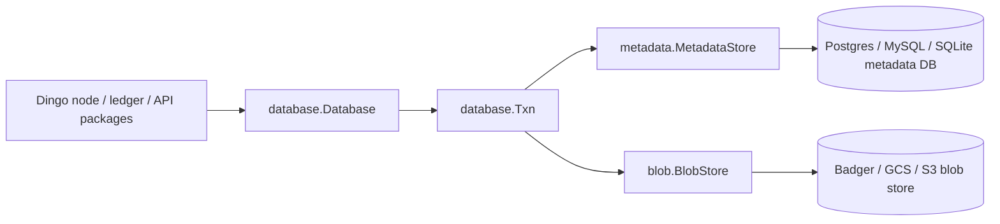
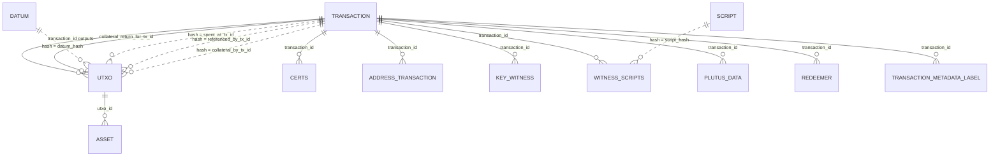
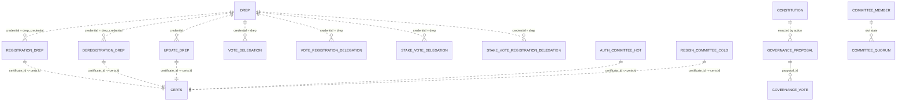
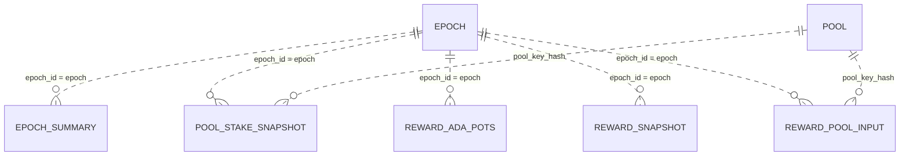
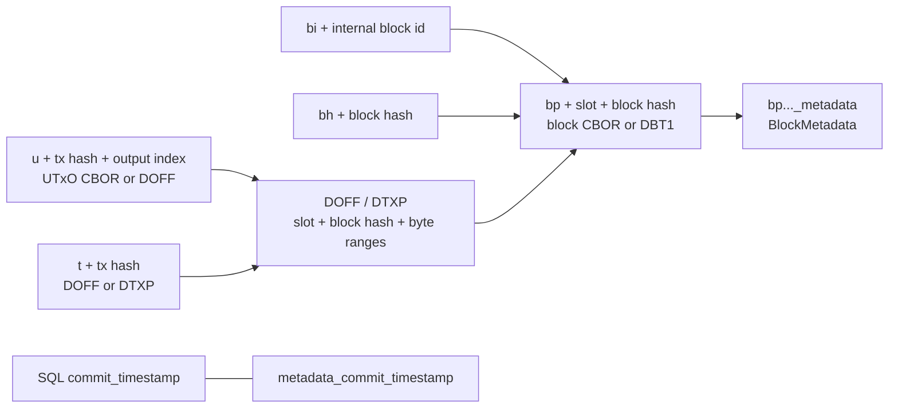

# Dingo Database

Dingo stores chain state in two sibling stores:

- The metadata store is a relational SQL database managed by the metadata plugins in `database/plugin/metadata/`. The supported plugins are `sqlite`, `postgres`, and `mysql`.
- The blob store is a key/value object store managed by the blob plugins in `database/plugin/blob/`. The supported plugins are `badger`, `gcs`, and `s3`.

The SQL schema is generated from GORM models in `database/models/` plus the plugin-local singleton tables `commit_timestamp` and `node_settings`. There are no checked-in SQL migrations; startup runs `AutoMigrate` for the active metadata plugin.

The Go model `models.Block` has `TableName() == "block"`, but it is not migrated into the metadata database. Blocks are stored in the blob store. SQL rows refer to blocks with `slot`, `block_hash`, and other hash columns.

## API Surface

Use the Go APIs when code runs inside Dingo:

- `database.Database` in `database/database.go` owns both stores and exposes `Blob()`, `Metadata()`, `Transaction()`, `BlobTxn()`, `MetadataTxn()`, `StorageMode()`, and `Close()`.
- `database.Txn` in `database/txn.go` coordinates sibling metadata/blob transactions. Write commits update commit timestamps in both stores, commit the blob transaction first, then commit metadata.
- `metadata.MetadataStore` in `database/plugin/metadata/store.go` is the SQL-facing interface. It groups ledger state, transactions, UTxO, accounts, pools, stake snapshots, rewards, governance, committee, rollback, sync-state, backfill, and off-chain metadata cache/fetch methods.
- `blob.BlobStore` in `database/plugin/blob/store.go` is the blob-facing interface. It provides raw `Get`/`Set`/`Delete`/iteration plus block, UTxO, transaction, signed-URL, tombstone, and commit-timestamp methods.
- `types.Txn`, `types.BlobIterator`, `types.BlockMetadata`, and blob key helpers live in `database/types/`.

Direct SQL users should treat this document as a map of the metadata store. The blob store remains the source of block CBOR, UTxO CBOR, and transaction CBOR/offset bytes.

## Store Topology



## SQL Conventions

- Table and column names are snake_case GORM names unless a model has an explicit `gorm:"column:..."` tag.
- Byte columns store raw bytes, not hex strings. In Postgres use `encode(col, 'hex')` and `decode($1, 'hex')`. In MySQL use `HEX(col)` and `UNHEX(?)`.
- `types.Uint64` values such as `amount`, `reward`, `pledge`, `cost`, treasury/reserves, and stake totals are persisted as unsigned decimal values through the Go SQL driver. Use numeric casts if your SQL client reports them as text in a specific backend.
- Quote the `transaction` table in SQL examples because it is a keyword-adjacent identifier: `"transaction"` in Postgres, `` `transaction` `` in MySQL.
- `id` is the normal auto-increment primary key. Tables with ledger identifiers also have unique indexes such as `hash`, `staking_key`, `(tx_id, output_idx)`, or `(epoch, snapshot_type, pool_key_hash)`.
- Many relations are logical joins rather than explicit foreign keys. Certificate rows have two logical pointers: each specialized certificate table has `certificate_id -> certs.id`, and `certs.certificate_id` is the polymorphic back-pointer to that specialized row chosen by `certs.cert_type`.
- Live UTxOs have `utxo.deleted_slot = 0`. Governance/committee/constitution soft deletes use nullable `deleted_slot`; `NULL` means active.
- Certificate history ordering must use `added_slot DESC`, the producing transaction's `block_index DESC`, and `cert_index DESC`. `cert_index` resets per transaction.
- Storage mode is persisted in `node_settings.storage_mode`. `core` mode stores consensus and ledger state. `api` mode additionally populates address, witness, datum, redeemer, script, metadata-label indexes, and the best-effort `offchain_metadata` cache. API-only tables are still migrated in `core` mode but may be empty.

## ER Diagrams

### Transactions and UTxO



### Certificates, Accounts, and Pools

```mermaid
erDiagram
    REGISTRATION ||..|| CERTS : "certificate_id -> certs.id"
    DEREGISTRATION ||..|| CERTS : "certificate_id -> certs.id"
    STAKE_REGISTRATION ||..|| CERTS : "certificate_id -> certs.id"
    STAKE_DEREGISTRATION ||..|| CERTS : "certificate_id -> certs.id"
    STAKE_DELEGATION ||..|| CERTS : "certificate_id -> certs.id"
    STAKE_REGISTRATION_DELEGATION ||..|| CERTS : "certificate_id -> certs.id"
    STAKE_VOTE_DELEGATION ||..|| CERTS : "certificate_id -> certs.id"
    STAKE_VOTE_REGISTRATION_DELEGATION ||..|| CERTS : "certificate_id -> certs.id"
    VOTE_DELEGATION ||..|| CERTS : "certificate_id -> certs.id"
    VOTE_REGISTRATION_DELEGATION ||..|| CERTS : "certificate_id -> certs.id"
    MOVE_INSTANTANEOUS_REWARDS ||..|| CERTS : "certificate_id -> certs.id"
    POOL_REGISTRATION ||..|| CERTS : "certificate_id -> certs.id"
    POOL_RETIREMENT ||..|| CERTS : "certificate_id -> certs.id"

    ACCOUNT ||..o{ REGISTRATION : "staking_key"
    ACCOUNT ||..o{ DEREGISTRATION : "staking_key"
    ACCOUNT ||..o{ STAKE_REGISTRATION : "staking_key"
    ACCOUNT ||..o{ STAKE_DEREGISTRATION : "staking_key"
    ACCOUNT ||..o{ STAKE_DELEGATION : "staking_key"
    ACCOUNT ||..o{ STAKE_REGISTRATION_DELEGATION : "staking_key"
    ACCOUNT ||..o{ STAKE_VOTE_DELEGATION : "staking_key"
    ACCOUNT ||..o{ STAKE_VOTE_REGISTRATION_DELEGATION : "staking_key"
    ACCOUNT ||..o{ VOTE_DELEGATION : "staking_key"
    ACCOUNT ||..o{ VOTE_REGISTRATION_DELEGATION : "staking_key"
    ACCOUNT ||..o{ ACCOUNT_REWARD_DELTA : "staking_key"
    POOL ||--o{ POOL_REGISTRATION : "pool_id"
    POOL ||--o{ POOL_RETIREMENT : "pool_id"
    POOL_REGISTRATION ||--o{ POOL_REGISTRATION_OWNER : "pool_registration_id"
    POOL_REGISTRATION ||--o{ POOL_REGISTRATION_RELAY : "pool_registration_id"
    MOVE_INSTANTANEOUS_REWARDS ||--o{ MOVE_INSTANTANEOUS_REWARDS_REWARD : "mir_id"
    POOL ||..o{ POOL_OPCERT_SEQUENCE : "pool_key_hash"
    POOL ||..o{ STAKE_DELEGATION : "pool_key_hash"
    POOL ||..o{ STAKE_REGISTRATION_DELEGATION : "pool_key_hash"
    POOL ||..o{ STAKE_VOTE_DELEGATION : "pool_key_hash"
    POOL ||..o{ STAKE_VOTE_REGISTRATION_DELEGATION : "pool_key_hash"
```



### Governance, DReps, and Committee



### Epochs, Snapshots, and Rewards



## Metadata Table Reference

### Operational and Chain State

| Table | Columns | Keys / indexes | Relationships and notes |
|---|---|---|---|
| `commit_timestamp` | `id`, `timestamp` | PK `id`; singleton row `id = 1` | Mirrored with the blob-store `metadata_commit_timestamp` key to detect partial commits. |
| `node_settings` | `id`, `storage_mode`, `network` | PK `id`; singleton row `id = 1` | Immutable startup settings. Dingo rejects storage-mode or network changes after initialization. |
| `tip` | `id`, `hash`, `slot`, `block_number` | PK `id` | Current metadata tip. Block CBOR is in the blob store, not SQL. |
| `epoch` | `id`, `epoch_id`, `start_slot`, `era_id`, `slot_length`, `length_in_slots`, `nonce`, `evolving_nonce`, `candidate_nonce`, `last_epoch_block_nonce` | PK `id`; unique `epoch_id` | Epoch nonce and era boundary state. Join snapshots and rewards with `epoch.epoch_id = ... .epoch`. |
| `block_nonce` | `id`, `hash`, `slot`, `nonce`, `is_checkpoint` | PK `id`; unique `(hash, slot)` | Per-block nonce history used by Praos nonce computation. |
| `network_state` | `id`, `treasury`, `reserves`, `slot` | PK `id`; unique `slot` | Treasury/reserves at a slot. |
| `network_donation` | `id`, `slot`, `epoch`, `amount` | PK `id`; unique `slot`; index `epoch` | Per-block Conway treasury donation, tagged with its epoch. `amount` is a plain integer column (not `types.Uint64`) so `SUM` aggregates directly across backends. Donations accumulate during an epoch and are moved into `network_state.treasury` at the next epoch boundary; rows are kept (not deleted on apply) so a rollback drops them by slot and re-application re-derives the same total. |
| `pparams` | `id`, `cbor`, `added_slot`, `epoch`, `era_id` | PK `id`; index `added_slot` | CBOR protocol parameters. Query by `epoch <= ?` and matching `era_id`. |
| `pparam_update` | `id`, `genesis_hash`, `cbor`, `added_slot`, `epoch` | PK `id`; index `added_slot` | Proposed protocol-parameter updates by epoch. |
| `sync_state` | `sync_key`, `value` | PK `sync_key` | Ephemeral key/value state for one-time sync/load work. |
| `backfill_checkpoint` | `id`, `phase`, `last_slot`, `total_slots`, `started_at`, `updated_at`, `completed` | PK `id`; unique `phase` | API-mode historical metadata backfill progress. |
| `import_checkpoint` | `id`, `import_key`, `phase` | PK `id`; unique `import_key` | Mithril snapshot import resume state. `import_key` is usually `{digest}:{slot}`. |

### Transactions, UTxO, and API Indexes

| Table | Columns | Keys / indexes | Relationships and notes |
|---|---|---|---|
| `transaction` | `id`, `hash`, `block_hash`, `slot`, `block_index`, `type`, `fee`, `ttl`, `valid`, `metadata` | PK `id`; unique `hash`; indexes `block_hash`, `slot` | One row per transaction. `block_hash` and `slot` point to the blob block. `metadata` is populated only in API mode. |
| `utxo` | `id`, `transaction_id`, `collateral_return_for_tx_id`, `tx_id`, `output_idx`, `payment_key`, `staking_key`, `datum_hash`, `spent_at_tx_id`, `referenced_by_tx_id`, `collateral_by_tx_id`, `added_slot`, `deleted_slot`, `amount`, `payment_script` | PK `id`; unique `(tx_id, output_idx)`; unique `collateral_return_for_tx_id`; indexes address keys, spend/reference/collateral tx hashes, `added_slot`, `deleted_slot`, `amount`; composite `(deleted_slot, staking_key, amount)` and `(deleted_slot, payment_script, amount)` | Produced outputs use `transaction_id -> transaction.id`. Collateral returns use `collateral_return_for_tx_id -> transaction.id`. Inputs/reference/collateral joins are logical: `spent_at_tx_id`, `referenced_by_tx_id`, and `collateral_by_tx_id` store transaction hashes. `payment_script` is a bool set at index time from the output address type (true when the payment credential is a script hash); the `(deleted_slot, payment_script, amount)` composite backs the network script-locked supply sum (blockfrost `/network` `supply.locked`). It is derived only at write time, so a database synced before this column existed reports script-locked supply only for UTxOs created after the upgrade until it is rebuilt from chain data. |
| `asset` | `id`, `utxo_id`, `policy_id`, `name`, `name_hex`, `fingerprint`, `amount` | PK `id`; unique `(name, policy_id, utxo_id)`; named index `idx_asset_policy_id` on `policy_id`; indexes `name_hex`, `fingerprint`, `amount` | Multi-asset quantities attached to `utxo.id`. The unique key backs ledger-state import `ON CONFLICT`; the policy-id query index can be deferred during bulk load. Use `utxo.deleted_slot = 0` for live balances. |
| `address_transaction` | `id`, `payment_key`, `staking_key`, `transaction_id`, `slot`, `tx_index` | PK `id`; indexes `payment_key`, `staking_key`, `transaction_id`, `slot` | API-mode address-to-transaction index. Join to `transaction.id`. |
| `transaction_metadata_label` | `id`, `transaction_id`, `label`, `slot`, `cbor_value`, `json_value` | PK `id`; unique `(transaction_id, label)`; indexes `label`, `slot` | API-mode per-label metadata index. Join to `transaction.id`. |
| `key_witness` | `id`, `transaction_id`, `type`, `vkey`, `signature`, `public_key`, `chain_code`, `attributes` | PK `id`; indexes `transaction_id`, `type` | API-mode vkey/bootstrap witnesses. Join to `transaction.id`. |
| `witness_scripts` | `id`, `transaction_id`, `script_hash`, `type` | PK `id`; indexes `transaction_id`, `script_hash`, `type` | API-mode witness-script references. Join `script_hash = script.hash`. |
| `script` | `id`, `hash`, `content`, `created_slot`, `type` | PK `id`; unique/index `hash`; index `type` | API-mode de-duplicated script content by hash. |
| `plutus_data` | `id`, `transaction_id`, `data` | PK `id`; index `transaction_id` | API-mode Plutus data from witness sets. Join to `transaction.id`. |
| `redeemer` | `id`, `transaction_id`, `tag`, `index`, `data`, `ex_units_memory`, `ex_units_cpu` | PK `id`; indexes `transaction_id`, `tag`, `index` | API-mode redeemers. Join to `transaction.id`. |
| `datum` | `id`, `hash`, `raw_datum`, `added_slot` | PK `id`; unique/index `hash`; index `added_slot` | API-mode datum hash index. UTxOs can reference it with `utxo.datum_hash = datum.hash`. |
| `certs` | `id`, `transaction_id`, `cert_index`, `cert_type`, `certificate_id`, `slot`, `block_hash` | PK `id`; unique `(transaction_id, cert_index)`; indexes `transaction_id`, `certificate_id`, `cert_type`, `slot`, `block_hash` | Unified certificate index. `certificate_id` points to one specialized certificate table according to `cert_type`; this is logical, not DB-enforced. |

### Stake Accounts and Certificate Tables

| Table | Columns | Keys / indexes | Relationships and notes |
|---|---|---|---|
| `account` | `id`, `staking_key`, `pool`, `drep`, `added_slot`, `certificate_id`, `reward`, `drep_type`, `active` | PK `id`; unique `staking_key`; indexes pool/DRep/active lookup combinations | Current stake account state. Historical changes are in certificate-specific tables. `drep_type`: 0 key hash, 1 script hash, 2 AlwaysAbstain, 3 AlwaysNoConfidence. |
| `account_reward_delta` | `id`, `staking_key`, `amount`, `added_slot` | PK `id`; indexes `staking_key`, `added_slot` | Rollback-aware reward-account credit journal. Logical join to `account.staking_key`. |
| `registration` | `id`, `staking_key`, `certificate_id`, `added_slot`, `deposit_amount` | PK `id`; indexes `staking_key`, `certificate_id`, `added_slot` | Conway-era stake registration certificate. Join `certificate_id -> certs.id`. |
| `deregistration` | `id`, `staking_key`, `certificate_id`, `added_slot`, `amount` | PK `id`; indexes `staking_key`, `certificate_id`, `added_slot` | Conway-era stake deregistration certificate. |
| `stake_registration` | `id`, `staking_key`, `certificate_id`, `added_slot`, `deposit_amount` | PK `id`; indexes `staking_key`, `certificate_id`, `added_slot` | Shelley-era stake registration certificate. |
| `stake_deregistration` | `id`, `staking_key`, `certificate_id`, `added_slot` | PK `id`; indexes `staking_key`, `certificate_id`, `added_slot` | Shelley-era stake deregistration certificate. |
| `stake_delegation` | `id`, `staking_key`, `pool_key_hash`, `certificate_id`, `added_slot` | PK `id`; indexes `staking_key`, `pool_key_hash`, `certificate_id`, `added_slot` | Stake delegation to pool. Logical joins to `account.staking_key` and `pool.pool_key_hash`. |
| `stake_registration_delegation` | `id`, `staking_key`, `pool_key_hash`, `certificate_id`, `added_slot`, `deposit_amount` | PK `id`; indexes `staking_key`, `pool_key_hash`, `certificate_id`, `added_slot` | Combined registration and pool delegation. |
| `stake_vote_delegation` | `id`, `staking_key`, `pool_key_hash`, `drep`, `drep_type`, `certificate_id`, `added_slot` | PK `id`; indexes `staking_key`, `pool_key_hash`, `drep`, `certificate_id`, `added_slot` | Combined pool and DRep delegation. |
| `stake_vote_registration_delegation` | `id`, `staking_key`, `pool_key_hash`, `drep`, `drep_type`, `certificate_id`, `added_slot`, `deposit_amount` | PK `id`; indexes `staking_key`, `pool_key_hash`, `drep`, `certificate_id`, `added_slot` | Combined registration, pool delegation, and DRep delegation. |
| `vote_delegation` | `id`, `staking_key`, `drep`, `drep_type`, `certificate_id`, `added_slot` | PK `id`; indexes `staking_key`, `drep`, `certificate_id`, `added_slot` | DRep-only vote delegation. |
| `vote_registration_delegation` | `id`, `staking_key`, `drep`, `drep_type`, `certificate_id`, `added_slot`, `deposit_amount` | PK `id`; indexes `staking_key`, `drep`, `certificate_id`, `added_slot` | Combined registration and DRep delegation. |
| `move_instantaneous_rewards` | `id`, `pot`, `certificate_id`, `added_slot` | PK `id`; indexes `pot`, `certificate_id`, `added_slot` | MIR certificate header. |
| `move_instantaneous_rewards_reward` | `id`, `mir_id`, `credential`, `amount` | PK `id`; index `mir_id` | MIR reward rows. Join `mir_id -> move_instantaneous_rewards.id`. |

### Pools

| Table | Columns | Keys / indexes | Relationships and notes |
|---|---|---|---|
| `pool` | `id`, `pool_key_hash`, `vrf_key_hash`, `reward_account`, `latest_op_cert_sequence`, `pledge`, `cost`, `margin` | PK `id`; unique `pool_key_hash` | Current pool state. Historical registrations and retirements are separate rows. |
| `pool_registration` | `id`, `pool_id`, `pool_key_hash`, `vrf_key_hash`, `reward_account`, `pledge`, `cost`, `margin`, `metadata_url`, `metadata_hash`, `certificate_id`, `added_slot`, `deposit_amount` | PK `id`; unique `(pool_id, added_slot)`; indexes `pool_key_hash`, `certificate_id` | Pool registration certificate. Join `pool_id -> pool.id` and `certificate_id -> certs.id`. |
| `pool_registration_owner` | `id`, `pool_registration_id`, `pool_id`, `key_hash` | PK `id`; indexes `pool_registration_id`, `pool_id` | Owners for a pool registration. Join `pool_registration_id -> pool_registration.id`; `pool_id -> pool.id`. |
| `pool_registration_relay` | `id`, `pool_registration_id`, `pool_id`, `ipv4`, `ipv6`, `hostname`, `port` | PK `id`; indexes `pool_registration_id`, `pool_id` | Relay addresses for a pool registration. |
| `pool_retirement` | `id`, `pool_id`, `pool_key_hash`, `certificate_id`, `epoch`, `added_slot` | PK `id`; indexes `pool_id`, `pool_key_hash`, `certificate_id`, `added_slot` | Pool retirement certificate. |
| `pool_opcert_sequence` | `id`, `pool_key_hash`, `slot`, `sequence` | PK `id`; unique `(pool_key_hash, slot)`; index `slot` | Observed operational certificate sequence by slot. |

### DReps, Governance, and Committee

| Table | Columns | Keys / indexes | Relationships and notes |
|---|---|---|---|
| `drep` | `id`, `credential`, `anchor_url`, `anchor_hash`, `added_slot`, `last_activity_epoch`, `expiry_epoch`, `active` | PK `id`; unique `credential`; indexes `added_slot`, `last_activity_epoch`, `expiry_epoch` | Current DRep state. |
| `registration_drep` | `id`, `drep_credential`, `anchor_url`, `anchor_hash`, `certificate_id`, `added_slot`, `deposit_amount` | PK `id`; unique `(drep_credential, added_slot)`; index `certificate_id` | DRep registration certificate. |
| `deregistration_drep` | `id`, `drep_credential`, `certificate_id`, `added_slot`, `deposit_amount` | PK `id`; indexes `drep_credential`, `certificate_id`, `added_slot` | DRep deregistration certificate. |
| `update_drep` | `id`, `credential`, `anchor_url`, `anchor_hash`, `certificate_id`, `added_slot` | PK `id`; indexes `credential`, `certificate_id`, `added_slot` | DRep update certificate. |
| `governance_proposal` | `id`, `tx_hash`, `action_index`, `action_type`, `proposed_epoch`, `expires_epoch`, `parent_tx_hash`, `parent_action_idx`, `enacted_epoch`, `enacted_slot`, `ratified_epoch`, `ratified_slot`, `policy_hash`, `anchor_url`, `anchor_hash`, `deposit`, `return_address`, `gov_action_cbor`, `expired_epoch`, `expired_slot`, `added_slot`, `deleted_slot` | PK `id`; unique `(tx_hash, action_index)`; indexes action type, epochs, lifecycle slots, `added_slot`, `deleted_slot` | Governance action lifecycle. Votes join by `governance_vote.proposal_id`. `gov_action_cbor` stores the era-specific GovAction CBOR used for enactment; replay may rewrite ratified parameter-change actions at an era boundary, such as Conway to Dijkstra, so old databases should be rebuilt from chain data when this encoding changes. |
| `governance_vote` | `id`, `proposal_id`, `voter_type`, `voter_credential`, `vote`, `anchor_url`, `anchor_hash`, `added_slot`, `vote_updated_slot`, `deleted_slot` | PK `id`; unique `(proposal_id, voter_type, voter_credential)`; indexes proposal/voter/lifecycle slots | Vote on a governance proposal. `voter_type`: 0 committee, 1 DRep, 2 SPO. `vote`: 0 No, 1 Yes, 2 Abstain. |
| `constitution` | `id`, `anchor_url`, `anchor_hash`, `policy_hash`, `added_slot`, `deleted_slot` | PK `id`; unique `added_slot`; index `deleted_slot` | Current or historical constitution references. |
| `committee_member` | `id`, `cold_cred_hash`, `expires_epoch`, `added_slot`, `deleted_slot` | PK `id`; unique `cold_cred_hash`; indexes `added_slot`, `deleted_slot` | Snapshot-imported committee state. |
| `committee_quorum` | `id`, `quorum`, `added_slot` | PK `id`; unique `added_slot` | Enacted committee quorum threshold. `quorum` is stored through `types.Rat`. |
| `auth_committee_hot` | `id`, `cold_credential`, `host_credential`, `certificate_id`, `added_slot` | PK `id`; indexes `cold_credential`, `host_credential`, `certificate_id`, `added_slot` | Committee hot-key authorization certificate. The SQL column is `host_credential` for backward compatibility. |
| `resign_committee_cold` | `id`, `cold_credential`, `anchor_url`, `anchor_hash`, `certificate_id`, `added_slot` | PK `id`; indexes `cold_credential`, `certificate_id`, `added_slot` | Committee cold-key resignation certificate. |

### Off-chain Metadata Cache

| Table | Columns | Keys / indexes | Relationships and notes |
|---|---|---|---|
| `offchain_metadata` | `id`, `source_type`, `url`, `hash`, `status`, `content_type`, `content`, `body_hash`, `last_error`, `last_http_status`, `fetch_attempts`, `fetched_at`, `next_fetch_after`, `created_at`, `updated_at` | PK `id`; unique `(source_type, url, hash)`; index `(status, next_fetch_after)` | Best-effort cache for documents referenced by pool metadata URLs and governance anchors. `url` keeps the original on-chain pointer, including HTTP(S) and `ipfs://` URLs; IPFS content is fetched through a gateway. `hash` is the on-chain Blake2b-256 hash. `body_hash` is the Blake2b-256 of the fetched bytes. Only rows with `status = 'fetched'` have hash-verified `content`; failed rows keep retry state and diagnostics. `content_type` is normalized to `application/json`, `application/ld+json`, or `text/plain`; any other response media type is stored as `application/octet-stream` (the header is not covered by the on-chain hash). |

`source_type` values are `pool`, `drep`, `drep_registration`, `drep_update`, `gov_proposal`, `gov_vote`, `constitution`, and `committee_resign`. `status` values are `pending`, `fetched`, and `failed`.

The API-mode off-chain metadata fetcher discovers pointers from `pool_registration.metadata_url`, DRep anchor rows, governance proposal/vote anchors, constitutions, and committee resignations. The cache is not consensus state: rollbacks may leave old cache rows behind, and APIs should join/cache-hit by the current on-chain `(source_type, url, hash)` pointer.

`metadata.MetadataStore` off-chain fetch methods accept a `context.Context`.
`GetOffchainMetadataFetchBatch` claims due rows before returning them by moving
`next_fetch_after` forward for a short lease, so concurrent fetchers do not
process the same pointer unless the claim expires before a result is recorded.

### Stake Snapshots and Rewards

| Table | Columns | Keys / indexes | Relationships and notes |
|---|---|---|---|
| `pool_stake_snapshot` | `id`, `epoch`, `snapshot_type`, `pool_key_hash`, `total_stake`, `delegator_count`, `captured_slot`, `reward_account_auto_vote`, `reward_account_auto_vote_resolved` | PK `id`; unique `(epoch, snapshot_type, pool_key_hash)` | Per-pool mark/set/go stake snapshots. Logical joins to `epoch.epoch_id` and `pool.pool_key_hash`. |
| `epoch_summary` | `id`, `epoch`, `total_active_stake`, `total_pool_count`, `total_delegators`, `epoch_nonce`, `boundary_slot`, `snapshot_ready` | PK `id`; unique `epoch` | Aggregate epoch snapshot state. |
| `reward_ada_pots` | `id`, `epoch`, `treasury`, `reserves`, `fees`, `rewards`, `captured_slot` | PK `id`; unique `epoch`; index `captured_slot` | Reward ADA pots at an epoch boundary. |
| `reward_snapshot` | `id`, `epoch`, `snapshot_type`, `total_active_stake`, `total_pool_count`, `total_delegators`, `captured_slot`, `boundary_slot`, `epoch_nonce`, `protocol_version` | PK `id`; unique `(epoch, snapshot_type)`; indexes `captured_slot`, `boundary_slot` | Reward-calculation snapshot metadata. |
| `reward_pool_input` | `id`, `epoch`, `pool_key_hash`, `pledge`, `delegated_stake`, `cost`, `margin`, `delegator_count`, `blocks_produced`, `total_blocks_in_epoch`, `captured_slot`, `boundary_slot` | PK `id`; unique `(epoch, pool_key_hash)`; indexes `captured_slot`, `boundary_slot` | Per-pool reward inputs. Logical join to `pool.pool_key_hash`. |

## Blob Store Reference

All blob plugins expose the same logical keys. Badger stores these binary keys directly. GCS and S3 hex-encode the logical key bytes into object names; S3 may prepend the configured object prefix.



| Logical key | Value | Used by |
|---|---|---|
| `bp` + big-endian slot `uint64` + block hash bytes | Raw block CBOR, or expired-history marker `DBT1` | `BlobStore.SetBlock`, `GetBlock`, `TombstoneBlock`, block iterators |
| `bp..._metadata` | `types.BlockMetadata`: `id`, `type`, `height`, `prev_hash` encoded as CBOR; Badger can use compact `DBM1` binary metadata | `GetBlock` and archive-proxy/history-expiry paths |
| `bi` + big-endian internal block ID `uint64` | The corresponding `bp...` block key | Block iteration and block-by-index lookup |
| `bh` + block hash bytes | The corresponding `bp...` block key | Fast block-by-hash lookup |
| `u` + tx hash bytes + big-endian output index `uint32` | UTxO CBOR or a 52-byte `DOFF` CBOR-offset reference into a block | UTxO resolution and history expiry |
| `t` + tx hash bytes | Transaction CBOR offset bytes. Current writers store 52-byte `DOFF`; readers also support 69-byte `DTXP` tx-part offsets. | Transaction CBOR lookup |
| `metadata_commit_timestamp` | Big-endian timestamp integer bytes | Commit consistency check with SQL `commit_timestamp` |

`DOFF` references are 52 bytes:

```text
magic "DOFF" (4) + block_slot (8) + block_hash (32) + byte_offset (4) + byte_length (4)
```

`DTXP` transaction-part references are 69 bytes:

```text
magic "DTXP" (4) + block_slot (8) + block_hash (32)
+ body_offset/body_length (8) + witness_offset/witness_length (8)
+ metadata_offset/metadata_length (8) + is_valid (1)
```

### Archive And History Expiry Contract

Archive nodes and history-expiry nodes use the same logical blob keys. The
difference is where immutable block CBOR is expected to live after the block is
older than the ledger stability window:

- Archive nodes keep block CBOR in a signed-URL-capable blob backend. The `s3`
  and `gcs` plugins implement `GetBlockURL` by reading the block's
  `bp..._metadata` value and generating a one-hour signed URL for the `bp...`
  object. Bark's archive service exposes that URL and metadata to other Dingo
  nodes. The local Badger plugin does not implement `GetBlockURL`, so it is not
  suitable as the backing store for a Bark archive node.
- History-expiry nodes keep their normal local blob plugin and run
  `internal/historyexpiry.Pruner` when `historyExpiry.enabled` is configured. The pruner
  calls `Database.PruneBlock` for blocks below
  `current_slot - ledger.StabilityWindow()`. `PruneBlock` first materializes
  UTxO CBOR entries that still point into the block by `DOFF` offset, then
  replaces the block's `bp...` value with marker `DBT1` in the same blob
  transaction.
- Expired blocks keep their `bi...`, `bh...`, and `bp..._metadata` entries.
  SQL metadata rows also remain. Blob readers return `types.ErrHistoryExpired`
  with the slot/hash. Without an archive wrapper this is the final read error;
  with `barkBaseUrl` configured, Bark fetches the CBOR from the archive while
  preserving local block indexes and iteration semantics.

## SQL Examples Mirroring the Go API

The examples below mirror common `metadata.MetadataStore` methods. Postgres examples use `decode($1, 'hex')`; MySQL equivalents use `UNHEX(?)`, `HEX(col)`, and `` `transaction` `` instead of `"transaction"`.

### `GetTransactionByHash`

Dingo loads the base transaction, then its direct associations: UTxOs, assets, certificates, witnesses, scripts, redeemers, and Plutus data. The `transaction.metadata` column contains the raw transaction metadata bytes when API mode populated them, but per-label rows in `transaction_metadata_label` are a separate index and are not loaded by `GetTransactionByHash`; fetch them through the metadata-label query path below when needed.

```sql
-- Postgres: base transaction
SELECT *
FROM "transaction"
WHERE hash = decode($1, 'hex');
```

```sql
-- Produced outputs plus assets
SELECT u.*, a.*
FROM utxo u
LEFT JOIN asset a ON a.utxo_id = u.id
WHERE u.transaction_id = (
  SELECT id FROM "transaction" WHERE hash = decode($1, 'hex')
)
ORDER BY u.output_idx ASC;
```

```sql
-- Consumed inputs, reference inputs, and collateral inputs.
-- These join by transaction hash, not transaction.id.
SELECT 'input' AS role, u.*
FROM utxo u
WHERE u.spent_at_tx_id = decode($1, 'hex')
UNION ALL
SELECT 'reference_input' AS role, u.*
FROM utxo u
WHERE u.referenced_by_tx_id = decode($1, 'hex')
UNION ALL
SELECT 'collateral' AS role, u.*
FROM utxo u
WHERE u.collateral_by_tx_id = decode($1, 'hex');
```

```sql
-- API-mode child tables for the same transaction
WITH tx AS (
  SELECT id FROM "transaction" WHERE hash = decode($1, 'hex')
)
SELECT 'cert' AS kind, c.id, c.cert_type, c.cert_index
FROM certs c, tx
WHERE c.transaction_id = tx.id
UNION ALL
SELECT 'key_witness', kw.id, kw.type::bigint, NULL
FROM key_witness kw, tx
WHERE kw.transaction_id = tx.id
UNION ALL
SELECT 'witness_script', ws.id, ws.type::bigint, NULL
FROM witness_scripts ws, tx
WHERE ws.transaction_id = tx.id
UNION ALL
SELECT 'redeemer', r.id, r.tag::bigint, r.index
FROM redeemer r, tx
WHERE r.transaction_id = tx.id;
```

For a lightweight equivalent of `GetTransactionSlotByHash` or `GetTransactionIDByHash`:

```sql
SELECT id, slot
FROM "transaction"
WHERE hash = decode($1, 'hex');
```

### `GetTransactionsByBlockHash`

```sql
SELECT *
FROM "transaction"
WHERE block_hash = decode($1, 'hex')
ORDER BY block_index ASC;
```

### `GetUtxo` and `GetUtxoIncludingSpent`

```sql
-- Live UTxO only, matching GetUtxo
SELECT u.*, a.*
FROM utxo u
LEFT JOIN asset a ON a.utxo_id = u.id
WHERE u.deleted_slot = 0
  AND u.tx_id = decode($1, 'hex')
  AND u.output_idx = $2;
```

```sql
-- Including spent rows, matching GetUtxoIncludingSpent
SELECT u.*, a.*
FROM utxo u
LEFT JOIN asset a ON a.utxo_id = u.id
WHERE u.tx_id = decode($1, 'hex')
  AND u.output_idx = $2;
```

### `GetTransactionsByAddress` and `CountTransactionsByAddress`

Recent transactions for an address key pair:

```sql
-- Postgres
SELECT t.slot, t.block_index, encode(t.hash, 'hex') AS tx_hash
FROM address_transaction atx
JOIN "transaction" t ON t.id = atx.transaction_id
WHERE atx.payment_key = decode($1, 'hex')
  AND atx.staking_key = decode($2, 'hex')
ORDER BY t.slot DESC, t.block_index DESC, t.id DESC
LIMIT 50;
```

Count the same address index:

```sql
SELECT COUNT(DISTINCT atx.transaction_id) AS tx_count
FROM address_transaction atx
WHERE atx.payment_key = decode($1, 'hex')
  AND atx.staking_key = decode($2, 'hex');
```

Payment-only Byron-style or enterprise-style lookups use the same condition Dingo uses:

```sql
WHERE atx.payment_key = decode($1, 'hex')
  AND (atx.staking_key IS NULL OR length(atx.staking_key) = 0)
```

### `GetAddressesByStakingKey`

```sql
SELECT MIN(id) AS id, payment_key, staking_key
FROM address_transaction
WHERE staking_key = decode($1, 'hex')
  AND length(payment_key) > 0
GROUP BY payment_key, staking_key
ORDER BY payment_key ASC
LIMIT 100;
```

### `GetUtxosByAddress`, `GetUtxosByAddressAtSlot`, and `GetControlledAmountByStakingKey`

Live UTxOs for a payment key with assets:

```sql
-- Postgres
SELECT
  encode(u.tx_id, 'hex') AS tx_id,
  u.output_idx,
  u.amount,
  encode(a.policy_id, 'hex') AS policy_id,
  encode(a.name, 'hex') AS asset_name,
  a.amount AS asset_amount
FROM utxo u
LEFT JOIN asset a ON a.utxo_id = u.id
WHERE u.deleted_slot = 0
  AND u.payment_key = decode($1, 'hex')
ORDER BY u.added_slot DESC, u.output_idx DESC;
```

Historical UTxOs at a slot:

```sql
SELECT u.*
FROM utxo u
WHERE u.added_slot <= $2
  AND (u.deleted_slot = 0 OR u.deleted_slot > $2)
  AND u.payment_key = decode($1, 'hex');
```

Controlled amount by staking key:

```sql
SELECT COALESCE(SUM(amount), 0) AS controlled_amount
FROM utxo
WHERE staking_key = decode($1, 'hex')
  AND deleted_slot = 0;
```

### `GetScriptLockedSupply`

Network script-locked supply (sum of lovelace in live UTxOs whose payment
credential is a script), backing blockfrost `/network` `supply.locked`:

```sql
SELECT COALESCE(SUM(amount), 0) AS locked_supply
FROM utxo
WHERE payment_script = true
  AND deleted_slot = 0;
```

### `GetUtxosByAssets` and Asset Quantity

```sql
-- Live UTxOs containing a policy/name pair
SELECT u.*
FROM utxo u
WHERE u.deleted_slot = 0
  AND u.id IN (
    SELECT utxo_id
    FROM asset
    WHERE policy_id = decode($1, 'hex')
      AND name = decode($2, 'hex')
  );
```

```sql
-- Total live quantity for a policy/name pair
SELECT COALESCE(SUM(a.amount), 0) AS quantity
FROM asset a
JOIN utxo u ON u.id = a.utxo_id
WHERE a.policy_id = decode($1, 'hex')
  AND a.name = decode($2, 'hex')
  AND u.deleted_slot = 0;
```

### `GetTransactionsByMetadataLabel`

Transactions by metadata label:

```sql
-- Postgres
SELECT t.slot, t.block_index, encode(t.hash, 'hex') AS tx_hash, ml.json_value
FROM transaction_metadata_label ml
JOIN "transaction" t ON t.id = ml.transaction_id
WHERE ml.label = $1
ORDER BY t.slot DESC, t.block_index DESC, t.id DESC
LIMIT 100;
```

### `GetAccount`

Latest delegation state for an account:

```sql
-- Postgres
SELECT
  encode(a.staking_key, 'hex') AS staking_key,
  encode(a.pool, 'hex') AS pool_key_hash,
  encode(a.drep, 'hex') AS drep,
  a.drep_type,
  a.reward,
  a.active
FROM account a
WHERE a.staking_key = decode($1, 'hex');
```

To match `includeInactive = false`, add:

```sql
AND a.active = true
```

### `GetAccountDelegationHistory`

Dingo unions all certificate tables that can carry pool delegation and orders with slot, transaction index, and certificate index.

```sql
SELECT *
FROM (
  SELECT sd.added_slot, tx.block_index, c.cert_index, tx.hash AS tx_hash, sd.pool_key_hash
  FROM stake_delegation sd
  JOIN certs c ON c.id = sd.certificate_id
  JOIN "transaction" tx ON tx.id = c.transaction_id
  WHERE sd.staking_key = decode($1, 'hex')

  UNION ALL
  SELECT srd.added_slot, tx.block_index, c.cert_index, tx.hash, srd.pool_key_hash
  FROM stake_registration_delegation srd
  JOIN certs c ON c.id = srd.certificate_id
  JOIN "transaction" tx ON tx.id = c.transaction_id
  WHERE srd.staking_key = decode($1, 'hex')

  UNION ALL
  SELECT svd.added_slot, tx.block_index, c.cert_index, tx.hash, svd.pool_key_hash
  FROM stake_vote_delegation svd
  JOIN certs c ON c.id = svd.certificate_id
  JOIN "transaction" tx ON tx.id = c.transaction_id
  WHERE svd.staking_key = decode($1, 'hex')

  UNION ALL
  SELECT svrd.added_slot, tx.block_index, c.cert_index, tx.hash, svrd.pool_key_hash
  FROM stake_vote_registration_delegation svrd
  JOIN certs c ON c.id = svrd.certificate_id
  JOIN "transaction" tx ON tx.id = c.transaction_id
  WHERE svrd.staking_key = decode($1, 'hex')
) h
ORDER BY added_slot DESC, block_index DESC, cert_index DESC, tx_hash DESC
LIMIT 50;
```

### `GetPool`, `GetPoolRegistrationsAtSlot`, and Pool History

Pool registration history with certificate order:

```sql
-- Postgres
SELECT
  pr.added_slot,
  t.block_index,
  c.cert_index,
  encode(pr.pool_key_hash, 'hex') AS pool_key_hash,
  pr.pledge,
  pr.cost,
  pr.margin,
  pr.metadata_url
FROM pool_registration pr
JOIN certs c ON c.id = pr.certificate_id
JOIN "transaction" t ON t.id = c.transaction_id
WHERE pr.pool_key_hash = decode($1, 'hex')
ORDER BY pr.added_slot DESC, t.block_index DESC, c.cert_index DESC;
```

Latest registration at or before a slot, matching `GetPoolRegistrationsAtSlot`:

```sql
WITH ranked AS (
  SELECT pr.*,
    ROW_NUMBER() OVER (
      PARTITION BY pr.pool_key_hash
      ORDER BY pr.added_slot DESC,
        COALESCE(t.block_index, 0) DESC,
        COALESCE(c.cert_index, 0) DESC,
        pr.id DESC
    ) AS rn
  FROM pool_registration pr
  LEFT JOIN certs c ON c.id = pr.certificate_id
  LEFT JOIN "transaction" t ON t.id = c.transaction_id
  WHERE pr.pool_key_hash = decode($1, 'hex')
    AND pr.added_slot <= $2
)
SELECT *
FROM ranked
WHERE rn = 1;
```

Current pool state with latest registration and retirement:

```sql
SELECT p.*
FROM pool p
WHERE p.pool_key_hash = decode($1, 'hex');

SELECT pr.*
FROM pool_registration pr
LEFT JOIN certs c ON c.id = pr.certificate_id
LEFT JOIN "transaction" t ON t.id = c.transaction_id
WHERE pr.pool_key_hash = decode($1, 'hex')
ORDER BY pr.added_slot DESC, COALESCE(t.block_index, 0) DESC, COALESCE(c.cert_index, 0) DESC
LIMIT 1;

SELECT r.*
FROM pool_retirement r
LEFT JOIN certs c ON c.id = r.certificate_id
LEFT JOIN "transaction" t ON t.id = c.transaction_id
WHERE r.pool_key_hash = decode($1, 'hex')
ORDER BY r.added_slot DESC, COALESCE(t.block_index, 0) DESC, COALESCE(c.cert_index, 0) DESC
LIMIT 1;
```

### `GetGovernanceProposal` and `GetGovernanceVotes`

Governance proposal and votes:

```sql
-- Postgres
SELECT
  encode(gp.tx_hash, 'hex') AS proposal_tx,
  gp.action_index,
  gp.action_type,
  gv.voter_type,
  encode(gv.voter_credential, 'hex') AS voter,
  gv.vote
FROM governance_proposal gp
LEFT JOIN governance_vote gv ON gv.proposal_id = gp.id
WHERE gp.deleted_slot IS NULL
  AND gp.expires_epoch >= $1
ORDER BY gp.proposed_epoch DESC, gp.action_index ASC;
```

Direct proposal lookup:

```sql
SELECT *
FROM governance_proposal
WHERE tx_hash = decode($1, 'hex')
  AND action_index = $2
  AND deleted_slot IS NULL;
```

Votes for a proposal:

```sql
SELECT *
FROM governance_vote
WHERE proposal_id = $1
  AND deleted_slot IS NULL;
```

Active governance proposals use Dingo's consensus-critical order:

```sql
SELECT *
FROM governance_proposal
WHERE expires_epoch >= $1
  AND enacted_epoch IS NULL
  AND expired_epoch IS NULL
  AND deleted_slot IS NULL
ORDER BY proposed_epoch ASC, added_slot ASC, tx_hash ASC, action_index ASC;
```

### `GetPParams`, `GetPParamUpdates`, and `GetTip`

```sql
SELECT *
FROM pparams
WHERE epoch <= $1
  AND era_id = $2
ORDER BY epoch DESC, id DESC
LIMIT 1;
```

```sql
-- For epoch 0, use WHERE epoch = 0. For later epochs:
SELECT *
FROM pparam_update
WHERE epoch IN ($1, $1 - 1)
ORDER BY id DESC;
```

```sql
SELECT *
FROM tip
WHERE id = 1;
```

### `GetDatum` and `GetScript`

```sql
SELECT *
FROM datum
WHERE hash = decode($1, 'hex');
```

```sql
SELECT *
FROM script
WHERE hash = decode($1, 'hex');
```

MySQL shape of the same byte filters:

```sql
SELECT HEX(t.hash) AS tx_hash, t.slot, t.block_index
FROM address_transaction atx
JOIN `transaction` t ON t.id = atx.transaction_id
WHERE atx.payment_key = UNHEX(?)
  AND atx.staking_key = UNHEX(?)
ORDER BY t.slot DESC, t.block_index DESC, t.id DESC
LIMIT 50;
```
