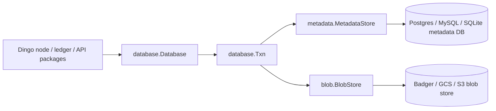
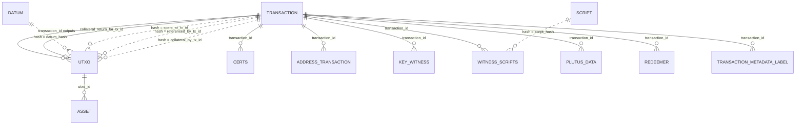
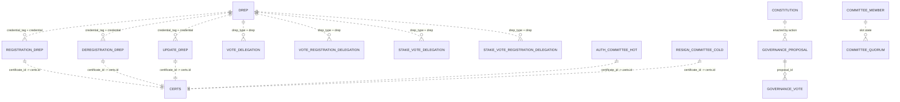
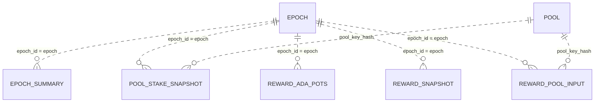
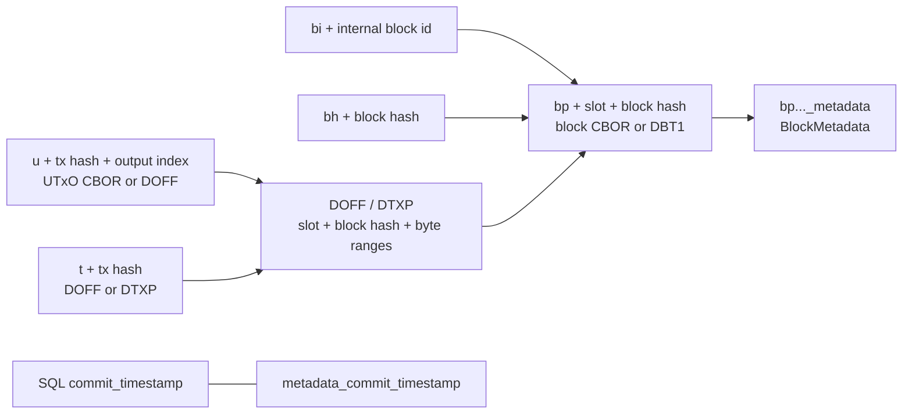

# Dingo Database

Dingo stores chain state in two sibling stores:

- The metadata store is a relational SQL database managed by the metadata plugins in `database/plugin/metadata/`. The always-built plugin is `sqlite`; `postgres` and `mysql` are optional and are built only with the `dingo_extra_plugins` build tag.
- The blob store is a key/value object store managed by the blob plugins in `database/plugin/blob/`. The always-built plugin is `badger`; `gcs` and `s3` are optional and are built only with the `dingo_extra_plugins` build tag.

The SQL schema is generated from GORM models in `database/models/` plus the plugin-local singleton tables `commit_timestamp` and `node_settings`. There are no checked-in SQL migrations; startup runs `AutoMigrate` for the active metadata plugin. The SQLite plugin migrates the full model set in one pass after its compatibility migrations so GORM-declared relationships and cascade constraints are present on fresh SQLite databases. On a database created before auto-migrate was enabled, adding a missing `OnDelete:CASCADE` foreign key rebuilds the child table with the constraint enforced; because those older databases never enforced the cascade, orphaned child rows may have accumulated (for example `asset` rows left behind when their `utxo` was deleted) and would fail the rebuild with `FOREIGN KEY constraint failed (787)`. To avoid this, every plugin purges orphaned rows whose cascade-FK parent no longer exists before running `AutoMigrate` (`models.PurgeOrphanedCascadeRows` in `database/models/purge_orphans.go`); this is a no-op once the foreign keys exist, since the constraint then prevents orphans.

The Go model `models.Block` has `TableName() == "block"`, but it is not migrated into the metadata database. Blocks are stored in the blob store. SQL rows refer to blocks with `slot`, `block_hash`, and other hash columns. `Block.Decode` is Leios-aware for Conway-tagged blocks (`ledger.BlockTypeConway`): it calls `DecodeConwayBlock` (`database/models/leios_block.go`), which tries gouroboros' strict Conway decoder first and only falls back to reconstructing a Leios-extended block when strict decode fails. This is detection-based, so the Musashi prototype's Conway-tagged blocks (block type 7 carrying a 12-field Leios-extended header body) decode from stored CBOR while real Conway networks (mainnet/preprod/preview) are unaffected. The reconstruct preserves the original wire bytes, so `Block.Cbor()` returns the verbatim block and any `DOFF` byte offsets recorded against the stored block CBOR stay valid.

## API Surface

Use the Go APIs when code runs inside Dingo:

- `database.Database` in `database/database.go` owns both stores and exposes `Blob()`, `Metadata()`, `Transaction()`, `BlobTxn()`, `MetadataTxn()`, `StorageMode()`, and `Close()`.
- `database.Txn` in `database/txn.go` coordinates sibling metadata/blob transactions. Write commits update commit timestamps in both stores, commit the blob transaction first, then commit metadata.
- `metadata.MetadataStore` in `database/plugin/metadata/store.go` is the SQL-facing interface. It groups ledger state, transactions, UTxO, accounts, pools, stake snapshots, rewards, governance, committee, rollback, sync-state, backfill, and off-chain metadata cache/fetch methods.
- `blob.BlobStore` in `database/plugin/blob/store.go` is the blob-facing interface. It provides raw `Get`/`Set`/`Delete`/iteration plus block, UTxO, transaction, signed-URL, tombstone, and commit-timestamp methods.
- `types.Txn`, `types.BlobIterator`, `types.BlockMetadata`, and blob key helpers live in `database/types/`.

Direct SQL users should treat this document as a map of the metadata store. The blob store remains the source of block CBOR, UTxO CBOR, and transaction CBOR/offset bytes.

## Store Topology



## SQL Conventions

- Table and column names are snake_case GORM names unless a model has an explicit `gorm:"column:..."` tag.
- Byte columns store raw bytes, not hex strings. In Postgres use `encode(col, 'hex')` and `decode($1, 'hex')`. In MySQL use `HEX(col)` and `UNHEX(?)`.
- `types.Uint64` values such as `amount`, `reward`, `pledge`, `cost`, treasury/reserves, and stake totals are persisted as unsigned decimal values through the Go SQL driver. Use numeric casts if your SQL client reports them as text in a specific backend.
- Quote the `transaction` table in SQL examples because it is a keyword-adjacent identifier: `"transaction"` in Postgres, `` `transaction` `` in MySQL.
- `id` is the normal auto-increment primary key. Tables with ledger identifiers also have unique indexes such as `hash`, `(credential_tag, staking_key)`, `(tx_id, output_idx)`, or `(epoch, snapshot_type, pool_key_hash)`.
- Relationships declared on GORM models may be enforced as backend foreign keys, especially on fresh SQLite databases where startup enables `foreign_keys(1)` and migrates the model set together. Hash-based joins and polymorphic relationships remain logical joins rather than explicit foreign keys. Certificate rows have two logical pointers: each specialized certificate table has `certificate_id -> certs.id`, and `certs.certificate_id` is the polymorphic back-pointer to that specialized row chosen by `certs.cert_type`.
- Live UTxOs have `utxo.deleted_slot = 0`. Governance/committee/constitution soft deletes use nullable `deleted_slot`; `NULL` means active.
- Certificate history ordering must use `added_slot DESC`, the producing transaction's `block_index DESC`, and `cert_index DESC`. `cert_index` resets per transaction.
- Storage mode is persisted in `node_settings.storage_mode`. `core` mode stores consensus and ledger state. `api` mode additionally populates address, witness, datum, redeemer, script, metadata-label indexes, and the best-effort `offchain_metadata` cache. API-only tables are still migrated in `core` mode but may be empty.

## ER Diagrams

### Transactions and UTxO



### Certificates, Accounts, and Pools

```mermaid
erDiagram
    REGISTRATION ||..|| CERTS : "certificate_id -> certs.id"
    DEREGISTRATION ||..|| CERTS : "certificate_id -> certs.id"
    STAKE_REGISTRATION ||..|| CERTS : "certificate_id -> certs.id"
    STAKE_DEREGISTRATION ||..|| CERTS : "certificate_id -> certs.id"
    STAKE_DELEGATION ||..|| CERTS : "certificate_id -> certs.id"
    STAKE_REGISTRATION_DELEGATION ||..|| CERTS : "certificate_id -> certs.id"
    STAKE_VOTE_DELEGATION ||..|| CERTS : "certificate_id -> certs.id"
    STAKE_VOTE_REGISTRATION_DELEGATION ||..|| CERTS : "certificate_id -> certs.id"
    VOTE_DELEGATION ||..|| CERTS : "certificate_id -> certs.id"
    VOTE_REGISTRATION_DELEGATION ||..|| CERTS : "certificate_id -> certs.id"
    MOVE_INSTANTANEOUS_REWARDS ||..|| CERTS : "certificate_id -> certs.id"
    GENESIS_DELEGATION ||..|| CERTS : "certificate_id -> certs.id"
    POOL_REGISTRATION ||..|| CERTS : "certificate_id -> certs.id"
    POOL_RETIREMENT ||..|| CERTS : "certificate_id -> certs.id"

    ACCOUNT ||..o{ REGISTRATION : "credential_tag + staking_key"
    ACCOUNT ||..o{ DEREGISTRATION : "credential_tag + staking_key"
    ACCOUNT ||..o{ STAKE_REGISTRATION : "credential_tag + staking_key"
    ACCOUNT ||..o{ STAKE_DEREGISTRATION : "credential_tag + staking_key"
    ACCOUNT ||..o{ STAKE_DELEGATION : "credential_tag + staking_key"
    ACCOUNT ||..o{ STAKE_REGISTRATION_DELEGATION : "credential_tag + staking_key"
    ACCOUNT ||..o{ STAKE_VOTE_DELEGATION : "credential_tag + staking_key"
    ACCOUNT ||..o{ STAKE_VOTE_REGISTRATION_DELEGATION : "credential_tag + staking_key"
    ACCOUNT ||..o{ VOTE_DELEGATION : "credential_tag + staking_key"
    ACCOUNT ||..o{ VOTE_REGISTRATION_DELEGATION : "credential_tag + staking_key"
    ACCOUNT ||..o{ ACCOUNT_REWARD_DELTA : "credential_tag + staking_key"
    POOL ||--o{ POOL_REGISTRATION : "pool_id"
    POOL ||--o{ POOL_RETIREMENT : "pool_id"
    POOL_REGISTRATION ||--o{ POOL_REGISTRATION_OWNER : "pool_registration_id"
    POOL_REGISTRATION ||--o{ POOL_REGISTRATION_RELAY : "pool_registration_id"
    MOVE_INSTANTANEOUS_REWARDS ||--o{ MOVE_INSTANTANEOUS_REWARDS_REWARD : "mir_id"
    POOL ||..o{ POOL_OPCERT_SEQUENCE : "pool_key_hash"
    POOL ||..o{ STAKE_DELEGATION : "pool_key_hash"
    POOL ||..o{ STAKE_REGISTRATION_DELEGATION : "pool_key_hash"
    POOL ||..o{ STAKE_VOTE_DELEGATION : "pool_key_hash"
    POOL ||..o{ STAKE_VOTE_REGISTRATION_DELEGATION : "pool_key_hash"
```



### Governance, DReps, and Committee



### Epochs, Snapshots, and Rewards



## Metadata Table Reference

### Operational and Chain State

| Table | Columns | Keys / indexes | Relationships and notes |
|---|---|---|---|
| `commit_timestamp` | `id`, `timestamp` | PK `id`; singleton row `id = 1` | Mirrored with the blob-store `metadata_commit_timestamp` key to detect partial commits. |
| `node_settings` | `id`, `storage_mode`, `network` | PK `id`; singleton row `id = 1` | Immutable startup settings. Dingo rejects storage-mode or network changes after initialization. |
| `tip` | `id`, `hash`, `slot`, `block_number` | PK `id` | Current metadata tip. Block CBOR is in the blob store, not SQL. |
| `epoch` | `id`, `epoch_id`, `start_slot`, `era_id`, `slot_length`, `length_in_slots`, `nonce`, `evolving_nonce`, `candidate_nonce`, `last_epoch_block_nonce` | PK `id`; unique `epoch_id` | Epoch nonce and era boundary state. `last_epoch_block_nonce` is the Praos lab carried at the boundary: the previous epoch's last block `PrevHash`, or the previously carried lab when that epoch had no blocks. Join snapshots and rewards with `epoch.epoch_id = ... .epoch`. |
| `block_nonce` | `id`, `hash`, `slot`, `nonce`, `is_checkpoint` | PK `id`; unique `(hash, slot)` | Per-block nonce history (cumulative evolving nonce through each block) used by Praos nonce computation. Must cover from the Mithril anchor through the trust boundary and beyond; when a usable anchor nonce exists below the boundary, `healMithrilGapBlockNonces` reconstructs missing gap-block rows at startup (see below). |
| `network_state` | `id`, `treasury`, `reserves`, `slot` | PK `id`; unique `slot` | Treasury/reserves at a slot. |
| `network_donation` | `id`, `slot`, `epoch`, `amount` | PK `id`; unique `slot`; index `epoch` | Per-block Conway treasury donation, tagged with its epoch. `amount` is a plain integer column (not `types.Uint64`) so `SUM` aggregates directly across backends. All donation sources applied under the same block slot, including Leios endorser-block effects recorded under a ranking block, are accumulated before this per-slot row is written. Donations accumulate during an epoch and are moved into `network_state.treasury` at the next epoch boundary; rows are kept (not deleted on apply) so a rollback drops them by slot and re-application re-derives the same total. |
| `pparams` | `id`, `cbor`, `added_slot`, `epoch`, `era_id` | PK `id`; index `added_slot` | CBOR protocol parameters. Query by `epoch <= ?` and matching `era_id`. |
| `pparam_update` | `id`, `genesis_hash`, `cbor`, `added_slot`, `epoch` | PK `id`; index `added_slot` | Proposed protocol-parameter updates by epoch. |
| `sync_state` | `sync_key`, `value` | PK `sync_key` | Key/value state for sync/load work. `sync_status` (`in_progress`/`backfill`/cleared; unknown non-empty values are treated as incomplete) is ephemeral and cleared on completion. Mithril stores `mithril_ledger_slot` plus `mithril_ledger_hash` as the trusted replay/intersect boundary point. `mithril_immutable_max` persists the highest immutable file number a Mithril sync imported (written *after* the completion clear, since clearing wipes all `sync_state`) so a later `dingo mithril sync` catch-up can skip already-present immutable archives when the marker exists. `mithril_catchup_active` is ephemeral (set when a catch-up import starts mutating, wiped on completion): it routes an interrupted catch-up back through catch-up semantics (reconcile) on the next run, which a markerless catch-up otherwise leaves no trace of. `deferred_header_validation:<slot>:<hash>` is written when blockfetch defers stateful header checks to ledger apply; the value is `true` and the row is deleted after the strict apply-time check passes. |
| `backfill_checkpoint` | `id`, `phase`, `last_slot`, `total_slots`, `started_at`, `updated_at`, `completed` | PK `id`; unique `phase` | API-mode historical metadata backfill progress. |
| `import_checkpoint` | `id`, `import_key`, `phase` | PK `id`; unique `import_key` | Mithril snapshot import resume state. `import_key` is usually `{digest}:{slot}`. Catch-up imports leave `import_key` empty to force a full pass. |

Mithril v2 catch-up reconcile: when `dingo mithril sync` advances an existing
core database to a newer v2 artifact, the new ledger-state snapshot is the
complete ledger state at its tip, so any live row absent from it is marked
inactive rather than deleted — live UTxOs get a `deleted_slot` tombstone,
`account` and `drep` rows go `active = false`, and a `pool_retirement` row is
added for retired pools. This uses the `metadata.MetadataStore` methods
`GetActiveAccountCredentials`, `DeactivateAccounts`, `DeactivateDreps`, and
`RetirePools` (implemented for sqlite, postgres, and mysql) plus the existing
`IterateLiveUtxos` / `MarkUtxosDeletedAtSlot`. Live-state rows are never deleted.

### Transactions, UTxO, and API Indexes

| Table | Columns | Keys / indexes | Relationships and notes |
|---|---|---|---|
| `transaction` | `id`, `hash`, `block_hash`, `slot`, `block_index`, `type`, `fee`, `ttl`, `valid`, `metadata` | PK `id`; unique `hash`; indexes `block_hash`, `slot` | One row per transaction. `block_hash` and `slot` point to the blob block. `metadata` is populated only in API mode. |
| `utxo` | `id`, `transaction_id`, `collateral_return_for_tx_id`, `tx_id`, `output_idx`, `payment_key`, `credential_tag`, `staking_key`, `datum_hash`, `spent_at_tx_id`, `referenced_by_tx_id`, `collateral_by_tx_id`, `added_slot`, `deleted_slot`, `amount`, `payment_script` | PK `id`; unique `(tx_id, output_idx)`; unique `collateral_return_for_tx_id`; indexes `transaction_id`, `payment_key`, `staking_key`, spend/reference/collateral tx hashes, and `added_slot`; composites `idx_utxo_deleted_staking_amount` (`deleted_slot`, `credential_tag`, `staking_key`, `amount`), `idx_utxo_staking_deleted_amount` (`credential_tag`, `staking_key`, `deleted_slot`, `amount`), and `idx_utxo_deleted_payment_script` (`deleted_slot`, `payment_script`, `amount`) | Produced outputs use `transaction_id -> transaction.id`. Collateral returns use `collateral_return_for_tx_id -> transaction.id`. Inputs/reference/collateral joins are logical: `spent_at_tx_id`, `referenced_by_tx_id`, and `collateral_by_tx_id` store transaction hashes. `credential_tag`: 0 key hash, 1 script hash for stake-bearing outputs. The `(credential_tag, staking_key, deleted_slot, amount)` composite backs stake-credential live UTxO sums such as DRep voting-power tallying. `payment_script` is a bool set at index time from the output address type (true when the payment credential is a script hash); the `(deleted_slot, payment_script, amount)` composite backs the network script-locked supply sum (blockfrost `/network` `supply.locked`). It is derived only at write time, so a database synced before this column existed reports script-locked supply only for UTxOs created after the upgrade until it is rebuilt from chain data. |
| `asset` | `id`, `utxo_id`, `policy_id`, `name`, `name_hex`, `fingerprint`, `amount` | PK `id`; unique `(name, policy_id, utxo_id)`; named index `idx_asset_policy_id` on `policy_id`; indexes `name_hex`, `fingerprint`, `amount` | Multi-asset quantities attached to `utxo.id`. The unique key backs ledger-state import `ON CONFLICT`; the policy-id query index can be deferred during bulk load. Use `utxo.deleted_slot = 0` for live balances. |
| `asset_mint_burn` | `id`, `tx_hash`, `policy_id`, `name`, `fingerprint`, `slot`, `quantity`, `tx_index` | PK `id`; unique `(tx_hash, policy_id, name)` (`idx_asset_mint_burn_unique`); composite `(policy_id, name, slot)` (`idx_asset_mint_burn_lookup`); indexes `fingerprint`, `slot` | API-mode-only mint/burn history: one row per `(transaction, asset)` for every tx that mints or burns the asset. Populated from `tx.AssetMint()` during indexing; `quantity` is a signed decimal string (negative for burns). Unlike `asset` (live holdings), this preserves full history so Blockfrost `/assets/{asset}` can derive `initial_mint_tx_hash` (earliest event by `(slot, tx_index, id)`) and `mint_or_burn_count` (row count). The unique key makes re-applying a transaction after a rollback idempotent. Rows with `slot > rollback_slot` are deleted alongside `transaction` on rollback. |
| `address_transaction` | `id`, `payment_key`, `credential_tag`, `staking_key`, `transaction_id`, `slot`, `tx_index` | PK `id`; indexes `payment_key`, `(credential_tag, staking_key)`, `transaction_id`, `slot` | API-mode address-to-transaction index. Join to `transaction.id`. `credential_tag`: 0 key hash, 1 script hash for stake-bearing addresses. |
| `transaction_metadata_label` | `id`, `transaction_id`, `label`, `slot`, `cbor_value`, `json_value` | PK `id`; unique `(transaction_id, label)`; indexes `label`, `slot` | API-mode per-label metadata index. Join to `transaction.id`. |
| `key_witness` | `id`, `transaction_id`, `type`, `vkey`, `signature`, `public_key`, `chain_code`, `attributes` | PK `id`; indexes `transaction_id`, `type` | API-mode vkey/bootstrap witnesses. Join to `transaction.id`. |
| `witness_scripts` | `id`, `transaction_id`, `script_hash`, `type` | PK `id`; indexes `transaction_id`, `script_hash`, `type` | API-mode witness-script references. Join `script_hash = script.hash`. |
| `script` | `id`, `hash`, `content`, `created_slot`, `type` | PK `id`; unique/index `hash`; index `type` | API-mode de-duplicated script content by hash. |
| `plutus_data` | `id`, `transaction_id`, `data` | PK `id`; index `transaction_id` | API-mode Plutus data from witness sets. Join to `transaction.id`. |
| `redeemer` | `id`, `transaction_id`, `tag`, `index`, `data`, `ex_units_memory`, `ex_units_cpu` | PK `id`; indexes `transaction_id`, `tag`, `index` | API-mode redeemers. Join to `transaction.id`. |
| `datum` | `id`, `hash`, `raw_datum`, `added_slot` | PK `id`; unique/index `hash`; index `added_slot` | API-mode datum hash index. UTxOs can reference it with `utxo.datum_hash = datum.hash`. |
| `certs` | `id`, `transaction_id`, `cert_index`, `cert_type`, `certificate_id`, `slot`, `block_hash` | PK `id`; unique `(transaction_id, cert_index)`; indexes `transaction_id`, `certificate_id`, `cert_type`, `slot`, `block_hash` | Unified certificate index. `certificate_id` points to one specialized certificate table according to `cert_type`; this is logical, not DB-enforced. |

### Midnight Indexer

| Table | Columns | Keys / indexes | Relationships and notes |
|---|---|---|---|
| `midnight_asset_creates` | `id`, `address`, `quantity`, `tx_hash`, `output_index`, `block_number`, `block_hash`, `tx_index`, `block_timestamp_ms` | PK `id`; composite index `(block_number, tx_index)`; **unique** composite index `(tx_hash, output_index)` (`idx_midnight_asset_creates_utxo_lookup`) | cNIGHT UTxO creations. The unique index enforces one create row per UTxO and makes `Create*` idempotent (ON CONFLICT DO NOTHING) for safe backfill replay. |
| `midnight_asset_spends` | `id`, `address`, `quantity`, `spending_tx_hash`, `utxo_tx_hash`, `utxo_index`, `block_number`, `block_hash`, `tx_index`, `block_timestamp_ms` | PK `id`; composite index `(block_number, tx_index)`; **unique** composite index `(utxo_tx_hash, utxo_index)` (`idx_midnight_asset_spends_utxo_ref`) | cNIGHT UTxO spends. The unique index enforces one spend row per UTxO and enables idempotent replays. Accelerates the `NOT EXISTS` subquery in `FindUnspentMidnightAssetCreates`. |
| `midnight_registrations` | `id`, `full_datum`, `tx_hash`, `output_index`, `block_number`, `block_hash`, `tx_index`, `block_timestamp_ms` | PK `id`; composite index `(block_number, tx_index)`; **unique** composite index `(tx_hash, output_index)` (`idx_midnight_registrations_utxo_lookup`) | Mapping validator registration events. The unique index enables idempotent replays and accelerates `FindUnspentMidnightRegistrations`. |
| `midnight_deregistrations` | `id`, `full_datum`, `tx_hash`, `utxo_tx_hash`, `utxo_index`, `block_number`, `block_hash`, `tx_index`, `block_timestamp_ms` | PK `id`; composite index `(block_number, tx_index)`; **unique** composite index `(utxo_tx_hash, utxo_index)` (`idx_midnight_deregistrations_utxo_ref`) | Mapping validator deregistration events. The unique index enables idempotent replays and accelerates `FindUnspentMidnightRegistrations`. |
| `midnight_governance_datums` | `id`, `datum_type`, `tx_hash`, `output_index`, `datum`, `block_number` | PK `id`; composite index `(datum_type, block_number DESC)`; **unique** composite index `(datum_type, tx_hash, output_index)` (`idx_midnight_governance_datums_output`) | Latest Technical Committee and Council datum snapshots. `datum_type` values are `technical_committee` and `council`; use the composite index for latest-at-or-before queries. The unique output key keeps restart/backfill replay idempotent while preserving distinct governance outputs as separate history rows. |
| `midnight_ariadne_params` | `id`, `epoch`, `datum` | PK `id`; unique `epoch` | Ariadne parameters per epoch when changed. |
| `midnight_ariadne_rollbacks` | `id`, `block_number`, `epoch`, `previous_exists`, `previous_datum` | PK `id`; unique `(block_number, epoch)` | Durable rollback journal for Ariadne upserts. Before changing an epoch row, the indexer records the previous row (or absence) so an undo after restart can restore/delete the row. |
| `midnight_epoch_candidates` | `id`, `epoch`, `block_number`, `candidates_cbor` | PK `id`; unique `epoch`; index `block_number` | Candidate snapshots captured at epoch boundaries. `block_number` records the block application that wrote the snapshot, so rollback deletes only snapshots created by the rolled-back block. `candidates_cbor` records only `(tx_hash, output_index, datum)` membership per candidate — see `midnight_committee_candidate_registrations` for per-candidate provenance. |
| `midnight_committee_candidate_registrations` | `id`, `tx_hash`, `output_index`, `block_number`, `slot_number`, `tx_index`, `tx_inputs_cbor` | PK `id`; **unique** composite index `(tx_hash, output_index)` (`idx_midnight_committee_candidate_reg_utxo`); index `block_number` | Durable provenance for a committee-candidate UTxO, written once when it's first observed as a transaction output. `tx_inputs_cbor` is the creating transaction's inputs, CBOR-encoded as a list of `(tx_hash, index)` pairs. Exists because the in-memory candidate set is rebuilt on restart from the generic UTXO index (`GetMidnightCandidates`), which carries only `tx_hash`/`output_index`/`datum` — this table is the only durable source for `tx_inputs`/`slot_number`/`tx_index`/`block_number`, which `MidnightState.GetEpochCandidates` joins in by `tx_hash`. |

#### Midnight MetadataStore API

`metadata.MetadataStore` exposes the following methods for the midnight_* tables:

| Method | Description |
|---|---|
| `CreateMidnightAssetCreate(txn, *MidnightAssetCreate)` | Insert a cNIGHT UTxO creation row. Idempotent: silently ignores conflicts on `(tx_hash, output_index)`. |
| `CreateMidnightAssetSpend(txn, *MidnightAssetSpend)` | Insert a cNIGHT UTxO spend row. Idempotent: silently ignores conflicts on `(utxo_tx_hash, utxo_index)`. |
| `CreateMidnightRegistration(txn, *MidnightRegistration)` | Insert a mapping-validator registration row. Idempotent: silently ignores conflicts on `(tx_hash, output_index)`. |
| `CreateMidnightDeregistration(txn, *MidnightDeregistration)` | Insert a mapping-validator deregistration row. Idempotent: silently ignores conflicts on `(utxo_tx_hash, utxo_index)`. |
| `FindUnspentMidnightAssetCreates()` | Returns `midnight_asset_creates` rows with no matching `midnight_asset_spends` row (`NOT EXISTS` on `(utxo_tx_hash, utxo_index)`). Used on indexer startup to restore the in-memory cNIGHT UTxO set. Accelerated by `idx_midnight_asset_creates_utxo_lookup` and `idx_midnight_asset_spends_utxo_ref`. |
| `FindUnspentMidnightRegistrations()` | Returns `midnight_registrations` rows with no matching `midnight_deregistrations` row. Used on startup to restore the in-memory registration UTxO set. Accelerated by `idx_midnight_registrations_utxo_lookup` and `idx_midnight_deregistrations_utxo_ref`. |
| `DeleteMidnightAssetCreatesByBlock(txn, blockNumber)` | Deletes and returns all `midnight_asset_creates` rows for the given block. Used during chain rollback; caller removes the returned UTxOs from the in-memory set. |
| `DeleteMidnightAssetSpendsByBlock(txn, blockNumber)` | Deletes and returns all `midnight_asset_spends` rows for the given block. Used during chain rollback; caller restores the returned UTxOs to the in-memory set. |
| `DeleteMidnightRegistrationsByBlock(txn, blockNumber)` | Deletes and returns all `midnight_registrations` rows for the given block. Used during chain rollback. |
| `DeleteMidnightDeregistrationsByBlock(txn, blockNumber)` | Deletes and returns all `midnight_deregistrations` rows for the given block. Used during chain rollback; caller restores the returned reg UTxOs to the in-memory set. |
| `FindMidnightAssetCreatesFrom(startBlock, startTxIndex, limit, txn)` | Returns `midnight_asset_creates` rows with `(block_number, tx_index) > (startBlock, startTxIndex)`, ordered `block_number ASC, tx_index ASC`, capped at `limit` (`limit <= 0` means no SQL LIMIT). May return more than `limit` rows: `(block_number, tx_index)` is not a unique key (one tx can write several rows to the same table), so a page that would otherwise end mid-key is extended, via `pagination.ExtendPageToFullTxGroup`, to include the rest of that key's rows — keeping the cursor gap-free instead of silently dropping the remainder on the next call. Backs the MidnightState `GetAssetCreates` RPC. |
| `FindMidnightAssetSpendsFrom(startBlock, startTxIndex, limit, txn)` | Same cursor semantics as `FindMidnightAssetCreatesFrom`, over `midnight_asset_spends`. Backs `GetAssetSpends`. |
| `FindMidnightRegistrationsFrom(startBlock, startTxIndex, limit, txn)` | Same cursor semantics as `FindMidnightAssetCreatesFrom`, over `midnight_registrations`. Backs `GetRegistrations`. |
| `FindMidnightDeregistrationsFrom(startBlock, startTxIndex, limit, txn)` | Same cursor semantics as `FindMidnightAssetCreatesFrom`, over `midnight_deregistrations`. Backs `GetDeregistrations`. |
| `InsertMidnightGovernanceDatum(txn, *MidnightGovernanceDatum)` | Insert a governance datum row. Idempotent: silently ignores replay conflicts on `(datum_type, tx_hash, output_index)`; latest is found via `ORDER BY block_number DESC`. |
| `DeleteMidnightGovernanceDatumsByBlock(txn, blockNumber)` | Deletes governance datum rows written by a rolled-back block. |
| `GetLatestMidnightGovernanceDatum(datumType, blockNumber, txn)` | Returns the newest datum of `datumType` at or before `blockNumber`, or nil when none exist. |
| `GetLatestMidnightAriadneParams(txn)` | Returns the most recently stored Ariadne parameters row (ordered by `epoch DESC`), or nil. |
| `GetMidnightAriadneParamsByEpoch(epoch, txn)` | Returns the Ariadne params row for one epoch, or nil when none exists. Used to journal rollback state before an upsert. |
| `GetMidnightAriadneParamsAtOrBeforeEpoch(epoch, txn)` | Returns the newest Ariadne params row at or before `epoch` (`ORDER BY epoch DESC`), or nil when none exist. Backs `MidnightState.GetAriadneParameters`. |
| `UpsertMidnightAriadneParams(txn, *MidnightAriadneParams)` | Insert or update the Ariadne params row for the given epoch. |
| `DeleteMidnightAriadneParamsByEpoch(txn, epoch)` | Deletes the Ariadne params row for one epoch. Used when rolling back a block that created the row. |
| `CreateMidnightAriadneRollback(txn, *MidnightAriadneRollback)` | Insert an Ariadne rollback journal row, ignoring duplicate `(block_number, epoch)` rows for idempotent replay. |
| `FindMidnightAriadneRollbacksByBlock(txn, blockNumber)` | Returns Ariadne rollback journal rows for a rolled-back block. |
| `DeleteMidnightAriadneRollbacksByBlock(txn, blockNumber)` | Deletes Ariadne rollback journal rows after a successful rollback. |
| `DeleteMidnightAriadneRollbacksBeforeBlock(txn, blockNumber)` | Prunes Ariadne rollback journal rows older than the rollback window. |
| `UpsertMidnightEpochCandidates(txn, *MidnightEpochCandidates)` | Insert or replace the committee-candidate snapshot for the given epoch, including the block number that created it. |
| `DeleteMidnightEpochCandidatesByBlock(txn, blockNumber)` | Deletes candidate snapshots created while applying `blockNumber`. Used during candidate rollback so persisted snapshots cannot retain stale candidate sets. |
| `GetMidnightEpochCandidatesByEpoch(epoch, txn)` | Returns the candidate snapshot row for one epoch, or nil when none exists. Backs `MidnightState.GetEpochCandidates`; `CandidatesCbor` is decoded via `midnight/indexer.DecodeEpochCandidatesCbor`. |
| `InsertMidnightCommitteeCandidateRegistration(txn, *MidnightCommitteeCandidateRegistration)` | Insert a candidate UTxO provenance row. Idempotent: silently ignores conflicts on `(tx_hash, output_index)`. `TxInputsCbor` is encoded via `midnight/indexer.EncodeCandidateInputsCbor`. |
| `DeleteMidnightCommitteeCandidateRegistrationsByBlock(txn, blockNumber)` | Deletes candidate registration rows written while applying `blockNumber`. Used during candidate rollback. |
| `GetMidnightCommitteeCandidateRegistrationsByTxHashes(txHashes, txn)` | Returns every registration row whose `tx_hash` is in `txHashes` (single `IN` query). Backs `MidnightState.GetEpochCandidates`'s join from decoded snapshot entries to their `tx_inputs`/`slot_number`/`tx_index`/`block_number`; `TxInputsCbor` is decoded via `midnight/indexer.DecodeCandidateInputsCbor`. |

Governance datum reads filter by `datum_type` and
`block_number <= requested_block`, then order by `block_number DESC, id DESC`.
The `id` tie-break preserves insertion order when multiple matching outputs
occur in one block. Ariadne rows are written only when the datum differs from
the latest stored value; a later change in the same epoch replaces that
epoch's row. Candidate snapshots encode entries ordered by transaction hash
and output index so identical sets produce identical CBOR.
On startup, committee-candidate restoration reads live `utxo` rows and joins
`utxo.datum_hash` to `datum.raw_datum`; it does not require block CBOR blobs
to still be available. This restoration path rebuilds only the in-memory
`(tx_hash, output_index) -> datum` membership set used to write the next
epoch snapshot — it does not touch `midnight_committee_candidate_registrations`,
which is written once per candidate UTxO at creation time and never needs
rebuilding. `MidnightState.GetEpochCandidates` treats a missing registration
row for a decoded snapshot entry as a legitimate (if unexpected) partial
result: it returns that candidate's `full_datum`/`utxo_tx_hash`/`utxo_index`
with `block_number`/`slot_number`/`tx_index`/`tx_inputs` left at their zero
values, rather than failing the whole response.

The MidnightState `GetUtxoEvents` RPC has no dedicated store method: the
`midnight/server` handler calls the four `Find*From` methods above with the
same cursor window, then merge-sorts the results in Go by
`(block_number, tx_index, kind_order)` (create=0, spend=1, registration=2,
deregistration=3), applies `end_block_hash` truncation and the `tx_capacity`
limit, and returns the last emitted row's position as `next_position`.
Fetching each table's own top-`tx_capacity` rows is sufficient for a correct
merge, since a row beyond that position in its own table cannot be among the
global top `tx_capacity` results. Truncating to `tx_capacity` extends forward
while the next item shares the cutoff's `(block_number, tx_index)` key, for
the same reason the per-table `Find*From` methods extend a page: a single tx
can write rows of more than one kind (e.g. a create and a registration), and
cutting between them would silently drop the remainder. `end_block_hash` is
resolved to a block number via the handler's configured block-hash resolver
(`node.go` wires `database.BlockByHash`), not by scanning the fetched event
rows, so the boundary is honored even when the target block carries no
Midnight events of its own. Both `utxo_capacity` and `tx_capacity` default to
a bounded page size when omitted (proto3 zero value) and are clamped to a
maximum, rather than being forwarded to the store as an unbounded scan.

**Write-side atomicity.** All of one block's `midnight_*` writes — every
`Create*`/`InsertMidnightGovernanceDatum`/`UpsertMidnightAriadneParams`/
`UpsertMidnightEpochCandidates` call `processBlock` makes while scanning that
block's transactions — share a single write transaction
(`Metadata.Transaction()`), committed once at the end of `processBlock` and
rolled back on any error. `(block_number, tx_index)` is not a unique key: one
transaction can write more than one row to the same table (for example
several cNIGHT outputs created in one tx, or a create and a registration in
the same tx). Without this, a live indexer using independent autocommit
writes could let a paginated reader observe one row for a key, advance its
`start_block`/`start_tx_index` cursor past it, and then permanently miss a
sibling row for that same key committed moments later — the per-table page
and merge extensions described above only close pagination-boundary gaps
*within* an already-fully-committed key, not gaps against a write still in
flight.

**Read-side consistency.** `GetUtxoEvents` opens one
`Metadata.ReadTransaction()` and passes it to all four `Find*From` calls, so
they observe a single consistent point in time instead of four independent
reads that could each land on a different side of a live block commit (which
would otherwise let the merged `next_position` cursor skip rows in whichever
table hadn't yet reflected that commit at the time of its read).
`ReadTransaction()` uses SQLite's WAL-mode snapshot semantics on that backend
and an explicit `REPEATABLE READ` isolation level on Postgres/MySQL (the
former's driver default, `READ COMMITTED`, would otherwise let two
statements in the same read-only transaction observe different commits; the
latter's session default already behaves this way, but is set explicitly
rather than relied on).

### Stake Accounts and Certificate Tables

| Table | Columns | Keys / indexes | Relationships and notes |
|---|---|---|---|
| `account` | `id`, `staking_key`, `credential_tag`, `pool`, `drep`, `added_slot`, `certificate_id`, `reward`, `drep_type`, `active` | PK `id`; unique `(credential_tag, staking_key)`; indexes pool/DRep/active lookup combinations, including leftmost `active` coverage for reconcile scans | Current stake account state. `credential_tag`: 0 key hash, 1 script hash. Historical changes are in certificate-specific tables. `drep_type`: 0 key hash, 1 script hash, 2 AlwaysAbstain, 3 AlwaysNoConfidence. |
| `account_reward_delta` | `id`, `staking_key`, `credential_tag`, `tx_hash`, `amount`, `previous_reward`, `added_slot`, `withdrawal` | PK `id`; indexes `(credential_tag, staking_key)`, `tx_hash`, `added_slot`, `withdrawal`; unique `(withdrawal, tx_hash, credential_tag, staking_key, added_slot)` | Rollback-aware reward-account change journal. `tx_hash` is non-null; credit writers use an empty blob only when no event discriminator exists. Credit rows add `amount`; withdrawal rows clear `account.reward`, store `previous_reward`, and use `tx_hash`, the full stake credential identity, and `added_slot` to keep transaction and epoch-boundary re-ingest idempotent while preserving distinct per-epoch credits. Governance proposal credits store a 32-byte proposal-event discriminator derived from proposal `tx_hash` plus `action_index`, not the raw proposal transaction hash alone. Logical join to `account.(credential_tag, staking_key)`. |
| `registration` | `id`, `staking_key`, `credential_tag`, `certificate_id`, `added_slot`, `deposit_amount` | PK `id`; indexes `(credential_tag, staking_key)`, `certificate_id`, `added_slot` | Conway-era stake registration certificate. Join `certificate_id -> certs.id`. |
| `deregistration` | `id`, `staking_key`, `credential_tag`, `certificate_id`, `added_slot`, `amount` | PK `id`; indexes `(credential_tag, staking_key)`, `certificate_id`, `added_slot` | Conway-era stake deregistration certificate. |
| `stake_registration` | `id`, `staking_key`, `credential_tag`, `certificate_id`, `added_slot`, `deposit_amount` | PK `id`; indexes `(credential_tag, staking_key)`, `certificate_id`, `added_slot` | Shelley-era stake registration certificate. |
| `stake_deregistration` | `id`, `staking_key`, `credential_tag`, `certificate_id`, `added_slot` | PK `id`; indexes `(credential_tag, staking_key)`, `certificate_id`, `added_slot` | Shelley-era stake deregistration certificate. |
| `stake_delegation` | `id`, `staking_key`, `credential_tag`, `pool_key_hash`, `certificate_id`, `added_slot` | PK `id`; indexes `(credential_tag, staking_key)`, `pool_key_hash`, `certificate_id`, `added_slot` | Stake delegation to pool. Logical joins to `account.(credential_tag, staking_key)` and `pool.pool_key_hash`. |
| `stake_registration_delegation` | `id`, `staking_key`, `credential_tag`, `pool_key_hash`, `certificate_id`, `added_slot`, `deposit_amount` | PK `id`; indexes `(credential_tag, staking_key)`, `pool_key_hash`, `certificate_id`, `added_slot` | Combined registration and pool delegation. |
| `stake_vote_delegation` | `id`, `staking_key`, `credential_tag`, `pool_key_hash`, `drep`, `drep_type`, `certificate_id`, `added_slot` | PK `id`; indexes `(credential_tag, staking_key)`, `pool_key_hash`, `drep`, `certificate_id`, `added_slot` | Combined pool and DRep delegation. |
| `stake_vote_registration_delegation` | `id`, `staking_key`, `credential_tag`, `pool_key_hash`, `drep`, `drep_type`, `certificate_id`, `added_slot`, `deposit_amount` | PK `id`; indexes `(credential_tag, staking_key)`, `pool_key_hash`, `drep`, `certificate_id`, `added_slot` | Combined registration, pool delegation, and DRep delegation. |
| `vote_delegation` | `id`, `staking_key`, `credential_tag`, `drep`, `drep_type`, `certificate_id`, `added_slot` | PK `id`; indexes `(credential_tag, staking_key)`, `drep`, `certificate_id`, `added_slot` | DRep-only vote delegation. |
| `vote_registration_delegation` | `id`, `staking_key`, `credential_tag`, `drep`, `drep_type`, `certificate_id`, `added_slot`, `deposit_amount` | PK `id`; indexes `(credential_tag, staking_key)`, `drep`, `certificate_id`, `added_slot` | Combined registration and DRep delegation. |
| `genesis_delegation` | `id`, `genesis_hash`, `genesis_delegate_hash`, `vrf_key_hash`, `added_slot`, `block_index`, `cert_index`, `certificate_id` | PK `id`; lookup index `(genesis_hash, added_slot, block_index, cert_index)`; index `genesis_delegate_hash`; unique index `certificate_id` | Shelley genesis-key delegation certificates. Header validation resolves the latest row with `added_slot < block_slot`, ordered by slot/block/certificate position, and falls back to Shelley genesis only when no on-chain update exists. |

| `move_instantaneous_rewards` | `id`, `pot`, `certificate_id`, `added_slot`, `other_pot` | PK `id`; indexes `pot`, `certificate_id`, `added_slot` | MIR certificate header. `pot`: 0 = Reserves, 1 = Treasury. `other_pot` is non-zero for pot-to-pot transfer certs (no child rows); zero for credential distribution certs (child rows in `move_instantaneous_rewards_reward`). Applied at each epoch boundary by the Shelley INSTANT rule. |
| `move_instantaneous_rewards_reward` | `id`, `mir_id`, `credential`, `credential_tag`, `amount` | PK `id`; index `mir_id`; composite index `(credential_tag, credential)` | MIR reward rows. Join `mir_id -> move_instantaneous_rewards.id`. `credential_tag` distinguishes key (0) vs script (1) stake credentials sharing a hash; `GetAccountSumsByCredential` filters on `(credential_tag, credential)` to attribute reserves/treasury totals to an account. |

### Pools

| Table | Columns | Keys / indexes | Relationships and notes |
|---|---|---|---|
| `pool` | `id`, `pool_key_hash`, `vrf_key_hash`, `reward_account`, `reward_account_credential_tag`, `latest_op_cert_sequence`, `pledge`, `cost`, `margin` | PK `id`; unique `pool_key_hash` | Current pool state. Historical registrations and retirements are separate rows. `reward_account_credential_tag`: 0 key hash, 1 script hash for the pool reward account. |
| `pool_registration` | `id`, `pool_id`, `pool_key_hash`, `vrf_key_hash`, `reward_account`, `reward_account_credential_tag`, `pledge`, `cost`, `margin`, `metadata_url`, `metadata_hash`, `certificate_id`, `added_slot`, `deposit_amount` | PK `id`; unique `(pool_id, added_slot)`; indexes `pool_key_hash`, `certificate_id` | Pool registration certificate. Join `pool_id -> pool.id` and `certificate_id -> certs.id`. `reward_account_credential_tag`: 0 key hash, 1 script hash. |
| `pool_registration_owner` | `id`, `pool_registration_id`, `pool_id`, `key_hash` | PK `id`; indexes `pool_registration_id`, `pool_id` | Owners for a pool registration. Join `pool_registration_id -> pool_registration.id`; `pool_id -> pool.id`. |
| `pool_registration_relay` | `id`, `pool_registration_id`, `pool_id`, `ipv4`, `ipv6`, `hostname`, `port` | PK `id`; indexes `pool_registration_id`, `pool_id` | Relay addresses for a pool registration. |
| `pool_retirement` | `id`, `pool_id`, `pool_key_hash`, `certificate_id`, `epoch`, `added_slot` | PK `id`; indexes `pool_id`, `pool_key_hash`, `certificate_id`, `added_slot` | Pool retirement certificate. Synthetic reconcile retirements written by a Mithril v2 catch-up have `certificate_id = 0` and join to no `certs` row (`epoch`/`added_slot` are the catch-up tip); joins on `certificate_id` must be LEFT JOINs to keep them visible. |
| `pool_opcert_sequence` | `id`, `pool_key_hash`, `slot`, `sequence` | PK `id`; unique `(pool_key_hash, slot)`; index `slot` | Observed operational certificate sequence by slot. Read before write inside the block-apply transaction to enforce inbound opcert counter monotonicity; per-slot rows let rollback drop entries past the rollback slot and recompute `pool.latest_op_cert_sequence`. |

### DReps, Governance, and Committee

| Table | Columns | Keys / indexes | Relationships and notes |
|---|---|---|---|
| `drep` | `id`, `credential_tag`, `credential`, `anchor_url`, `anchor_hash`, `added_slot`, `last_activity_epoch`, `expiry_epoch`, `active` | PK `id`; unique `(credential_tag, credential)`; indexes `added_slot`, `last_activity_epoch`, `expiry_epoch`, `active` | Current DRep state. `credential_tag`: 0 key-hash, 1 script-hash. The composite unique key distinguishes same-hash key and script DReps. The `active` index supports reconcile scans for live DReps. |
| `registration_drep` | `id`, `credential_tag`, `drep_credential`, `anchor_url`, `anchor_hash`, `certificate_id`, `added_slot`, `deposit_amount` | PK `id`; unique `(credential_tag, drep_credential, added_slot)`; index `certificate_id` | DRep registration certificate. `credential_tag` mirrors `drep.credential_tag` for the registered DRep. |
| `deregistration_drep` | `id`, `credential_tag`, `drep_credential`, `certificate_id`, `added_slot`, `deposit_amount` | PK `id`; indexes `(credential_tag, drep_credential)`, `certificate_id`, `added_slot` | DRep deregistration certificate. |
| `update_drep` | `id`, `credential_tag`, `credential`, `anchor_url`, `anchor_hash`, `certificate_id`, `added_slot` | PK `id`; indexes `(credential_tag, credential)`, `certificate_id`, `added_slot` | DRep update certificate. |
| `governance_proposal` | `id`, `tx_hash`, `action_index`, `action_type`, `proposed_epoch`, `expires_epoch`, `parent_tx_hash`, `parent_action_idx`, `enacted_epoch`, `enacted_slot`, `ratified_epoch`, `ratified_slot`, `policy_hash`, `anchor_url`, `anchor_hash`, `deposit`, `return_address`, `gov_action_cbor`, `expired_epoch`, `expired_slot`, `added_slot`, `deleted_slot` | PK `id`; unique `(tx_hash, action_index)`; composite `(parent_tx_hash, parent_action_idx)` (`idx_gov_proposal_parent`); indexes action type, epochs, lifecycle slots, `added_slot`, `deleted_slot` | Governance action lifecycle. Votes join by `governance_vote.proposal_id`. `gov_action_cbor` stores the era-specific GovAction CBOR used for enactment; replay may rewrite ratified parameter-change actions at an era boundary, such as Conway to Dijkstra, so old databases should be rebuilt from chain data when this encoding changes. Same-boundary epoch replay reads proposals whose `enacted_epoch/enacted_slot` or `expired_epoch/expired_slot` already match the boundary to restore treasury/reward side effects after stake reward pot reset. |
| `governance_vote` | `id`, `proposal_id`, `voter_type`, `voter_credential_tag`, `voter_credential`, `vote`, `anchor_url`, `anchor_hash`, `added_slot`, `vote_updated_slot`, `deleted_slot` | PK `id`; unique `(proposal_id, voter_type, voter_credential_tag, voter_credential)`; indexes proposal/voter/lifecycle slots | Vote on a governance proposal. `voter_type`: 0 committee, 1 DRep, 2 SPO. `voter_credential_tag`: 0 key hash, 1 script hash for committee/DRep voters; 0 for SPO key hashes. `vote`: 0 No, 1 Yes, 2 Abstain. |
| `constitution` | `id`, `anchor_url`, `anchor_hash`, `policy_hash`, `added_slot`, `deleted_slot` | PK `id`; unique `added_slot`; index `deleted_slot` | Current or historical constitution references. |
| `committee_member` | `id`, `cold_cred_hash`, `expires_epoch`, `added_slot`, `deleted_slot` | PK `id`; unique `cold_cred_hash`; indexes `added_slot`, `deleted_slot` | Snapshot-imported committee state. |
| `committee_quorum` | `id`, `quorum`, `added_slot` | PK `id`; unique `added_slot` | Enacted committee quorum threshold. `quorum` is stored through `types.Rat`. |
| `auth_committee_hot` | `id`, `cold_credential`, `host_credential`, `certificate_id`, `added_slot` | PK `id`; indexes `cold_credential`, `host_credential`, `certificate_id`, `added_slot` | Committee hot-key authorization certificate. The SQL column is `host_credential` for backward compatibility. |
| `resign_committee_cold` | `id`, `cold_credential`, `anchor_url`, `anchor_hash`, `certificate_id`, `added_slot` | PK `id`; indexes `cold_credential`, `certificate_id`, `added_slot` | Committee cold-key resignation certificate. |

### Off-chain Metadata Cache

| Table | Columns | Keys / indexes | Relationships and notes |
|---|---|---|---|
| `offchain_metadata` | `id`, `source_type`, `url`, `hash`, `status`, `content_type`, `content`, `body_hash`, `last_error`, `last_http_status`, `fetch_attempts`, `fetched_at`, `next_fetch_after`, `created_at`, `updated_at` | PK `id`; unique `(source_type, url, hash)`; index `(status, next_fetch_after)` | Best-effort cache for documents referenced by pool metadata URLs and governance anchors. `url` keeps the original on-chain pointer, including HTTP(S) and `ipfs://` URLs; IPFS content is fetched through a gateway. `hash` is the on-chain Blake2b-256 hash. `body_hash` is the Blake2b-256 of the fetched bytes. Only rows with `status = 'fetched'` have hash-verified `content`; failed rows keep retry state and diagnostics. `content_type` is normalized to `application/json`, `application/ld+json`, or `text/plain`; any other response media type is stored as `application/octet-stream` (the header is not covered by the on-chain hash). |

`source_type` values are `pool`, `drep`, `drep_registration`, `drep_update`, `gov_proposal`, `gov_vote`, `constitution`, and `committee_resign`. `status` values are `pending`, `fetched`, and `failed`.

The API-mode off-chain metadata fetcher discovers pointers from `pool_registration.metadata_url`, DRep anchor rows, governance proposal/vote anchors, constitutions, and committee resignations. The cache is not consensus state: rollbacks may leave old cache rows behind, and APIs should join/cache-hit by the current on-chain `(source_type, url, hash)` pointer.

`metadata.MetadataStore` off-chain fetch methods accept a `context.Context`.
`GetOffchainMetadataFetchBatch` claims due rows before returning them by moving
`next_fetch_after` forward for a short lease, so concurrent fetchers do not
process the same pointer unless the claim expires before a result is recorded.

### Stake Snapshots and Rewards

| Table | Columns | Keys / indexes | Relationships and notes |
|---|---|---|---|
| `pool_stake_snapshot` | `id`, `epoch`, `snapshot_type`, `pool_key_hash`, `total_stake`, `stake_denominator`, `delegator_count`, `captured_slot`, `reward_account_auto_vote`, `reward_account_auto_vote_resolved` | PK `id`; unique `(epoch, snapshot_type, pool_key_hash)` | Per-pool stake snapshots. `"mark"` rows store lovelace stake totals captured from slot-aware delegation and UTxO state at `captured_slot` and are used by the normal Praos epoch-2 rotation. Mithril-imported `"actv"` rows store `NewEpochState.pool-distr` stake fractions as `total_stake / stake_denominator` for the imported epoch. Logical joins to `epoch.epoch_id` and `pool.pool_key_hash`. |
| `epoch_summary` | `id`, `epoch`, `total_active_stake`, `total_pool_count`, `total_delegators`, `epoch_nonce`, `boundary_slot`, `snapshot_ready` | PK `id`; unique `epoch` | Aggregate epoch snapshot state. |
| `reward_ada_pots` | `id`, `epoch`, `treasury`, `reserves`, `fees`, `rewards`, `captured_slot` | PK `id`; unique `epoch`; index `captured_slot` | Reward ADA pots at an epoch boundary. |
| `reward_snapshot` | `id`, `epoch`, `snapshot_type`, `total_active_stake`, `total_pool_count`, `total_delegators`, `captured_slot`, `boundary_slot`, `epoch_nonce`, `protocol_version` | PK `id`; unique `(epoch, snapshot_type)`; indexes `captured_slot`, `boundary_slot` | Reward-calculation snapshot metadata. |
| `reward_pool_input` | `id`, `epoch`, `pool_key_hash`, `pledge`, `delegated_stake`, `cost`, `margin`, `delegator_count`, `blocks_produced`, `total_blocks_in_epoch`, `captured_slot`, `boundary_slot` | PK `id`; unique `(epoch, pool_key_hash)`; indexes `captured_slot`, `boundary_slot` | Per-pool reward inputs. Logical join to `pool.pool_key_hash`. |

## Blob Store Reference

All blob plugins expose the same logical keys. Badger stores these binary keys directly. GCS and S3 hex-encode the logical key bytes into object names; S3 may prepend the configured object prefix.



| Logical key | Value | Used by |
|---|---|---|
| `bp` + big-endian slot `uint64` + block hash bytes | Raw block CBOR, or expired-history marker `DBT1` | `BlobStore.SetBlock`, `GetBlock`, `TombstoneBlock`, block iterators |
| `bp..._metadata` | `types.BlockMetadata`: `id`, `type`, `height`, `prev_hash` encoded as CBOR; Badger can use compact `DBM1` binary metadata | `GetBlock` and archive-proxy/history-expiry paths |
| `bi` + big-endian internal block ID `uint64` | The corresponding `bp...` block key | Block iteration and block-by-index lookup |
| `bh` + block hash bytes | The corresponding `bp...` block key | Fast block-by-hash lookup |
| `u` + tx hash bytes + big-endian output index `uint32` | UTxO CBOR or a 52-byte `DOFF` CBOR-offset reference into a block | UTxO resolution and history expiry |
| `t` + tx hash bytes | Transaction CBOR offset bytes. Current writers store 52-byte `DOFF`; readers also support 69-byte `DTXP` tx-part offsets. | Transaction CBOR lookup |
| `em` + endorser-block hash bytes (32) | Big-endian slot `uint64` (8 bytes) followed by the raw endorser-block manifest CBOR received over leios-fetch `MsgBlock`. Written by `Database.SetLeiosEB` (the merged manifest+txs single-commit writer) on the asynchronous background persistence writer, off the leios-fetch hot path; the granular `Database.SetLeiosEBManifest` remains available. Read by `Database.GetLeiosEBManifest`. Used so a synced node can serve historical EB manifests to downstream peers via leios-fetch `MsgBlockRequest` after the in-memory 10-minute TTL has expired. | Leios EB manifest serving |
| `et` + endorser-block hash bytes (32) | CBOR-encoded `[]cbor.RawMessage` — the complete transaction-body list from leios-fetch `MsgBlockTxs` (CBOR-in-CBOR wrapped, matching the wire format). Written by `Database.SetLeiosEB` in the same blob transaction as the `em` manifest, only when the tx cache is complete (`txCount` txs fetched), on the asynchronous background persistence writer; the granular `Database.SetLeiosEBTxs` remains available. Missing key means txs were never fully fetched, the best-effort historical-serving write was dropped under a full queue, or the node predates this key. Read by `Database.GetLeiosEBTxs`. Used so a synced node can serve historical EB transactions to downstream peers via leios-fetch `MsgBlockTxsRequest`. | Leios EB tx-body serving |
| `metadata_commit_timestamp` | Big-endian timestamp integer bytes | Commit consistency check with SQL `commit_timestamp` |

`DOFF` references are 52 bytes:

```text
magic "DOFF" (4) + block_slot (8) + block_hash (32) + byte_offset (4) + byte_length (4)
```

`DTXP` transaction-part references are 69 bytes:

```text
magic "DTXP" (4) + block_slot (8) + block_hash (32)
+ body_offset/body_length (8) + witness_offset/witness_length (8)
+ metadata_offset/metadata_length (8) + is_valid (1)
```

Leios endorser-block storage uses the same blob-key namespace, even though an
endorser block is not part of the ranking-block chain. When a Dijkstra ranking
block references an endorser block (`ledger/leios_apply.go`), `SetGenesisCbor`
writes a standalone CBOR blob under a `bp` + `(endorser-block slot,
endorser-block hash)` key. That `bp` value is the endorser-block offset blob
used by cold extraction, not a chain block and not the transaction metadata
rows. Like the genesis UTxO blob, it writes only the `bp` and `bp..._metadata`
keys and deliberately omits the `bi`/`bh` index keys, so the chain iterator
never treats it as a chain block. Its `bp..._metadata` carries `ID=0` (real
ranking blocks created via `BlockCreate` get `ID >= 1`), which is also how the
`bp`-prefix scanning helpers exclude it: `BlockBeforeSlotTxn` skips `ID=0`
blobs so a synthetic endorser/genesis blob is never returned as the "previous
block." This matters for storage callers, but it does not make a slot-key scan
a canonical chain query: retained fork blobs can still sort before an epoch
boundary.
Epoch nonce code derives `last_epoch_block_nonce` from the previous epoch's last
ranking block's `PrevHash` through `canonicalBlockBeforeSlot`: when a chain
index is attached it uses `chain.BlockBeforeSlot`; startup helpers, tests, and
tooling that construct a ledger without a chain fall back to
`BlockBeforeSlotTxn`/`BlockBeforeSlot`. That fallback still excludes synthetic
`ID=0` blobs, but it is not a canonical fork filter in databases that retain
same-slot fork blobs, so production ledger paths attach the chain index before
using this lookup. Older blob-scan lab lookup could also save an empty lab here,
collapsing the epoch's nonce to the NeutralNonce
identity and failing leader-VRF checks. A related hazard is the candidate/evolving
nonce input: Mithril import persists the evolving nonce only at the ledger-state
slot and ingests the "gap blocks" up to the (later) trust boundary without folding
their VRF output into `block_nonce`, so the frozen candidate for the first
post-bootstrap epoch boundary would omit them. `healMithrilGapBlockNonces`
re-folds the evolving nonce from the anchor `block_nonce` through every
canonical-chain block to the tip (walking the primary chain index, not a `bp`
slot scan, so retained fork blobs and synthetic endorser blobs are never
folded) and writes a corrected `block_nonce` per block at startup. Writes
commit in batches; the recorded trust-boundary point's row is the completion
marker and commits last, so the heal is idempotent and a crash mid-heal resumes
from the highest valid canonical row below the boundary. Fork rows at the
boundary or below it do not mark completion or seed the fold when the canonical
trust-boundary hash / primary-chain anchor is available.

Whether the decoded endorser transactions are then applied to the ledger is
selected by `LedgerStateConfig.LeiosApplyEndorserBlockTxs` (see
`ARCHITECTURE.md`; wired from the network in `node.go`, false on the Musashi
prototype and true elsewhere). On the CIP-conformant path (every network except
Musashi), `LeiosApplyEndorserBlockTxs` persists the transaction-level apply
data: each endorser transaction's `t` entry and its outputs' `u` entries store
ordinary `DOFF` references whose `block_slot`/`block_hash` point at the
standalone `bp` blob above, so cold-extract resolution is identical to
chain-block transactions. The transactions' metadata rows are recorded under
the referencing ranking block's point, so a rollback of the ranking block
removes them (the orphaned endorser-block blob is harmless and re-created on
reprocess). On the Haskell-conformant path (Musashi,
`LeiosApplyEndorserBlockTxs` false) the standalone `bp` endorser-block blob
above is written for historical serving and the node-to-client inline view, and
non-UTxO transaction metadata/certificates/governance rows are recorded under
the ranking block for transaction hashes not already present. No `t`/`u` entries
or UTxO/input rows are created, because the endorser transactions are not
applied to the UTxO set. Positive donations from valid metadata-only endorser
transactions are still accumulated in `network_donation` under the ranking
block's slot/epoch so the treasury update at the epoch boundary matches the
transaction metadata path. Replayed endorser transactions are skipped for
metadata so certificate and governance effects are not applied twice.
Decode/build failures are ignored before storage is touched; once the blob or
transaction rows start writing, the caller aborts the enclosing block
transaction rather than committing a partial endorser-block application.

### Archive And History Expiry Contract

Archive nodes and history-expiry nodes use the same logical blob keys. The
difference is where immutable block CBOR is expected to live after the block is
older than the ledger stability window:

- Archive nodes keep block CBOR in a signed-URL-capable blob backend. The `s3`
  and `gcs` plugins implement `GetBlockURL` by reading the block's
  `bp..._metadata` value and generating a one-hour signed URL for the `bp...`
  object. Bark's archive service exposes that URL and metadata to other Dingo
  nodes. The local Badger plugin does not implement `GetBlockURL`, so it is not
  suitable as the backing store for a Bark archive node.
- History-expiry nodes keep their normal local blob plugin and run
  `internal/historyexpiry.Pruner` when `historyExpiry.enabled` is configured. The pruner
  calls `Database.PruneBlock` for blocks below
  `current_slot - ledger.StabilityWindow()`. `PruneBlock` first materializes
  UTxO CBOR entries that still point into the block by `DOFF` offset, then
  replaces the block's `bp...` value with marker `DBT1` in the same blob
  transaction.
- Expired blocks keep their `bi...`, `bh...`, and `bp..._metadata` entries.
  SQL metadata rows also remain. Blob readers return `types.ErrHistoryExpired`
  with the slot/hash. Without an archive wrapper this is the final read error;
  with `barkBaseUrl` configured, Bark fetches the CBOR from the archive while
  preserving local block indexes and iteration semantics. Bark validates archive
  download URLs before fetching: they must be HTTPS, must not contain embedded
  credentials, and must resolve to the `barkBaseUrl` hostname or a configured
  `barkBlockDownloadHosts` entry; downloads are also size-limited to the archive
  block response cap.

### Block Hash Index Contract

`BlockByHash` resolves exclusively through the `bh` + hash entry. A missing
entry is a hard miss: the lookup returns `models.ErrBlockNotFound` without
scanning the `bp` keyspace. Every block written through `BlockCreate` has
its `bh` entry since #1915, but databases created before that carry old
blocks without one, and those blocks are not reachable by hash until the
index is backfilled (iterate the `bp` keys once offline and write the
matching `bh` entry for each block). The
`dingo_database_block_hash_index_hits_total` and
`dingo_database_block_hash_index_misses_total` counters expose the hit and
miss rates so operators can tell whether a backfill is needed.

## SQL Examples Mirroring the Go API

The examples below mirror common `metadata.MetadataStore` methods. Postgres examples use `decode($1, 'hex')`; MySQL equivalents use `UNHEX(?)`, `HEX(col)`, and `` `transaction` `` instead of `"transaction"`.

### `GetTransactionByHash`

Dingo loads the base transaction, then its direct associations: UTxOs, assets, certificates, witnesses, scripts, redeemers, and Plutus data. The `transaction.metadata` column contains the raw transaction metadata bytes when API mode populated them, but per-label rows in `transaction_metadata_label` are a separate index and are not loaded by `GetTransactionByHash`; fetch them through the metadata-label query path below when needed.

```sql
-- Postgres: base transaction
SELECT *
FROM "transaction"
WHERE hash = decode($1, 'hex');
```

```sql
-- Produced outputs plus assets
SELECT u.*, a.*
FROM utxo u
LEFT JOIN asset a ON a.utxo_id = u.id
WHERE u.transaction_id = (
  SELECT id FROM "transaction" WHERE hash = decode($1, 'hex')
)
ORDER BY u.output_idx ASC;
```

```sql
-- Consumed inputs, reference inputs, and collateral inputs.
-- These join by transaction hash, not transaction.id.
SELECT 'input' AS role, u.*
FROM utxo u
WHERE u.spent_at_tx_id = decode($1, 'hex')
UNION ALL
SELECT 'reference_input' AS role, u.*
FROM utxo u
WHERE u.referenced_by_tx_id = decode($1, 'hex')
UNION ALL
SELECT 'collateral' AS role, u.*
FROM utxo u
WHERE u.collateral_by_tx_id = decode($1, 'hex');
```

```sql
-- API-mode child tables for the same transaction
WITH tx AS (
  SELECT id FROM "transaction" WHERE hash = decode($1, 'hex')
)
SELECT 'cert' AS kind, c.id, c.cert_type, c.cert_index
FROM certs c, tx
WHERE c.transaction_id = tx.id
UNION ALL
SELECT 'key_witness', kw.id, kw.type::bigint, NULL
FROM key_witness kw, tx
WHERE kw.transaction_id = tx.id
UNION ALL
SELECT 'witness_script', ws.id, ws.type::bigint, NULL
FROM witness_scripts ws, tx
WHERE ws.transaction_id = tx.id
UNION ALL
SELECT 'redeemer', r.id, r.tag::bigint, r.index
FROM redeemer r, tx
WHERE r.transaction_id = tx.id;
```

For a lightweight equivalent of `GetTransactionSlotByHash` or `GetTransactionIDByHash`:

```sql
SELECT id, slot
FROM "transaction"
WHERE hash = decode($1, 'hex');
```

### `GetTransactionsByBlockHash`

```sql
SELECT *
FROM "transaction"
WHERE block_hash = decode($1, 'hex')
ORDER BY block_index ASC;
```

### `GetUtxo` and `GetUtxoIncludingSpent`

```sql
-- Live UTxO only, matching GetUtxo
SELECT u.*, a.*
FROM utxo u
LEFT JOIN asset a ON a.utxo_id = u.id
WHERE u.deleted_slot = 0
  AND u.tx_id = decode($1, 'hex')
  AND u.output_idx = $2;
```

```sql
-- Including spent rows, matching GetUtxoIncludingSpent
SELECT u.*, a.*
FROM utxo u
LEFT JOIN asset a ON a.utxo_id = u.id
WHERE u.tx_id = decode($1, 'hex')
  AND u.output_idx = $2;
```

### `GetTransactionsByAddress` and `CountTransactionsByAddress`

Recent transactions for an address key pair:

```sql
-- Postgres
SELECT t.slot, t.block_index, encode(t.hash, 'hex') AS tx_hash
FROM address_transaction atx
JOIN "transaction" t ON t.id = atx.transaction_id
WHERE atx.payment_key = decode($1, 'hex')
  AND atx.credential_tag = $2
  AND atx.staking_key = decode($3, 'hex')
ORDER BY t.slot DESC, t.block_index DESC, t.id DESC
LIMIT 50;
```

Count the same address index:

```sql
SELECT COUNT(DISTINCT atx.transaction_id) AS tx_count
FROM address_transaction atx
WHERE atx.payment_key = decode($1, 'hex')
  AND atx.credential_tag = $2
  AND atx.staking_key = decode($3, 'hex');
```

Payment-only Byron-style or enterprise-style lookups use the same condition Dingo uses:

```sql
WHERE atx.payment_key = decode($1, 'hex')
  AND (atx.staking_key IS NULL OR length(atx.staking_key) = 0)
```

### `GetAddressesByCredential`

```sql
SELECT MIN(id) AS id, payment_key, credential_tag, staking_key
FROM address_transaction
WHERE credential_tag = $1
  AND staking_key = decode($2, 'hex')
  AND length(payment_key) > 0
GROUP BY payment_key, credential_tag, staking_key
ORDER BY payment_key ASC
LIMIT 100;
```

### `GetUtxosByAddress`, `GetUtxosByAddressAtSlot`, and `GetControlledAmountByCredential`

Live UTxOs for a payment key with assets:

```sql
-- Postgres
SELECT
  encode(u.tx_id, 'hex') AS tx_id,
  u.output_idx,
  u.amount,
  encode(a.policy_id, 'hex') AS policy_id,
  encode(a.name, 'hex') AS asset_name,
  a.amount AS asset_amount
FROM utxo u
LEFT JOIN asset a ON a.utxo_id = u.id
WHERE u.deleted_slot = 0
  AND u.payment_key = decode($1, 'hex')
  AND u.payment_script = $2
ORDER BY u.added_slot DESC, u.output_idx DESC;
```

Historical UTxOs at a slot:

```sql
SELECT u.*
FROM utxo u
WHERE u.added_slot <= $3
  AND (u.deleted_slot = 0 OR u.deleted_slot > $3)
  AND u.payment_key = decode($1, 'hex')
  AND u.payment_script = $2;
```

Controlled amount by stake credential:

```sql
SELECT COALESCE(SUM(amount), 0) AS controlled_amount
FROM utxo
WHERE credential_tag = $1
  AND staking_key = decode($2, 'hex')
  AND deleted_slot = 0;
```

### `GetScriptLockedSupply`

Network script-locked supply (sum of lovelace in live UTxOs whose payment
credential is a script), backing blockfrost `/network` `supply.locked`:

```sql
SELECT COALESCE(SUM(amount), 0) AS locked_supply
FROM utxo
WHERE payment_script = true
  AND deleted_slot = 0;
```

### `GetUtxosByAssets`, Asset Quantity, and Asset Holders

```sql
-- Live UTxOs containing a policy/name pair
SELECT u.*
FROM utxo u
WHERE u.deleted_slot = 0
  AND u.id IN (
    SELECT utxo_id
    FROM asset
    WHERE policy_id = decode($1, 'hex')
      AND name = decode($2, 'hex')
  );
```

```sql
-- Total live quantity for a policy/name pair
SELECT COALESCE(SUM(a.amount), 0) AS quantity
FROM asset a
JOIN utxo u ON u.id = a.utxo_id
WHERE a.policy_id = decode($1, 'hex')
  AND a.name = decode($2, 'hex')
  AND u.deleted_slot = 0;
```

`GetAssetMintBurnInfo` (Blockfrost `/assets/{asset}` `initial_mint_tx_hash` and
`mint_or_burn_count`) reads the mint/burn history rather than live holdings:

```sql
-- mint_or_burn_count: number of mint/burn events for the asset
SELECT COUNT(*)
FROM asset_mint_burn
WHERE policy_id = decode($1, 'hex')
  AND name = decode($2, 'hex');

-- initial_mint_tx_hash: earliest recorded event
SELECT tx_hash
FROM asset_mint_burn
WHERE policy_id = decode($1, 'hex')
  AND name = decode($2, 'hex')
ORDER BY slot ASC, tx_index ASC, id ASC
LIMIT 1;
```

On-chain metadata (`onchain_metadata`, `onchain_metadata_standard`) is not
stored in a dedicated table: the adapter loads only the initial mint
transaction's `transaction.metadata` column (via
`GetTransactionMetadataByHash`, which selects the blob without preloading
inputs/outputs/witnesses), extracts CIP-25 metadata label `721`, and matches
the policy/asset entry. The asset-name key format is chosen from the detected
standard — UTF-8 for v1, hex for v2 — rather than trying both, so an asset
whose UTF-8 name collides with another asset's hex name is not mismatched.
Off-chain `metadata` (the Cardano token registry) has no on-node source and,
like CIP-68 (`onchain_metadata_extra`) datum-based metadata, is returned as
`null` to match the Blockfrost response shape.

The Blockfrost-compatible `GET /api/v0/assets/{asset}/addresses` endpoint
uses `GetUtxosByAssets` for live candidate UTxOs, decodes each UTxO CBOR value
to recover the exact original address, then aggregates matching asset
quantities by that address. Decoding CBOR is required because some valid
addresses, such as pointer addresses, cannot be reconstructed from the
metadata credential-hash columns alone.

### `GetTransactionsByMetadataLabel`

Transactions by metadata label:

```sql
-- Postgres
SELECT t.slot, t.block_index, encode(t.hash, 'hex') AS tx_hash, ml.json_value
FROM transaction_metadata_label ml
JOIN "transaction" t ON t.id = ml.transaction_id
WHERE ml.label = $1
ORDER BY t.slot DESC, t.block_index DESC, t.id DESC
LIMIT 100;
```

### `GetAccount`

Latest delegation state for an account:

```sql
-- Postgres
SELECT
  a.credential_tag,
  encode(a.staking_key, 'hex') AS staking_key,
  encode(a.pool, 'hex') AS pool_key_hash,
  encode(a.drep, 'hex') AS drep,
  a.drep_type,
  a.reward,
  a.active
FROM account a
WHERE a.credential_tag = $1
  AND a.staking_key = decode($2, 'hex');
```

To match `includeInactive = false`, add:

```sql
AND a.active = true
```

### `GetStakeByPools`

Current live stake by pool joins active `account` rows to UTxOs with
`deleted_slot = 0` and sums their lovelace amounts. Because `utxo.amount` is
stored as text (`types.Uint64`) on postgres and mysql, implementations cast it
before summation: `INTEGER` on sqlite, `BIGINT` on postgres, and `UNSIGNED` on
mysql. The casts keep postgres from rejecting `SUM(text)` and prevent mysql
from implicitly converting amounts to `DOUBLE` and losing integer precision.

### `GetStakeByPoolsAtSlot`

Historical stake by pool for epoch-boundary snapshots. The query resolves the
latest registration/deregistration and pool-delegation certificate for each
stake credential at or before the requested slot, treats current `account` rows
as synthetic state only when no relevant certificate history exists for
imported/bootstrap data, and sums only UTxOs live at that slot:

`utxo.amount` is stored as text (`types.Uint64`) on postgres and mysql, so it is
cast to the backend's native integer type before summation (`INTEGER` on sqlite,
`BIGINT` on postgres, `UNSIGNED` on mysql), matching the DRep voting-power
queries:

```sql
-- Predicate used by sqlite/postgres/mysql implementations after resolving
-- active_delegation(pool_key_hash, credential_tag, staking_key)
WITH active_delegator_stake AS (
  SELECT active_delegation.pool_key_hash,
         active_delegation.credential_tag,
         active_delegation.staking_key,
         COALESCE(SUM(CAST(utxo.amount AS BIGINT)), 0) AS total_stake
  FROM active_delegation
  LEFT JOIN utxo
    ON utxo.credential_tag = active_delegation.credential_tag
   AND utxo.staking_key = active_delegation.staking_key
   AND utxo.added_slot <= $1
   AND (utxo.deleted_slot = 0 OR utxo.deleted_slot > $1)
  WHERE active_delegation.pool_key_hash IN (...)
  GROUP BY active_delegation.pool_key_hash,
           active_delegation.credential_tag,
           active_delegation.staking_key
)
SELECT pool_key_hash,
       COUNT(*) AS delegator_count,
       COALESCE(SUM(total_stake), 0) AS total_stake
FROM active_delegator_stake
GROUP BY pool_key_hash;
```

### `GetDRepDelegators`

Stake credentials currently delegating their voting power to a DRep — the `delegators` member of the `GetDRepState` local-state-query result. `drep_type` distinguishes key (0) from script (1) DRep credentials that share the same 28-byte hash. Results are ordered by `(credential_tag, staking_key)` so the resulting CBOR set (tag 258) is canonical; cardano clients reject an unsorted set with a canonicity violation.

```sql
-- Postgres
SELECT a.credential_tag, encode(a.staking_key, 'hex') AS staking_key
FROM account a
WHERE a.drep = decode($1, 'hex')   -- DRep credential hash
  AND a.drep_type = $2             -- 0 key hash, 1 script hash
  AND a.active = true
ORDER BY a.credential_tag, a.staking_key;
```

### `GetAccountDelegationHistory`

Dingo unions all certificate tables that can carry pool delegation and orders with slot, transaction index, and certificate index. Each row also selects `tx.slot` (`tx_slot`) and `tx.block_hash` (`block_hash`); the Blockfrost adapter resolves `block_height` from the block store by hash (block numbers are not in the metadata SQL schema) and derives `block_time` from the slot.

```sql
SELECT *
FROM (
  SELECT sd.added_slot, tx.block_index, c.cert_index, tx.hash AS tx_hash, sd.pool_key_hash,
         tx.slot AS tx_slot, tx.block_hash AS block_hash
  FROM stake_delegation sd
  JOIN certs c ON c.id = sd.certificate_id
  JOIN "transaction" tx ON tx.id = c.transaction_id
  WHERE sd.credential_tag = $1
    AND sd.staking_key = decode($2, 'hex')

  UNION ALL  -- same projection from stake_registration_delegation,
             -- stake_vote_delegation, and stake_vote_registration_delegation
  -- ...
) h
ORDER BY added_slot DESC, block_index DESC, cert_index DESC, tx_hash DESC
LIMIT 50;
```

### `GetAccountRegistrationHistory`

Unions the stake (de)registration certificate tables, tagging each row with an
`action` (`registered` / `deregistered`). Each row additionally selects the
deposit (`deposit_amount` for registrations, the refund `amount` for the legacy
`deregistration` table, `0` where the certificate carries none), `tx.slot`
(`tx_slot`), and `tx.block_hash` (`block_hash`, resolved to `block_height` by
the adapter as above).

### `GetAccountSumsByCredential`

Backs the Blockfrost account `withdrawals_sum`, `reserves_sum`, and
`treasury_sum` fields. All three totals are reconstructed from rollback-aware
persisted rows rather than stored as running counters:

```sql
-- withdrawals_sum
SELECT COALESCE(SUM(amount), 0)
FROM account_reward_delta
WHERE withdrawal = true AND credential_tag = $1 AND staking_key = decode($2, 'hex');

-- reserves_sum (pot = 0) / treasury_sum (pot = 1)
SELECT COALESCE(SUM(r.amount), 0)
FROM move_instantaneous_rewards_reward r
JOIN move_instantaneous_rewards mir ON mir.id = r.mir_id
WHERE mir.pot = $pot AND r.credential_tag = $1 AND r.credential = decode($2, 'hex');
```

### `GetStakeRegistrationsByCredential`

Stake registration certificate reconstruction uses the full stake credential
identity. `credential_tag` is restored into the returned certificate's
`StakeCredential.CredType`.

```sql
-- Postgres
SELECT
  sr.credential_tag,
  encode(sr.staking_key, 'hex') AS staking_key,
  sr.added_slot
FROM stake_registration sr
WHERE sr.credential_tag = $1
  AND sr.staking_key = decode($2, 'hex')
ORDER BY sr.id DESC;
```

### `GetPool`, `GetPoolRegistrationsAtSlot`, and Pool History

Pool registration history with certificate order:

```sql
-- Postgres
SELECT
  pr.added_slot,
  t.block_index,
  c.cert_index,
  encode(pr.pool_key_hash, 'hex') AS pool_key_hash,
  pr.pledge,
  pr.cost,
  pr.margin,
  pr.metadata_url
FROM pool_registration pr
JOIN certs c ON c.id = pr.certificate_id
JOIN "transaction" t ON t.id = c.transaction_id
WHERE pr.pool_key_hash = decode($1, 'hex')
ORDER BY pr.added_slot DESC, t.block_index DESC, c.cert_index DESC;
```

Latest registration at or before a slot, matching `GetPoolRegistrationsAtSlot`:

```sql
WITH ranked AS (
  SELECT pr.*,
    ROW_NUMBER() OVER (
      PARTITION BY pr.pool_key_hash
      ORDER BY pr.added_slot DESC,
        COALESCE(t.block_index, 0) DESC,
        COALESCE(c.cert_index, 0) DESC,
        pr.id DESC
    ) AS rn
  FROM pool_registration pr
  LEFT JOIN certs c ON c.id = pr.certificate_id
  LEFT JOIN "transaction" t ON t.id = c.transaction_id
  WHERE pr.pool_key_hash = decode($1, 'hex')
    AND pr.added_slot <= $2
)
SELECT *
FROM ranked
WHERE rn = 1;
```

Current pool state with latest registration and retirement:

```sql
SELECT p.*
FROM pool p
WHERE p.pool_key_hash = decode($1, 'hex');

SELECT pr.*
FROM pool_registration pr
LEFT JOIN certs c ON c.id = pr.certificate_id
LEFT JOIN "transaction" t ON t.id = c.transaction_id
WHERE pr.pool_key_hash = decode($1, 'hex')
ORDER BY pr.added_slot DESC, COALESCE(t.block_index, 0) DESC, COALESCE(c.cert_index, 0) DESC
LIMIT 1;

SELECT r.*
FROM pool_retirement r
LEFT JOIN certs c ON c.id = r.certificate_id
LEFT JOIN "transaction" t ON t.id = c.transaction_id
WHERE r.pool_key_hash = decode($1, 'hex')
ORDER BY r.added_slot DESC,
  CASE WHEN r.certificate_id = 0 THEN 1 ELSE 0 END DESC,
  COALESCE(t.block_index, 0) DESC, COALESCE(c.cert_index, 0) DESC
LIMIT 1;
```

The retirement ordering ranks synthetic reconcile retirements
(`certificate_id = 0`, written by a Mithril v2 catch-up) ahead of any
certificate-backed retirement at the same slot: a synthetic row has no
`certs`/`transaction` join, so without the `CASE WHEN` key its
`COALESCE(..., 0)` values would lose the same-slot tie-break and a
reconcile-retired pool could read as still active.

### `GetPoolsRetiringAtEpoch`

Pools whose effective retirement takes effect at a given epoch, with the reward
account and deposit needed to refund their POOLREAP deposit at the epoch
boundary. A pool is included when, as of the boundary slot, its latest
retirement certificate names the target epoch and has not been cancelled by a
later re-registration (same-slot disambiguation uses `block_index` then
`cert_index`). Unlike `GetActivePoolKeyHashesAtSlot`, this query does not rank
synthetic reconcile retirements (`certificate_id = 0`) first: those rows carry
the catch-up tip as `epoch`/`added_slot`, so the `added_slot < $boundarySlot`
and `epoch = $epoch` filters exclude them from boundary refund processing by
design — a reconcile-retired pool gets no POOLREAP refund because its real
retirement (or lack of one) was already settled in the imported snapshot's
ledger state. The deposit and reward account come from the latest
registration. Backends differ only in identifier quoting (`"transaction"` on
SQLite/Postgres, `` `transaction` `` on MySQL).

```sql
WITH latest_reg AS (
  SELECT pr.pool_id, pr.added_slot, pr.reward_account,
    pr.reward_account_credential_tag, pr.deposit_amount,
    COALESCE(t.block_index, 0) AS blk_idx,
    COALESCE(c.cert_index, 0)  AS cert_idx,
    ROW_NUMBER() OVER (
      PARTITION BY pr.pool_id
      ORDER BY pr.added_slot DESC, COALESCE(t.block_index, 0) DESC, COALESCE(c.cert_index, 0) DESC
    ) AS rn
  FROM pool_registration pr
  LEFT JOIN certs c ON c.id = pr.certificate_id
  LEFT JOIN "transaction" t ON t.id = c.transaction_id
  WHERE pr.added_slot < $boundarySlot
),
latest_ret AS (
  SELECT rt.pool_id, rt.added_slot, rt.epoch,
    COALESCE(t.block_index, 0) AS blk_idx,
    COALESCE(c.cert_index, 0)  AS cert_idx,
    ROW_NUMBER() OVER (
      PARTITION BY rt.pool_id
      ORDER BY rt.added_slot DESC, COALESCE(t.block_index, 0) DESC, COALESCE(c.cert_index, 0) DESC
    ) AS rn
  FROM pool_retirement rt
  LEFT JOIN certs c ON c.id = rt.certificate_id
  LEFT JOIN "transaction" t ON t.id = c.transaction_id
  WHERE rt.added_slot < $boundarySlot
)
SELECT p.pool_key_hash, lr.reward_account, lr.reward_account_credential_tag,
  lr.deposit_amount
FROM pool p
INNER JOIN latest_reg lr  ON lr.pool_id = p.id  AND lr.rn = 1
INNER JOIN latest_ret lrt ON lrt.pool_id = p.id AND lrt.rn = 1
WHERE lrt.epoch = $epoch
  AND NOT (
    lrt.added_slot < lr.added_slot
    OR (lrt.added_slot = lr.added_slot AND lrt.blk_idx < lr.blk_idx)
    OR (lrt.added_slot = lr.added_slot AND lrt.blk_idx = lr.blk_idx AND lrt.cert_idx < lr.cert_idx)
  );
```

The `reward_account` is the 28-byte stake credential stored on the registration,
and `reward_account_credential_tag` distinguishes key-hash vs script-hash reward
credentials when looking up the reward account. Deposit
refunds are applied in `applyPoolRetirements` (ledger): the deposit is credited
to the registered, active reward account, or added to `network_state.treasury`
when that account is missing or inactive. Both writes are slot-keyed (the
`account_reward_delta` journal and the boundary `network_state` row), so a
rollback past the boundary reverts them and re-application is deterministic.

### `GetMIRCertsInSlotRange`

MIR certificates for the epoch range `[startSlot, endSlot)`, applied at the epoch boundary as the Shelley INSTANT rule. Distribution certs (`other_pot = 0`) credit registered reward accounts and debit the source pot in `network_state`; pot-to-pot transfer certs (`other_pot > 0`) move that amount between treasury and reserves directly. The `mir.id` value is retained by the processed effect as the per-MIR reward-credit discriminator so multiple MIR certs can credit the same account at one boundary without collapsing into one `account_reward_delta` row.

```sql
SELECT mir.id, mir.pot, mir.other_pot, mir.added_slot,
       mirr.credential, mirr.amount
FROM move_instantaneous_rewards mir
LEFT JOIN move_instantaneous_rewards_reward mirr ON mirr.mir_id = mir.id
WHERE mir.added_slot >= $startSlot
  AND mir.added_slot < $endSlot
ORDER BY mir.added_slot ASC, mir.id ASC;
```

### `GetGovernanceProposal` and `GetGovernanceVotes`

Governance proposal and votes:

```sql
-- Postgres
SELECT
  encode(gp.tx_hash, 'hex') AS proposal_tx,
  gp.action_index,
  gp.action_type,
  gv.voter_type,
  gv.voter_credential_tag,
  encode(gv.voter_credential, 'hex') AS voter,
  gv.vote
FROM governance_proposal gp
LEFT JOIN governance_vote gv ON gv.proposal_id = gp.id
WHERE gp.deleted_slot IS NULL
  AND gp.expires_epoch >= $1
ORDER BY gp.proposed_epoch DESC, gp.action_index ASC;
```

Direct proposal lookup:

```sql
SELECT *
FROM governance_proposal
WHERE tx_hash = decode($1, 'hex')
  AND action_index = $2
  AND deleted_slot IS NULL;
```

Votes for a proposal:

```sql
SELECT *
FROM governance_vote
WHERE proposal_id = $1
  AND deleted_slot IS NULL;
```

Active governance proposals use Dingo's consensus-critical order:

```sql
SELECT *
FROM governance_proposal
WHERE expires_epoch >= $1
  AND enacted_epoch IS NULL
  AND expired_epoch IS NULL
  AND deleted_slot IS NULL
ORDER BY proposed_epoch ASC, added_slot ASC, tx_hash ASC, action_index ASC;
```

Epoch-boundary replay uses exact epoch/slot lifecycle lookups:

```sql
-- GetEnactedGovernanceProposalsAt(epoch, slot)
SELECT *
FROM governance_proposal
WHERE ratified_epoch IS NOT NULL
  AND enacted_epoch = $1
  AND enacted_slot = $2
  AND deleted_slot IS NULL
ORDER BY ratified_epoch ASC, ratified_slot ASC,
  proposed_epoch ASC, added_slot ASC, tx_hash ASC, action_index ASC;
```

```sql
-- GetExpiredGovernanceProposalsAt(epoch, slot)
SELECT *
FROM governance_proposal
WHERE expired_epoch = $1
  AND expired_slot = $2
  AND enacted_epoch IS NULL
  AND deleted_slot IS NULL
ORDER BY proposed_epoch ASC, added_slot ASC, tx_hash ASC, action_index ASC;
```

### `GetChildGovernanceProposals`

Used during the Conway epoch boundary orphan sweep (`removeOrphanedProposals`). Returns all active proposals that reference a given enacted or expired proposal as their parent. The composite index `idx_gov_proposal_parent` on `(parent_tx_hash, parent_action_idx)` makes this lookup O(children) rather than O(table).

```sql
SELECT *
FROM governance_proposal
WHERE parent_tx_hash = $1
  AND parent_action_idx = $2
  AND enacted_epoch IS NULL
  AND expired_epoch IS NULL
  AND deleted_slot IS NULL
ORDER BY proposed_epoch ASC, added_slot ASC, tx_hash ASC, action_index ASC;
```

The sweep is transitive (BFS): each orphaned proposal is itself used as a seed to find its own children, continuing until the graph is exhausted. Orphaned proposals are marked with `expired_epoch`/`expired_slot` at the boundary slot so the existing slot-based rollback path in `DeleteGovernanceProposalsAfterSlot` reverts them cleanly.

### `GetPParams`, `GetPParamUpdates`, and `GetTip`

```sql
SELECT *
FROM pparams
WHERE epoch <= $1
  AND era_id = $2
ORDER BY epoch DESC, id DESC
LIMIT 1;
```

```sql
-- For epoch 0, use WHERE epoch = 0. For later epochs:
SELECT *
FROM pparam_update
WHERE epoch IN ($1, $1 - 1)
ORDER BY id DESC;
```

```sql
SELECT *
FROM tip
WHERE id = 1;
```

### `GetDatum` and `GetScript`

```sql
SELECT *
FROM datum
WHERE hash = decode($1, 'hex');
```

```sql
SELECT *
FROM script
WHERE hash = decode($1, 'hex');
```

MySQL shape of the same byte filters:

```sql
SELECT HEX(t.hash) AS tx_hash, t.slot, t.block_index
FROM address_transaction atx
JOIN `transaction` t ON t.id = atx.transaction_id
WHERE atx.payment_key = UNHEX(?)
  AND atx.credential_tag = ?
  AND atx.staking_key = UNHEX(?)
ORDER BY t.slot DESC, t.block_index DESC, t.id DESC
LIMIT 50;
```
