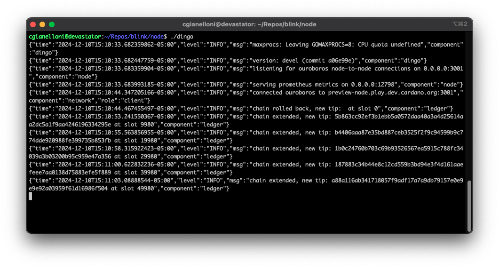

# Dingo

<div align="center">
  
  <br>
  
  <a href="https://goreportcard.com/report/github.com/blinklabs-io/dingo"></a>
  <a href="https://pkg.go.dev/github.com/blinklabs-io/dingo"></a>
  <a href="https://discord.gg/5fPRZnX4qW"></a>
</div>

# Dingo

This is a work in progress and is currently under heavy development

<div align="center">
  
</div>

## Features

- [x] Network
  - [x] UTxO RPC
  - [x] Ouroboros
    - [x] Node-to-node
      - [x] ChainSync
      - [x] BlockFetch
      - [x] TxSubmission2
    - [x] Node-to-client
      - [x] ChainSync
      - [x] LocalTxMonitor
      - [x] LocalTxSubmission
      - [x] LocalStateQuery
    - [ ] Peer governor
      - [x] Topology config
      - [ ] Peer churn
      - [ ] Ledger peers
    - [x] Connection manager
      - [x] Inbound connections
      - [x] Outbound connections
- [ ] Ledger
  - [x] Blocks
    - [x] Block storage
    - [ ] Chain selection
  - [x] UTxO tracking
  - [x] Protocol parameters
  - [ ] Certificates
    - [x] Pool registration
    - [x] Stake registration/delegation
    - [ ] Governance

Additional planned features can be found in our issue tracker and project boards.

[Catalyst Fund 12 - Go Node (Dingo)](https://github.com/orgs/blinklabs-io/projects/16)<br/>
[Catalyst Fund 13 - Archive Node](https://github.com/orgs/blinklabs-io/projects/17)

## Development / Building

This requires Go 1.22 or better is installed. You also need `make`.

```bash
# Build
make
# Run
./dingo
```

You can also run the code without building a binary, first
```bash
go run ./cmd/dingo/
```
