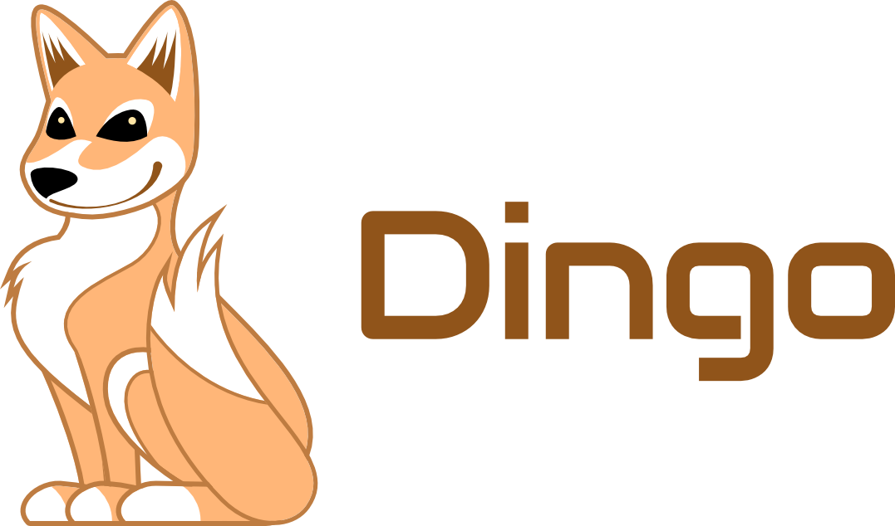
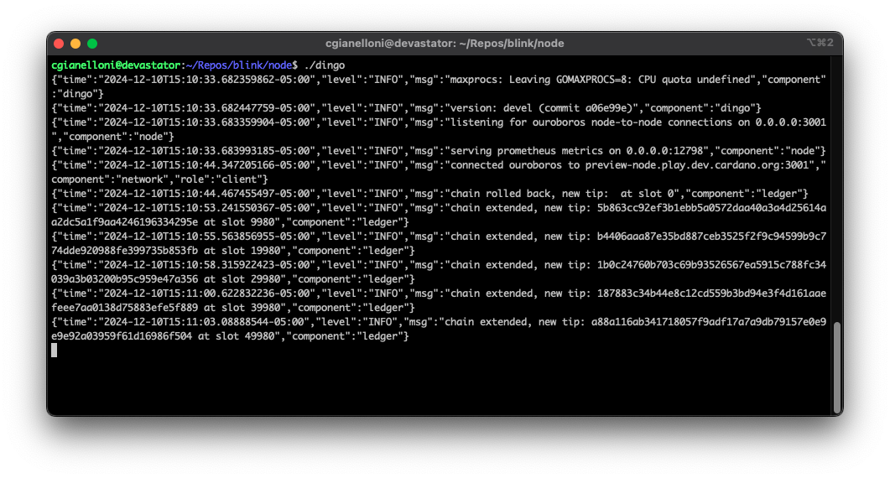

# Dingo

<div align="center">
  
  <br>
  
  <a href="https://goreportcard.com/report/github.com/blinklabs-io/dingo"></a>
  <a href="https://pkg.go.dev/github.com/blinklabs-io/dingo"></a>
  <a href="https://discord.gg/5fPRZnX4qW"></a>
</div>

> ⚠️ **WARNING: Dingo is under heavy active development and is not yet ready for production use. It should only be used on testnets (preview, preprod) and devnets. Do not use Dingo on mainnet with real funds.**

A high-performance Cardano blockchain node implementation in Go by Blink Labs. Dingo provides:
- Full chain synchronization and validation via Ouroboros consensus protocol
- UTxO tracking with 41 UTXO validation rules and Plutus V1/V2/V3 smart contract execution
- Block production with VRF leader election and stake snapshots
- Multi-peer chain selection with density comparison and VRF tie-breaking
- Client connectivity for wallets and applications
- Pluggable storage backends (Badger, SQLite, PostgreSQL, MySQL, GCS, S3)
- Tiered storage modes ("core" for consensus, "api" for full indexing)
- Peer governance with dynamic peer selection, ledger peers, and topology support
- Chain rollback support for handling forks with automatic state restoration
- Fast bootstrapping via built-in Mithril client
- Multiple API servers: UTxO RPC, Blockfrost-compatible REST, Mesh (Coinbase Rosetta)

Note: On Windows systems, named pipes are used instead of Unix sockets for node-to-client communication.

<div align="center">
  
</div>

## Running

Dingo supports configuration via a YAML config file (`dingo.yaml`), environment variables, and command-line flags. Priority: CLI flags > environment variables > YAML config > defaults.

A sample configuration file is provided at `dingo.yaml.example`. You can copy and edit this file to configure Dingo for your local or production environment.

### Environment Variables

The following environment variables modify Dingo's behavior:

- `CARDANO_BIND_ADDR`
  - IP address to bind for listening (default: `0.0.0.0`)
- `CARDANO_CONFIG`
  - Full path to the Cardano node configuration (default:
    `./config/cardano/preview/config.json`)
  - Use your own configuration files for different networks
  - Genesis configuration files are read from the same directory by default
- `CARDANO_DATABASE_PATH`
  - A directory which contains the ledger database files (default:
    `.dingo`)
  - This is the location for persistent data storage for the ledger
- `CARDANO_INTERSECT_TIP`
  - Ignore prior chain history and start from current position (default:
    `false`)
  - This is experimental and will likely break... use with caution
- `CARDANO_METRICS_PORT`
  - TCP port to bind for listening for Prometheus metrics (default: `12798`)
- `CARDANO_NETWORK`
  - Named Cardano network (default: `preview`)
- `CARDANO_PRIVATE_BIND_ADDR`
  - IP address to bind for listening for Ouroboros NtC (default:
    `127.0.0.1`)
- `CARDANO_PRIVATE_PORT`
  - TCP port to bind for listening for Ouroboros NtC (default: `3002`)
- `CARDANO_RELAY_PORT`
  - TCP port to bind for listening for Ouroboros NtN (default: `3001`)
- `CARDANO_SOCKET_PATH`
  - UNIX socket path for listening (default: `dingo.socket`)
  - This socket speaks Ouroboros NtC and is used by client software
- `CARDANO_TOPOLOGY`
  - Full path to the Cardano node topology (default: "")
- `DINGO_UTXORPC_PORT`
  - TCP port to bind for listening for UTxO RPC (default: `0`, disabled)
- `DINGO_BLOCKFROST_PORT`
  - TCP port for the Blockfrost-compatible REST API (default: `0`, disabled)
- `DINGO_MESH_PORT`
  - TCP port for the Mesh (Coinbase Rosetta) API (default: `0`, disabled)
- `DINGO_BARK_PORT`
  - TCP port for the Bark block archive API (default: `0`, disabled)
- `DINGO_STORAGE_MODE`
  - Storage mode: `core` (default) or `api`
  - `core` stores only consensus data (UTxOs, certs, pools, protocol params)
  - `api` additionally stores witnesses, scripts, datums, redeemers, and tx metadata
  - API servers (Blockfrost, UTxO RPC, Mesh) require `api` mode
- `DINGO_RUN_MODE`
  - Run mode: `serve` (full node, default), `load` (batch import), `dev` (development mode), or `leios` (experimental Leios protocol support)
- `TLS_CERT_FILE_PATH` - SSL certificate to use, requires `TLS_KEY_FILE_PATH`
    (default: empty)
- `TLS_KEY_FILE_PATH` - SSL certificate key to use (default: empty)

### Block Production (SPO Mode)

To run Dingo as a stake pool operator producing blocks:

- `CARDANO_BLOCK_PRODUCER` - Enable block production (default: `false`)
- `CARDANO_SHELLEY_VRF_KEY` - Path to VRF signing key file
- `CARDANO_SHELLEY_KES_KEY` - Path to KES signing key file
- `CARDANO_SHELLEY_OPERATIONAL_CERTIFICATE` - Path to operational certificate file

### Quick Start

```bash
# Preview network (default)
./dingo

# Mainnet
CARDANO_NETWORK=mainnet ./dingo

# Or with explicit config path
CARDANO_NETWORK=mainnet CARDANO_CONFIG=path/to/mainnet/config.json ./dingo
```

Dingo creates a `dingo.socket` file that speaks Ouroboros node-to-client and is compatible with `cardano-cli`, `adder`, `kupo`, and other Cardano client tools.

Cardano configuration files are bundled in the Docker image. For local builds, you can find them at [docker-cardano-configs](https://github.com/blinklabs-io/docker-cardano-configs/tree/main/config).

## Docker

```bash
# Run on preview (default)
docker run -p 3001:3001 ghcr.io/blinklabs-io/dingo

# Run on mainnet with persistent storage
docker run -p 3001:3001 \
  -e CARDANO_NETWORK=mainnet \
  -v dingo-data:/data/db \
  -v dingo-ipc:/ipc \
  ghcr.io/blinklabs-io/dingo
```

The image is based on Debian bookworm-slim and includes `cardano-cli`, `nview`, and `txtop`. Mithril snapshot support is built into dingo natively (`dingo mithril sync`). The Dockerfile sets `CARDANO_DATABASE_PATH=/data/db` and `CARDANO_SOCKET_PATH=/ipc/dingo.socket`, overriding the local defaults of `.dingo` and `dingo.socket` — the volume mounts above map to these container paths.

| Port | Service |
|------|---------|
| 3001 | Ouroboros NtN (node-to-node) |
| 3002 | Ouroboros NtC over TCP |
| 12798 | Prometheus metrics |

## Storage Modes

Dingo has two storage modes that control how much data is persisted:

| Mode | What's Stored | Use Case |
|------|---------------|----------|
| `core` (default) | UTxOs, certificates, pools, protocol parameters | Relays, block producers |
| `api` | Core data + witnesses, scripts, datums, redeemers, tx metadata | Nodes serving API queries |

```bash
# Relay or block producer (default)
./dingo

# API node
DINGO_STORAGE_MODE=api ./dingo
```

Or in `dingo.yaml`:

```yaml
storageMode: "api"
```

## API Servers

Dingo includes four API servers, all disabled by default. Enable them by setting a non-zero port. All API servers except Bark require `storageMode: "api"`.

| API | Port Env Var | Default | Protocol |
|-----|-------------|---------|----------|
| UTxO RPC | `DINGO_UTXORPC_PORT` | disabled | gRPC |
| Blockfrost | `DINGO_BLOCKFROST_PORT` | disabled | REST |
| Mesh (Rosetta) | `DINGO_MESH_PORT` | disabled | REST |
| Bark | `DINGO_BARK_PORT` | disabled | RPC |

```bash
# Enable Blockfrost API on port 3100 and UTxO RPC on port 9090
DINGO_STORAGE_MODE=api \
  DINGO_BLOCKFROST_PORT=3100 \
  DINGO_UTXORPC_PORT=9090 \
  ./dingo
```

Or in `dingo.yaml`:

```yaml
storageMode: "api"
blockfrostPort: 3100
utxorpcPort: 9090
```

### Deployment Patterns

**Relay node** (consensus only, no APIs):
```bash
./dingo
```

**API / data node** (full indexing, one or more APIs):
```bash
DINGO_STORAGE_MODE=api DINGO_BLOCKFROST_PORT=3100 ./dingo
```

**Block producer** (consensus only, with SPO keys):
```bash
CARDANO_BLOCK_PRODUCER=true \
  CARDANO_SHELLEY_VRF_KEY=/keys/vrf.skey \
  CARDANO_SHELLEY_KES_KEY=/keys/kes.skey \
  CARDANO_SHELLEY_OPERATIONAL_CERTIFICATE=/keys/opcert.cert \
  ./dingo
```

When `storageMode=core`, the Badger blob store defaults to mmap-only settings: `block-cache-size=0`, `index-cache-size=0`, and `compression=false`. When `storageMode=api`, the default Badger profile is `block-cache-size=268435456`, `index-cache-size=0`, and `compression=true`. YAML, environment variable, and CLI Badger options override those defaults only when explicitly set.

See `dingo.yaml.example` for the full set of configuration options.

## Fast Bootstrapping with Mithril

Instead of syncing from genesis (which can take days on mainnet), you can bootstrap Dingo using a [Mithril](https://mithril.network/) snapshot. Dingo has a built-in Mithril client that handles download, extraction, and import automatically. This is the fastest way to get a node running.

```bash
# Bootstrap from Mithril and start syncing
./dingo -n preview sync --mithril

# Then start the node
./dingo -n preview serve
```

Or use the subcommand form for more control:

```bash
# List available snapshots
./dingo -n preview mithril list

# Show snapshot details
./dingo -n preview mithril show <digest>

# Download and import
./dingo -n preview mithril sync
```

This imports:
- All blocks from genesis (stored in blob store for serving peers)
- Current UTxO set, stake accounts, pool registrations, DRep registrations
- Stake snapshots (mark/set/go) for leader election
- Protocol parameters, governance state, treasury/reserves
- Complete epoch history for slot-to-time calculations

What is NOT included: Individual transaction records, certificate history, witness/script/datum storage, and governance vote records for blocks before the snapshot. These are not needed for consensus, block production, or serving blocks to peers. New blocks processed after bootstrap will have full metadata.

Performance (preview network, ~4M blocks):

| Phase | Time |
|-------|------|
| Download snapshot (~2.6 GB) | ~1-2 min |
| Extract + download ancillary | ~1 min |
| Import ledger state (UTxOs, accounts, pools, DReps, epochs) | ~12 min |
| Load blocks into blob store | ~36 min |
| Total | ~50 min |

For indexers and API nodes that need full historical data (transaction lookups, certificate queries, datum/script resolution), configure the storage mode to `api` and `dingo mithril sync` will automatically backfill historical metadata after loading the snapshot.

### Disk Space Requirements

Bootstrapping requires temporary disk space for both the downloaded snapshot and the Dingo database:

| Network | Snapshot Size | Dingo DB | Total Needed |
|---------|--------------|----------|--------------|
| mainnet |      ~180 GB | ~200+ GB |      ~400 GB |
| preprod |       ~60 GB |   ~80 GB |      ~150 GB |
| preview |       ~15 GB |   ~25 GB |       ~50 GB |

These are approximate values that grow over time. The snapshot can be deleted after import, but you need sufficient space for both during the load process.

## Database Plugins

Dingo supports pluggable storage backends for both blob storage (blocks, transactions) and metadata storage. This allows you to choose the best storage solution for your use case.

### Available Plugins

Blob Storage Plugins:
- `badger` - BadgerDB local key-value store (default)
- `gcs` - Google Cloud Storage blob store
- `s3` - AWS S3 blob store

Metadata Storage Plugins:
- `sqlite` - SQLite relational database (default)
- `postgres` - PostgreSQL relational database
- `mysql` - MySQL relational database

### Plugin Selection

Plugins can be selected via command-line flags, environment variables, or configuration file:

```bash
# Command line
./dingo --blob gcs --metadata sqlite

# Environment variables
DINGO_DATABASE_BLOB_PLUGIN=gcs
DINGO_DATABASE_METADATA_PLUGIN=sqlite

# Configuration file (dingo.yaml)
database:
  blob:
    plugin: "gcs"
  metadata:
    plugin: "sqlite"
```

### Plugin Configuration

Each plugin supports specific configuration options. See `dingo.yaml.example` for detailed configuration examples.

BadgerDB Options:
- `data-dir` - Directory for database files
- `block-cache-size` - Block cache size in bytes
- `index-cache-size` - Index cache size in bytes
- `compression` - Enable Snappy compression
- `gc` - Enable garbage collection

Leave the mode-sensitive Badger settings unset if you want Dingo's storage-mode defaults. `storageMode=core` uses `block-cache-size=0`, `index-cache-size=0`, and `compression=false`; `storageMode=api` uses `block-cache-size=268435456`, `index-cache-size=0`, and `compression=true`.

Google Cloud Storage Options:
- `bucket` - GCS bucket name
- `project-id` - Google Cloud project ID
- `prefix` - Path prefix within bucket

AWS S3 Options:
- `bucket` - S3 bucket name
- `region` - AWS region
- `prefix` - Path prefix within bucket
- `access-key-id` - AWS access key ID (optional - uses default credential chain if not provided)
- `secret-access-key` - AWS secret access key (optional - uses default credential chain if not provided)

SQLite Options:
- `data-dir` - Path to SQLite database file

PostgreSQL Options:
- `host` - PostgreSQL server hostname
- `port` - PostgreSQL server port
- `username` - Database user
- `password` - Database password
- `database` - Database name

MySQL Options:
- `host` - MySQL server hostname
- `port` - MySQL server port
- `user` - Database user
- `password` - Database password
- `database` - Database name
- `ssl-mode` - MySQL TLS mode (mapped to tls= in DSN)
- `timezone` - MySQL time zone location (default: UTC)
- `dsn` - Full MySQL DSN (overrides other options when set)
- `storage-mode` - Storage tier: core or api (default: core)

### Listing Available Plugins

You can see all available plugins and their descriptions:

```bash
./dingo list
```

## Plugin Development

For information on developing custom storage plugins, see [PLUGIN_DEVELOPMENT.md](PLUGIN_DEVELOPMENT.md).

## Features

- [x] Network
  - [x] UTxO RPC
  - [x] Ouroboros
    - [x] Node-to-node
      - [x] ChainSync
      - [x] BlockFetch
      - [x] TxSubmission2
    - [x] Node-to-client
      - [x] ChainSync
      - [x] LocalTxMonitor
      - [x] LocalTxSubmission
      - [x] LocalStateQuery
    - [x] Peer governor
      - [x] Topology config
      - [x] Peer churn (full PeerChurnEvent with gossip/public root churn, bootstrap events)
      - [x] Ledger peers
      - [x] Peer sharing
      - [x] Denied peers tracking
    - [x] Connection manager
      - [x] Inbound connections
        - [x] Node-to-client over TCP
        - [x] Node-to-client over UNIX socket
        - [x] Node-to-node over TCP
      - [x] Outbound connections
        - [x] Node-to-node over TCP
- [ ] Ledger
  - [x] Blocks
    - [x] Block storage
    - [x] Chain selection (density comparison, VRF tie-breaker, ChainForkEvent)
  - [x] UTxO tracking
  - [x] Protocol parameters
  - [x] Genesis validation
  - [x] Block header validation (VRF/KES/OpCert cryptographic verification)
  - [ ] Certificates
    - [x] Pool registration
    - [x] Stake registration/delegation
    - [x] Account registration checks
    - [x] DRep registration
    - [ ] Governance
  - [ ] Transaction validation
    - [ ] Phase 1 validation
      - [x] UTxO rules
      - [x] Fee validation (full fee calculation with script costs)
      - [x] Transaction size and ExUnit budget validation
      - [ ] Witnesses
      - [ ] Block body
      - [ ] Certificates
      - [ ] Delegation/pools
      - [ ] Governance
    - [x] Phase 2 validation
      - [x] Plutus V1 smart contract execution
      - [x] Plutus V2 smart contract execution
      - [x] Plutus V3 smart contract execution
- [x] Block production
  - [x] VRF leader election with stake snapshots
  - [x] Block forging with KES/OpCert signing
  - [x] Slot battle detection
- [x] Mempool
  - [x] Accept transactions from local clients
  - [x] Distribute transactions to other nodes
  - [x] Validation of transaction on add
  - [x] Consumer tracking
  - [x] Transaction purging on chain update
  - [x] Watermark-based eviction and rejection
- [x] Database Recovery
  - [x] Chain rollback support (SQLite, PostgreSQL, and MySQL plugins)
  - [x] State restoration on rollback
  - [x] WAL mode for crash recovery
  - [x] Automatic rollback on transaction error
- [x] Stake Snapshots
  - [x] Mark/Set/Go rotation at epoch boundaries
  - [x] Genesis snapshot capture
- [x] API Servers
  - [x] UTxO RPC (gRPC)
  - [x] Blockfrost-compatible REST API
  - [x] Mesh (Coinbase Rosetta) API
  - [x] Bark block archive API
- [x] Mithril Bootstrap
  - [x] Built-in Mithril client
  - [x] Ledger state import (UTxOs, accounts, pools, DReps, epochs)
  - [x] Block loading from ImmutableDB

Additional planned features can be found in our issue tracker and project boards.

[Catalyst Fund 12 - Go Node (Dingo)](https://github.com/orgs/blinklabs-io/projects/16)<br/>
[Catalyst Fund 13 - Archive Node](https://github.com/orgs/blinklabs-io/projects/17)

Check the issue tracker for known issues. Due to rapid development, bugs happen
especially as there is functionality which has not yet been developed.

## Development / Building

This requires Go 1.25 or later. You also need `make`.

```bash
# Format, test, and build (default target)
make

# Build only
make build

# Run
./dingo

# Run without building a binary
go run ./cmd/dingo/
```

### Testing

```bash
make test                                    # All tests with race detection
go test -v -race -run TestName ./package/    # Single test
make bench                                   # Benchmarks
```

### Profiling

```bash
# Load testdata with CPU and memory profiling
make test-load-profile

# Analyze
go tool pprof cpu.prof
go tool pprof mem.prof
```

## DevNet

The DevNet runs a private Cardano network with Dingo and `cardano-node` producing blocks side by side. It validates that Dingo forges blocks, maintains consensus, and interoperates with the reference node.

### Architecture

The DevNet uses Docker Compose to run 3 containers on a bridge network:

| Container | Role | Host Port |
|-----------|------|-----------|
| `dingo-producer` | Dingo block producer (pool 1) | 3010 |
| `cardano-producer` | cardano-node block producer (pool 2) | 3011 |
| `cardano-relay` | Relay node (no block production) | 3012 |

A `configurator` init container generates fresh pool keys and genesis files before nodes start.

### Prerequisites

- Docker with the Compose plugin (`docker compose`)
- Go 1.24+

### Running the Automated Tests

The test suite builds the Dingo Docker image, starts all containers, waits for health checks, and runs Go integration tests tagged with `//go:build devnet`:

```bash
cd internal/test/devnet/

# Run all devnet tests
./run-tests.sh

# Run a specific test
./run-tests.sh -run TestBasicBlockForging

# Keep containers running after tests pass (for inspection)
./run-tests.sh --keep-up
```

Override host ports if needed:

```bash
DEVNET_DINGO_PORT=4010 DEVNET_CARDANO_PORT=4011 DEVNET_RELAY_PORT=4012 ./run-tests.sh
```

### Running the DevNet Manually

For longer-running manual tests (soak testing, observing behavior over multiple epochs, debugging):

```bash
cd internal/test/devnet/

# Start all containers
./start.sh

# Watch logs
docker compose -f docker-compose.yml logs -f

# Watch a specific node
docker compose -f docker-compose.yml logs -f dingo-producer

# Stop and clean up
./stop.sh
```

Containers remain running until you stop them. The DevNet parameters (in `testnet.yaml`) use 1-second slots and 1500-slot epochs (~25 minutes per epoch), so you can observe epoch transitions, leader election, and stake snapshot rotation relatively quickly.

### Local DevNet (Without Docker)

For quick iteration without Docker, `devmode.sh` runs Dingo directly against a local devnet genesis. It resets state and updates genesis timestamps on each run:

```bash
# Run in devnet mode
./devmode.sh

# With debug logging
DEBUG=true ./devmode.sh
```

This stores state in `.devnet/` and uses genesis configs from `config/cardano/devnet/`. It runs a single Dingo node (no cardano-node counterpart), which is useful for testing startup, epoch transitions, and block production in isolation.
