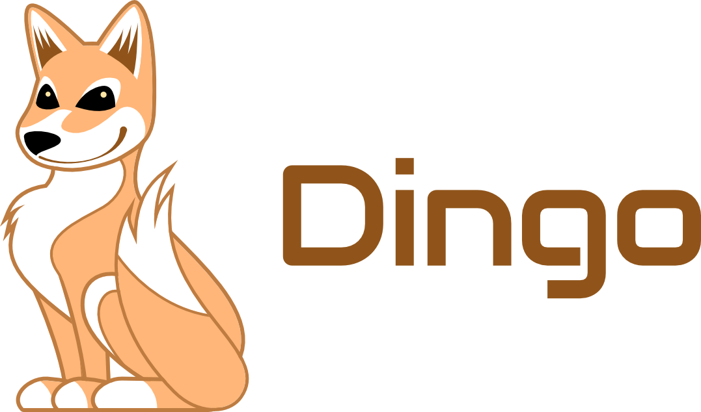

# Dingo

<div align="center">
  
  <br>
  
  <a href="https://pkg.go.dev/github.com/blinklabs-io/dingo"></a>
  <a href="https://discord.gg/5fPRZnX4qW"></a>
</div>

> ⚠️ **WARNING: Dingo is under heavy active development and is not yet ready for production use. It should only be used on testnets (preview, preprod) and devnets. Do not use Dingo on mainnet with real funds.**

Dingo is Blink Labs' Cardano node implementation in Go. It implements the
Ouroboros networking and consensus protocols, validates ledger state, and
provides pluggable storage and client interfaces.

## Documentation by audience

- **Node operators:** [Dingo guides](https://docs.blinklabs.io/guides/dingo/001-dingo/),
  including the [quick start](https://docs.blinklabs.io/guides/dingo/002-quick-start-overview/),
  [configuration and storage modes](https://docs.blinklabs.io/guides/dingo/005-node-configuration/),
  [bootstrap and data maintenance](https://docs.blinklabs.io/guides/dingo/007-bootstrap-and-data-maintenance/),
  and [stake pool operation](https://docs.blinklabs.io/guides/dingo/spo-guides/000-spo-guide/).
- **Application developers:** [APIs and archive services](https://docs.blinklabs.io/guides/dingo/006-apis-and-archive/)
  and [using Dingo with Cardano CLI](https://docs.blinklabs.io/guides/dingo/004-using-dingo-with-cardano-cli/).
- The Kupo-compatible API is disabled by default. To enable it, configure
  `DINGO_PLUGINS_API_KUPO_CONFIG_PORT` and use API storage mode.
- **Dingo contributors:** [development guide](docs/development.md),
  [local DevNet](docs/devnet.md), [benchmarks and profiling](docs/benchmarks.md),
  [architecture](ARCHITECTURE.md), [database design](DATABASE.md), and
  [plugin development](database/plugin/PLUGIN_DEVELOPMENT.md).

## Codebase

| Area | Location |
| --- | --- |
| Application composition and CLI | `node.go`, `internal/node/`, `cmd/dingo/` |
| Ledger validation and state | `ledger/`, `ledgerstate/` |
| Ouroboros protocols and peer management | `ouroboros/`, `connmanager/`, `peergov/`, `topology/` |
| Persistence and transaction pool | `database/`, `mempool/` |
| Client APIs and Dingo archive service | `api/`, `bark/` |

## Build and test

Use Go 1.26 or later and `make`:

```sh
make build
./dingo --help
```

Run the test suite with race detection using `make test`. See the
[development guide](docs/development.md) for repository checks, integration
environments, and profiling. For basic node setup and usage, follow the
[operator quick start](https://docs.blinklabs.io/guides/dingo/002-quick-start-overview/).

## Repository documentation

- [Development](docs/development.md)
- [Architecture](ARCHITECTURE.md)
- [Database](DATABASE.md)
- [Local DevNet](docs/devnet.md)
- [Benchmarks and profiling](docs/benchmarks.md)
- [Monitoring dashboards](docs/dashboards/README.md)
- [Badger garbage collection](docs/badger-gc.md)
