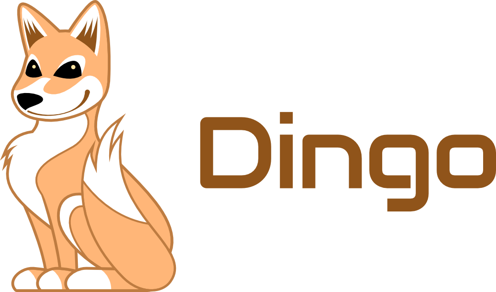

# Dingo

<div align="center">
  
  <br>
  
  <a href="https://goreportcard.com/report/github.com/blinklabs-io/dingo"></a>
  <a href="https://pkg.go.dev/github.com/blinklabs-io/dingo"></a>
  <a href="https://discord.gg/5fPRZnX4qW"></a>
</div>

# Dingo

⚠️ This is a work in progress and is currently under heavy development

A high-performance Cardano blockchain node implementation in Go by Blink Labs. Dingo provides:
- Full chain synchronization and validation via Ouroboros consensus protocol
- UTxO tracking with 41 UTXO validation rules and Plutus smart contract execution
- Client connectivity for wallets and applications
- Pluggable storage backends (Badger, SQLite, PostgreSQL, GCS, S3)
- Peer governance with dynamic peer selection and topology support
- Chain rollback support for handling forks with automatic state restoration

Note: On Windows systems, named pipes are used instead of Unix sockets for node-to-client communication.

<div align="center">
  
</div>

## Running

Dingo supports configuration via both a YAML config file (`dingo.yaml`) and uses environment
variables to modify its own behavior.

A sample configuration file is provided at `dingo.yaml.example`. You can copy and edit this file to configure Dingo for your local or production environment.

In addition to the configuration file, Dingo's behavior can be changed via the following environment variables:

- `CARDANO_BIND_ADDR`
  - IP address to bind for listening (default: `0.0.0.0`)
- `CARDANO_CONFIG`
  - Full path to the Cardano node configuration (default:
    `./config/cardano/preview/config.json`)
  - Use your own configuration files for different networks
  - Genesis configuration files are read from the same directory by default
- `CARDANO_DATABASE_PATH`
  - A directory which contains the ledger database files (default:
    `.dingo`)
  - This is the location for persistent data storage for the ledger
- `CARDANO_INTERSECT_TIP`
  - Ignore prior chain history and start from current position (default:
    `false`)
  - This is experimental and will likely break... use with caution
- `CARDANO_METRICS_PORT`
  - TCP port to bind for listening for Prometheus metrics (default: `12798`)
- `CARDANO_NETWORK`
  - Named Cardano network (default: `preview`)
- `CARDANO_PRIVATE_BIND_ADDR`
  - IP address to bind for listening for Ouroboros NtC (default:
    `127.0.0.1`)
- `CARDANO_PRIVATE_PORT`
  - TCP port to bind for listening for Ouroboros NtC (default: `3002`)
- `CARDANO_RELAY_PORT`
  - TCP port to bind for listening for Ouroboros NtN (default: `3001`)
- `CARDANO_SOCKET_PATH`
  - UNIX socket path for listening (default: `dingo.socket`)
  - This socket speaks Ouroboros NtC and is used by client software
- `CARDANO_TOPOLOGY`
  - Full path to the Cardano node topology (default: "")
- `DINGO_UTXORPC_PORT`
  - TCP port to bind for listening for UTxO RPC (default: `0`, disabled)
- `TLS_CERT_FILE_PATH` - SSL certificate to use, requires `TLS_KEY_FILE_PATH`
    (default: empty)
- `TLS_KEY_FILE_PATH` - SSL certificate key to use (default: empty)

## Fast Bootstrapping with Mithril

Instead of syncing from genesis (which can take days on mainnet), you can bootstrap Dingo using a [Mithril](https://mithril.network/) snapshot. There are two approaches depending on your use case:

| Approach | Command | Use Case | Data Available |
|----------|---------|----------|---------------|
| **`dingo sync`** | `dingo sync --mithril` | Consensus nodes, relays | Current ledger state + all blocks |
| **`mithril-client` + `dingo load`** | Manual download + load | Indexers, API nodes | Full historical transaction/certificate data |

### Option 1: `dingo sync --mithril` (Recommended for Consensus)

Dingo has a built-in Mithril client that handles download, extraction, and import automatically. This is the fastest way to get a node running.

```bash
# Bootstrap from Mithril and start syncing
./dingo -n preview sync --mithril

# Then start the node
./dingo -n preview serve
```

Or use the subcommand form for more control:

```bash
# List available snapshots
./dingo -n preview mithril list

# Show snapshot details
./dingo -n preview mithril show <digest>

# Download and import
./dingo -n preview mithril sync
```

This imports:
- All blocks from genesis (stored in blob store for serving peers)
- Current UTxO set, stake accounts, pool registrations, DRep registrations
- Stake snapshots (mark/set/go) for leader election
- Protocol parameters, governance state, treasury/reserves
- Complete epoch history for slot-to-time calculations

**What's NOT included**: Individual transaction records, certificate history, witness/script/datum storage, and governance vote records for blocks before the snapshot. These aren't needed for consensus, block production, or serving blocks to peers. New blocks processed after bootstrap will have full metadata.

**Performance** (preview network, ~4M blocks):

| Phase | Time |
|-------|------|
| Download snapshot (~2.6 GB) | ~1-2 min |
| Extract + download ancillary | ~1 min |
| Import ledger state (UTxOs, accounts, pools, DReps, epochs) | ~12 min |
| Load blocks into blob store | ~36 min |
| **Total** | **~50 min** |

### Option 2: `mithril-client` + `dingo load` (For Indexers/API Nodes)

If you need full historical data (transaction lookups, certificate queries, datum/script resolution), use the external `mithril-client` to download the snapshot and then load it with `dingo load`, which processes every block through the full indexing pipeline.

#### Prerequisites

Install the `mithril-client` CLI from [Mithril releases](https://github.com/input-output-hk/mithril/releases):

```bash
# Detect OS and architecture
OS=$(uname -s)
ARCH=$(uname -m)

case "$OS" in
  Linux)
    case "$ARCH" in
      x86_64)  MITHRIL_PLATFORM="x64-linux-musl" ;;
      aarch64|arm64) MITHRIL_PLATFORM="arm64-linux-musl" ;;
      *) echo "Unsupported architecture: $ARCH"; exit 1 ;;
    esac
    ;;
  Darwin)
    case "$ARCH" in
      x86_64)  MITHRIL_PLATFORM="x64-macos" ;;
      arm64)   MITHRIL_PLATFORM="arm64-macos" ;;
      *) echo "Unsupported architecture: $ARCH"; exit 1 ;;
    esac
    ;;
  *) echo "Unsupported OS: $OS (see Mithril releases for Windows)"; exit 1 ;;
esac

MITHRIL_VERSION="2506.0"
curl -L "https://github.com/input-output-hk/mithril/releases/download/${MITHRIL_VERSION}/mithril-${MITHRIL_VERSION}-${MITHRIL_PLATFORM}.tar.gz" -o mithril.tar.gz
tar -xzf mithril.tar.gz
sudo mv mithril-client /usr/local/bin/
rm mithril.tar.gz
```

For Windows, download the appropriate binary from the [Mithril releases page](https://github.com/input-output-hk/mithril/releases).

#### Bootstrap Workflow

```bash
# Set network (CARDANO_NETWORK is used by dingo, not mithril-client)
export CARDANO_NETWORK=preview
# AGGREGATOR_ENDPOINT is used by mithril-client
export AGGREGATOR_ENDPOINT=https://aggregator.pre-release-preview.api.mithril.network/aggregator

# For mainnet:
# export AGGREGATOR_ENDPOINT=https://aggregator.release-mainnet.api.mithril.network/aggregator

# Download snapshot (uses AGGREGATOR_ENDPOINT)
mithril-client cardano-db download --download-dir /tmp/mithril-snapshot

# Load into Dingo (uses CARDANO_NETWORK for chain config)
./dingo load /tmp/mithril-snapshot/db/immutable

# Clean up snapshot
rm -rf /tmp/mithril-snapshot

# Start Dingo
./dingo -n preview serve
```

This creates full historical data including transaction records, certificate history, witness data, scripts, datums, and governance votes — everything needed for rich query APIs.

### Disk Space Requirements

Bootstrapping requires temporary disk space for both the downloaded snapshot and the Dingo database:

| Network | Snapshot Size | Dingo DB | Total Needed |
|---------|--------------|----------|--------------|
| mainnet |      ~180 GB | ~200+ GB |      ~400 GB |
| preprod |       ~60 GB |   ~80 GB |      ~150 GB |
| preview |       ~15 GB |   ~25 GB |       ~50 GB |

**Note**: These are approximate values that grow over time. The snapshot can be deleted after import, but you need sufficient space for both during the load process.

## Database Plugins

Dingo supports pluggable storage backends for both blob storage (blocks, transactions) and metadata storage. This allows you to choose the best storage solution for your use case.

### Available Plugins

**Blob Storage Plugins:**
- `badger` - BadgerDB local key-value store (default)
- `gcs` - Google Cloud Storage blob store
- `s3` - AWS S3 blob store

**Metadata Storage Plugins:**
- `sqlite` - SQLite relational database (default)
- `postgres` - PostgreSQL relational database

### Plugin Selection

Plugins can be selected via command-line flags, environment variables, or configuration file:

```bash
# Command line
./dingo --blob gcs --metadata sqlite

# Environment variables
DINGO_DATABASE_BLOB_PLUGIN=gcs
DINGO_DATABASE_METADATA_PLUGIN=sqlite

# Configuration file (dingo.yaml)
database:
  blob:
    plugin: "gcs"
  metadata:
    plugin: "sqlite"
```

### Plugin Configuration

Each plugin supports specific configuration options. See `dingo.yaml.example` for detailed configuration examples.

**BadgerDB Options:**
- `data-dir` - Directory for database files
- `block-cache-size` - Block cache size in bytes
- `index-cache-size` - Index cache size in bytes
- `gc` - Enable garbage collection

**Google Cloud Storage Options:**
- `bucket` - GCS bucket name
- `project-id` - Google Cloud project ID
- `prefix` - Path prefix within bucket

**AWS S3 Options:**
- `bucket` - S3 bucket name
- `region` - AWS region
- `prefix` - Path prefix within bucket
- `access-key-id` - AWS access key ID (optional - uses default credential chain if not provided)
- `secret-access-key` - AWS secret access key (optional - uses default credential chain if not provided)

**SQLite Options:**
- `data-dir` - Path to SQLite database file

**PostgreSQL Options:**
- `host` - PostgreSQL server hostname
- `port` - PostgreSQL server port
- `username` - Database user
- `password` - Database password
- `database` - Database name

### Listing Available Plugins

You can see all available plugins and their descriptions:

```bash
./dingo list
```

## Plugin Development

For information on developing custom storage plugins, see [PLUGIN_DEVELOPMENT.md](PLUGIN_DEVELOPMENT.md).

### Example

Running on mainnet (:sweat_smile:):

```bash
CARDANO_NETWORK=mainnet CARDANO_CONFIG=path/to/cardano/configs/mainnet/config.json ./dingo
```

Note: you can find cardano configuration files at
<https://github.com/blinklabs-io/docker-cardano-configs/tree/main/config>

Dingo will drop a `dingo.socket` file which can be used by other clients, such
as `cardano-cli` or software like `adder` or `kupo`. This has only had limited
testing, so success/failure reports are very welcome and encouraged!

## Features

- [x] Network
  - [x] UTxO RPC
  - [x] Ouroboros
    - [x] Node-to-node
      - [x] ChainSync
      - [x] BlockFetch
      - [x] TxSubmission2
    - [x] Node-to-client
      - [x] ChainSync
      - [x] LocalTxMonitor
      - [x] LocalTxSubmission
      - [x] LocalStateQuery
    - [x] Peer governor
      - [x] Topology config
      - [x] Peer churn (full PeerChurnEvent with gossip/public root churn, bootstrap events)
      - [x] Ledger peers
      - [x] Peer sharing
      - [x] Denied peers tracking
    - [x] Connection manager
      - [x] Inbound connections
        - [x] Node-to-client over TCP
        - [x] Node-to-client over UNIX socket
        - [x] Node-to-node over TCP
      - [x] Outbound connections
        - [x] Node-to-node over TCP
- [ ] Ledger
  - [x] Blocks
    - [x] Block storage
    - [x] Chain selection (density comparison, VRF tie-breaker, ChainForkEvent)
  - [x] UTxO tracking
  - [x] Protocol parameters
  - [x] Genesis validation
  - [ ] Certificates
    - [x] Pool registration
    - [x] Stake registration/delegation
    - [x] Account registration checks
    - [ ] Governance
  - [ ] Transaction validation
    - [ ] Phase 1 validation
      - [x] UTxO rules
      - [ ] Witnesses
      - [ ] Block body
      - [ ] Certificates
      - [ ] Delegation/pools
      - [ ] Governance
    - [ ] Phase 2 validation
      - [ ] Smart contracts
- [x] Mempool
  - [x] Accept transactions from local clients
  - [x] Distribute transactions to other nodes
  - [x] Validation of transaction on add
  - [x] Consumer tracking
  - [x] Transaction purging on chain update
- [x] Database Recovery
  - [x] Chain rollback support (SQLite and PostgreSQL plugins)
  - [x] State restoration on rollback
  - [x] WAL mode for crash recovery
  - [x] Automatic rollback on transaction error
- [x] Plutus Validation
  - [x] Plutus V3 smart contract validation
  - [ ] Plutus V1/V2 smart contract validation

Additional planned features can be found in our issue tracker and project boards.

[Catalyst Fund 12 - Go Node (Dingo)](https://github.com/orgs/blinklabs-io/projects/16)<br/>
[Catalyst Fund 13 - Archive Node](https://github.com/orgs/blinklabs-io/projects/17)

Check the issue tracker for known issues. Due to rapid development, bugs happen
especially as there is functionality which has not yet been developed.

## Development / Building

This requires Go 1.23 or better is installed. You also need `make`.

```bash
# Build
make
# Run
./dingo
```

You can also run the code without building a binary, first

```bash
go run ./cmd/dingo/
```
