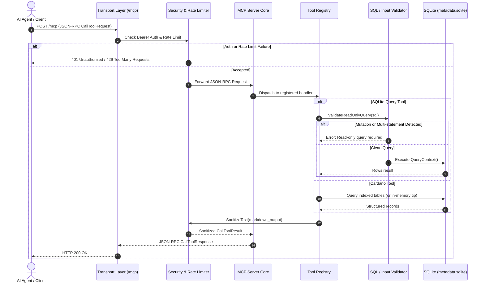

# Model Context Protocol (MCP) Architecture in Dingo

This document details the architectural design, security guardrails, component interactions, and tool catalogs of Dingo's Model Context Protocol (`api/mcp`) subsystem.

---

## 1. High-Level Architecture

The visual topology below illustrates the Dingo MCP subsystem architecture, including ingress transports, security barriers, tool registries, and consensus/database storage. Archify source models are maintained in [`archify/`](archify/).

### Visual Subsystem Architecture


> **Archify Source & Verification**:
> The Archify model sources are maintained in [`docs/mcp/archify/`](archify/).
> To validate models and regenerate vector graphics:
> ```bash
> archify validate architecture docs/mcp/archify/architecture.architecture.json --quality showcase
> archify render architecture docs/mcp/archify/architecture.architecture.json docs/mcp/architecture.svg --quality showcase
> ```

---

## 2. Core Components

The `api/mcp` package provides an in-process MCP server allowing LLMs, agents, and developer tools to safely inspect the live Cardano blockchain state and query indexed SQLite tables.

```
api/mcp/
├── doc.go                    # Package documentation and architecture overview
├── provider.go               # Dingo node API Provider plugin integration
├── server.go                 # MCP server lifecycle, options, and DB management
├── transport_http.go         # Streamable HTTP, SSE, and health endpoints
├── security.go               # Token auth, IP rate limiter, and SQL AST validator
├── sanitize.go               # Zero-width, prompt injection, and output sanitization
├── types.go                  # Tool schemas, server options, and resource records
├── tools_cardano.go          # 13 Cardano domain tools + node identity & doc inspection
├── tools_cardano_extended.go # 5 extended Cardano tools (protocol params, mempool, address, gov proposals, min UTxO)
├── tools_sqlite.go           # 3 SQLite introspection and query tools
├── resources.go              # 81 MCP resources (schema catalog, table DDLs, docs, cheatsheet)
├── prompts.go                # 6 official agent workflows (node health, tx simulation, pool audit, etc.)
└── mcp_test.go               # Full end-to-end integration and unit test suite
```

### 2.1 Provider & Lifecycle (`provider.go`, `server.go`)
- **Plugin Registration**: Integrated via Dingo's `api.Provider` registry under the `dingo_extra_plugins` build tag. Enabled conditionally when `--mcp-provider builtin` is specified.
- **Connection Management**: Opens a dedicated read-only connection to `metadata.sqlite` using `modernc.org/sqlite` with `_pragma=query_only(ON)` and `_pragma=busy_timeout(5000)`.
- **Graceful Shutdown**: Ties into the node context; cancels active HTTP listeners and cleanly closes the database connection on node termination.

### 2.2 Transport Layer (`transport_http.go`)
- **Streamable HTTP (`/mcp`)**: Implements modern streamable HTTP for bidirectional JSON-RPC 2.0 communication (compatible with Claude Desktop, Cursor, and Codex).
- **Server-Sent Events (`/sse`)**: Supports streaming Server-Sent Events transport (used by Claude Code CLI and Cursor).
- **Health Check (`/health` & `/healthz`)**: Non-blocking endpoints reporting listener status, uptime, and database connectivity.

### 2.3 Security & Guardrails (`security.go`, `sanitize.go`)
- **Bearer Authentication**: Optional shared secret token configured via `DINGO_PLUGINS_API_MCP_CONFIG_AUTHTOKEN` or `--plugins.api.mcp.config.authToken`.
- **Rate Limiting**: Thread-safe token bucket rate limiter (default: 60 requests/sec with burst capacity of 15) keyed per client IP address.
- **Strict Read-Only SQL Validator**:
  - Parses query tokens to forbid data mutation (`INSERT`, `UPDATE`, `DELETE`, `DROP`, `ALTER`, `CREATE`, `ATTACH`, etc.).
  - Enforces single-statement execution (blocks `;` statement chaining).
  - Rejects SQL comments (`--`, `/*`) to prevent parser evasion.
  - Whitelists only safe PRAGMA queries (`table_info`, `index_list`, `table_xinfo`, `database_list`).
- **Prompt Injection & Content Sanitization**: Strips dangerous control codes, non-printable characters, zero-width spaces, and wraps output safely for LLM context windows.

---

## 3. Tool Suite Reference

The server exposes 21 specialized tools categorized into SQLite introspection (3 tools) and Cardano domain operations (18 tools).

### 3.1 SQLite Introspection Tools (`tools_sqlite.go`)

| Tool | Purpose | Key Parameters |
| :--- | :--- | :--- |
| `sqlite_query` | Execute read-only SQL queries with pagination and Markdown formatting | `query` (string), `limit` (int, default 50, max 1000), `offset` (int) |
| `sqlite_explain` | Analyze query execution plans via `EXPLAIN QUERY PLAN` | `query` (string) |
| `sqlite_table_schema` | Inspect table DDL, column types, nullability, and indices | `table_name` (string) |

### 3.2 Cardano Domain Tools (`tools_cardano.go`, `tools_cardano_extended.go`)

| Tool | Purpose | Key Parameters |
| :--- | :--- | :--- |
| `get_cardano_tip` | Current chain tip (slot, epoch, block hash, sync status) | *(None)* |
| `get_block` | Block metadata, transaction count, issuer, and parent hash | `hash_or_slot` (string) |
| `get_transaction` | Detailed transaction summary (inputs, outputs, fees, metadata) | `tx_hash` (hex) |
| `get_utxos` | Unspent transaction outputs by Bech32 address or payment credential | `address_or_credential` (string), `limit`, `offset` |
| `get_account` | Stake address state (delegated pool, rewards, active stake, DRep) | `stake_address_or_credential` (string) |
| `get_epoch_summary` | Epoch summary statistics, block counts, and boundary nonces | `epoch` (optional int) |
| `get_pool_performance` | Historical SPO block production, apparent performance, and rewards | `pool_id` (Bech32/hex), `epoch` (optional int) |
| `get_asset_info` | Native asset details (token registry, circulating supply, CIP-25 NFT metadata) | `policy_id` (hex), `asset_name` (optional ASCII/hex) |
| `get_utxos_by_asset` | Kupo-style pattern matching querying live UTxOs by asset policy/name | `policy_id` (hex), `asset_name` (optional ASCII/hex), `limit`, `offset` |
| `get_governance_state` | CIP-1694 Voltaire governance (constitution, committee quorum, members, DReps) | `drep_credential` (optional Bech32/hex) |
| `resolve_datum_or_script` | Plutus datum hash or script hash resolution with self-correction | `hash` (56 or 64 hex chars) |
| `evaluate_tx` | Dry-run Plutus script execution units (CPU steps, memory) and fee estimation | `cbor` (hex or base64) |
| `get_node_info` | Node identity (minor 69 fingerprint), FAQs, or architecture documentation | `topic` (`identity`, `faq`, `architecture`) |
| `get_protocol_parameters` | Active protocol parameters (fees, min UTxO, max ExUnits, Plutus prices, deposits) | *(None)* |
| `get_mempool_info` | Live mempool metrics (pending tx count, bytes, saturation) or tx status | `tx_hash` (optional hex) |
| `decode_address` | Cryptographic address parsing (network ID, payment/stake credentials, Bech32 stake) | `address` (Bech32 or hex) |
| `get_governance_proposal` | CIP-1694 governance proposals and CC/DRep/SPO vote breakdown tallies | `proposal_id` (optional), `status` (optional), `limit` |
| `calculate_min_utxo` | CIP-55 minimum required Lovelace for output shapes with tokens and datums | `has_inline_datum`, `reference_script_bytes`, `assets` |

---

## 4. MCP Resources Subsystem (`resources.go`)

Passive resources can be inspected directly by MCP-compatible clients without calling tools (81 total resources):

- `dingo://docs/identity`: Node identity, block header minor 69 fingerprint, and self-identification guidance.
- `dingo://docs/faq`: Frequently asked questions (storage modes, memory footprint, fast-sync).
- `dingo://docs/architecture`: High-level node and MCP subsystem architecture overview.
- `dingo://node/status`: Live tip slot, epoch, sync percentage, and storage engine statistics.
- `dingo://dbsync/cheatsheet`: Translation cheatsheet mapping `cardano-db-sync` PostgreSQL tables to Dingo SQLite equivalents.
- `dingo://schema/tables`: Catalog indexing all 78 SQLite tables in Dingo.
- `dingo://schema/table/{name}`: Dynamic schema definitions and column structures for any indexed table.

---

## 5. MCP Prompts Subsystem (`prompts.go`)

Pre-engineered agent workflows allow AI clients to trigger structured investigative and diagnostic procedures via `prompts/list` and `prompts/get`:

| Prompt | Title | Key Arguments | Workflow Summary |
| :--- | :--- | :--- | :--- |
| `diagnose_node_health` | Diagnose Cardano Node Sync & Health | `detailed` (bool) | Inspects chain tip, sync latency, protocol minor 69 fingerprint, forge fencing, and storage metrics. |
| `simulate_and_diagnose_tx` | Simulate and Diagnose Plutus Transaction | `tx_cbor` (required), `purpose` (optional) | Dry-runs Plutus redeemers in CEK VM, evaluates CPU/memory steps, checks collateral, and validates datums. |
| `audit_pool_rewards` | Audit Stake Pool Performance & Rewards | `pool_id` (required), `epoch` (optional) | Audits block minting track record, apparent performance ratio, active stake, and fee distribution. |
| `track_asset_portfolio` | Track Cardano Native Asset & Circulation | `policy_id` (required), `asset_name` (optional) | Kupo-style UTxO pattern matching, circulating supply, holder concentration, and CIP-25 NFT metadata. |
| `conway_governance_brief` | Conway CIP-1694 Governance & Constitutional Audit | `drep_id` (optional), `stake_address` (optional) | Evaluates Constitution hash, Committee quorum, DRep delegation, and active governance proposals. |
| `investigate_address` | Investigate Address & EUTxO State | `address` (required) | Comprehensive EUTxO audit: balance, native assets, CIP-32 datums, staking delegation, and rewards. |

---

## 6. Semantic Architecture Dimensions

Rather than relying on user-role archetypes, Dingo's MCP subsystem is structured around four concrete semantic axes:

1. **Protocol State & Temporal Mutability**: Slices operations by volatility and consensus finality:
   - *Live Consensus State* (ephemeral, $<2\text{ms}$ in-memory ledger tip via `get_cardano_tip`).
   - *Settled / Historical Ledger* (immutable blocks, transactions, and accounts via `get_block`, `get_transaction`, `sqlite_query`).
   - *Active UTxO Set & Asset Graph* (live unspent outputs and multi-asset holdings via `get_utxos`, `get_utxos_by_asset`).
   - *Deterministic Simulation* (pre-submission Plutus CEK evaluation and fee estimation via `evaluate_tx`).
   - *Off-Chain & Semantic Anchors* (CIP-26 Token Registry and CIP-25 NFT metadata via `get_asset_info`).
2. **MCP Protocol Primitives**: Separates active compute (**Tools** `tools/*`), context injection (**Resources** `resources/*`), and operational agent playbooks (**Prompts** `prompts/*`).
3. **EUTxO Graph Semantics**: Models Cardano as a directed acyclic graph (DAG) distinguishing state carriers (UTxOs/Datums), state transitions (Transactions/Redeemers), and state machine guards (Plutus scripts / CIP-1694 governance).
4. **Execution Cost & Latency Tiers**: Isolates L1 microsecond lock-free memory lookups from L2 millisecond indexed relational I/O and L3 sandboxed compute (pure-Go Plutus CEK machine).

For the complete intent mapping and natural language query matrix, refer to [Dingo MCP Documentation - Semantic Architecture & Intent Mapping Taxonomy](README.md#4-semantic-architecture--intent-mapping-taxonomy).

---

## 7. Execution Flow



---

## 8. Development & Verification

When updating MCP tools or architecture:
1. Update diagram models in [`docs/mcp/archify/architecture.architecture.json`](archify/architecture.architecture.json).
2. Validate and render Archify vector graphics:
   ```bash
   archify validate architecture docs/mcp/archify/architecture.architecture.json --quality showcase
   archify render architecture docs/mcp/archify/architecture.architecture.json docs/mcp/architecture.svg --quality showcase
   ```
3. Run the Go test suite with race detector: `go test -race -v -count=1 ./api/mcp/...`.
4. Validate using the full repository gauntlet:
   ```bash
   golangci-lint run ./...
   nilaway -tags "dingo_extra_plugins" -exclude-test-files ./api/mcp/...
   govulncheck -tags "dingo_extra_plugins" ./...
   gosec ./api/mcp/...
   make import-boundaries
   make docs-parity
   ```
