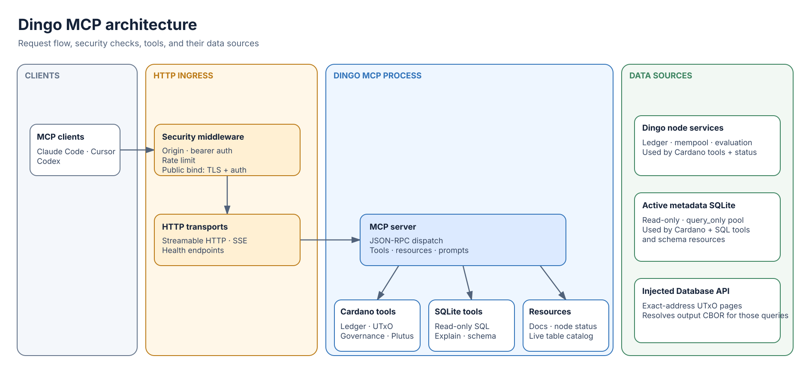

# Model Context Protocol (MCP) Architecture in Dingo

This document details the architectural design, security guardrails, component interactions, and tool catalogs of Dingo's Model Context Protocol (`api/mcp`) subsystem.

---

## 1. High-Level Architecture

The visual topology below illustrates the Dingo MCP subsystem architecture, including ingress transports, security barriers, tool registries, live node services, and SQLite metadata. The editable diagram source is [`architecture.excalidraw`](architecture.excalidraw); the SVG is its documentation preview.

### Visual Subsystem Architecture



Cardano tools use both injected node services and the read-only SQL pool.
Exact-address queries also resolve output CBOR through the injected database
and its configured blob provider. The SQL pool reads the active metadata file.

> **Diagram source:** Edit `architecture.excalidraw` in Excalidraw, then export it as SVG to `architecture.svg` to update this preview.

---

## 2. Core Components

The `api/mcp` package provides an in-process MCP server allowing LLMs, agents, and developer tools to safely inspect the live Cardano blockchain state and query indexed SQLite tables.

```
api/mcp/
├── doc.go                    # Package documentation and architecture overview
├── provider.go               # Dingo node API Provider plugin integration
├── server.go                 # MCP server lifecycle, options, and DB management
├── transport_http.go         # Streamable HTTP, SSE, and health endpoints
├── security.go               # Token auth, IP rate limiter, and Origin validation
├── sanitize.go               # Zero-width, prompt injection, and output sanitization
├── types.go                  # Tool schemas, server options, and resource records
├── tools_cardano.go          # 13 Cardano domain tools + node identity & doc inspection
├── tools_cardano_extended.go # 5 extended Cardano tools (protocol params, mempool, address, gov proposals, min UTxO)
├── sql_validation.go         # SQL tokenization and read-only statement checks
├── tools_sqlite.go           # 3 SQLite introspection and query tools
├── resources.go              # Documentation, live status, catalog, and per-table resources
├── prompts.go                # 6 official agent workflows (node health, tx simulation, pool audit, etc.)
├── testsupport_test.go       # Shared database fixtures and in-memory tool sessions
├── mcp_test.go               # In-memory MCP session integration test
└── *_test.go                 # Component and Cardano domain tests; opt-in Preview checks
```

### 2.1 Provider & Lifecycle (`provider.go`, `server.go`)
- **Plugin Registration**: Registered explicitly on the instance-owned `plugin.Host`. Compiled in without an extra build tag; disabled by default (`port: 0`). Node composition skips construction at zero; a positive port such as `8088` enables it in either storage mode. This makes the endpoint opt-in while authentication is unset. Zero does not select an ephemeral port.
- **Connection Management**: Opens a separate read-only pool at the active metadata provider's `SQLitePath()` using `modernc.org/sqlite`, `mode=ro`, `_pragma=query_only(1)`, and `_pragma=busy_timeout(5000)`. This reads the live database file, not a replica. Providers without a file-backed SQLite path leave SQL-dependent tools unavailable.
- **Graceful Shutdown**: Uses `internal/apilistener` for context-driven listener shutdown. The plugin stop hook stops the listener and closes the owned SQL pool; live lifecycle reconstruction creates a new provider instance against the active database.

### 2.2 Transport Layer (`transport_http.go`)
- **Streamable HTTP (`/mcp`)**: Implements modern streamable HTTP for bidirectional JSON-RPC 2.0 communication (compatible with Claude Desktop, Cursor, and Codex).
- **Server-Sent Events (`/sse`)**: Supports streaming Server-Sent Events transport (used by Claude Code CLI and Cursor).
- **Health Check (`/health` & `/healthz`)**: Listener status endpoints returning `{"service":"dingo-mcp","status":"ok"}`; they do not probe database connectivity. `/healthz` bypasses token authentication and rate limiting, while `/health` does not. Both remain subject to origin validation.

### 2.3 Security & Guardrails (`security.go`, `sanitize.go`)
- **Bearer Authentication**: Optional shared secret token configured via `DINGO_PLUGINS_API_MCP_CONFIG_AUTH_TOKEN` or YAML `plugins.api.mcp.config.authToken`.
- **Rate Limiting**: Thread-safe token bucket rate limiter (default: 60 requests/sec with burst capacity of 15) keyed per client IP address.
- **Strict Read-Only SQL Validator**:
  - Identifies the main statement after CTE definitions, accounting for comments, quoted data and nested expressions; permits SELECT/VALUES reads and EXPLAIN without executing DDL or DML.
  - Enforces single-statement execution (blocks `;` statement chaining).
  - Whitelists only safe PRAGMA queries (`table_info`, `index_list`, `index_info`, `foreign_key_list`).
- **External Text Handling**: Bounds text, removes control and invisible formatting, JSON-quotes it, and escapes Markdown syntax before formatting registry and CIP-25 data. Results explicitly mark external metadata as untrusted; clients must not follow instructions contained in it.
- **Network Bind Protection**: The default listener is loopback. Provider construction rejects a non-loopback bind unless both an auth token and server TLS are configured.

---

## 3. Tool Suite Reference

The server exposes 21 specialized tools categorized into SQLite introspection (3 tools) and Cardano domain operations (18 tools).

### 3.1 SQLite Introspection Tools (`tools_sqlite.go`)

| Tool | Purpose | Key Parameters |
| :--- | :--- | :--- |
| `sqlite_query` | Execute read-only SQL queries with pagination and Markdown formatting | `query` (string), `limit` (int, default 50, capped by configured maxRows and 200), `offset` (int) |
| `sqlite_explain` | Analyze query execution plans via `EXPLAIN QUERY PLAN` | `query` (string) |
| `sqlite_table_schema` | Inspect table DDL, column types, nullability, and indices | `table_name` (string) |

### 3.2 Cardano Domain Tools (`tools_cardano.go`, `tools_cardano_extended.go`)

| Tool | Purpose | Key Parameters |
| :--- | :--- | :--- |
| `get_cardano_tip` | Current chain tip (slot, epoch, block hash, sync status) | *(None)* |
| `get_block` | Block summary with slot/hash, and indexed epoch/height/transaction/fee fields when available | `hash_or_slot` (string) |
| `get_transaction` | Transaction hash, internal ID, slot, block index, fee, output count, and total output lovelace | `tx_hash` (hex) |
| `get_utxos` | Unspent transaction outputs by Bech32 address or payment credential | `address_or_credential` (string), `limit`, `cursor` for exact addresses; `offset` for credentials |
| `get_account` | Stored stake-account row, including delegation, reward, DRep, and registration state where indexed | `stake_address_or_credential` (string), `credential_type` (`key` or `script`, required for hex credentials) |
| `get_epoch_summary` | Epoch summary statistics, block counts, and boundary nonces | `epoch` (optional int) |
| `get_pool_performance` | Historical SPO blocks, recorded delegated stake and pledge (lovelace), apparent performance, and rewards | `pool_id` (Bech32/hex), `epoch` (optional int), `limit` (default 10, maximum 50 epochs) |
| `get_asset_info` | Native asset details (token registry, circulating supply, CIP-25 NFT metadata) | `policy_id` (hex), `asset_name` (optional ASCII/hex) |
| `get_utxos_by_asset` | Kupo-style pattern matching querying live UTxOs by asset policy/name | `policy_id` (hex), `asset_name` (optional ASCII/hex), `limit`, `offset` |
| `get_governance_state` | CIP-1694 Voltaire governance (constitution, committee quorum, members, DReps) | `drep_credential` (optional Bech32/hex) |
| `resolve_datum_or_script` | Plutus datum hash or script hash resolution with self-correction | `hash` (56 or 64 hex chars) |
| `evaluate_tx` | Dry-run Plutus script execution units (CPU steps, memory) and fee estimation | `cbor` (hex or base64) |
| `get_node_info` | Node identity (minor 69 fingerprint), FAQs, or architecture documentation | `topic` (`identity`, `faq`, `architecture`) |
| `get_protocol_parameters` | Active protocol parameters (fees, min UTxO, max ExUnits, Plutus prices, deposits) | *(None)* |
| `get_mempool_info` | Live mempool metrics (pending tx count, bytes, saturation) or tx status | `tx_hash` (optional hex) |
| `decode_address` | Cryptographic address parsing (network ID, payment/stake credentials, Bech32 stake) | `address` (Bech32 or hex) |
| `get_governance_proposal` | CIP-1694 governance proposals and CC/DRep/SPO vote breakdown tallies | `tx_hash` (optional), `action_index` (optional), `status` (optional), `limit` |
| `calculate_min_utxo` | CIP-55 minimum required Lovelace for output shapes with tokens and datums | `output_cbor_hex`, `address`, `coins_per_utxo_byte` |

---

## 4. MCP Resources Subsystem (`resources.go`)

Resources can be inspected directly without calling tools. Six resources are always registered; startup also registers one schema resource per discovered non-internal SQLite table. The total depends on the connected database, not a fixed table count:

- `dingo://docs/identity`: Node identity, block header minor 69 fingerprint, and self-identification guidance.
- `dingo://docs/faq`: Frequently asked questions (storage modes, memory footprint, fast-sync).
- `dingo://docs/architecture`: High-level node and MCP subsystem architecture overview.
- `dingo://node/status`: Configured network, tip slot, block height, block hash, and sync status. It does not report epoch, percentage progress, or storage statistics.
- `dingo://dbsync/cheatsheet`: Translation cheatsheet mapping `cardano-db-sync` PostgreSQL tables to Dingo SQLite equivalents.
- `dingo://schema/tables`: Catalog of the connected SQLite database, queried at read time; reports schema unavailability without a SQL pool.
- `dingo://schema/table/{name}`: Schema definitions for tables discovered at server construction. Discovery is bounded by the larger of the request timeout and 30 seconds so a shorter per-request timeout cannot omit table resources, and a discovery failure is logged; each read queries the current DDL and columns with the configured request timeout.

---

## 5. MCP Prompts Subsystem (`prompts.go`)

Pre-engineered agent workflows allow AI clients to trigger structured investigative and diagnostic procedures via `prompts/list` and `prompts/get`:

| Prompt | Title | Key Arguments | Workflow Summary |
| :--- | :--- | :--- | :--- |
| `diagnose_node_health` | Diagnose Cardano Node Sync & Health | `detailed` (bool) | Inspects the reported ledger or metadata tip, sync status, protocol minor 69 fingerprint, and any forge fence in `sync_state`; it does not calculate epoch progress or assess storage health. |
| `simulate_and_diagnose_tx` | Simulate and Diagnose Plutus Transaction | `tx_cbor` (required), `purpose` (optional) | Dry-runs Plutus redeemers in CEK VM, evaluates CPU/memory steps, checks collateral, and validates datums. |
| `audit_pool_rewards` | Audit Stake Pool Performance & Rewards | `pool_id` (required), `epoch` (optional) | Audits recorded block/reward snapshots and queries the current active account count for the pool. The account table does not provide delegated stake totals. |
| `track_asset_portfolio` | Track Cardano Native Asset & Circulation | `policy_id` (required 56-hex), `asset_name` (optional, max 32 bytes) | Reads asset metadata and pages matching UTxOs. The asset-info count is holding UTxOs, not unique addresses; it does not calculate holder concentration. |
| `conway_governance_brief` | Conway CIP-1694 Governance & Constitutional Audit | `drep_id` (optional), `stake_address` (optional) | Evaluates Constitution hash, Committee quorum, DRep delegation, and active governance proposals. |
| `investigate_address` | Investigate Address & EUTxO State | `address` (required) | Comprehensive EUTxO audit: balance, native assets, CIP-32 datums, staking delegation, and rewards. |

---

## 6. Semantic Architecture Dimensions

Rather than relying on user-role archetypes, Dingo's MCP subsystem is structured around four concrete semantic axes:

1. **Protocol State & Temporal Mutability**: Slices operations by volatility and consensus finality:
   - *Live Consensus State* (current ledger tip via `get_cardano_tip`).
   - *Settled / Historical Ledger* (retained blocks, transactions, and account state, subject to rollback and pruning, via `get_block`, `get_transaction`, `sqlite_query`).
   - *Active UTxO Set & Asset Graph* (live unspent outputs and multi-asset holdings via `get_utxos`, `get_utxos_by_asset`).
   - *Deterministic Simulation* (pre-submission Plutus CEK evaluation and fee estimation via `evaluate_tx`).
   - *Off-Chain & Semantic Anchors* (CIP-26 Token Registry and CIP-25 NFT metadata via `get_asset_info`).
2. **MCP Protocol Primitives**: Separates active compute (**Tools** `tools/*`), context injection (**Resources** `resources/*`), and operational agent playbooks (**Prompts** `prompts/*`).
3. **EUTxO Graph Semantics**: Models Cardano as a directed acyclic graph (DAG) distinguishing state carriers (UTxOs/Datums), state transitions (Transactions/Redeemers), and state machine guards (Plutus scripts / CIP-1694 governance).
4. **Execution Cost**: Tools read live services, query SQLite metadata, load output CBOR through the database layer, or evaluate Plutus scripts. Cost depends on the query, retained data, and node load; these categories provide no latency guarantees.

For the complete intent mapping and natural language query matrix, refer to [Dingo MCP Documentation - Semantic Architecture & Intent Mapping Taxonomy](README.md#4-semantic-architecture--intent-mapping-taxonomy).

---

## 7. Execution Flow

```mermaid
sequenceDiagram
    autonumber
    actor Client
    participant Sec as HTTP middleware
    participant Core as MCP SDK transport and dispatch
    participant Tool as Tool handler
    participant SQL as Read-only SQLite pool
    participant Node as Injected node services

    Client->>Sec: MCP request
    Sec->>Sec: Validate Origin, optional token, rate limit
    alt Request rejected
        Sec-->>Client: 403, 401, or 429
    else Request accepted
        Sec->>Core: Forward request
        Core->>Tool: Invoke registered handler
        alt SQL-dependent tool
            Tool->>Tool: Validate input and SQL for SQLite tools
            Tool->>SQL: Query with context
            SQL-->>Tool: Rows or error
        else Live state, exact address, or evaluation
            Tool->>Node: Ledger, mempool, or database operation
            Node-->>Tool: Result or error
        end
        Tool->>Tool: Format result; sanitize external text where used
        Tool-->>Core: Tool result or error
        Core-->>Client: MCP response through HTTP transport
    end
```

---

## 8. Development & Verification

When updating MCP tools or architecture:
1. Edit [`architecture.excalidraw`](architecture.excalidraw) and export an updated `architecture.svg` preview.
2. Validate the editable scene with the Excalidraw skill's `validate_scene.py`.
3. Run the Go test suite with race detector: `go test -race -v -count=1 ./api/mcp/...`.
4. Validate using the full repository gauntlet:
   ```bash
   golangci-lint run ./...
   nilaway -tags "dingo_extra_plugins" -exclude-test-files ./api/mcp/...
   govulncheck -tags "dingo_extra_plugins" ./...
   gosec ./api/mcp/...
   make import-boundaries
   make docs-parity
   ```

## Metadata ownership and transport safeguards

Composition injects the active database into MCP. The SQLite provider records
its resolved file location on `sqlstore.Store`; MCP uses its optional
`SQLitePath()` capability to open a separate `mode=ro`, `query_only` connection.
It never reconstructs a file location from the global database directory. MCP
owns and closes that additional pool. PostgreSQL/MySQL and in-memory SQLite do
not expose a file for these SQL tools.

Exact addresses use `Database.UtxosByAddressPage` with a context-bound read
transaction and compare full address bytes from output CBOR. Pages return at
most 100 matches and examine at most 2,000 candidates. A cursor follows the last
completed candidate, including empty pages with more candidates. Separate pages
read live state independently. Credential searches are intentionally wider and
use offset pagination.
Stake accounts and DReps bind binary hashes together with their credential tag.
Epoch queries use persisted epoch slot boundaries and epoch-summary nonces.
Historical protocol-parameter requests return an explicit unsupported error.
Minimum UTxO calculation delegates to the pinned gouroboros ledger helper using
complete output CBOR, or a constructed ADA-only output.

Both HTTP transports share origin validation before authentication and route
handling. Only same-origin on loopback or explicitly allowed origins pass; the shared CORS
wildcard is ignored for MCP. Native clients without Origin remain supported.
`DINGO_MCP_AUTH_TOKEN` is a compatibility alias below the canonical plugin
environment setting in precedence. HTTP has no absolute write deadline because
SSE responses span client sessions. Rate-limit entries are reclaimed during
requests, so replacing a server retains no cleanup goroutine.

### Upstream references

Protocol and library references are listed below. See `go.mod` for the dependency
versions used by this checkout.

- [MCP transport origin validation](https://modelcontextprotocol.io/specification/2026-07-28/basic/transports/streamable-http#security-endpoint)
- [Go HTTP server timeouts](https://pkg.go.dev/net/http#Server)
- [SQLite WITH clauses](https://www.sqlite.org/lang_with.html)
- [SQLite metadata PRAGMAs](https://www.sqlite.org/pragma.html#pragma_table_info)
- [CIP-129 governance credential encoding](https://cips.cardano.org/cip/CIP-0129)
- [CIP-55 Babbage protocol parameters](https://cips.cardano.org/cip/CIP-0055)

The pinned SDK continues to provide its supported session protocol and legacy
SSE transport. These fixes do not migrate the server to the newer sessionless
2026-07-28 wire protocol.
